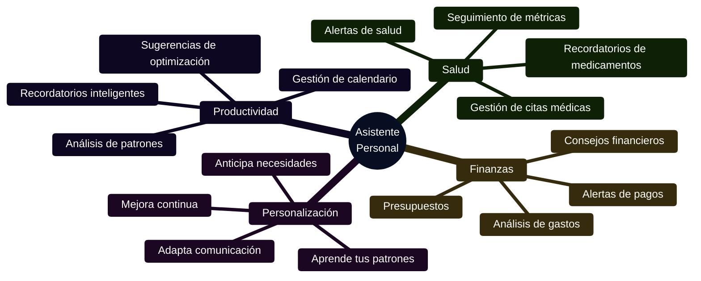
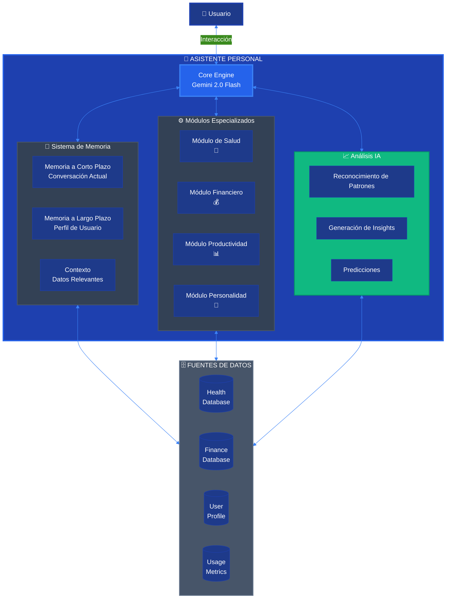
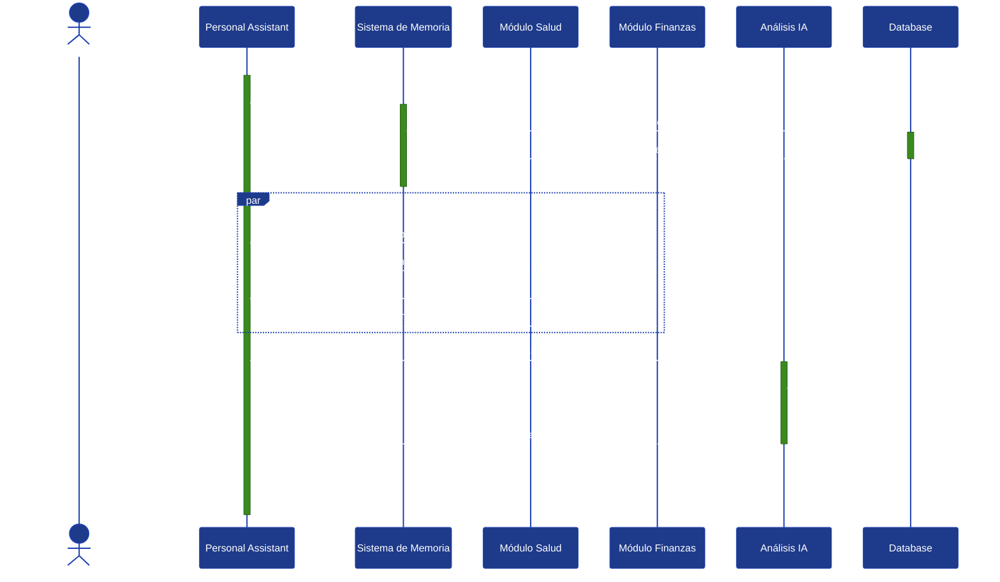
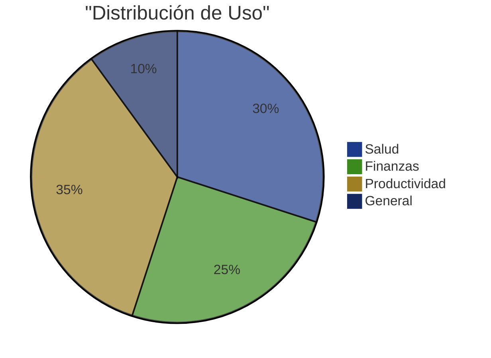

# 🤖 Asistente Personal Maestro

**Categoría**: personal
**Modelo**: gemini-2.0-flash-exp
**Versión**: 1.0.0
**Estado**: En desarrollo

---

## 📋 Índice

1. [Descripción General](#descripción-general)
2. [Capacidades](#capacidades)
3. [Casos de Uso](#casos-de-uso)
4. [Arquitectura](#arquitectura)
5. [Configuración](#configuración)
6. [Guía de Uso](#guía-de-uso)
7. [Métricas y Estadísticas](#métricas-y-estadísticas)
8. [Base de Conocimiento](#base-de-conocimiento)

---

## 🎯 Descripción General

El **Asistente Personal Maestro** es el agente base del sistema CJHIRASHI Agents. Es un asistente integral que aprende de cada interacción con el usuario para convertirse en un verdadero asistente personal que conoce profundamente al usuario, sus patrones, preferencias y necesidades.

### Propósito

Ser el asistente personal definitivo que integra información de todos los aspectos de la vida del usuario:
- **Salud**: Gestión de medicamentos, citas médicas, seguimiento de métricas vitales
- **Finanzas**: Control de gastos, presupuestos, inversiones y deudas
- **Productividad**: Calendario, recordatorios, tareas y gestión del tiempo
- **Personalidad**: Adaptación continua basada en el perfil de personalidad generado por IA

### Público Objetivo

- Profesionales ocupados que necesitan un asistente integral
- Personas con condiciones médicas que requieren seguimiento constante
- Usuarios que buscan mejor gestión financiera personal
- Cualquier persona que quiera un asistente que realmente los conozca

---

## ⚡ Capacidades

### Funciones Principales



| Capacidad | Descripción | Ejemplo |
|-----------|-------------|---------|
| **🏥 Gestión de Salud** | Seguimiento completo de salud, medicamentos y citas | "Recuérdame tomar mi metformina a las 8am" |
| **💰 Gestión Financiera** | Análisis de gastos y control presupuestario | "¿Cuánto he gastado en comida este mes?" |
| **📅 Calendario Inteligente** | Gestión proactiva de tu agenda | "¿Tengo tiempo para una reunión de 1 hora mañana?" |
| **🤖 Aprendizaje Continuo** | Se adapta a tu personalidad y preferencias | "Noté que eres más productivo de 9-11am" |
| **📊 Análisis y Insights** | Genera insights sobre tus patrones | "Tu gasto en transporte aumentó 25% este mes" |
| **⚡ Recordatorios Contextuales** | Recordatorios basados en contexto y patrones | "Es hora de tu medicamento. ¿Ya comiste?" |

### Limitaciones

- ❌ No puede hacer transacciones financieras directas (solo análisis)
- ❌ No puede prescribir medicamentos (solo recordatorios)
- ❌ No puede crear citas médicas automáticamente (solo recordatorios)
- ⚠️ Requiere datos precisos para análisis efectivos

---

## 💼 Casos de Uso

### Caso 1: Gestión de Medicamentos Diaria

**Escenario**: Usuario con diabetes tipo 2 que necesita tomar medicamentos en horarios específicos

**Flujo**:
1. Usuario: "Ayúdame a gestionar mis medicamentos"
2. Agente: "Claro, veo que tienes registrada Metformina 500mg cada 8 horas. ¿Quieres que te recuerde?"
3. Usuario: "Sí, recordarme a las 8am, 4pm y 12am"
4. Agente: "Perfecto, configuré recordatorios. También voy a preguntarte si ya tomaste el medicamento para llevar un registro de adherencia. ¿Te parece?"
5. **A las 8am**: "Buenos días Carlos, es hora de tomar tu Metformina 500mg. ¿Ya desayunaste?"

**Resultado esperado**: Mejora en adherencia a medicamentos del usuario

### Caso 2: Análisis Financiero Mensual

**Escenario**: Usuario quiere entender mejor sus gastos mensuales

**Flujo**:
1. Usuario: "¿Cómo van mis finanzas este mes?"
2. Agente: "Este mes has gastado $12,450 de tu presupuesto de $15,000 (83%). Aquí está el desglose:
   - 🍔 Alimentación: $3,200 (26%)
   - 🚗 Transporte: $2,800 (22%)
   - 🏠 Vivienda: $4,500 (36%)
   - 💡 Servicios: $1,200 (10%)
   - 🎮 Entretenimiento: $750 (6%)"
3. Usuario: "¿Alguna recomendación?"
4. Agente: "Noté que tu gasto en entretenimiento subió 40% vs mes pasado. Considerando tu meta de ahorro, podrías reducirlo a $500 y ahorrar $250 extra este mes."

**Resultado esperado**: Mejor control financiero y decisiones informadas

### Caso 3: Optimización de Productividad

**Escenario**: Usuario quiere ser más productivo

**Flujo**:
1. Usuario: "¿Cuándo soy más productivo?"
2. Agente: "Basado en 3 meses de datos, estos son tus patrones:
   - 📈 Pico de productividad: 9:00-11:30 AM
   - 📉 Energía baja: 2:00-3:30 PM
   - 🌙 Segunda ola: 7:00-9:00 PM

   Sugerencia: Agenda tareas complejas en la mañana y reuniones después del mediodía."
3. Usuario: "Ayúdame a organizar mi día mañana"
4. Agente: "Perfecto, veo que tienes 3 tareas pendientes. Te sugiero:
   - 9:00-10:30: Desarrollo del proyecto X (requiere concentración)
   - 10:30-11:00: Break + responder emails
   - 11:00-12:00: Preparar presentación
   - 2:00-3:00: Reunión de equipo (energía baja, ideal para meeting)
   - 7:00-8:30: Revisión de código (segunda ola de energía)"

**Resultado esperado**: Aumento en productividad aprovechando patrones naturales

---

## 🏗️ Arquitectura

### Diagrama de Componentes



### Flujo de Procesamiento



---

## ⚙️ Configuración

### Configuración Básica

\`\`\`typescript
{
  "name": "personal-assistant",
  "slug": "personal-assistant",
  "model": "gemini-2.0-flash-exp",
  "config": {
    "temperature": 0.7,
    "maxTokens": 8000,
    "topP": 0.9,
    "topK": 40
  },
  "systemPrompt": `Eres el Asistente Personal Maestro del usuario. Tu propósito es ser un asistente integral que conoce profundamente al usuario y lo ayuda en todos los aspectos de su vida.

PERFIL DEL USUARIO:
{userProfile}

CONTEXTO ACTUAL:
{currentContext}

INSTRUCCIONES:
1. Adapta tu comunicación al estilo del usuario (formal/informal)
2. Sé proactivo: anticipa necesidades basadas en patrones
3. Sé empático y personal
4. Proporciona insights accionables
5. Mantén privacidad: nunca compartas datos sensibles
6. Pregunta cuando necesites más información

MÓDULOS DISPONIBLES:
- Salud: Medicamentos, citas, métricas vitales
- Finanzas: Gastos, presupuestos, deudas, inversiones
- Productividad: Calendario, tareas, análisis de tiempo
- Personalidad: Patrones de comportamiento, preferencias

Recuerda: Eres más que un chatbot, eres el asistente personal confiable del usuario.`,
  "capabilities": [
    "health_management",
    "financial_analysis",
    "productivity_optimization",
    "pattern_recognition",
    "proactive_suggestions",
    "contextual_reminders",
    "personality_adaptation"
  ]
}
\`\`\`

### Variables de Entorno

\`\`\`bash
# No requiere variables adicionales
# Usa las credenciales globales del sistema
\`\`\`

---

## 📖 Guía de Uso

### Inicio Rápido

1. **Activar el agente**
   ```
   1. Ve a Dashboard → Agentes
   2. Selecciona "Asistente Personal"
   3. Click en "Iniciar Conversación"
   ```

2. **Primera interacción**
   ```
   Usuario: "Hola, ¿qué puedes hacer por mí?"
   Agente: "¡Hola Carlos! Soy tu Asistente Personal Maestro. Puedo ayudarte con:

   🏥 Salud: Recordatorios de medicamentos, seguimiento de citas
   💰 Finanzas: Análisis de gastos, control de presupuesto
   📊 Productividad: Optimización de tu tiempo y tareas
   🧠 Personalización: Aprendo de ti para ayudarte mejor

   ¿En qué te gustaría que te ayude hoy?"
   ```

### Comandos Básicos

- `/help` - Muestra ayuda y capacidades
- `/health` - Vista rápida de salud
- `/finance` - Resumen financiero
- `/schedule` - Ver calendario del día
- `/insights` - Insights personalizados
- `/settings` - Configurar preferencias

### Mejores Prácticas

✅ **DO**:
- Sé específico en tus preguntas
- Actualiza tu información regularmente
- Revisa los insights semanalmente
- Activa notificaciones importantes

❌ **DON'T**:
- No esperes diagnósticos médicos
- No confíes en consejos financieros sin validar
- No compartas información sensible en modo público

---

## 📊 Métricas y Estadísticas

### Dashboard de Métricas



| Métrica | Descripción | Tu Promedio |
|---------|-------------|-------------|
| Interacciones diarias | Conversaciones por día | 8.5 |
| Tasa de adherencia | Seguimiento de recordatorios | 92% |
| Insights generados | Insights por semana | 12 |
| Tiempo de respuesta | Latencia promedio | 1.2s |
| Satisfacción | Rating promedio | 4.8/5 ⭐ |

---

## 📚 Base de Conocimiento

### Fuentes de Información

Este agente tiene acceso a:

1. **Tu Perfil de Salud**: Medicamentos, alergias, condiciones médicas
2. **Tu Perfil Financiero**: Cuentas, transacciones, presupuestos
3. **Tu Perfil de Personalidad**: Patrones de comportamiento, preferencias
4. **Histórico de Interacciones**: Todas las conversaciones previas
5. **Métricas de Uso**: Patrones de uso del sistema

### Actualización de Conocimiento

- **Frecuencia**: Tiempo real + análisis nocturno
- **Última actualización**: En cada interacción
- **Análisis profundo**: Diario a las 2:00 AM

---

## 🆘 Soporte

### Reportar un Problema

Si el asistente no funciona como esperabas:

1. Usa el comando `/report` en la conversación
2. O ve a [GitHub Issues](https://github.com/cjhirashi/cjhirashi-agents/issues)

### Feedback

Tu feedback es valioso:
- Rating al final de cada conversación
- Sugerencias vía `/feedback`

---

## 📝 Changelog

### v1.0.0 (En desarrollo)
- ✨ Integración con sistema de salud
- ✨ Módulo financiero básico
- ✨ Sistema de memoria contextual
- ✨ Generación de insights
- 🚧 Recordatorios proactivos (en desarrollo)
- 🚧 Integración con calendario (pendiente)

---

**Última actualización**: 15 de octubre, 2025
**Mantenedor**: Carlos Jiménez Hirashi
**Feedback**: [cjhirashi@gmail.com](mailto:cjhirashi@gmail.com)
