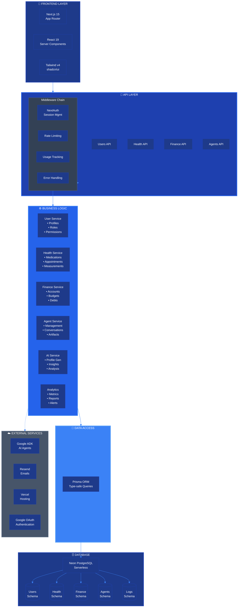
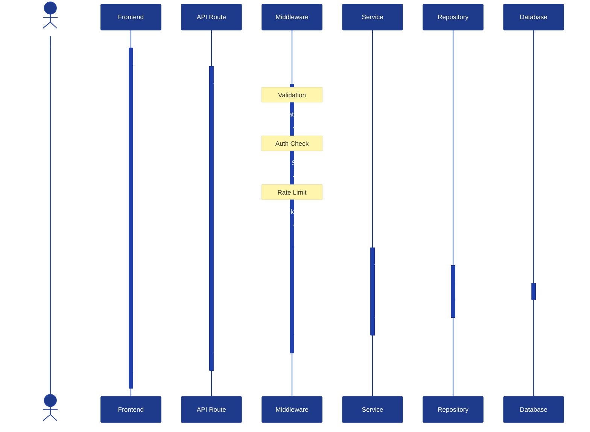
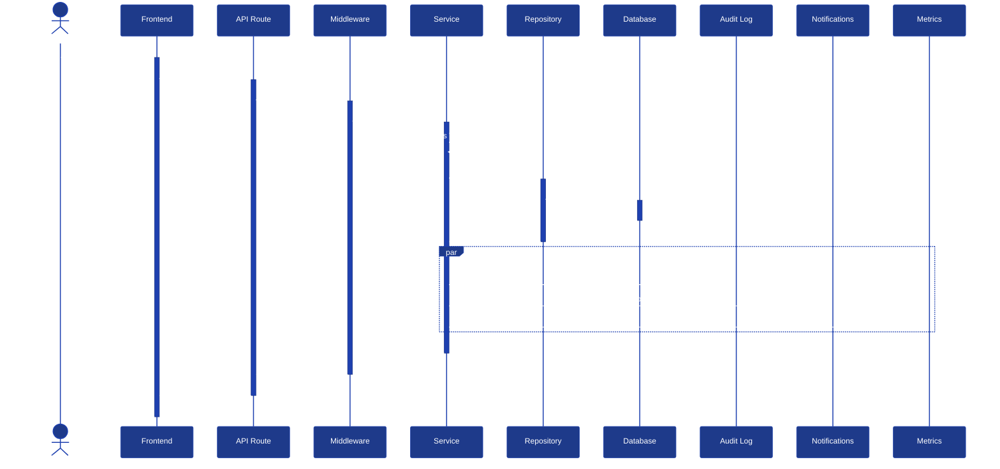

# 🏗️ Arquitectura General del Sistema

**CJHIRASHI Agents - Sistema de Asistente Personal de IA**

---

## 📋 Tabla de Contenidos

1. [Visión General](#visión-general)
2. [Arquitectura de Alto Nivel](#arquitectura-de-alto-nivel)
3. [Capas del Sistema](#capas-del-sistema)
4. [Stack Tecnológico](#stack-tecnológico)
5. [Patrones de Diseño](#patrones-de-diseño)
6. [Flujo de Datos](#flujo-de-datos)
7. [Seguridad](#seguridad)
8. [Escalabilidad](#escalabilidad)

---

## 🎯 Visión General

CJHIRASHI Agents es una plataforma de asistente personal de IA que integra múltiples agentes especializados para gestionar diferentes aspectos de la vida del usuario:

- **🏥 Salud**: Gestión de medicamentos, citas médicas, condiciones y métricas
- **💰 Finanzas**: Control de gastos, inversiones, deudas y presupuestos
- **🧠 Personalidad**: Perfil de comportamiento generado por IA
- **🤖 Agentes**: Múltiples agentes especializados con memoria contextual

### Principios de Diseño

1. **Modular**: Cada sistema es independiente y puede evolucionar sin afectar otros
2. **Seguro**: Encriptación de datos sensibles y control de acceso granular
3. **Escalable**: Arquitectura preparada para crecimiento exponencial
4. **Inteligente**: IA integrada en cada componente del sistema
5. **Profesional**: Documentación completa y estándares enterprise

---

## 🏛️ Arquitectura de Alto Nivel

---

## 📦 Capas del Sistema

### 1. Frontend Layer

**Responsabilidades**:
- Interfaz de usuario responsive
- Gestión de estado del cliente (Zustand)
- Optimistic updates
- Client-side routing

**Tecnologías**:
- Next.js 15 (App Router)
- React 19 (Server Components)
- Tailwind CSS v4
- shadcn/ui
- Framer Motion

### 2. API Layer

**Responsabilidades**:
- Endpoints REST
- Validación de datos (Zod)
- Rate limiting
- Autenticación/Autorización

**Patrones**:
- Route Handlers (Next.js)
- Middleware chain
- Error boundaries
- Response formatting

### 3. Business Logic Layer

**Responsabilidades**:
- Lógica de negocio
- Validaciones complejas
- Integraciones entre servicios
- Procesamiento de datos

**Servicios**:
\`\`\`typescript
services/
├── users/
│   ├── UserService.ts
│   ├── RoleService.ts
│   └── InvitationService.ts
├── health/
│   ├── MedicationService.ts
│   ├── AppointmentService.ts
│   └── MeasurementService.ts
├── finance/
│   ├── AccountService.ts
│   ├── TransactionService.ts
│   └── BudgetService.ts
├── agents/
│   ├── AgentService.ts
│   ├── ConversationService.ts
│   └── ArtifactService.ts
└── ai/
    ├── ProfileGenerator.ts
    ├── InsightsEngine.ts
    └── AnalysisService.ts
\`\`\`

### 4. Data Access Layer

**Responsabilidades**:
- Acceso a base de datos
- Queries optimizadas
- Transacciones
- Caché (futuro)

**Patrón Repository**:
\`\`\`typescript
repositories/
├── UserRepository.ts
├── HealthRepository.ts
├── FinanceRepository.ts
└── AgentRepository.ts
\`\`\`

### 5. Database Layer

**Responsabilidades**:
- Persistencia de datos
- Integridad referencial
- Índices optimizados
- Backups automáticos

---

## 🛠️ Stack Tecnológico

### Frontend
| Tecnología | Versión | Propósito |
|------------|---------|-----------|
| Next.js | 15.5.5 | Framework React |
| React | 19.x | UI Library |
| TypeScript | 5.0+ | Type Safety |
| Tailwind CSS | v4 | Styling |
| shadcn/ui | latest | UI Components |
| Zustand | latest | State Management |
| Framer Motion | latest | Animations |

### Backend
| Tecnología | Versión | Propósito |
|------------|---------|-----------|
| Next.js API Routes | 15.5.5 | API Endpoints |
| NextAuth.js | 4.24.11 | Authentication |
| Prisma | 6.17.1 | ORM |
| Zod | latest | Validation |

### Database
| Tecnología | Versión | Propósito |
|------------|---------|-----------|
| Neon PostgreSQL | 17 | Primary Database |
| Prisma | 6.17.1 | ORM & Migrations |

### External Services
| Servicio | Propósito |
|----------|-----------|
| Google ADK | AI Agents |
| Resend | Email Service |
| Vercel | Hosting & Deployment |
| Google OAuth | Authentication |

### Development Tools
| Tool | Propósito |
|------|-----------|
| ESLint | Code Linting |
| Prettier | Code Formatting |
| Husky | Git Hooks |
| Jest | Unit Testing |
| Playwright | E2E Testing |

---

## 🎨 Patrones de Diseño

### 1. Repository Pattern
Abstrae el acceso a datos y permite cambiar la implementación sin afectar la lógica de negocio.

### 2. Service Layer Pattern
Encapsula la lógica de negocio en servicios reutilizables.

### 3. Middleware Chain Pattern
Procesa requests a través de una cadena de middlewares (auth, rate limiting, logging).

### 4. Observer Pattern
Para notificaciones y eventos del sistema.

### 5. Strategy Pattern
Para diferentes estrategias de IA según el contexto del usuario.

---

## 🔄 Flujo de Datos

### Request Flow (Lectura)

### Write Flow (Escritura con Side Effects)

---

## 🔐 Seguridad

### Capas de Seguridad

1. **Authentication Layer**
   - OAuth 2.0 con Google
   - JWT tokens
   - Session management

2. **Authorization Layer**
   - Role-based access control (RBAC)
   - Permission-based access
   - Resource ownership validation

3. **Data Protection Layer**
   - Encriptación en tránsito (HTTPS)
   - Encriptación en reposo (datos sensibles)
   - Input sanitization
   - SQL injection prevention (Prisma)

4. **Application Layer**
   - Rate limiting
   - CSRF protection
   - XSS prevention
   - Content Security Policy

### Niveles de Sensibilidad de Datos

| Nivel | Tipo de Datos | Protección |
|-------|---------------|------------|
| PUBLIC | Nombre, avatar | Ninguna especial |
| PRIVATE | Email, preferencias | Access control |
| SENSITIVE | Datos financieros básicos | Encriptación + Access control |
| HIGHLY_SENSITIVE | Datos médicos, SSN | Encriptación fuerte + Audit log |

---

## 📈 Escalabilidad

### Estrategias de Escalabilidad

1. **Horizontal Scaling**
   - Vercel serverless functions
   - Auto-scaling basado en demanda
   - Neon serverless database (scale-to-zero)

2. **Database Optimization**
   - Índices estratégicos
   - Query optimization
   - Connection pooling
   - Read replicas (futuro)

3. **Caching Strategy** (Futuro)
   - Redis para session storage
   - CDN para assets estáticos
   - API response caching

4. **Asynchronous Processing**
   - Background jobs para tareas pesadas
   - Queue system para emails
   - Webhooks para integraciones

### Límites del Sistema

| Recurso | Límite Actual | Límite Objetivo |
|---------|---------------|-----------------|
| Usuarios Concurrentes | 100 | 10,000+ |
| Requests/segundo | 1,000 | 100,000+ |
| Database Size | 512 MB | 100+ GB |
| Response Time | < 200ms | < 100ms |

---

## 📊 Monitoreo y Observabilidad

### Métricas Clave

1. **Performance Metrics**
   - API response time
   - Database query time
   - Page load time

2. **Business Metrics**
   - Active users
   - Conversations per day
   - Token usage
   - Cost per user

3. **System Health**
   - Error rate
   - Uptime
   - Resource utilization

### Logging Strategy

\`\`\`typescript
// Niveles de log
enum LogLevel {
  DEBUG,    // Desarrollo
  INFO,     // Información general
  WARN,     // Advertencias
  ERROR,    // Errores
  CRITICAL  // Errores críticos del sistema
}

// Categorías
- auth.log      // Autenticación
- api.log       // API requests
- database.log  // Database operations
- agent.log     // Agent interactions
- audit.log     // Cambios sensibles
\`\`\`

---

## 🔮 Roadmap de Arquitectura

### Fase Actual (Q4 2025)
- ✅ Arquitectura base serverless
- ✅ Next.js 15 + Neon
- 🚧 Sistema de usuarios completo
- 🚧 Sistema de agentes base

### Fase 2 (Q1 2026)
- [ ] Sistema de salud completo
- [ ] Sistema financiero completo
- [ ] Perfil IA avanzado
- [ ] Sistema de métricas

### Fase 3 (Q2 2026)
- [ ] Caching layer (Redis)
- [ ] Queue system
- [ ] Webhooks
- [ ] API pública

### Fase 4 (Q3 2026)
- [ ] Mobile apps (React Native)
- [ ] Real-time features (WebSockets)
- [ ] Advanced analytics
- [ ] Multi-region deployment

---

## 📚 Referencias

- [Next.js Documentation](https://nextjs.org/docs)
- [Prisma Documentation](https://www.prisma.io/docs)
- [Neon Documentation](https://neon.tech/docs)
- [Database Schema](./02-DATABASE.md)
- [Security Architecture](./03-SECURITY.md)

---

**Última actualización**: 15 de octubre, 2025
**Próxima revisión**: 15 de enero, 2026
