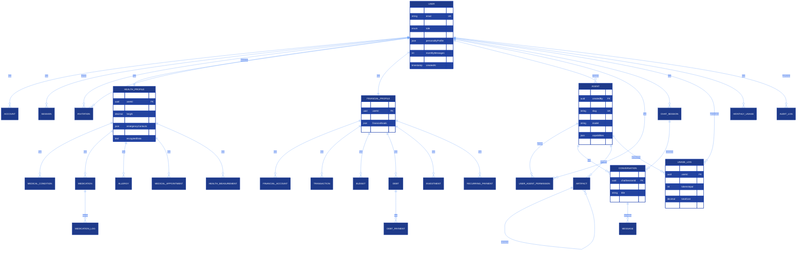
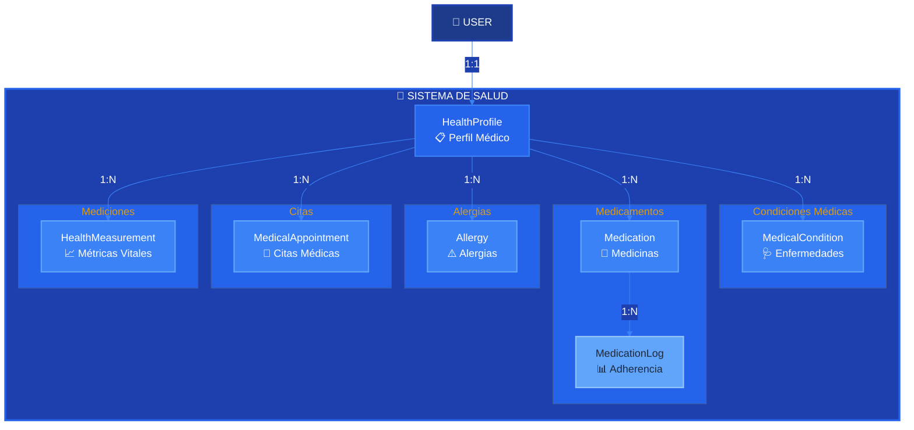
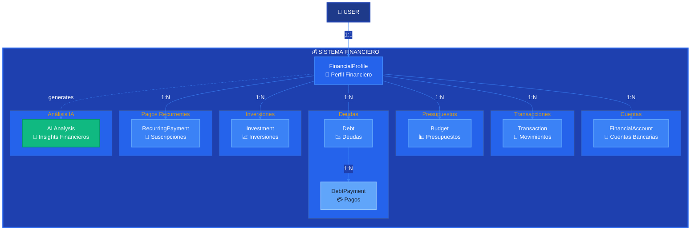
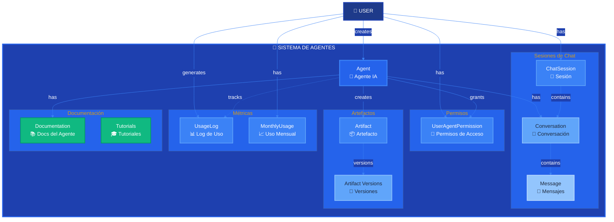

# 🗄️ Arquitectura de Base de Datos

**CJHIRASHI Agents - Database Schema Documentation v2.0**

---

## 📋 Tabla de Contenidos

1. [Visión General](#visión-general)
2. [Diagrama ER Completo](#diagrama-er-completo)
3. [Esquemas por Sistema](#esquemas-por-sistema)
4. [Relaciones y Cardinalidad](#relaciones-y-cardinalidad)
5. [Índices y Optimización](#índices-y-optimización)
6. [Estrategias de Seguridad](#estrategias-de-seguridad)
7. [Migraciones](#migraciones)

---

## 🎯 Visión General

La base de datos está organizada en **6 esquemas lógicos principales**:

| Sistema | Tablas | Propósito |
|---------|--------|-----------|
| **Usuarios** | 6 tablas | Autenticación, permisos, perfiles |
| **Salud** | 7 tablas | Gestión médica completa |
| **Finanzas** | 8 tablas | Control financiero integral |
| **Agentes** | 6 tablas | Agentes IA y conversaciones |
| **Métricas** | 4 tablas | Uso, costos y analytics |
| **Auditoría** | 1 tabla | Logs de cambios críticos |

**Total**: 32 tablas principales

---

## 📊 Diagrama ER Completo

---

## 🔐 Sistema de Usuarios

### Tabla: users

**Propósito**: Usuario principal del sistema con perfil completo

| Campo | Tipo | Descripción | Índice |
|-------|------|-------------|--------|
| id | uuid | PK | ✓ |
| email | varchar | Único, requerido | ✓ |
| role | enum | SUPER_ADMIN, ADMIN, USER | ✓ |
| subscriptionTier | enum | FREE, PRO, ENTERPRISE | ✓ |
| personalityProfile | jsonb | Perfil IA generado | - |
| customLimits | jsonb | Límites personalizados | - |
| monthlyTokens | bigint | Tokens usados este mes | ✓ |

**Estructura JSON - personalityProfile**:
\`\`\`json
{
  "mbtiType": "INTJ",
  "traits": {
    "openness": 0.85,
    "conscientiousness": 0.75,
    "extraversion": 0.45,
    "agreeableness": 0.70,
    "neuroticism": 0.30
  },
  "temperament": "Analítico, directo",
  "communicationStyle": "Conciso y basado en datos",
  "workStyle": {
    "peakProductivity": ["09:00-12:00", "15:00-18:00"],
    "preferredTaskSize": "grandes proyectos con hitos",
    "motivators": ["aprendizaje continuo", "impacto"]
  },
  "lastAnalyzed": "2025-10-15T10:00:00Z",
  "confidence": 0.85
}
\`\`\`

**Estructura JSON - customLimits**:
\`\`\`json
{
  "monthlyMessages": 1000,  // null = ilimitado
  "monthlyTokens": 500000,
  "maxAgents": 5,
  "prioritySupport": true,
  "customModels": ["gpt-4", "claude-3"]
}
\`\`\`

### Tabla: invitations

**Propósito**: Sistema de invitaciones con tokens únicos

| Campo | Tipo | Descripción |
|-------|------|-------------|
| id | uuid | PK |
| email | varchar | Email del invitado |
| token | varchar | Token único de invitación |
| role | enum | Rol asignado al aceptar |
| status | enum | PENDING, ACCEPTED, EXPIRED |
| invitedBy | uuid | FK a users |
| expiresAt | timestamp | Fecha de expiración (7 días) |

---

## 🏥 Sistema de Salud

### Diagrama del Sistema

### Tabla: health_profiles

**Campos encriptados**:
- `emergencyContacts` (JSON)
- `insuranceInfo` (JSON)
- `encryptedData` (Text - para SSN, etc.)

### Tabla: medications

**Sistema de recordatorios**:
\`\`\`json
{
  "reminderEnabled": true,
  "reminderTimes": ["08:00", "16:00", "00:00"],
  "notificationChannels": ["email", "push"]
}
\`\`\`

### Tabla: health_measurements

**Estructura flexible por tipo**:
\`\`\`json
// Peso
{
  "weight": 75.5,
  "unit": "kg"
}

// Presión arterial
{
  "systolic": 120,
  "diastolic": 80,
  "unit": "mmHg",
  "heartRate": 72
}

// Glucosa
{
  "glucose": 95,
  "unit": "mg/dL",
  "context": "fasting"
}
\`\`\`

---

## 💰 Sistema Financiero

### Diagrama del Sistema

### Tabla: transactions

**Categorías predefinidas**:
- Vivienda (renta, hipoteca, servicios)
- Transporte (gasolina, transporte público, mantenimiento)
- Alimentación (supermercado, restaurantes)
- Salud (médico, medicamentos, seguro)
- Entretenimiento (streaming, cine, hobbies)
- Educación (cursos, libros, capacitación)
- Ahorros (inversiones, fondo de emergencia)

**Estructura de tags**:
\`\`\`json
{
  "tags": ["negocio", "deducible", "urgente"],
  "paymentMethod": "tarjeta_credito",
  "merchant": "Amazon",
  "location": "Online"
}
\`\`\`

### Tabla: debts

**Estrategias de pago**:
- `avalanche`: Pagar primero la deuda con mayor tasa de interés
- `snowball`: Pagar primero la deuda más pequeña
- `custom`: Estrategia personalizada por el usuario

---

## 🤖 Sistema de Agentes

### Diagrama del Sistema

### Tabla: agents

**Campos clave**:
\`\`\`typescript
{
  slug: "personal-assistant",        // URL-friendly
  category: "personal",              // Categorización
  systemPrompt: "Eres un...",        // Prompt del sistema
  capabilities: [                     // Capacidades
    "gestión_calendario",
    "recordatorios",
    "análisis_salud"
  ],
  documentationUrl: "/docs/agents/personal-assistant",
  tutorialUrl: "/tutorials/personal-assistant"
}
\`\`\`

### Tabla: artifacts

**Sistema de versionamiento**:
\`\`\`
Artifact v1 (parentId: null)
    │
    ├─── Artifact v2 (parentId: v1.id)
    │       │
    │       └─── Artifact v3 (parentId: v2.id)
    │
    └─── Artifact v2-alt (parentId: v1.id)  // Rama alternativa
\`\`\`

**Tipos de artefactos**:
- `code`: Código generado
- `document`: Documentos (MD, PDF)
- `image`: Imágenes generadas
- `data`: Datos estructurados (JSON, CSV)
- `analysis`: Análisis y reportes

---

## 📊 Sistema de Métricas

### Tabla: usage_logs

**Registro detallado de cada interacción**:

| Campo | Descripción |
|-------|-------------|
| tokensInput | Tokens del prompt |
| tokensOutput | Tokens de la respuesta |
| costInput | Costo de entrada ($0.002/1K tokens) |
| costOutput | Costo de salida ($0.008/1K tokens) |
| duration | Tiempo de respuesta (ms) |

**Cálculo de costos**:
\`\`\`typescript
// Ejemplo: Gemini 2.0 Flash
const COST_INPUT = 0.002 / 1000;   // $0.002 por 1K tokens
const COST_OUTPUT = 0.008 / 1000;  // $0.008 por 1K tokens

totalCost = (tokensInput * COST_INPUT) + (tokensOutput * COST_OUTPUT);
\`\`\`

### Tabla: monthly_usage

**Agregación mensual por usuario**:
\`\`\`json
{
  "agentUsage": {
    "agent-uuid-1": {
      "messages": 100,
      "tokens": 50000,
      "cost": 2.50
    },
    "agent-uuid-2": {
      "messages": 50,
      "tokens": 25000,
      "cost": 1.25
    }
  }
}
\`\`\`

---

## 🔍 Índices y Optimización

### Índices Principales

\`\`\`sql
-- Búsquedas frecuentes
CREATE INDEX idx_users_email ON users(email);
CREATE INDEX idx_users_role ON users(role);

-- Queries de métricas (crítico para performance)
CREATE INDEX idx_usage_logs_user_date ON usage_logs(user_id, timestamp DESC);
CREATE INDEX idx_usage_logs_agent_date ON usage_logs(agent_id, timestamp DESC);

-- Mensajes por conversación (paginación)
CREATE INDEX idx_messages_conversation ON messages(conversation_id, timestamp DESC);

-- Transacciones financieras (reportes)
CREATE INDEX idx_transactions_date ON transactions(financial_profile_id, date DESC);
CREATE INDEX idx_transactions_category ON transactions(category, date DESC);

-- Medicamentos activos
CREATE INDEX idx_medications_active ON medications(health_profile_id, is_active);

-- Artefactos con versionamiento
CREATE INDEX idx_artifacts_parent ON artifacts(parent_id);
CREATE INDEX idx_artifacts_user ON artifacts(user_id, created_at DESC);
\`\`\`

### Estrategias de Optimización

1. **Particionamiento** (Futuro)
   - `usage_logs` por mes
   - `transactions` por año

2. **Archivado**
   - Mover conversaciones antiguas (>6 meses) a tabla de archivo
   - Comprimir mensajes históricos

3. **Agregaciones Materializadas**
   - `monthly_usage` se calcula una vez al mes
   - Cache de estadísticas de agentes

---

## 🔐 Estrategias de Seguridad

### 1. Encriptación de Datos

**Niveles de sensibilidad**:
\`\`\`typescript
enum DataSensitivity {
  PUBLIC,           // Nombre, avatar
  PRIVATE,          // Email, preferencias
  SENSITIVE,        // Transacciones financieras
  HIGHLY_SENSITIVE  // SSN, historia médica detallada
}
\`\`\`

**Campos encriptados**:
- `health_profiles.encryptedData`
- `health_profiles.emergencyContacts` (JSON)
- `health_profiles.insuranceInfo` (JSON)

**Método de encriptación**:
\`\`\`typescript
// AES-256-GCM con clave derivada
import { encrypt, decrypt } from '@/lib/encryption';

const encrypted = encrypt(sensitiveData, userKey);
const decrypted = decrypt(encrypted, userKey);
\`\`\`

### 2. Row-Level Security (RLS)

**Políticas Prisma**:
\`\`\`typescript
// Los usuarios solo pueden ver sus propios datos
await prisma.healthProfile.findFirst({
  where: {
    userId: session.user.id  // ← Filtro automático
  }
});
\`\`\`

### 3. Auditoría

**Campos de auditoría en todas las tablas**:
- `createdAt`: Cuándo se creó
- `updatedAt`: Última modificación
- Tabla `audit_logs` para cambios críticos

---

## 🔄 Migraciones

### Proceso de Migración

\`\`\`bash
# 1. Crear migración
npx prisma migrate dev --name add_health_system

# 2. Revisar SQL generado
cat prisma/migrations/*/migration.sql

# 3. Aplicar en producción
npx prisma migrate deploy

# 4. Generar cliente
npx prisma generate
\`\`\`

### Migraciones Críticas

#### V1 → V2: Agregar Sistema de Salud
\`\`\`sql
-- Crear tabla health_profiles
CREATE TABLE health_profiles (
  id UUID PRIMARY KEY DEFAULT gen_random_uuid(),
  user_id UUID NOT NULL UNIQUE REFERENCES users(id) ON DELETE CASCADE,
  blood_type VARCHAR(10),
  ...
  created_at TIMESTAMP DEFAULT now(),
  updated_at TIMESTAMP DEFAULT now()
);

-- Índices
CREATE INDEX idx_health_profiles_user ON health_profiles(user_id);
\`\`\`

#### Rollback Strategy
\`\`\`bash
# Revertir última migración
npx prisma migrate resolve --rolled-back <migration-name>

# Aplicar migración de rollback
npx prisma migrate deploy
\`\`\`

---

## 📈 Estadísticas del Schema

| Métrica | Valor |
|---------|-------|
| Total de tablas | 32 |
| Total de índices | ~45 |
| Total de enums | 6 |
| Relaciones 1:1 | 2 (HealthProfile, FinancialProfile) |
| Relaciones 1:N | 28 |
| Relaciones N:M | 1 (UserAgentPermission) |
| Campos JSON | 15 |
| Campos encriptados | 3 |

---

## 🔮 Roadmap de Base de Datos

### Q4 2025
- ✅ Schema base con usuarios y agentes
- 🚧 Sistema de salud completo
- 🚧 Sistema financiero completo

### Q1 2026
- [ ] Particionamiento de usage_logs
- [ ] Read replicas
- [ ] Full-text search (PostgreSQL)

### Q2 2026
- [ ] Time-series data para métricas
- [ ] Archivado automático
- [ ] Backup point-in-time

---

## 📚 Referencias

- [Prisma Schema Reference](https://www.prisma.io/docs/reference/api-reference/prisma-schema-reference)
- [PostgreSQL Best Practices](https://wiki.postgresql.org/wiki/Don%27t_Do_This)
- [Database Indexing Strategies](https://use-the-index-luke.com/)

---

**Última actualización**: 15 de octubre, 2025
**Versión del Schema**: 2.0.0
