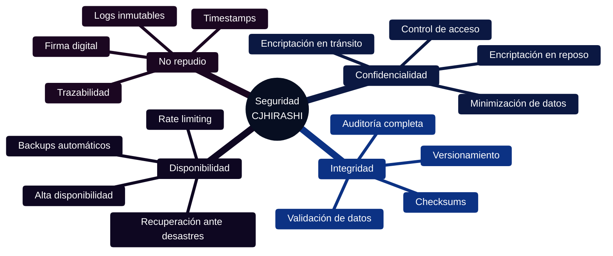
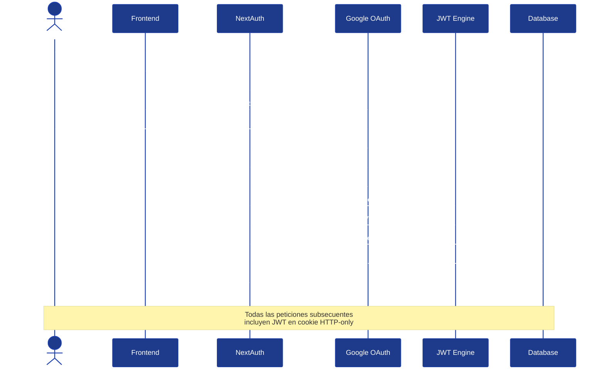
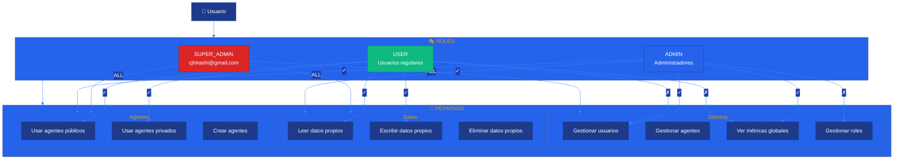
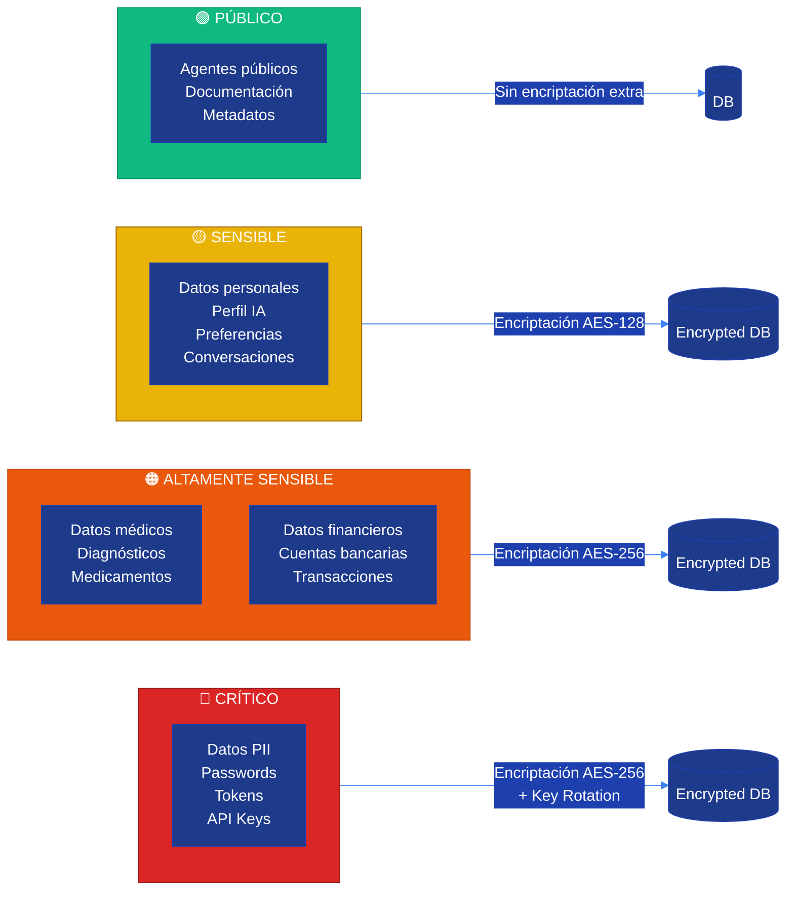
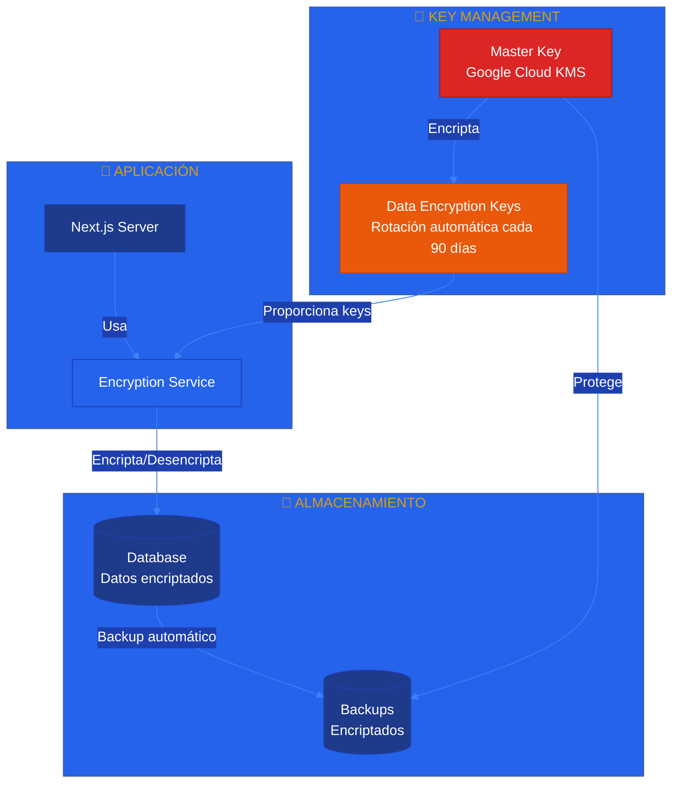
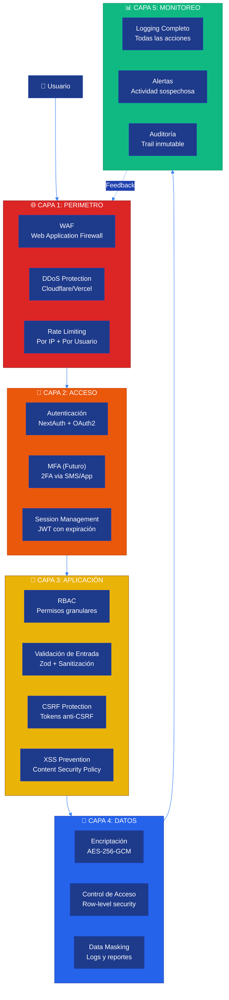
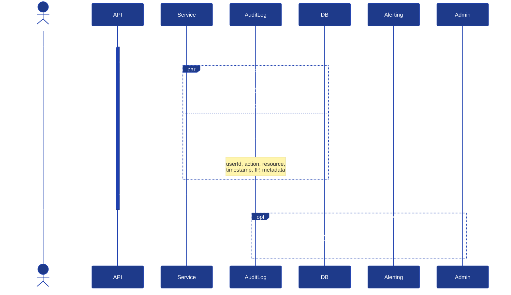
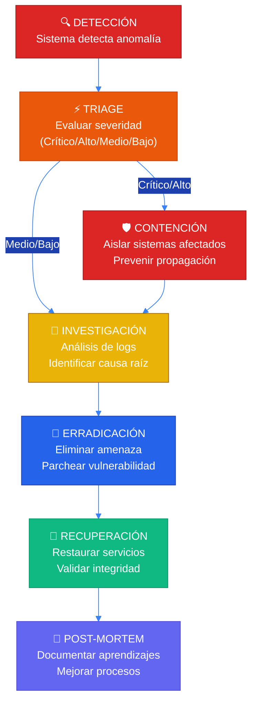

# 🔒 Arquitectura de Seguridad

**Sistema CJHIRASHI Agents - Seguridad y Protección de Datos**

---

## 📋 Índice

1. [Introducción](#introducción)
2. [Principios de Seguridad](#principios-de-seguridad)
3. [Autenticación y Autorización](#autenticación-y-autorización)
4. [Protección de Datos](#protección-de-datos)
5. [Seguridad en Capas](#seguridad-en-capas)
6. [Auditoría y Monitoreo](#auditoría-y-monitoreo)
7. [Cumplimiento Normativo](#cumplimiento-normativo)
8. [Plan de Respuesta a Incidentes](#plan-de-respuesta-a-incidentes)

---

## 🎯 Introducción

La seguridad en CJHIRASHI Agents es **crítica** debido a la naturaleza sensible de los datos que maneja:

- 🏥 **Información médica**: Medicamentos, historial, diagnósticos
- 💰 **Datos financieros**: Cuentas bancarias, transacciones, inversiones
- 🔑 **Datos personales**: Identidad, preferencias, patrones de comportamiento
- 💬 **Conversaciones privadas**: Interacciones con agentes IA

Este documento establece la arquitectura de seguridad que protege estos datos en todos los niveles del sistema.

---

## 🛡️ Principios de Seguridad

### Principios Fundamentales



| Principio | Descripción | Implementación |
|-----------|-------------|----------------|
| **🔐 Confidencialidad** | Solo usuarios autorizados acceden a datos | Encriptación + RBAC |
| **✅ Integridad** | Los datos no se modifican sin autorización | Validación + Auditoría |
| **⚡ Disponibilidad** | Sistema accesible cuando se necesite | HA + Backups |
| **📝 No Repudio** | Acciones no pueden ser negadas | Logs + Firma |
| **🎯 Mínimo Privilegio** | Solo acceso necesario para la función | Permisos granulares |
| **🔍 Defensa en Profundidad** | Múltiples capas de seguridad | Seguridad en todas las capas |

---

## 🔑 Autenticación y Autorización

### Flujo de Autenticación



### Sistema RBAC (Role-Based Access Control)



### Permisos Granulares

| Recurso | Super Admin | Admin | User | Guest |
|---------|-------------|-------|------|-------|
| **Usuarios** |
| Crear usuario | ✅ | ✅ | ❌ | ❌ |
| Editar cualquier usuario | ✅ | ✅ | ❌ | ❌ |
| Eliminar usuario | ✅ | ✅ | ❌ | ❌ |
| Cambiar roles | ✅ | ❌ | ❌ | ❌ |
| Editar perfil propio | ✅ | ✅ | ✅ | ❌ |
| **Agentes** |
| Crear agente público | ✅ | ✅ | ❌ | ❌ |
| Crear agente privado | ✅ | ✅ | ✅ | ❌ |
| Editar agente propio | ✅ | ✅ | ✅ | ❌ |
| Editar cualquier agente | ✅ | ✅ | ❌ | ❌ |
| Usar agente público | ✅ | ✅ | ✅ | ✅ |
| Usar agente privado | ✅ | ✅ | ✅* | ❌ |
| **Datos de Salud** |
| Ver datos propios | ✅ | ✅ | ✅ | ❌ |
| Editar datos propios | ✅ | ✅ | ✅ | ❌ |
| Ver datos de otros | ✅ | ❌ | ❌ | ❌ |
| **Datos Financieros** |
| Ver datos propios | ✅ | ✅ | ✅ | ❌ |
| Editar datos propios | ✅ | ✅ | ✅ | ❌ |
| Ver datos de otros | ✅ | ❌ | ❌ | ❌ |
| **Métricas** |
| Ver métricas globales | ✅ | ✅ | ❌ | ❌ |
| Ver métricas propias | ✅ | ✅ | ✅ | ❌ |
| **Auditoría** |
| Ver todos los logs | ✅ | ✅ | ❌ | ❌ |
| Ver logs propios | ✅ | ✅ | ✅ | ❌ |

> **Nota**: ✅* = Solo con permiso explícito otorgado por el creador del agente

### Implementación de RBAC

```typescript
// lib/auth/permissions.ts
export enum Permission {
  // Sistema
  MANAGE_USERS = "system:manage_users",
  MANAGE_AGENTS = "system:manage_agents",
  MANAGE_ROLES = "system:manage_roles",
  VIEW_GLOBAL_METRICS = "system:view_global_metrics",

  // Datos personales
  READ_OWN_DATA = "data:read_own",
  WRITE_OWN_DATA = "data:write_own",
  DELETE_OWN_DATA = "data:delete_own",
  READ_ANY_DATA = "data:read_any",

  // Agentes
  USE_PUBLIC_AGENTS = "agents:use_public",
  USE_PRIVATE_AGENTS = "agents:use_private",
  CREATE_AGENTS = "agents:create",
  MANAGE_ANY_AGENT = "agents:manage_any",
}

export const ROLE_PERMISSIONS: Record<UserRole, Permission[]> = {
  SUPER_ADMIN: Object.values(Permission), // Todos los permisos

  ADMIN: [
    Permission.MANAGE_USERS,
    Permission.MANAGE_AGENTS,
    Permission.VIEW_GLOBAL_METRICS,
    Permission.READ_OWN_DATA,
    Permission.WRITE_OWN_DATA,
    Permission.DELETE_OWN_DATA,
    Permission.USE_PUBLIC_AGENTS,
    Permission.USE_PRIVATE_AGENTS,
    Permission.CREATE_AGENTS,
    Permission.MANAGE_ANY_AGENT,
  ],

  USER: [
    Permission.READ_OWN_DATA,
    Permission.WRITE_OWN_DATA,
    Permission.DELETE_OWN_DATA,
    Permission.USE_PUBLIC_AGENTS,
    Permission.USE_PRIVATE_AGENTS,
    Permission.CREATE_AGENTS,
  ],

  GUEST: [
    Permission.USE_PUBLIC_AGENTS,
  ],
};

// Middleware para verificar permisos
export function hasPermission(
  userRole: UserRole,
  permission: Permission
): boolean {
  const permissions = ROLE_PERMISSIONS[userRole];
  return permissions.includes(permission);
}

// HOC para proteger rutas
export function requirePermission(permission: Permission) {
  return async (req: NextRequest) => {
    const session = await getServerSession();
    if (!session?.user?.role) {
      return NextResponse.json({ error: "Unauthorized" }, { status: 401 });
    }

    if (!hasPermission(session.user.role, permission)) {
      return NextResponse.json({ error: "Forbidden" }, { status: 403 });
    }

    return null; // Continuar
  };
}
```

---

## 🔐 Protección de Datos

### Clasificación de Sensibilidad



### Encriptación

#### Encriptación en Tránsito

- ✅ **TLS 1.3** para todas las conexiones
- ✅ **HTTPS obligatorio** (redirect automático de HTTP)
- ✅ **HSTS** (HTTP Strict Transport Security)
- ✅ **Certificate pinning** en producción

```typescript
// next.config.js
const nextConfig = {
  headers: async () => [
    {
      source: '/:path*',
      headers: [
        {
          key: 'Strict-Transport-Security',
          value: 'max-age=63072000; includeSubDomains; preload'
        },
        {
          key: 'X-Content-Type-Options',
          value: 'nosniff'
        },
        {
          key: 'X-Frame-Options',
          value: 'DENY'
        },
        {
          key: 'X-XSS-Protection',
          value: '1; mode=block'
        },
      ],
    },
  ],
};
```

#### Encriptación en Reposo

```typescript
// lib/encryption/index.ts
import crypto from "crypto";

const ALGORITHM = "aes-256-gcm";
const KEY = Buffer.from(process.env.ENCRYPTION_KEY!, "hex"); // 32 bytes
const IV_LENGTH = 16;
const AUTH_TAG_LENGTH = 16;

export function encrypt(text: string): string {
  const iv = crypto.randomBytes(IV_LENGTH);
  const cipher = crypto.createCipheriv(ALGORITHM, KEY, iv);

  let encrypted = cipher.update(text, "utf8", "hex");
  encrypted += cipher.final("hex");

  const authTag = cipher.getAuthTag();

  // Formato: iv:authTag:encrypted
  return `${iv.toString("hex")}:${authTag.toString("hex")}:${encrypted}`;
}

export function decrypt(encryptedData: string): string {
  const [ivHex, authTagHex, encrypted] = encryptedData.split(":");

  const iv = Buffer.from(ivHex, "hex");
  const authTag = Buffer.from(authTagHex, "hex");

  const decipher = crypto.createDecipheriv(ALGORITHM, KEY, iv);
  decipher.setAuthTag(authTag);

  let decrypted = decipher.update(encrypted, "hex", "utf8");
  decrypted += decipher.final("utf8");

  return decrypted;
}

// Uso en el modelo
// prisma/schema.prisma
model HealthProfile {
  id              String   @id @default(uuid())
  userId          String   @unique

  // Campos sensibles encriptados
  bloodType       String?  // Encriptado en la capa de aplicación
  allergiesData   String?  // JSON encriptado
  conditionsData  String?  // JSON encriptado

  user            User     @relation(fields: [userId], references: [id])

  @@map("health_profiles")
}
```

#### Key Management



**Estrategia de rotación de keys**:
1. **Master Key**: Rotación anual (manual)
2. **Data Keys**: Rotación automática cada 90 días
3. **JWT Secret**: Rotación cada 6 meses
4. **API Keys**: Rotación bajo demanda

---

## 🏰 Seguridad en Capas



### Implementación por Capa

#### Capa 1: Perímetro

```typescript
// middleware.ts
import { NextResponse } from "next/server";
import type { NextRequest } from "next/server";
import { Ratelimit } from "@upstash/ratelimit";
import { Redis } from "@upstash/redis";

const ratelimit = new Ratelimit({
  redis: Redis.fromEnv(),
  limiter: Ratelimit.slidingWindow(100, "1 h"), // 100 requests por hora
  analytics: true,
});

export async function middleware(request: NextRequest) {
  // Rate limiting por IP
  const ip = request.ip ?? "127.0.0.1";
  const { success, limit, reset, remaining } = await ratelimit.limit(ip);

  if (!success) {
    return NextResponse.json(
      { error: "Too many requests" },
      {
        status: 429,
        headers: {
          "X-RateLimit-Limit": limit.toString(),
          "X-RateLimit-Remaining": remaining.toString(),
          "X-RateLimit-Reset": reset.toString(),
        }
      }
    );
  }

  return NextResponse.next();
}
```

#### Capa 2: Autenticación

```typescript
// lib/auth/config.ts
import { NextAuthOptions } from "next-auth";
import GoogleProvider from "next-auth/providers/google";
import { PrismaAdapter } from "@auth/prisma-adapter";
import { prisma } from "@/lib/prisma";

export const authOptions: NextAuthOptions = {
  adapter: PrismaAdapter(prisma),

  providers: [
    GoogleProvider({
      clientId: process.env.GOOGLE_CLIENT_ID!,
      clientSecret: process.env.GOOGLE_CLIENT_SECRET!,
    }),
  ],

  session: {
    strategy: "jwt",
    maxAge: 30 * 24 * 60 * 60, // 30 días
  },

  jwt: {
    secret: process.env.NEXTAUTH_SECRET,
    maxAge: 30 * 24 * 60 * 60,
  },

  callbacks: {
    async jwt({ token, user }) {
      if (user) {
        token.role = user.role;
        token.id = user.id;
      }
      return token;
    },

    async session({ session, token }) {
      if (session.user) {
        session.user.role = token.role as UserRole;
        session.user.id = token.id as string;
      }
      return session;
    },
  },

  pages: {
    signIn: "/auth/signin",
    error: "/auth/error",
  },
};
```

#### Capa 3: Validación

```typescript
// lib/validation/index.ts
import { z } from "zod";
import DOMPurify from "isomorphic-dompurify";

// Schema de validación
export const HealthProfileSchema = z.object({
  bloodType: z.enum(["A+", "A-", "B+", "B-", "AB+", "AB-", "O+", "O-"]).optional(),
  allergies: z.array(z.string().max(100)).max(50),
  conditions: z.array(z.string().max(200)).max(20),
});

// Sanitización de entrada
export function sanitizeInput(input: string): string {
  return DOMPurify.sanitize(input, {
    ALLOWED_TAGS: [], // No permitir HTML
    ALLOWED_ATTR: [],
  });
}

// Validación + Sanitización
export function validateAndSanitize<T>(
  schema: z.ZodSchema<T>,
  data: unknown
): T {
  // Primero sanitizar strings
  const sanitized = sanitizeObject(data);

  // Luego validar
  return schema.parse(sanitized);
}

function sanitizeObject(obj: any): any {
  if (typeof obj === "string") {
    return sanitizeInput(obj);
  }

  if (Array.isArray(obj)) {
    return obj.map(sanitizeObject);
  }

  if (typeof obj === "object" && obj !== null) {
    return Object.fromEntries(
      Object.entries(obj).map(([key, value]) => [
        key,
        sanitizeObject(value),
      ])
    );
  }

  return obj;
}
```

---

## 📊 Auditoría y Monitoreo

### Sistema de Auditoría



### Acciones Auditadas

| Categoría | Acciones | Nivel de Detalle |
|-----------|----------|------------------|
| **🔐 Autenticación** | Login, Logout, Fallos de login | IP, dispositivo, ubicación |
| **👥 Usuarios** | Crear, editar, eliminar usuario | Cambios específicos (diff) |
| **🤖 Agentes** | Crear, editar, eliminar agente | Configuración completa |
| **🏥 Datos de Salud** | Leer, escribir, eliminar | Qué campos se accedieron |
| **💰 Datos Financieros** | Leer, escribir, eliminar | Qué campos se accedieron |
| **💬 Conversaciones** | Crear, leer conversación | ID conversación, agente usado |
| **⚙️ Configuración** | Cambiar configuración del sistema | Valores antes/después |

### Implementación de Auditoría

```typescript
// lib/audit/logger.ts
import { prisma } from "@/lib/prisma";

export enum AuditAction {
  // Autenticación
  LOGIN = "auth:login",
  LOGOUT = "auth:logout",
  LOGIN_FAILED = "auth:login_failed",

  // Usuarios
  USER_CREATED = "user:created",
  USER_UPDATED = "user:updated",
  USER_DELETED = "user:deleted",
  ROLE_CHANGED = "user:role_changed",

  // Datos sensibles
  HEALTH_DATA_READ = "health:read",
  HEALTH_DATA_WRITE = "health:write",
  FINANCE_DATA_READ = "finance:read",
  FINANCE_DATA_WRITE = "finance:write",

  // Agentes
  AGENT_CREATED = "agent:created",
  AGENT_EXECUTED = "agent:executed",
}

export interface AuditLogData {
  userId: string;
  action: AuditAction;
  resourceType: string;
  resourceId?: string;
  metadata?: Record<string, any>;
  ipAddress?: string;
  userAgent?: string;
}

export async function createAuditLog(data: AuditLogData) {
  await prisma.auditLog.create({
    data: {
      userId: data.userId,
      action: data.action,
      resourceType: data.resourceType,
      resourceId: data.resourceId,
      metadata: data.metadata,
      ipAddress: data.ipAddress,
      userAgent: data.userAgent,
      timestamp: new Date(),
    },
  });

  // Detectar actividad sospechosa
  await detectSuspiciousActivity(data);
}

async function detectSuspiciousActivity(data: AuditLogData) {
  // 1. Múltiples fallos de login
  if (data.action === AuditAction.LOGIN_FAILED) {
    const recentFailures = await prisma.auditLog.count({
      where: {
        userId: data.userId,
        action: AuditAction.LOGIN_FAILED,
        timestamp: {
          gte: new Date(Date.now() - 15 * 60 * 1000), // Últimos 15 min
        },
      },
    });

    if (recentFailures >= 5) {
      await triggerSecurityAlert({
        type: "MULTIPLE_LOGIN_FAILURES",
        userId: data.userId,
        count: recentFailures,
      });
    }
  }

  // 2. Acceso a datos sensibles desde IP desconocida
  if (
    data.action === AuditAction.HEALTH_DATA_READ ||
    data.action === AuditAction.FINANCE_DATA_READ
  ) {
    const knownIPs = await getUserKnownIPs(data.userId);
    if (!knownIPs.includes(data.ipAddress!)) {
      await triggerSecurityAlert({
        type: "SENSITIVE_DATA_ACCESS_NEW_IP",
        userId: data.userId,
        ipAddress: data.ipAddress,
      });
    }
  }

  // 3. Acceso masivo a datos
  const recentReads = await prisma.auditLog.count({
    where: {
      userId: data.userId,
      action: {
        in: [
          AuditAction.HEALTH_DATA_READ,
          AuditAction.FINANCE_DATA_READ,
        ],
      },
      timestamp: {
        gte: new Date(Date.now() - 5 * 60 * 1000), // Últimos 5 min
      },
    },
  });

  if (recentReads >= 100) {
    await triggerSecurityAlert({
      type: "MASS_DATA_ACCESS",
      userId: data.userId,
      count: recentReads,
    });
  }
}
```

---

## ⚖️ Cumplimiento Normativo

### HIPAA (Health Insurance Portability and Accountability Act)

Aplicable a datos de salud:

| Requerimiento | Implementación |
|---------------|----------------|
| **Encriptación** | AES-256 en reposo, TLS 1.3 en tránsito |
| **Control de Acceso** | RBAC + permisos granulares |
| **Auditoría** | Logs completos de todos los accesos |
| **Minimización** | Solo recolectar datos necesarios |
| **Derecho a eliminar** | API para eliminar todos los datos |
| **Notificación de brechas** | Protocolo en <72h |

### GDPR (General Data Protection Regulation)

Aplicable a usuarios en la UE:

| Derecho | Implementación |
|---------|----------------|
| **Derecho al olvido** | Endpoint `/api/user/delete-all-data` |
| **Portabilidad** | Exportar todos los datos en JSON |
| **Rectificación** | Editar cualquier dato personal |
| **Acceso** | Ver todos los datos almacenados |
| **Consentimiento** | Opt-in explícito para cada categoría |
| **Notificación** | Email en caso de brecha de seguridad |

### Implementación de Exportación de Datos

```typescript
// app/api/user/export-data/route.ts
import { getServerSession } from "next-auth";
import { prisma } from "@/lib/prisma";
import { decrypt } from "@/lib/encryption";

export async function GET() {
  const session = await getServerSession();
  if (!session?.user?.id) {
    return new Response("Unauthorized", { status: 401 });
  }

  const userId = session.user.id;

  // Recolectar TODOS los datos del usuario
  const [
    user,
    healthProfile,
    medications,
    appointments,
    financialProfile,
    accounts,
    transactions,
    conversations,
  ] = await Promise.all([
    prisma.user.findUnique({ where: { id: userId } }),
    prisma.healthProfile.findUnique({ where: { userId } }),
    prisma.medication.findMany({ where: { healthProfile: { userId } } }),
    prisma.medicalAppointment.findMany({ where: { healthProfile: { userId } } }),
    prisma.financialProfile.findUnique({ where: { userId } }),
    prisma.financialAccount.findMany({ where: { profile: { userId } } }),
    prisma.transaction.findMany({ where: { account: { profile: { userId } } } }),
    prisma.conversation.findMany({ where: { chatSession: { userId } } }),
  ]);

  // Desencriptar datos sensibles
  const exportData = {
    user,
    health: {
      profile: healthProfile,
      medications,
      appointments,
    },
    finance: {
      profile: financialProfile,
      accounts,
      transactions,
    },
    conversations,
    exportDate: new Date().toISOString(),
  };

  // Log de auditoría
  await createAuditLog({
    userId,
    action: AuditAction.DATA_EXPORTED,
    resourceType: "user",
    resourceId: userId,
    metadata: { recordCount: JSON.stringify(exportData).length },
  });

  return new Response(JSON.stringify(exportData, null, 2), {
    headers: {
      "Content-Type": "application/json",
      "Content-Disposition": `attachment; filename="cjhirashi-data-${userId}.json"`,
    },
  });
}
```

---

## 🚨 Plan de Respuesta a Incidentes

### Fases de Respuesta



### Clasificación de Incidentes

| Severidad | Descripción | Tiempo de Respuesta | Notificación |
|-----------|-------------|---------------------|--------------|
| **🔴 Crítico** | Brecha de datos, acceso no autorizado a datos sensibles | < 1 hora | CEO + Usuarios afectados |
| **🟠 Alto** | Múltiples fallos de autenticación, intentos de intrusión | < 4 horas | Equipo de seguridad |
| **🟡 Medio** | Anomalías en logs, comportamiento sospechoso | < 24 horas | Admin |
| **🟢 Bajo** | Eventos menores, false positives | < 72 horas | Log interno |

### Contactos de Emergencia

```typescript
// lib/security/incident-response.ts
export const SECURITY_CONTACTS = {
  lead: {
    name: "Carlos Jiménez Hirashi",
    email: "cjhirashi@gmail.com",
    phone: "+52-XXX-XXX-XXXX",
  },

  backup: {
    name: "[BACKUP CONTACT]",
    email: "[backup@example.com]",
    phone: "+52-XXX-XXX-XXXX",
  },
};

export async function triggerSecurityAlert(alert: {
  type: string;
  userId: string;
  severity: "CRITICAL" | "HIGH" | "MEDIUM" | "LOW";
  details: Record<string, any>;
}) {
  // 1. Log en base de datos
  await prisma.securityAlert.create({
    data: {
      type: alert.type,
      userId: alert.userId,
      severity: alert.severity,
      details: alert.details,
      timestamp: new Date(),
      status: "OPEN",
    },
  });

  // 2. Notificar según severidad
  if (alert.severity === "CRITICAL" || alert.severity === "HIGH") {
    await sendEmail({
      to: SECURITY_CONTACTS.lead.email,
      subject: `🚨 SECURITY ALERT: ${alert.type}`,
      body: `
        Severity: ${alert.severity}
        User: ${alert.userId}
        Type: ${alert.type}
        Details: ${JSON.stringify(alert.details, null, 2)}

        Time: ${new Date().toISOString()}
      `,
    });

    // SMS para críticos
    if (alert.severity === "CRITICAL") {
      await sendSMS({
        to: SECURITY_CONTACTS.lead.phone,
        message: `CRITICAL SECURITY ALERT: ${alert.type}. Check email immediately.`,
      });
    }
  }

  // 3. Tomar acciones automáticas si es crítico
  if (alert.severity === "CRITICAL") {
    await automaticContainment(alert);
  }
}

async function automaticContainment(alert: any) {
  // Bloquear usuario temporalmente
  if (alert.type === "MULTIPLE_LOGIN_FAILURES") {
    await prisma.user.update({
      where: { id: alert.userId },
      data: {
        isActive: false,
        lockedReason: "Security: Multiple login failures",
        lockedAt: new Date(),
      },
    });
  }

  // Invalidar sesiones
  if (alert.type === "SENSITIVE_DATA_ACCESS_NEW_IP") {
    await prisma.session.deleteMany({
      where: { userId: alert.userId },
    });
  }
}
```

---

## 🔄 Checklist de Seguridad

### Pre-Deployment

- [ ] Todas las variables de entorno están configuradas correctamente
- [ ] No hay secrets en el código
- [ ] Dependencias actualizadas (sin vulnerabilidades conocidas)
- [ ] Tests de seguridad ejecutados (OWASP ZAP, etc.)
- [ ] Rate limiting configurado
- [ ] CORS configurado correctamente
- [ ] Headers de seguridad configurados
- [ ] Certificados SSL válidos

### Post-Deployment

- [ ] Monitoreo activo funcionando
- [ ] Alertas configuradas
- [ ] Backups automáticos funcionando
- [ ] Logs fluyendo correctamente
- [ ] Prueba de autenticación exitosa
- [ ] Prueba de permisos funcionando

### Mantenimiento Regular

**Diario**:
- [ ] Revisar logs de errores
- [ ] Revisar alertas de seguridad

**Semanal**:
- [ ] Revisar métricas de uso
- [ ] Analizar patrones anómalos
- [ ] Backup manual de prueba

**Mensual**:
- [ ] Actualizar dependencias
- [ ] Revisar permisos de usuarios
- [ ] Auditoría de accesos
- [ ] Revisar logs de auditoría

**Trimestral**:
- [ ] Penetration testing
- [ ] Revisar política de seguridad
- [ ] Actualizar documentación
- [ ] Rotación de keys

---

## 📚 Referencias

- [OWASP Top 10](https://owasp.org/www-project-top-ten/)
- [NextAuth.js Security](https://next-auth.js.org/security)
- [HIPAA Compliance Guide](https://www.hhs.gov/hipaa/index.html)
- [GDPR Official Text](https://gdpr-info.eu/)
- [NIST Cybersecurity Framework](https://www.nist.gov/cyberframework)

---

**Última actualización**: 15 de octubre, 2025
**Próxima revisión**: Enero 2026
**Responsable**: Carlos Jiménez Hirashi
**Contacto**: [cjhirashi@gmail.com](mailto:cjhirashi@gmail.com)

---

> **⚠️ IMPORTANTE**: Este documento contiene información sensible sobre la arquitectura de seguridad. Acceso restringido solo a personal autorizado.
