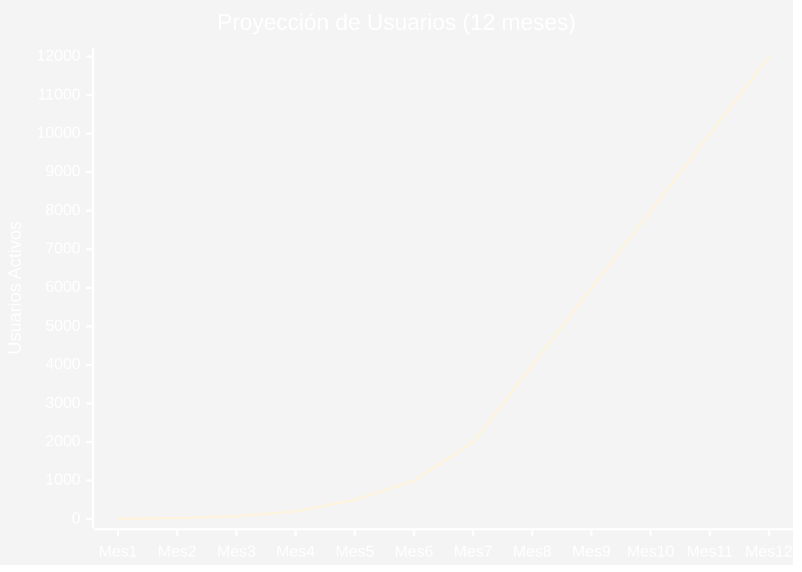
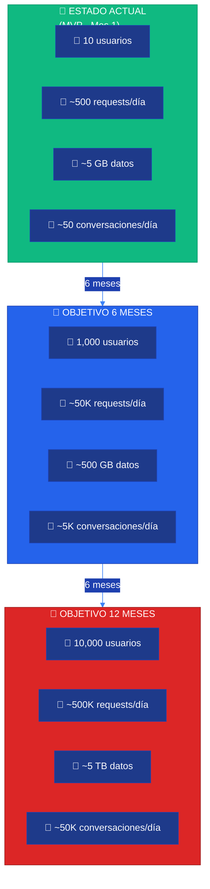
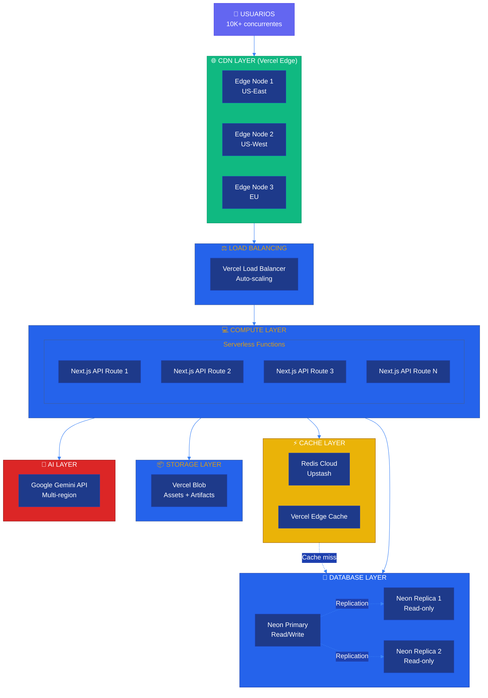
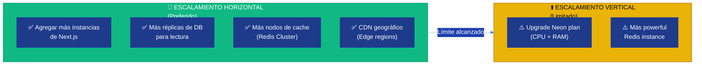
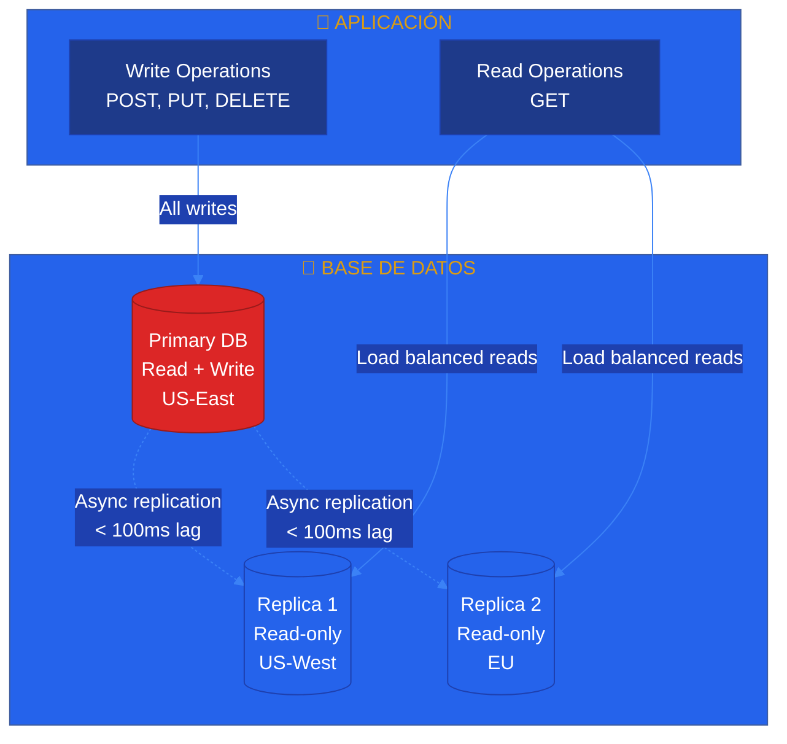
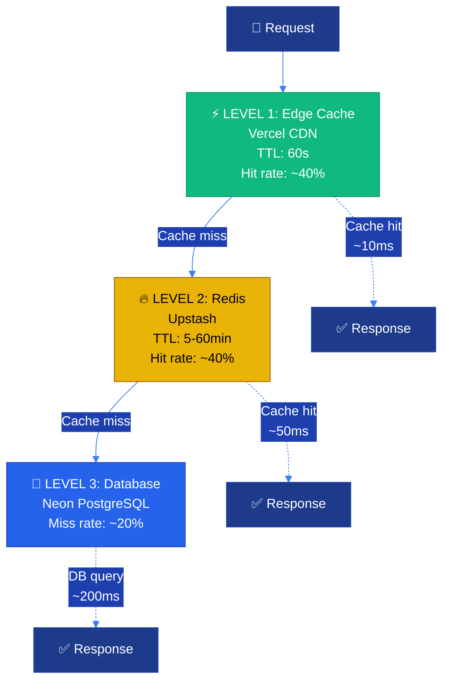
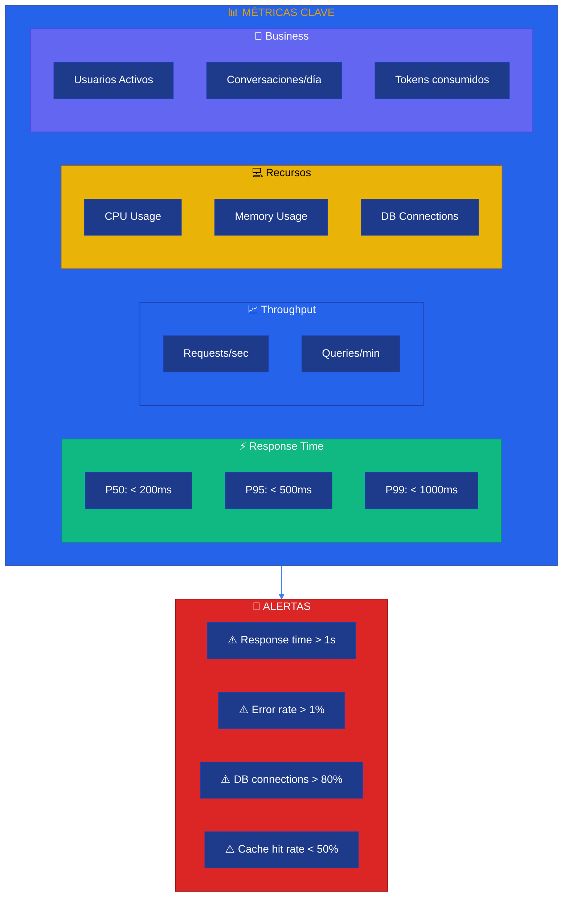

# 🚀 Arquitectura de Escalabilidad

**Sistema CJHIRASHI Agents - Estrategias de Escalamiento y Optimización**

---

## 📋 Índice

1. [Introducción](#introducción)
2. [Análisis de Crecimiento](#análisis-de-crecimiento)
3. [Estrategias de Escalamiento](#estrategias-de-escalamiento)
4. [Optimización de Base de Datos](#optimización-de-base-de-datos)
5. [Caching Estratégico](#caching-estratégico)
6. [Optimización de Performance](#optimización-de-performance)
7. [Monitoreo y Métricas](#monitoreo-y-métricas)
8. [Plan de Crecimiento](#plan-de-crecimiento)

---

## 🎯 Introducción

La escalabilidad es **crítica** para CJHIRASHI Agents debido a:

- 📈 **Crecimiento esperado**: De 10 usuarios MVP a 10,000+ usuarios en 12 meses
- 🤖 **Agentes IA**: Cada conversación consume recursos significativos (tokens, compute)
- 💾 **Datos crecientes**: Health + Finance + Conversations generan TB de datos
- ⚡ **Experiencia de usuario**: Respuestas rápidas (<2s) son cruciales

Este documento define cómo escalar horizontal y verticalmente sin comprometer performance.

---

## 📊 Análisis de Crecimiento

### Proyección de Usuarios



### Proyección de Carga



### Cálculo de Recursos

| Métrica | Mes 1 (MVP) | Mes 6 | Mes 12 | Factor |
|---------|-------------|--------|---------|--------|
| **Usuarios** | 10 | 1,000 | 10,000 | 1000x |
| **Requests/día** | 500 | 50K | 500K | 1000x |
| **DB Size** | 5 GB | 500 GB | 5 TB | 1000x |
| **Conversaciones/día** | 50 | 5K | 50K | 1000x |
| **Tokens/mes** | 500K | 50M | 500M | 1000x |
| **Costos IA/mes** | $50 | $2,500 | $25,000 | 500x |
| **Bandwidth/mes** | 10 GB | 1 TB | 10 TB | 1000x |

---

## ⚡ Estrategias de Escalamiento

### Arquitectura de Escalamiento



### Escalamiento Horizontal vs Vertical



**Estrategia**: Priorizar **horizontal scaling** (agregar más instancias) sobre vertical (hacer instancias más grandes).

**Razones**:
1. ✅ Mejor distribución de carga
2. ✅ Mayor tolerancia a fallos
3. ✅ Escalamiento automático más efectivo
4. ✅ Sin downtime durante escalamiento
5. ⚠️ Vertical tiene límites físicos

---

## 💾 Optimización de Base de Datos

### Estrategias de Indexing

```typescript
// prisma/schema.prisma - Índices optimizados

model User {
  id                String   @id @default(uuid())
  email             String   @unique
  role              UserRole @default(USER)

  // Índices compuestos para queries frecuentes
  @@index([email, isActive])
  @@index([role, isActive])
  @@index([createdAt])
  @@map("users")
}

model Conversation {
  id            String   @id @default(uuid())
  chatSessionId String
  agentId       String
  createdAt     DateTime @default(now())
  updatedAt     DateTime @updatedAt

  // Índices para queries comunes
  @@index([chatSessionId, createdAt]) // Listar conversaciones de sesión
  @@index([agentId, createdAt])       // Conversaciones por agente
  @@index([updatedAt])                // Últimas actualizadas
  @@map("conversations")
}

model Message {
  id             String   @id @default(uuid())
  conversationId String
  role           String
  timestamp      DateTime @default(now())

  // Índice compuesto para paginación eficiente
  @@index([conversationId, timestamp(sort: Desc)])
  @@map("messages")
}

model Transaction {
  id          String   @id @default(uuid())
  accountId   String
  amount      Decimal
  date        DateTime
  category    String?

  // Índices para análisis financiero
  @@index([accountId, date(sort: Desc)])     // Transacciones de cuenta
  @@index([category, date])                   // Por categoría
  @@index([date(sort: Desc)])                // Todas ordenadas por fecha
  @@map("transactions")
}
```

### Read Replicas



**Configuración**:

```typescript
// lib/db/prisma-read-replica.ts
import { PrismaClient } from "@prisma/client";

// Primary (read + write)
export const prisma = new PrismaClient({
  datasources: {
    db: {
      url: process.env.DATABASE_URL, // Primary
    },
  },
});

// Read replica
export const prismaRead = new PrismaClient({
  datasources: {
    db: {
      url: process.env.DATABASE_READ_URL, // Replica
    },
  },
});

// Helper: Decidir qué cliente usar
export function getDBClient(operation: "read" | "write") {
  return operation === "write" ? prisma : prismaRead;
}
```

**Uso**:

```typescript
// app/api/conversations/[id]/route.ts
import { prismaRead } from "@/lib/db/prisma-read-replica";

export async function GET(
  req: Request,
  { params }: { params: { id: string } }
) {
  // Usar read replica para queries de lectura
  const conversation = await prismaRead.conversation.findUnique({
    where: { id: params.id },
    include: {
      messages: {
        orderBy: { timestamp: "desc" },
        take: 50,
      },
    },
  });

  return Response.json(conversation);
}
```

### Connection Pooling

```typescript
// lib/db/prisma.ts
import { PrismaClient } from "@prisma/client";

const globalForPrisma = globalThis as unknown as {
  prisma: PrismaClient | undefined;
};

export const prisma =
  globalForPrisma.prisma ??
  new PrismaClient({
    log:
      process.env.NODE_ENV === "development"
        ? ["query", "error", "warn"]
        : ["error"],

    // Connection pooling optimizado
    datasources: {
      db: {
        url: process.env.DATABASE_URL,
      },
    },

    // Configuración de pool
    // Neon maneja pooling automáticamente, pero configuramos timeouts
    // https://neon.tech/docs/guides/prisma
  });

if (process.env.NODE_ENV !== "production") globalForPrisma.prisma = prisma;

// Pool size recomendado: (num_cores * 2) + effective_spindle_count
// Para serverless: 10-20 conexiones por instancia
```

### Particionamiento de Tablas

Para tablas que crecen rápidamente (mensajes, transacciones, logs):

```sql
-- Particionar tabla de mensajes por mes
-- Esto mejora performance de queries recientes

CREATE TABLE messages (
    id UUID PRIMARY KEY,
    conversation_id UUID NOT NULL,
    role TEXT NOT NULL,
    content TEXT NOT NULL,
    timestamp TIMESTAMP NOT NULL
) PARTITION BY RANGE (timestamp);

-- Particiones mensuales
CREATE TABLE messages_2025_01 PARTITION OF messages
    FOR VALUES FROM ('2025-01-01') TO ('2025-02-01');

CREATE TABLE messages_2025_02 PARTITION OF messages
    FOR VALUES FROM ('2025-02-01') TO ('2025-03-01');

-- Script de mantenimiento: crear partición del próximo mes
-- Ejecutar como cron job mensual
```

---

## ⚡ Caching Estratégico

### Estrategia de Cache en Capas



### Implementación de Redis Cache

```typescript
// lib/cache/redis.ts
import { Redis } from "@upstash/redis";

export const redis = new Redis({
  url: process.env.UPSTASH_REDIS_REST_URL!,
  token: process.env.UPSTASH_REDIS_REST_TOKEN!,
});

// TTL por tipo de dato
export const CACHE_TTL = {
  USER_PROFILE: 60 * 5, // 5 minutos
  AGENT_CONFIG: 60 * 30, // 30 minutos
  CONVERSATION_LIST: 60 * 2, // 2 minutos
  HEALTH_DATA: 60 * 10, // 10 minutos
  FINANCIAL_SUMMARY: 60 * 15, // 15 minutos
  USAGE_METRICS: 60 * 60, // 1 hora
} as const;

// Helper genérico
export async function getCached<T>(
  key: string,
  fetcher: () => Promise<T>,
  ttl: number
): Promise<T> {
  // Intenta obtener del cache
  const cached = await redis.get<T>(key);
  if (cached !== null) {
    return cached;
  }

  // Cache miss: ejecutar fetcher
  const fresh = await fetcher();

  // Guardar en cache
  await redis.setex(key, ttl, fresh);

  return fresh;
}

// Invalidar cache
export async function invalidateCache(pattern: string) {
  // Upstash Redis no soporta SCAN, usar lista de keys
  // Alternativa: usar tags en keys y invalidar por tag
  await redis.del(pattern);
}
```

**Uso**:

```typescript
// app/api/user/profile/route.ts
import { getCached, CACHE_TTL } from "@/lib/cache/redis";
import { prismaRead } from "@/lib/db/prisma-read-replica";

export async function GET(req: Request) {
  const session = await getServerSession();
  const userId = session!.user.id;

  const profile = await getCached(
    `user:profile:${userId}`,
    async () => {
      return await prismaRead.user.findUnique({
        where: { id: userId },
        include: {
          healthProfile: true,
          financialProfile: true,
        },
      });
    },
    CACHE_TTL.USER_PROFILE
  );

  return Response.json(profile);
}
```

### Cache de Conversaciones

```typescript
// lib/cache/conversation.ts
import { getCached, CACHE_TTL, redis } from "./redis";
import { prismaRead } from "@/lib/db/prisma-read-replica";

export async function getCachedConversation(conversationId: string) {
  return getCached(
    `conversation:${conversationId}`,
    async () => {
      return await prismaRead.conversation.findUnique({
        where: { id: conversationId },
        include: {
          messages: {
            orderBy: { timestamp: "desc" },
            take: 50, // Solo últimos 50 mensajes en cache
          },
        },
      });
    },
    CACHE_TTL.CONVERSATION_LIST
  );
}

// Invalidar cuando se agrega mensaje
export async function invalidateConversationCache(conversationId: string) {
  await redis.del(`conversation:${conversationId}`);
}
```

### Edge Caching (Vercel)

```typescript
// app/api/agents/public/route.ts
import { NextResponse } from "next/server";

export const runtime = "edge"; // Edge function

export async function GET() {
  const publicAgents = await prismaRead.agent.findMany({
    where: { isPublic: true },
  });

  return NextResponse.json(publicAgents, {
    headers: {
      // Cache en edge por 60 segundos
      "Cache-Control": "public, s-maxage=60, stale-while-revalidate=120",
    },
  });
}
```

---

## 📈 Optimización de Performance

### Lazy Loading y Code Splitting

```typescript
// app/dashboard/page.tsx
import { Suspense } from "react";
import dynamic from "next/dynamic";

// Code splitting: Cargar componentes pesados solo cuando se necesiten
const FinancialDashboard = dynamic(
  () => import("@/components/finance/dashboard"),
  {
    loading: () => <DashboardSkeleton />,
    ssr: false, // No SSR para componentes con datos sensibles
  }
);

const HealthDashboard = dynamic(
  () => import("@/components/health/dashboard"),
  {
    loading: () => <DashboardSkeleton />,
  }
);

export default function DashboardPage() {
  return (
    <div>
      <Suspense fallback={<DashboardSkeleton />}>
        <FinancialDashboard />
      </Suspense>

      <Suspense fallback={<DashboardSkeleton />}>
        <HealthDashboard />
      </Suspense>
    </div>
  );
}
```

### Paginación Eficiente

```typescript
// app/api/conversations/route.ts
import { z } from "zod";

const QuerySchema = z.object({
  cursor: z.string().optional(),
  limit: z.coerce.number().min(1).max(100).default(20),
});

export async function GET(req: Request) {
  const { searchParams } = new URL(req.url);
  const { cursor, limit } = QuerySchema.parse({
    cursor: searchParams.get("cursor"),
    limit: searchParams.get("limit"),
  });

  // Cursor-based pagination (más eficiente que offset)
  const conversations = await prismaRead.conversation.findMany({
    take: limit + 1, // +1 para saber si hay más
    ...(cursor && {
      cursor: { id: cursor },
      skip: 1, // Skip el cursor mismo
    }),
    orderBy: { updatedAt: "desc" },
  });

  const hasMore = conversations.length > limit;
  const items = hasMore ? conversations.slice(0, -1) : conversations;
  const nextCursor = hasMore ? items[items.length - 1].id : null;

  return Response.json({
    items,
    nextCursor,
    hasMore,
  });
}
```

### Optimización de Queries

```typescript
// ❌ MAL: N+1 queries
async function getConversationsWithAgents(userId: string) {
  const conversations = await prisma.conversation.findMany({
    where: { chatSession: { userId } },
  });

  // Esto genera 1 query por cada conversación!
  for (const conv of conversations) {
    conv.agent = await prisma.agent.findUnique({
      where: { id: conv.agentId },
    });
  }

  return conversations;
}

// ✅ BIEN: 1 query con JOIN
async function getConversationsWithAgents(userId: string) {
  return await prisma.conversation.findMany({
    where: { chatSession: { userId } },
    include: {
      agent: true, // JOIN en una sola query
    },
  });
}

// ✅ MEJOR: Con cache
async function getConversationsWithAgents(userId: string) {
  return getCached(
    `user:${userId}:conversations`,
    async () => {
      return await prismaRead.conversation.findMany({
        where: { chatSession: { userId } },
        include: { agent: true },
      });
    },
    CACHE_TTL.CONVERSATION_LIST
  );
}
```

### Background Jobs

Para operaciones pesadas que no requieren respuesta inmediata:

```typescript
// lib/jobs/queue.ts
import { Queue } from "bullmq";
import { Redis } from "ioredis";

const connection = new Redis(process.env.REDIS_URL!);

export const analysisQueue = new Queue("analysis", { connection });

// Encolar trabajo pesado
export async function enqueueFinancialAnalysis(userId: string) {
  await analysisQueue.add(
    "financial-analysis",
    { userId },
    {
      attempts: 3,
      backoff: {
        type: "exponential",
        delay: 2000,
      },
    }
  );
}
```

```typescript
// lib/jobs/worker.ts
import { Worker } from "bullmq";
import { analyzeUserFinances } from "@/lib/analysis/finance";

const worker = new Worker(
  "analysis",
  async (job) => {
    if (job.name === "financial-analysis") {
      const { userId } = job.data;
      await analyzeUserFinances(userId);
    }
  },
  {
    connection: new Redis(process.env.REDIS_URL!),
    concurrency: 5, // 5 jobs en paralelo
  }
);
```

---

## 📊 Monitoreo y Métricas

### Dashboard de Performance



### Implementación de Métricas

```typescript
// lib/monitoring/metrics.ts
import { prisma } from "@/lib/db/prisma";

export async function recordMetric(metric: {
  name: string;
  value: number;
  tags?: Record<string, string>;
}) {
  await prisma.metric.create({
    data: {
      name: metric.name,
      value: metric.value,
      tags: metric.tags,
      timestamp: new Date(),
    },
  });
}

// Métricas de performance por endpoint
export async function recordAPIMetrics(req: Request, duration: number) {
  const url = new URL(req.url);

  await recordMetric({
    name: "api.response_time",
    value: duration,
    tags: {
      endpoint: url.pathname,
      method: req.method,
    },
  });
}

// Middleware para medir todas las requests
export async function performanceMiddleware(
  req: Request,
  handler: () => Promise<Response>
) {
  const start = Date.now();

  const response = await handler();

  const duration = Date.now() - start;
  await recordAPIMetrics(req, duration);

  return response;
}
```

### Health Check Endpoint

```typescript
// app/api/health/route.ts
import { prisma } from "@/lib/db/prisma";
import { redis } from "@/lib/cache/redis";

export async function GET() {
  const checks = await Promise.allSettled([
    // Check database
    prisma.$queryRaw`SELECT 1`,

    // Check Redis
    redis.ping(),

    // Check AI API
    fetch("https://generativelanguage.googleapis.com/v1/models", {
      headers: {
        "x-goog-api-key": process.env.GOOGLE_AI_API_KEY!,
      },
    }),
  ]);

  const [dbCheck, redisCheck, aiCheck] = checks;

  const health = {
    status: checks.every((c) => c.status === "fulfilled") ? "healthy" : "degraded",
    timestamp: new Date().toISOString(),
    checks: {
      database: dbCheck.status === "fulfilled" ? "up" : "down",
      redis: redisCheck.status === "fulfilled" ? "up" : "down",
      ai: aiCheck.status === "fulfilled" ? "up" : "down",
    },
  };

  return Response.json(health, {
    status: health.status === "healthy" ? 200 : 503,
  });
}
```

---

## 📅 Plan de Crecimiento

### Roadmap de Escalamiento

```mermaid
%%{init: {'theme':'base', 'themeVariables': { 'primaryColor':'#1e3a8a','primaryTextColor':'#fff','primaryBorderColor':'#1e40af','lineColor':'#3b82f6','secondaryColor':'#1e40af','tertiaryColor':'#2563eb'}}}%%
timeline
    title Plan de Escalamiento (12 meses)
    section Fase 1: MVP (Mes 1-2)
        Arquitectura base : Vercel + Neon + Redis básico
        10-100 usuarios : Monitoreo básico
        Sin optimizaciones : Todo en una región
    section Fase 2: Optimización (Mes 3-4)
        Implementar caching : Redis + Edge cache
        100-500 usuarios : Read replicas
        Índices optimizados : Connection pooling
    section Fase 3: Multi-región (Mes 5-7)
        Edge functions : CDN multi-región
        500-2K usuarios : DB réplicas geográficas
        Background jobs : Queue system
    section Fase 4: Escala (Mes 8-12)
        Auto-scaling : Monitoreo avanzado
        2K-10K usuarios : Particionamiento de tablas
        Alertas avanzadas : Cost optimization
```

### Checklist por Fase

#### ✅ Fase 1: MVP (Actual)

- [x] Next.js en Vercel
- [x] Neon PostgreSQL
- [x] Autenticación con NextAuth
- [x] Redis básico (Upstash)
- [x] Health check endpoint
- [ ] Monitoreo básico

#### 🔄 Fase 2: Optimización (Mes 3-4)

- [ ] Implementar cache en todas las queries de lectura
- [ ] Configurar read replica en Neon
- [ ] Optimizar índices basado en queries lentas
- [ ] Implementar paginación cursor-based
- [ ] Code splitting y lazy loading
- [ ] Comprimir assets (imágenes, JS)

#### 🎯 Fase 3: Multi-región (Mes 5-7)

- [ ] Configurar Edge functions para APIs de lectura
- [ ] Réplicas de DB en múltiples regiones
- [ ] CDN para assets estáticos
- [ ] Implementar queue system (BullMQ)
- [ ] Background jobs para análisis pesados

#### 🚀 Fase 4: Escala (Mes 8-12)

- [ ] Auto-scaling basado en métricas
- [ ] Particionamiento de tablas grandes
- [ ] Alertas avanzadas (PagerDuty/Opsgenie)
- [ ] A/B testing infrastructure
- [ ] Cost optimization automático

---

## 💰 Estimación de Costos

| Servicio | Mes 1 | Mes 6 | Mes 12 | Notas |
|----------|-------|--------|---------|-------|
| **Vercel** | $20 | $150 | $400 | Pro plan + bandwidth |
| **Neon DB** | $0 | $50 | $200 | Free tier → Launch → Scale |
| **Redis (Upstash)** | $0 | $20 | $80 | Pay-as-you-go |
| **Google AI (Gemini)** | $50 | $2,500 | $25,000 | Tokens + requests |
| **Vercel Blob** | $0 | $30 | $100 | Storage para artifacts |
| **Monitoreo** | $0 | $50 | $100 | Logs + metrics |
| **Email (Resend)** | $0 | $20 | $50 | Notificaciones |
| **TOTAL** | **~$70** | **~$2,820** | **~$25,930** | |

**Nota**: El mayor costo es el consumo de tokens de IA. Optimizaciones posibles:
- Cache agresivo de respuestas comunes
- Usar modelos más pequeños para tareas simples
- Rate limiting por tier de suscripción

---

## 📚 Referencias

- [Vercel Edge Network](https://vercel.com/docs/edge-network/overview)
- [Neon Branching](https://neon.tech/docs/introduction/branching)
- [Prisma Performance Guide](https://www.prisma.io/docs/guides/performance-and-optimization)
- [Redis Caching Strategies](https://redis.io/docs/manual/patterns/)
- [Next.js Performance](https://nextjs.org/docs/app/building-your-application/optimizing)

---

**Última actualización**: 15 de octubre, 2025
**Próxima revisión**: Mensual (al alcanzar hitos de usuarios)
**Responsable**: Carlos Jiménez Hirashi
**Contacto**: [cjhirashi@gmail.com](mailto:cjhirashi@gmail.com)
