# 🤖 Sistema de Agentes

**CJHIRASHI Agents - Plataforma de Agentes IA Especializados**

---

## 📋 Índice

1. [Introducción](#introducción)
2. [Arquitectura del Sistema](#arquitectura-del-sistema)
3. [Tipos de Agentes](#tipos-de-agentes)
4. [Creación de Agentes](#creación-de-agentes)
5. [Sistema de Conversaciones](#sistema-de-conversaciones)
6. [Artefactos y Versionamiento](#artefactos-y-versionamiento)
7. [Permisos y Compartición](#permisos-y-compartición)
8. [Integración con Sistemas](#integración-con-sistemas)

---

## 🎯 Introducción

El Sistema de Agentes es el **núcleo** de CJHIRASHI Agents, permitiendo:

- 🤖 **Agentes especializados** para diferentes tareas
- 💬 **Conversaciones contextuales** con memoria
- 📦 **Artefactos versionados** (código, documentos, etc.)
- 🔒 **Permisos granulares** para compartir
- 🔌 **Integración profunda** con sistemas de salud y finanzas
- 🎨 **Customización completa** de comportamiento
- 📊 **Métricas y análisis** de uso

---

## 🏗️ Arquitectura del Sistema

### Visión General


### Modelo de Datos


---

## 🤖 Tipos de Agentes

### Categorías de Agentes

```mermaid
%%{init: {'theme':'base', 'themeVariables': { 'primaryColor':'#1e3a8a','primaryTextColor':'#fff','primaryBorderColor':'#1e40af','lineColor':'#3b82f6','secondaryColor':'#1e40af','tertiaryColor':'#2563eb'}}}%%
mindmap
  root((Agentes<br/>CJHIRASHI))
    Asistente Personal
      Salud
      Finanzas
      Productividad
      General
    Especializados
      Médico
      Financiero
      Legal
      Técnico
    Creativos
      Escritor
      Diseñador
      Músico
      Artista
    Desarrollador
      Code Helper
      Debugger
      Documenter
      Reviewer
```



### Agentes del Sistema

```typescript
// types/agents.ts
export enum AgentCategory {
  PERSONAL = "PERSONAL", // Asistente personal
  HEALTH = "HEALTH", // Salud
  FINANCE = "FINANCE", // Finanzas
  PRODUCTIVITY = "PRODUCTIVITY", // Productividad
  CREATIVE = "CREATIVE", // Creatividad
  DEVELOPER = "DEVELOPER", // Desarrollo
  CUSTOM = "CUSTOM", // Personalizado
}

export enum AIModel {
  GEMINI_2_FLASH = "gemini-2.0-flash-exp",
  GEMINI_1_5_PRO = "gemini-1.5-pro",
  GEMINI_1_5_FLASH = "gemini-1.5-flash",
}

export interface Agent {
  id: string;
  name: string;
  description: string;
  category: AgentCategory;
  model: AIModel;
  isPublic: boolean;
  createdById: string;

  // Configuración
  config: AgentConfig;
  systemPrompt: string;
  capabilities: string[]; // ["health_access", "finance_access", "web_search"]

  // Metadata
  avatar?: string;
  color?: string;
  icon?: string;
  tags?: string[];
  version?: string;

  // Estadísticas
  usageCount?: number;
  averageRating?: number;

  createdAt: Date;
  updatedAt: Date;
}

export interface AgentConfig {
  // Parámetros del modelo
  temperature: number; // 0-2
  maxTokens: number; // Max output tokens
  topP?: number; // 0-1
  topK?: number;
  stopSequences?: string[];

  // Comportamiento
  enableMemory: boolean; // Recordar conversaciones previas
  memoryLength?: number; // Cuántos mensajes recordar
  enableTools: boolean; // Permitir uso de herramientas
  allowedTools?: string[]; // ["health_api", "finance_api", "web_search"]

  // Personalización
  greeting?: string; // Mensaje de bienvenida
  responseFormat?: "text" | "markdown" | "json";
  language?: string; // "es", "en", etc.

  // Límites
  maxConversationLength?: number;
  maxArtifactsPerConversation?: number;
}
```

### Agentes Predefinidos

```typescript
// lib/agents/defaults.ts
export const DEFAULT_AGENTS: Partial<Agent>[] = [
  {
    name: "Asistente Personal",
    description:
      "Tu asistente personal con acceso a salud, finanzas y más",
    category: AgentCategory.PERSONAL,
    model: AIModel.GEMINI_2_FLASH,
    isPublic: true,
    capabilities: [
      "health_access",
      "finance_access",
      "web_search",
      "calendar",
    ],
    config: {
      temperature: 0.7,
      maxTokens: 8000,
      enableMemory: true,
      memoryLength: 50,
      enableTools: true,
      greeting: "¡Hola! Soy tu asistente personal. ¿En qué puedo ayudarte?",
    },
    systemPrompt: `
Eres un asistente personal inteligente con acceso a los datos de salud y finanzas del usuario.

Capacidades:
- Consultar y gestionar medicamentos, citas médicas
- Analizar gastos, presupuestos y finanzas personales
- Buscar información en la web
- Ayudar con tareas de productividad

Instrucciones:
1. Sé proactivo: sugiere acciones basadas en el contexto
2. Personaliza respuestas según el perfil del usuario
3. Cita fuentes cuando uses datos específicos
4. Mantén conversaciones naturales y empáticas
5. Prioriza la privacidad y seguridad de datos
`,
  },

  {
    name: "Doctor IA",
    description: "Asistente médico para gestión de salud",
    category: AgentCategory.HEALTH,
    model: AIModel.GEMINI_1_5_PRO,
    isPublic: true,
    capabilities: ["health_access", "web_search"],
    config: {
      temperature: 0.5,
      maxTokens: 4000,
      enableMemory: true,
      enableTools: true,
      greeting:
        "Hola, soy tu asistente de salud. ¿Qué necesitas consultar?",
    },
    systemPrompt: `
Eres un asistente médico especializado con acceso al perfil de salud del usuario.

IMPORTANTE:
- NO diagnostiques ni reemplaces consejo médico profesional
- Sugiere consultar a un médico para síntomas serios
- Usa información médica verificada
- Sé claro sobre tus limitaciones

Puedes:
- Revisar medicamentos y recordatorios
- Analizar mediciones de salud
- Dar información general sobre condiciones
- Sugerir cuando buscar atención médica
`,
  },

  {
    name: "Asesor Financiero IA",
    description: "Experto en finanzas personales y presupuestos",
    category: AgentCategory.FINANCE,
    model: AIModel.GEMINI_1_5_PRO,
    isPublic: true,
    capabilities: ["finance_access", "web_search"],
    config: {
      temperature: 0.3,
      maxTokens: 4000,
      enableMemory: true,
      enableTools: true,
    },
    systemPrompt: `
Eres un asesor financiero personal con acceso a las finanzas del usuario.

Capacidades:
- Analizar gastos y patrones de consumo
- Sugerir ajustes a presupuestos
- Calcular estrategias de pago de deudas
- Proyectar ahorros e inversiones

Enfoque:
- Prioriza estabilidad financiera
- Sugiere metas alcanzables
- Explica conceptos financieros claramente
- Personaliza consejos según la situación del usuario

IMPORTANTE: No proporciones asesoría de inversión específica sin disclaimer.
`,
  },

  {
    name: "Code Helper",
    description: "Asistente de programación y debugging",
    category: AgentCategory.DEVELOPER,
    model: AIModel.GEMINI_2_FLASH,
    isPublic: true,
    capabilities: ["web_search", "code_execution"],
    config: {
      temperature: 0.2,
      maxTokens: 8000,
      enableMemory: true,
      enableTools: true,
      responseFormat: "markdown",
    },
    systemPrompt: `
Eres un asistente de programación experto en múltiples lenguajes.

Capacidades:
- Escribir código limpio y documentado
- Explicar conceptos de programación
- Debuggear y optimizar código
- Sugerir mejores prácticas

Formato de respuesta:
- Usa bloques de código con syntax highlighting
- Explica el razonamiento detrás del código
- Incluye ejemplos de uso
- Menciona posibles edge cases
`,
  },
];
```

---

## 🛠️ Creación de Agentes

### Flujo de Creación


### Implementación

```typescript
// app/api/agents/route.ts
import { getServerSession } from "next-auth";
import { prisma } from "@/lib/db/prisma";
import { checkLimit, Permission } from "@/lib/auth/permissions";
import { z } from "zod";

const CreateAgentSchema = z.object({
  name: z.string().min(1).max(100),
  description: z.string().max(500),
  category: z.nativeEnum(AgentCategory),
  model: z.nativeEnum(AIModel),
  isPublic: z.boolean().default(false),
  systemPrompt: z.string().min(10).max(5000),
  config: z.object({
    temperature: z.number().min(0).max(2).default(0.7),
    maxTokens: z.number().min(100).max(32000).default(4000),
    enableMemory: z.boolean().default(true),
    enableTools: z.boolean().default(false),
  }),
  capabilities: z.array(z.string()).optional(),
});

export async function POST(req: Request) {
  const session = await getServerSession();

  if (!session?.user) {
    return Response.json({ error: "Unauthorized" }, { status: 401 });
  }

  // Validar entrada
  const body = await req.json();
  const data = CreateAgentSchema.parse(body);

  // Si es público, verificar permisos
  if (data.isPublic) {
    if (!hasPermission(session.user.role, Permission.CREATE_PUBLIC_AGENTS)) {
      return Response.json(
        { error: "Insufficient permissions for public agents" },
        { status: 403 }
      );
    }
  }

  // Verificar límite de agentes privados
  if (!data.isPublic) {
    const { allowed, remaining } = await checkLimit(
      session.user.id,
      "maxPrivateAgents"
    );

    if (!allowed) {
      return Response.json(
        {
          error: "Agent limit reached",
          message: `You've reached your limit of private agents. Upgrade your plan to create more.`,
        },
        { status: 429 }
      );
    }
  }

  // Crear agente
  const agent = await prisma.agent.create({
    data: {
      name: data.name,
      description: data.description,
      category: data.category,
      model: data.model,
      isPublic: data.isPublic,
      createdById: session.user.id,
      systemPrompt: data.systemPrompt,
      config: data.config as any,
      capabilities: data.capabilities || [],
    },
  });

  // Crear sesión de chat inicial
  await prisma.chatSession.create({
    data: {
      userId: session.user.id,
      agentId: agent.id,
      title: `Chat con ${agent.name}`,
    },
  });

  // Log de auditoría
  await prisma.auditLog.create({
    data: {
      userId: session.user.id,
      action: "AGENT_CREATED",
      resourceType: "agent",
      resourceId: agent.id,
      metadata: {
        name: agent.name,
        isPublic: agent.isPublic,
      },
    },
  });

  return Response.json({
    data: agent,
  });
}
```

---

## 💬 Sistema de Conversaciones

### Arquitectura de Conversaciones

```mermaid
%%{init: {'theme':'base', 'themeVariables': { 'primaryColor':'#1e3a8a','primaryTextColor':'#fff','primaryBorderColor':'#1e40af','lineColor':'#3b82f6','secondaryColor':'#1e40af','tertiaryColor':'#2563eb'}}}%%
flowchart TD
    User["👤 Usuario envía mensaje"]

    subgraph Processing["🔄 PROCESAMIENTO"]
        Receive["Recibir mensaje"]
        Context["Cargar contexto<br/>Memoria + Perfil"]
        Tools["Identificar herramientas<br/>necesarias"]
    end

    subgraph Execution["⚡ EJECUCIÓN"]
        CallTools["Ejecutar herramientas"]
        HealthAPI["Health API"]
        FinanceAPI["Finance API"]
        WebSearch["Web Search"]
        Model["Llamar modelo IA"]
    end

    subgraph Response["📤 RESPUESTA"]
        Stream["Streaming response"]
        SaveMsg["Guardar mensaje"]
        CheckArtifact["¿Generar artefacto?"]
        CreateArtifact["Crear artefacto"]
    end

    User --> Processing
    Processing --> Execution
    CallTools --> HealthAPI
    CallTools --> FinanceAPI
    CallTools --> WebSearch
    Execution --> Model
    Model --> Response
    CheckArtifact -->|Sí| CreateArtifact
    CheckArtifact -->|No| SaveMsg

    style Processing fill:#2563eb,stroke:#1e40af,color:#fff
    style Execution fill:#ea580c,stroke:#c2410c,color:#fff
    style Response fill:#10b981,stroke:#059669,color:#fff
```



### Implementación del Chat

```typescript
// app/api/conversations/[id]/messages/route.ts
import { GoogleGenerativeAI } from "@google/generative-ai";
import { getServerSession } from "next-auth";
import { prisma } from "@/lib/db/prisma";

export async function POST(
  req: Request,
  { params }: { params: { id: string } }
) {
  const session = await getServerSession();
  if (!session?.user) {
    return Response.json({ error: "Unauthorized" }, { status: 401 });
  }

  const { content } = await req.json();
  const conversationId = params.id;

  // 1. Obtener conversación y agente
  const conversation = await prisma.conversation.findUnique({
    where: { id: conversationId },
    include: {
      agent: true,
      messages: {
        orderBy: { timestamp: "desc" },
        take: 20, // Últimos 20 mensajes para contexto
      },
      chatSession: true,
    },
  });

  if (!conversation) {
    return Response.json(
      { error: "Conversation not found" },
      { status: 404 }
    );
  }

  if (conversation.chatSession.userId !== session.user.id) {
    return Response.json({ error: "Forbidden" }, { status: 403 });
  }

  // 2. Guardar mensaje del usuario
  const userMessage = await prisma.message.create({
    data: {
      conversationId,
      role: "user",
      content,
    },
  });

  // 3. Preparar contexto
  const agent = conversation.agent;
  const config = agent.config as AgentConfig;

  // Obtener perfil del usuario para personalización
  const user = await prisma.user.findUnique({
    where: { id: session.user.id },
    select: {
      personalityProfile: true,
      healthProfile: true,
      financialProfile: true,
    },
  });

  // 4. Construir historial de mensajes
  const history = conversation.messages
    .reverse()
    .map((msg) => ({
      role: msg.role as "user" | "model",
      parts: [{ text: msg.content }],
    }));

  // 5. Iniciar conversación con modelo
  const genAI = new GoogleGenerativeAI(process.env.GOOGLE_AI_API_KEY!);
  const model = genAI.getGenerativeModel({
    model: agent.model,
    generationConfig: {
      temperature: config.temperature,
      maxOutputTokens: config.maxTokens,
      topP: config.topP,
      topK: config.topK,
    },
    systemInstruction: buildSystemPrompt(agent, user),
  });

  // 6. Enviar mensaje y hacer streaming
  const chat = model.startChat({
    history,
  });

  const result = await chat.sendMessageStream(content);

  // 7. Stream response al cliente
  const encoder = new TextEncoder();
  const stream = new ReadableStream({
    async start(controller) {
      let fullResponse = "";

      try {
        for await (const chunk of result.stream) {
          const text = chunk.text();
          fullResponse += text;

          // Enviar chunk al cliente
          controller.enqueue(
            encoder.encode(`data: ${JSON.stringify({ token: text })}\n\n`)
          );
        }

        // 8. Guardar respuesta del asistente
        const assistantMessage = await prisma.message.create({
          data: {
            conversationId,
            role: "assistant",
            content: fullResponse,
          },
        });

        // 9. Registrar uso
        await recordUsage(session.user.id, result);

        // 10. Verificar si se debe generar un artefacto
        if (shouldCreateArtifact(fullResponse)) {
          const artifact = await createArtifact(
            conversationId,
            fullResponse
          );

          controller.enqueue(
            encoder.encode(
              `data: ${JSON.stringify({ artifact: artifact })}\n\n`
            )
          );
        }

        // Finalizar stream
        controller.enqueue(
          encoder.encode(
            `data: ${JSON.stringify({ done: true, messageId: assistantMessage.id })}\n\n`
          )
        );

        controller.close();
      } catch (error) {
        controller.error(error);
      }
    },
  });

  return new Response(stream, {
    headers: {
      "Content-Type": "text/event-stream",
      "Cache-Control": "no-cache",
      Connection: "keep-alive",
    },
  });
}

function buildSystemPrompt(agent: Agent, user: any): string {
  let prompt = agent.systemPrompt;

  // Agregar contexto del perfil IA del usuario
  if (user.personalityProfile) {
    const profile = user.personalityProfile as UserPersonalityProfile;
    prompt += `\n\n## Perfil del Usuario:\n`;
    prompt += `- Estilo de comunicación: ${profile.communicationStyle.formality}\n`;
    prompt += `- Nivel de detalle preferido: ${profile.communicationStyle.verbosity}\n`;
    prompt += `- Intereses: ${profile.interests.topics.join(", ")}\n`;
  }

  // Agregar capacidades disponibles
  const capabilities = agent.capabilities as string[];
  if (capabilities.length > 0) {
    prompt += `\n\n## Herramientas Disponibles:\n`;

    if (capabilities.includes("health_access")) {
      prompt += `- Acceso a datos de salud del usuario (medicamentos, citas, mediciones)\n`;
    }

    if (capabilities.includes("finance_access")) {
      prompt += `- Acceso a datos financieros del usuario (cuentas, transacciones, presupuestos)\n`;
    }

    if (capabilities.includes("web_search")) {
      prompt += `- Búsqueda en la web para información actualizada\n`;
    }
  }

  return prompt;
}

async function recordUsage(userId: string, result: any) {
  const tokensUsed =
    result.response.usageMetadata?.totalTokenCount || 0;

  await prisma.usageLog.create({
    data: {
      userId,
      action: "AGENT_MESSAGE",
      tokensUsed,
      cost: calculateCost(tokensUsed),
    },
  });

  // Actualizar contador mensual del usuario
  await prisma.user.update({
    where: { id: userId },
    data: {
      monthlyMessages: { increment: 1 },
      monthlyTokens: { increment: tokensUsed },
    },
  });
}

function calculateCost(tokens: number): number {
  // Gemini 2.0 Flash: ~$0.075 per 1M input tokens, ~$0.30 per 1M output tokens
  // Asumiendo 50/50 input/output
  const avgCostPerToken = (0.075 + 0.3) / 2 / 1_000_000;
  return tokens * avgCostPerToken;
}
```

---

## 📦 Artefactos y Versionamiento

### ¿Qué son los Artefactos?

Los **artefactos** son contenido sustancial generado por los agentes:

- 💻 **Código** (completo, ejecutable)
- 📄 **Documentos** (markdown, HTML)
- 📊 **Visualizaciones** (SVG, diagramas)
- 🎨 **Diseños** (CSS, UI components)
- 📋 **Planes** (estructurados, detallados)

```mermaid
%%{init: {'theme':'base', 'themeVariables': { 'primaryColor':'#1e3a8a','primaryTextColor':'#fff','primaryBorderColor':'#1e40af','lineColor':'#3b82f6','secondaryColor':'#1e40af','tertiaryColor':'#2563eb'}}}%%
flowchart LR
    Message["💬 Mensaje del agente"]

    Decision{"¿Es un<br/>artefacto?"}

    Criteria["Criterios:<br/>- Más de 15 líneas<br/>- Código completo<br/>- Documento estructurado<br/>- Visualización<br/>- Plan detallado"]

    Create["📦 Crear artefacto"]

    Version["🔄 Sistema de<br/>versionamiento"]

    Display["🖥️ Renderizar en<br/>panel separado"]

    Message --> Decision
    Decision -->|Evaluar| Criteria
    Criteria -->|Sí| Create
    Create --> Version
    Version --> Display

    Decision -->|No| Skip["Mensaje normal"]

    style Decision fill:#eab308,stroke:#a16207,color:#000
    style Create fill:#10b981,stroke:#059669,color:#fff
    style Version fill:#2563eb,stroke:#1e40af,color:#fff
```



### Tipos de Artefactos

```typescript
// types/artifacts.ts
export enum ArtifactType {
  CODE = "CODE",
  DOCUMENT = "DOCUMENT",
  SVG = "SVG",
  MERMAID = "MERMAID",
  HTML = "HTML",
  REACT_COMPONENT = "REACT_COMPONENT",
}

export interface Artifact {
  id: string;
  conversationId: string;
  title: string;
  type: ArtifactType;
  content: string;
  language?: string; // "typescript", "python", etc.
  currentVersion: number;

  // Metadata
  description?: string;
  tags?: string[];

  createdAt: Date;
  updatedAt: Date;
}

export interface ArtifactVersion {
  id: string;
  artifactId: string;
  version: number;
  content: string;
  changelog?: string;
  createdAt: Date;
}
```

### Creación Automática de Artefactos

```typescript
// lib/agents/artifact-detector.ts
export function shouldCreateArtifact(content: string): boolean {
  // Detectar bloques de código
  const codeBlockRegex = /```[\s\S]+?```/g;
  const codeBlocks = content.match(codeBlockRegex);

  if (codeBlocks && codeBlocks.length > 0) {
    const firstBlock = codeBlocks[0];
    const lines = firstBlock.split("\n").length;

    // Crear artefacto si el código tiene más de 15 líneas
    if (lines > 15) {
      return true;
    }
  }

  // Detectar SVG
  if (content.includes("<svg") && content.includes("</svg>")) {
    return true;
  }

  // Detectar diagramas Mermaid
  if (content.includes("```mermaid")) {
    return true;
  }

  // Detectar HTML estructurado
  if (
    content.includes("<!DOCTYPE html>") ||
    (content.includes("<html") && content.includes("</html>"))
  ) {
    return true;
  }

  return false;
}

export async function createArtifact(
  conversationId: string,
  content: string
): Promise<Artifact> {
  // Detectar tipo
  const type = detectArtifactType(content);

  // Extraer código del markdown
  const extracted = extractCode(content, type);

  // Generar título automático
  const title = await generateArtifactTitle(extracted.content, type);

  // Crear artefacto
  const artifact = await prisma.artifact.create({
    data: {
      conversationId,
      title,
      type,
      content: extracted.content,
      language: extracted.language,
      currentVersion: 1,
    },
  });

  // Crear versión inicial
  await prisma.artifactVersion.create({
    data: {
      artifactId: artifact.id,
      version: 1,
      content: extracted.content,
      changelog: "Initial version",
    },
  });

  return artifact;
}

function detectArtifactType(content: string): ArtifactType {
  if (content.includes("```mermaid")) return ArtifactType.MERMAID;
  if (content.includes("<svg")) return ArtifactType.SVG;
  if (content.includes("<!DOCTYPE html>")) return ArtifactType.HTML;
  if (
    content.includes("export default function") ||
    content.includes("export const")
  ) {
    return ArtifactType.REACT_COMPONENT;
  }
  if (content.includes("```")) return ArtifactType.CODE;
  return ArtifactType.DOCUMENT;
}

function extractCode(
  content: string,
  type: ArtifactType
): { content: string; language?: string } {
  if (type === ArtifactType.CODE || type === ArtifactType.REACT_COMPONENT) {
    const match = content.match(/```(\w+)?\n([\s\S]+?)```/);
    if (match) {
      return {
        content: match[2].trim(),
        language: match[1] || "plaintext",
      };
    }
  }

  return { content: content.trim() };
}

async function generateArtifactTitle(
  content: string,
  type: ArtifactType
): Promise<string> {
  // Generar título con IA (opcional)
  // Por ahora, usar reglas simples

  switch (type) {
    case ArtifactType.CODE:
    case ArtifactType.REACT_COMPONENT:
      // Buscar nombre de función o clase
      const functionMatch = content.match(
        /(?:function|const|class)\s+(\w+)/
      );
      if (functionMatch) return functionMatch[1];
      return "Code Snippet";

    case ArtifactType.MERMAID:
      return "Diagram";

    case ArtifactType.SVG:
      return "SVG Visualization";

    case ArtifactType.HTML:
      const titleMatch = content.match(/<title>(.*?)<\/title>/);
      if (titleMatch) return titleMatch[1];
      return "HTML Document";

    default:
      return "Document";
  }
}
```

### Versionamiento

```typescript
// lib/agents/artifact-versioning.ts
export async function updateArtifact(
  artifactId: string,
  newContent: string,
  changelog?: string
) {
  const artifact = await prisma.artifact.findUnique({
    where: { id: artifactId },
  });

  if (!artifact) {
    throw new Error("Artifact not found");
  }

  const newVersion = artifact.currentVersion + 1;

  // Crear nueva versión
  await prisma.artifactVersion.create({
    data: {
      artifactId,
      version: newVersion,
      content: newContent,
      changelog: changelog || `Version ${newVersion}`,
    },
  });

  // Actualizar artefacto
  await prisma.artifact.update({
    where: { id: artifactId },
    data: {
      content: newContent,
      currentVersion: newVersion,
      updatedAt: new Date(),
    },
  });

  return newVersion;
}

export async function revertArtifact(artifactId: string, version: number) {
  const artifactVersion = await prisma.artifactVersion.findFirst({
    where: {
      artifactId,
      version,
    },
  });

  if (!artifactVersion) {
    throw new Error("Version not found");
  }

  await prisma.artifact.update({
    where: { id: artifactId },
    data: {
      content: artifactVersion.content,
      currentVersion: version,
      updatedAt: new Date(),
    },
  });
}

export async function getArtifactHistory(artifactId: string) {
  return await prisma.artifactVersion.findMany({
    where: { artifactId },
    orderBy: { version: "desc" },
  });
}
```

---

## 🔒 Permisos y Compartición

### Sistema de Permisos

```typescript
// types/permissions.ts
export enum AgentPermissionLevel {
  VIEW = "VIEW", // Ver y usar el agente
  EDIT = "EDIT", // Editar configuración
  ADMIN = "ADMIN", // Control total + compartir
}

export interface AgentPermission {
  id: string;
  agentId: string;
  userId: string;
  level: AgentPermissionLevel;
  grantedBy: string; // userId que otorgó el permiso
  grantedAt: Date;
  expiresAt?: Date;
}
```

### Compartir Agentes

```typescript
// app/api/agents/[id]/share/route.ts
export async function POST(
  req: Request,
  { params }: { params: { id: string } }
) {
  const session = await getServerSession();
  if (!session?.user) {
    return Response.json({ error: "Unauthorized" }, { status: 401 });
  }

  const { email, level } = await req.json();
  const agentId = params.id;

  // Verificar que el usuario es dueño o admin del agente
  const agent = await prisma.agent.findUnique({
    where: { id: agentId },
    include: { permissions: true },
  });

  if (!agent) {
    return Response.json({ error: "Agent not found" }, { status: 404 });
  }

  const isOwner = agent.createdById === session.user.id;
  const isAdmin = agent.permissions.some(
    (p) =>
      p.userId === session.user.id && p.level === AgentPermissionLevel.ADMIN
  );

  if (!isOwner && !isAdmin) {
    return Response.json({ error: "Forbidden" }, { status: 403 });
  }

  // Buscar usuario por email
  const targetUser = await prisma.user.findUnique({
    where: { email },
  });

  if (!targetUser) {
    return Response.json({ error: "User not found" }, { status: 404 });
  }

  // Crear permiso
  const permission = await prisma.agentPermission.create({
    data: {
      agentId,
      userId: targetUser.id,
      level,
      grantedBy: session.user.id,
    },
  });

  // Enviar notificación por email
  await sendEmail({
    to: email,
    subject: `${session.user.name} compartió un agente contigo`,
    html: `
      <h2>🤖 Agente Compartido</h2>
      <p>${session.user.name} ha compartido el agente "${agent.name}" contigo.</p>
      <p><a href="${process.env.NEXTAUTH_URL}/agents/${agent.id}">Ver agente</a></p>
    `,
  });

  return Response.json({ data: permission });
}
```

---

## 🔌 Integración con Sistemas

### Herramientas Disponibles

Los agentes pueden acceder a herramientas especializadas:

```typescript
// lib/agents/tools.ts
export interface AgentTool {
  name: string;
  description: string;
  parameters: Record<string, any>;
  execute: (params: any, userId: string) => Promise<any>;
}

export const AGENT_TOOLS: Record<string, AgentTool> = {
  get_medications: {
    name: "get_medications",
    description: "Get user's active medications",
    parameters: {},
    execute: async (params, userId) => {
      return await prisma.medication.findMany({
        where: {
          healthProfile: { userId },
          isActive: true,
        },
      });
    },
  },

  get_spending_summary: {
    name: "get_spending_summary",
    description: "Get user's spending summary for a period",
    parameters: {
      period: { type: "string", enum: ["week", "month", "year"] },
    },
    execute: async (params, userId) => {
      return await getSpendingAnalysis(userId, params.period);
    },
  },

  search_web: {
    name: "search_web",
    description: "Search the web for information",
    parameters: {
      query: { type: "string" },
    },
    execute: async (params, userId) => {
      // Implementar con API de búsqueda (Google, Bing, etc.)
      return await searchWeb(params.query);
    },
  },

  create_budget: {
    name: "create_budget",
    description: "Create a new budget",
    parameters: {
      category: { type: "string" },
      amount: { type: "number" },
      period: { type: "string" },
    },
    execute: async (params, userId) => {
      const profile = await prisma.financialProfile.findUnique({
        where: { userId },
      });

      return await prisma.budget.create({
        data: {
          profileId: profile!.id,
          name: `Budget: ${params.category}`,
          category: params.category,
          amount: params.amount,
          spent: 0,
          period: params.period,
          startDate: new Date(),
          endDate: calculateEndDate(params.period),
        },
      });
    },
  },
};
```

---

## 📊 Métricas y Análisis

```typescript
// lib/agents/metrics.ts
export async function getAgentMetrics(agentId: string) {
  const [
    totalConversations,
    totalMessages,
    totalArtifacts,
    usageLogs,
  ] = await Promise.all([
    prisma.conversation.count({
      where: { agentId },
    }),

    prisma.message.count({
      where: {
        conversation: { agentId },
      },
    }),

    prisma.artifact.count({
      where: {
        conversation: { agentId },
      },
    }),

    prisma.usageLog.findMany({
      where: {
        metadata: {
          path: ["agentId"],
          equals: agentId,
        },
      },
    }),
  ]);

  const totalTokens = usageLogs.reduce((sum, log) => sum + log.tokensUsed, 0);
  const totalCost = usageLogs.reduce((sum, log) => sum + log.cost, 0);

  return {
    totalConversations,
    totalMessages,
    totalArtifacts,
    totalTokens,
    totalCost,
    averageMessagesPerConversation: totalMessages / totalConversations,
  };
}
```

---

## 📡 API Reference

Ver documentación completa: [API Reference](../../api/README.md#agents-api)

**Endpoints principales**:

- `GET /api/agents` - Listar agentes
- `POST /api/agents` - Crear agente
- `GET /api/agents/:id` - Detalles del agente
- `PATCH /api/agents/:id` - Actualizar agente
- `DELETE /api/agents/:id` - Eliminar agente
- `POST /api/agents/:id/share` - Compartir agente
- `GET /api/conversations` - Listar conversaciones
- `POST /api/conversations` - Crear conversación
- `POST /api/conversations/:id/messages` - Enviar mensaje
- `GET /api/artifacts/:id` - Obtener artefacto
- `GET /api/artifacts/:id/versions` - Historial de versiones

---

## 📚 Referencias

- [Arquitectura General](../../architecture/01-OVERVIEW.md)
- [Personal Assistant Agent](../../agents/personal-assistant/README.md)
- [Agent Template](../../agents/_TEMPLATE/README.md)
- [API Reference](../../api/README.md)

---

**Última actualización**: 15 de octubre, 2025
**Versión**: 2.0.0
**Mantenedor**: Carlos Jiménez Hirashi
**Contacto**: [cjhirashi@gmail.com](mailto:cjhirashi@gmail.com)
