# 💰 Sistema Financiero

**CJHIRASHI Agents - Gestión Inteligente de Finanzas Personales**

---

## 📋 Índice

1. [Introducción](#introducción)
2. [Arquitectura del Sistema](#arquitectura-del-sistema)
3. [Cuentas Bancarias](#cuentas-bancarias)
4. [Transacciones](#transacciones)
5. [Presupuestos](#presupuestos)
6. [Deudas e Inversiones](#deudas-e-inversiones)
7. [Análisis IA](#análisis-ia)
8. [Privacidad y Seguridad](#privacidad-y-seguridad)

---

## 🎯 Introducción

El Sistema Financiero de CJHIRASHI Agents te ayuda a:

- 🏦 **Gestionar cuentas** bancarias y tarjetas
- 💳 **Rastrear transacciones** automáticamente
- 📊 **Crear presupuestos** inteligentes
- 📈 **Monitorear inversiones** y patrimonio
- 💸 **Controlar deudas** con plan de pagos
- 🤖 **Análisis IA** para decisiones financieras
- 🔒 **Encriptación de datos** bancarios

---

## 🏗️ Arquitectura del Sistema

### Visión General

```mermaid
%%{init: {'theme':'base', 'themeVariables': { 'primaryColor':'#1e3a8a','primaryTextColor':'#fff','primaryBorderColor':'#1e40af','lineColor':'#3b82f6','secondaryColor':'#1e40af','tertiaryColor':'#2563eb'}}}%%
flowchart TD
    User["👤 Usuario"]

    subgraph Profile["💼 PERFIL FINANCIERO"]
        BasicInfo["Información Base<br/>Ingresos, moneda, patrimonio"]
        Goals["Metas Financieras"]
    end

    subgraph Accounts["🏦 CUENTAS"]
        Checking["Cuenta de cheques"]
        Savings["Ahorros"]
        Credit["Tarjetas de crédito"]
        Investment["Inversiones"]
    end

    subgraph Transactions["💳 TRANSACCIONES"]
        Income["Ingresos"]
        Expenses["Gastos"]
        Transfers["Transferencias"]
        Categorization["Categorización Auto"]
    end

    subgraph Budgets["📊 PRESUPUESTOS"]
        Categories["Por categoría"]
        Monthly["Mensuales"]
        Tracking["Seguimiento"]
        Alerts["Alertas de límite"]
    end

    subgraph Debts["💸 DEUDAS"]
        CreditCards["Tarjetas crédito"]
        Loans["Préstamos"]
        PaymentPlan["Plan de pagos"]
        InterestCalc["Cálculo intereses"]
    end

    subgraph Investments["📈 INVERSIONES"]
        Stocks["Acciones"]
        Bonds["Bonos"]
        Crypto["Criptomonedas"]
        RealEstate["Bienes raíces"]
    end

    subgraph AI["🤖 ANÁLISIS IA"]
        SpendingPatterns["Patrones de gasto"]
        Forecasting["Pronósticos"]
        Recommendations["Recomendaciones"]
        Insights["Insights financieros"]
    end

    User --> Profile
    Profile --> Accounts
    Accounts --> Transactions
    Transactions --> Budgets
    Accounts --> Debts
    Accounts --> Investments

    Transactions --> AI
    Budgets --> AI
    Debts --> AI
    Investments --> AI

    style Profile fill:#2563eb,stroke:#1e40af,color:#fff
    style Accounts fill:#10b981,stroke:#059669,color:#fff
    style Transactions fill:#ea580c,stroke:#c2410c,color:#fff
    style Budgets fill:#6366f1,stroke:#4f46e5,color:#fff
    style Debts fill:#dc2626,stroke:#991b1b,color:#fff
    style Investments fill:#10b981,stroke:#059669,color:#fff
    style AI fill:#eab308,stroke:#a16207,color:#000
```



### Modelo de Datos

```mermaid
%%{init: {'theme':'base', 'themeVariables': { 'primaryColor':'#1e3a8a','primaryTextColor':'#fff','primaryBorderColor':'#1e40af','lineColor':'#3b82f6','secondaryColor':'#1e40af','tertiaryColor':'#2563eb'}}}%%
erDiagram
    USER ||--|| FINANCIAL_PROFILE : "has"
    FINANCIAL_PROFILE ||--o{ FINANCIAL_ACCOUNT : "has"
    FINANCIAL_ACCOUNT ||--o{ TRANSACTION : "has"
    FINANCIAL_PROFILE ||--o{ BUDGET : "has"
    FINANCIAL_PROFILE ||--o{ DEBT : "has"
    FINANCIAL_PROFILE ||--o{ INVESTMENT : "has"
    FINANCIAL_PROFILE ||--o{ RECURRING_PAYMENT : "has"
    DEBT ||--o{ DEBT_PAYMENT : "has"

    FINANCIAL_PROFILE {
        uuid id PK
        uuid userId FK UK
        string currency
        decimal monthlyIncome
        decimal totalAssets
        decimal totalLiabilities
        decimal netWorth
        json financialGoals
    }

    FINANCIAL_ACCOUNT {
        uuid id PK
        uuid profileId FK
        string name
        enum type
        decimal balance
        string currency
        string institution
        string accountNumber
        boolean isActive
    }

    TRANSACTION {
        uuid id PK
        uuid accountId FK
        decimal amount
        string description
        enum category
        enum type
        date date
        json metadata
    }

    BUDGET {
        uuid id PK
        uuid profileId FK
        string name
        enum category
        decimal amount
        decimal spent
        enum period
        date startDate
        date endDate
    }

    DEBT {
        uuid id PK
        uuid profileId FK
        string name
        decimal principal
        decimal currentBalance
        float interestRate
        date dueDate
        decimal minimumPayment
    }

    INVESTMENT {
        uuid id PK
        uuid profileId FK
        string name
        enum type
        decimal amount
        decimal currentValue
        date purchaseDate
    }
```

---

## 🏦 Cuentas Bancarias

### Tipos de Cuentas

```typescript
// types/accounts.ts
export enum AccountType {
  CHECKING = "CHECKING", // Cuenta de cheques
  SAVINGS = "SAVINGS", // Ahorros
  CREDIT_CARD = "CREDIT_CARD", // Tarjeta de crédito
  INVESTMENT = "INVESTMENT", // Inversión
  LOAN = "LOAN", // Préstamo
  CRYPTO = "CRYPTO", // Criptomonedas
  CASH = "CASH", // Efectivo
  OTHER = "OTHER",
}

export interface FinancialAccount {
  id: string;
  profileId: string;
  name: string;
  type: AccountType;
  balance: number;
  currency: string; // ISO 4217: USD, MXN, EUR
  institution: string; // "BBVA", "Santander", etc.
  accountNumber?: string; // Encriptado
  isActive: boolean;

  // Para tarjetas de crédito
  creditLimit?: number;
  availableCredit?: number;
  dueDate?: number; // Día del mes (1-31)
  closingDate?: number; // Día del mes (1-31)

  // Metadata
  lastSyncedAt?: Date;
  color?: string; // Para UI
  icon?: string;
}
```

### Visualización de Balance


---

## 💳 Transacciones

### Categorías de Transacciones

```typescript
// types/transactions.ts
export enum TransactionCategory {
  // Ingresos
  SALARY = "SALARY",
  FREELANCE = "FREELANCE",
  INVESTMENT_INCOME = "INVESTMENT_INCOME",
  OTHER_INCOME = "OTHER_INCOME",

  // Gastos fijos
  RENT = "RENT",
  UTILITIES = "UTILITIES",
  INSURANCE = "INSURANCE",
  SUBSCRIPTIONS = "SUBSCRIPTIONS",

  // Gastos variables
  FOOD = "FOOD",
  TRANSPORT = "TRANSPORT",
  ENTERTAINMENT = "ENTERTAINMENT",
  SHOPPING = "SHOPPING",
  HEALTH = "HEALTH",
  EDUCATION = "EDUCATION",

  // Otros
  TRANSFER = "TRANSFER",
  SAVINGS = "SAVINGS",
  DEBT_PAYMENT = "DEBT_PAYMENT",
  UNCATEGORIZED = "UNCATEGORIZED",
}

export enum TransactionType {
  INCOME = "INCOME", // Ingreso
  EXPENSE = "EXPENSE", // Gasto
  TRANSFER = "TRANSFER", // Transferencia entre cuentas
}

export interface Transaction {
  id: string;
  accountId: string;
  amount: number; // Positivo para ingresos, negativo para gastos
  description: string;
  category: TransactionCategory;
  type: TransactionType;
  date: Date;

  // Metadata
  merchant?: string;
  location?: string;
  notes?: string;
  tags?: string[];
  receipt?: string; // URL de imagen de recibo

  // Categorización
  isRecurring?: boolean;
  recurringId?: string;
  autoCateg orized?: boolean; // Si fue categorizado por IA
  confidence?: number; // 0-100 confianza de categorización

  createdAt: Date;
  updatedAt: Date;
}
```

### Categorización Automática con IA

```typescript
// lib/finance/auto-categorization.ts
import { GoogleGenerativeAI } from "@google/generative-ai";
import { prisma } from "@/lib/db/prisma";

export async function autoCategor izeTransaction(
  transaction: Partial<Transaction>
): Promise<{
  category: TransactionCategory;
  confidence: number;
}> {
  // 1. Obtener transacciones previas del usuario para contexto
  const previousTransactions = await prisma.transaction.findMany({
    where: {
      account: {
        profile: {
          id: transaction.accountId,
        },
      },
    },
    orderBy: { date: "desc" },
    take: 100,
  });

  // 2. Preparar contexto
  const prompt = `
Categoriza la siguiente transacción financiera basándote en el historial del usuario:

## Transacción a categorizar:
- Descripción: ${transaction.description}
- Monto: ${transaction.amount}
- Comercio: ${transaction.merchant || "N/A"}

## Historial (últimas 100 transacciones):
${previousTransactions
  .slice(0, 20)
  .map((t) => `- "${t.description}" → ${t.category}`)
  .join("\n")}

---

Categorías disponibles:
${Object.values(TransactionCategory).join(", ")}

Responde con JSON:
{
  "category": "CATEGORY_NAME",
  "confidence": 0-100,
  "reasoning": "Breve explicación"
}
`;

  // 3. Llamar al modelo
  const genAI = new GoogleGenerativeAI(process.env.GOOGLE_AI_API_KEY!);
  const model = genAI.getGenerativeModel({ model: "gemini-2.0-flash-exp" });
  const result = await model.generateContent(prompt);
  const response = JSON.parse(result.response.text());

  return {
    category: response.category,
    confidence: response.confidence,
  };
}

// Aplicar a transacciones sin categorizar
export async function processPendingCategorization(userId: string) {
  const uncategorized = await prisma.transaction.findMany({
    where: {
      account: {
        profile: { userId },
      },
      category: TransactionCategory.UNCATEGORIZED,
    },
    take: 50,
  });

  for (const txn of uncategorized) {
    const { category, confidence } = await autoCategor izeTransaction(txn);

    // Solo aplicar si la confianza es alta
    if (confidence >= 80) {
      await prisma.transaction.update({
        where: { id: txn.id },
        data: {
          category,
          autoCategorized: true,
          confidence,
        },
      });
    }
  }
}
```

### Análisis de Gastos

```typescript
// lib/finance/spending-analysis.ts
export async function getSpendingAnalysis(
  userId: string,
  period: "week" | "month" | "year" = "month"
) {
  const startDate = getStartDate(period);

  const transactions = await prisma.transaction.findMany({
    where: {
      account: {
        profile: { userId },
      },
      type: TransactionType.EXPENSE,
      date: {
        gte: startDate,
      },
    },
  });

  // Agrupar por categoría
  const byCategory = transactions.reduce((acc, txn) => {
    const category = txn.category;
    if (!acc[category]) {
      acc[category] = {
        total: 0,
        count: 0,
        transactions: [],
      };
    }
    acc[category].total += Math.abs(txn.amount);
    acc[category].count += 1;
    acc[category].transactions.push(txn);
    return acc;
  }, {} as Record<string, any>);

  const totalSpent = Object.values(byCategory).reduce(
    (sum: number, cat: any) => sum + cat.total,
    0
  );

  // Calcular porcentajes
  const categoriesWithPercentage = Object.entries(byCategory).map(
    ([category, data]: [string, any]) => ({
      category,
      total: data.total,
      count: data.count,
      percentage: (data.total / totalSpent) * 100,
      average: data.total / data.count,
    })
  );

  // Ordenar por total descendente
  categoriesWithPercentage.sort((a, b) => b.total - a.total);

  return {
    period,
    totalSpent,
    transactionCount: transactions.length,
    categories: categoriesWithPercentage,
    topCategory: categoriesWithPercentage[0],
    averageTransactionAmount: totalSpent / transactions.length,
  };
}

function getStartDate(period: "week" | "month" | "year"): Date {
  const now = new Date();
  switch (period) {
    case "week":
      return new Date(now.getTime() - 7 * 24 * 60 * 60 * 1000);
    case "month":
      return new Date(now.getFullYear(), now.getMonth(), 1);
    case "year":
      return new Date(now.getFullYear(), 0, 1);
  }
}
```

---

## 📊 Presupuestos

### Sistema de Presupuestos

```mermaid
%%{init: {'theme':'base', 'themeVariables': { 'primaryColor':'#1e3a8a','primaryTextColor':'#fff','primaryBorderColor':'#1e40af','lineColor':'#3b82f6','secondaryColor':'#1e40af','tertiaryColor':'#2563eb'}}}%%
flowchart LR
    subgraph Create["➕ CREAR"]
        Set["Definir categoría"]
        Amount["Establecer monto"]
        Period["Seleccionar período"]
    end

    subgraph Track["📊 SEGUIMIENTO"]
        Auto["Tracking automático<br/>de gastos"]
        Progress["Progreso en %"]
        Remaining["Restante"]
    end

    subgraph Alert["🚨 ALERTAS"]
        Warning["80% gastado<br/>Advertencia"]
        Critical["100% gastado<br/>Crítico"]
        Exceeded["Excedido<br/>Alerta máxima"]
    end

    subgraph Analyze["📈 ANÁLISIS"]
        Compare["Comparar períodos"]
        Trends["Tendencias"]
        Adjust["Sugerencias de ajuste"]
    end

    Create --> Track
    Track --> Alert
    Alert --> Analyze
    Analyze -.->|Optimizar| Create

    style Create fill:#10b981,stroke:#059669,color:#fff
    style Track fill:#2563eb,stroke:#1e40af,color:#fff
    style Alert fill:#dc2626,stroke:#991b1b,color:#fff
    style Analyze fill:#6366f1,stroke:#4f46e5,color:#fff
```



### Tipos de Presupuestos

```typescript
// types/budgets.ts
export enum BudgetPeriod {
  WEEKLY = "WEEKLY",
  MONTHLY = "MONTHLY",
  QUARTERLY = "QUARTERLY",
  YEARLY = "YEARLY",
}

export enum BudgetStatus {
  ON_TRACK = "ON_TRACK", // < 80%
  WARNING = "WARNING", // 80-100%
  CRITICAL = "CRITICAL", // 100%
  EXCEEDED = "EXCEEDED", // > 100%
}

export interface Budget {
  id: string;
  profileId: string;
  name: string;
  category: TransactionCategory;
  amount: number;
  spent: number;
  remaining: number;
  percentage: number; // spent / amount * 100
  status: BudgetStatus;
  period: BudgetPeriod;
  startDate: Date;
  endDate: Date;

  // Alertas
  alertThresholds?: number[]; // [80, 100] = alertar a 80% y 100%
  lastAlertSent?: Date;

  // Metadata
  notes?: string;
  isActive: boolean;
  createdAt: Date;
  updatedAt: Date;
}
```

### Cálculo y Actualización de Presupuestos

```typescript
// lib/finance/budget-tracking.ts
export async function updateBudgetProgress(budgetId: string) {
  const budget = await prisma.budget.findUnique({
    where: { id: budgetId },
  });

  if (!budget) return;

  // Calcular gastos en el período
  const transactions = await prisma.transaction.findMany({
    where: {
      account: {
        profileId: budget.profileId,
      },
      category: budget.category,
      type: TransactionType.EXPENSE,
      date: {
        gte: budget.startDate,
        lte: budget.endDate,
      },
    },
  });

  const spent = transactions.reduce(
    (sum, txn) => sum + Math.abs(txn.amount),
    0
  );
  const remaining = budget.amount - spent;
  const percentage = (spent / budget.amount) * 100;

  // Determinar status
  let status: BudgetStatus;
  if (percentage < 80) status = BudgetStatus.ON_TRACK;
  else if (percentage < 100) status = BudgetStatus.WARNING;
  else if (percentage === 100) status = BudgetStatus.CRITICAL;
  else status = BudgetStatus.EXCEEDED;

  // Actualizar budget
  await prisma.budget.update({
    where: { id: budgetId },
    data: {
      spent,
      remaining,
      percentage,
      status,
    },
  });

  // Verificar si se debe enviar alerta
  await checkBudgetAlerts(budgetId, percentage, status);
}

async function checkBudgetAlerts(
  budgetId: string,
  percentage: number,
  status: BudgetStatus
) {
  const budget = await prisma.budget.findUnique({
    where: { id: budgetId },
    include: {
      profile: {
        include: { user: true },
      },
    },
  });

  if (!budget) return;

  const thresholds = budget.alertThresholds || [80, 100];
  const user = budget.profile.user;

  // Verificar cada threshold
  for (const threshold of thresholds) {
    if (percentage >= threshold && percentage < threshold + 5) {
      // Solo enviar si cruzó el umbral recientemente
      await sendBudgetAlert(user, budget, threshold);

      // Actualizar última alerta
      await prisma.budget.update({
        where: { id: budgetId },
        data: { lastAlertSent: new Date() },
      });
    }
  }
}

async function sendBudgetAlert(
  user: any,
  budget: Budget,
  threshold: number
) {
  const message =
    threshold >= 100
      ? `Has excedido tu presupuesto de ${budget.category}!`
      : `Has gastado el ${threshold}% de tu presupuesto de ${budget.category}`;

  await sendPushNotification(user.id, {
    title: "🚨 Alerta de Presupuesto",
    body: message,
    data: {
      type: "budget_alert",
      budgetId: budget.id,
    },
  });

  await sendEmail({
    to: user.email,
    subject: `Alerta de Presupuesto: ${budget.name}`,
    html: `
      <h2>🚨 Alerta de Presupuesto</h2>
      <p>Hola ${user.name},</p>
      <p>${message}</p>
      <ul>
        <li><strong>Categoría:</strong> ${budget.category}</li>
        <li><strong>Presupuesto:</strong> $${budget.amount}</li>
        <li><strong>Gastado:</strong> $${budget.spent} (${budget.percentage.toFixed(1)}%)</li>
        <li><strong>Restante:</strong> $${budget.remaining}</li>
      </ul>
      <p><a href="${process.env.NEXTAUTH_URL}/finance/budgets/${budget.id}">Ver detalles</a></p>
    `,
  });
}
```

---

## 💸 Deudas e Inversiones

### Gestión de Deudas

```typescript
// types/debts.ts
export enum DebtType {
  CREDIT_CARD = "CREDIT_CARD",
  PERSONAL_LOAN = "PERSONAL_LOAN",
  MORTGAGE = "MORTGAGE",
  AUTO_LOAN = "AUTO_LOAN",
  STUDENT_LOAN = "STUDENT_LOAN",
  OTHER = "OTHER",
}

export interface Debt {
  id: string;
  profileId: string;
  name: string;
  type: DebtType;
  principal: number; // Monto original
  currentBalance: number; // Balance actual
  interestRate: number; // Tasa anual (%)
  dueDate: Date; // Fecha de vencimiento
  minimumPayment: number;
  creditor: string; // Acreedor

  // Plan de pagos
  paymentFrequency: "weekly" | "biweekly" | "monthly";
  nextPaymentDate: Date;
  nextPaymentAmount: number;

  // Cálculos
  totalPaid: number;
  interestPaid: number;
  remainingPayments: number;
  payoffDate?: Date; // Fecha estimada de liquidación

  // Metadata
  isActive: boolean;
  notes?: string;
  createdAt: Date;
  updatedAt: Date;
}

export interface DebtPayment {
  id: string;
  debtId: string;
  amount: number;
  principalPaid: number;
  interestPaid: number;
  date: Date;
  notes?: string;
}
```

### Calculadora de Deudas

```typescript
// lib/finance/debt-calculator.ts
export function calculateDebtPayoff(debt: Debt, extraPayment: number = 0) {
  const monthlyRate = debt.interestRate / 100 / 12;
  const totalPayment = debt.minimumPayment + extraPayment;

  let balance = debt.currentBalance;
  let months = 0;
  let totalInterest = 0;
  const payments: Array<{
    month: number;
    payment: number;
    principal: number;
    interest: number;
    balance: number;
  }> = [];

  while (balance > 0 && months < 600) {
    // Max 50 años
    months++;

    const interestPayment = balance * monthlyRate;
    const principalPayment = Math.min(
      totalPayment - interestPayment,
      balance
    );

    totalInterest += interestPayment;
    balance -= principalPayment;

    payments.push({
      month: months,
      payment: totalPayment,
      principal: principalPayment,
      interest: interestPayment,
      balance: Math.max(balance, 0),
    });

    if (balance < 0.01) break;
  }

  const payoffDate = new Date();
  payoffDate.setMonth(payoffDate.getMonth() + months);

  return {
    months,
    totalPayments: months * totalPayment,
    totalInterest,
    payoffDate,
    monthlySavings: extraPayment,
    payments,
  };
}

// Comparar estrategias de pago
export function comparePaymentStrategies(debts: Debt[]) {
  const strategies = {
    // Avalancha: Pagar primero la de mayor interés
    avalanche: [...debts].sort((a, b) => b.interestRate - a.interestRate),

    // Bola de nieve: Pagar primero la de menor balance
    snowball: [...debts].sort((a, b) => a.currentBalance - b.currentBalance),

    // Híbrido: Balance entre interés y balance
    hybrid: [...debts].sort((a, b) => {
      const scoreA = a.currentBalance * (1 + a.interestRate / 100);
      const scoreB = b.currentBalance * (1 + b.interestRate / 100);
      return scoreA - scoreB;
    }),
  };

  return strategies;
}
```

### Inversiones

```typescript
// types/investments.ts
export enum InvestmentType {
  STOCKS = "STOCKS",
  BONDS = "BONDS",
  ETF = "ETF",
  MUTUAL_FUND = "MUTUAL_FUND",
  CRYPTO = "CRYPTO",
  REAL_ESTATE = "REAL_ESTATE",
  COMMODITIES = "COMMODITIES",
  OTHER = "OTHER",
}

export interface Investment {
  id: string;
  profileId: string;
  name: string;
  type: InvestmentType;
  ticker?: string; // Símbolo (AAPL, BTC, etc.)
  quantity: number;
  purchasePrice: number;
  currentPrice: number;
  amount: number; // quantity * purchasePrice
  currentValue: number; // quantity * currentPrice
  gain: number; // currentValue - amount
  gainPercentage: number; // (gain / amount) * 100
  purchaseDate: Date;

  // Metadata
  broker?: string;
  notes?: string;
  isActive: boolean;
  lastUpdated: Date;
}
```

---

## 🤖 Análisis IA

### Insights Financieros

```typescript
// lib/finance/ai-insights.ts
export async function generateFinancialInsights(userId: string) {
  // 1. Recopilar datos financieros
  const [profile, accounts, transactions, budgets, debts] = await Promise.all([
    prisma.financialProfile.findUnique({ where: { userId } }),
    prisma.financialAccount.findMany({
      where: { profile: { userId } },
    }),
    prisma.transaction.findMany({
      where: {
        account: { profile: { userId } },
        date: {
          gte: new Date(Date.now() - 90 * 24 * 60 * 60 * 1000),
        },
      },
      orderBy: { date: "desc" },
    }),
    prisma.budget.findMany({
      where: { profile: { userId }, isActive: true },
    }),
    prisma.debt.findMany({
      where: { profile: { userId }, isActive: true },
    }),
  ]);

  // 2. Análisis de gastos
  const spendingAnalysis = await getSpendingAnalysis(userId, "month");

  // 3. Preparar prompt
  const prompt = `
Analiza la situación financiera del siguiente usuario y genera insights:

## Perfil Financiero
- Ingresos mensuales: $${profile?.monthlyIncome || 0}
- Patrimonio neto: $${profile?.netWorth || 0}
- Activos totales: $${profile?.totalAssets || 0}
- Pasivos totales: $${profile?.totalLiabilities || 0}

## Cuentas (${accounts.length})
${accounts
  .map((a) => `- ${a.name} (${a.type}): $${a.balance}`)
  .join("\n")}

## Gastos del Mes
- Total gastado: $${spendingAnalysis.totalSpent}
- Transacciones: ${spendingAnalysis.transactionCount}
- Top categoría: ${spendingAnalysis.topCategory?.category} ($${spendingAnalysis.topCategory?.total})

Desglose por categoría:
${spendingAnalysis.categories
  .map(
    (c) =>
      `- ${c.category}: $${c.total.toFixed(2)} (${c.percentage.toFixed(1)}%)`
  )
  .join("\n")}

## Presupuestos (${budgets.length})
${budgets
  .map(
    (b) =>
      `- ${b.name}: $${b.spent}/$${b.amount} (${b.percentage.toFixed(1)}%) - ${b.status}`
  )
  .join("\n")}

## Deudas (${debts.length})
${debts
  .map(
    (d) =>
      `- ${d.name}: $${d.currentBalance} (interés: ${d.interestRate}%)`
  )
  .join("\n")}

---

Genera un JSON con insights:
{
  "summary": "Resumen general de salud financiera (2-3 líneas)",
  "healthScore": 0-100,
  "highlights": [
    "3-5 puntos positivos"
  ],
  "concerns": [
    "2-3 áreas de preocupación"
  ],
  "recommendations": [
    {
      "category": "savings" | "spending" | "debt" | "investment" | "budget",
      "priority": "high" | "medium" | "low",
      "title": "Título",
      "description": "Descripción detallada",
      "potentialSavings": number o null,
      "actionable": true/false
    }
  ],
  "spendingPatterns": {
    "topCategory": "categoría con más gasto",
    "unusualSpending": ["patrones inusuales"],
    "trends": "mejorando | estable | empeorando"
  },
  "savingsPotential": {
    "amount": number,
    "percentage": number,
    "areas": ["áreas donde se puede ahorrar"]
  }
}
`;

  // 4. Llamar al modelo
  const genAI = new GoogleGenerativeAI(process.env.GOOGLE_AI_API_KEY!);
  const model = genAI.getGenerativeModel({ model: "gemini-2.0-flash-exp" });
  const result = await model.generateContent(prompt);
  const insights = JSON.parse(result.response.text());

  // 5. Guardar insights
  await prisma.financialInsight.create({
    data: {
      profileId: profile!.id,
      insights: insights as any,
      generatedAt: new Date(),
    },
  });

  return insights;
}
```

### Pronósticos

```typescript
// lib/finance/forecasting.ts
export async function forecastCashFlow(
  userId: string,
  months: number = 6
) {
  // Obtener historial de transacciones
  const transactions = await prisma.transaction.findMany({
    where: {
      account: { profile: { userId } },
      date: {
        gte: new Date(Date.now() - 180 * 24 * 60 * 60 * 1000),
      },
    },
    orderBy: { date: "asc" },
  });

  // Calcular promedios mensuales
  const monthlyData: Record<
    string,
    { income: number; expenses: number }
  > = {};

  transactions.forEach((txn) => {
    const month = txn.date.toISOString().substring(0, 7); // "2025-10"
    if (!monthlyData[month]) {
      monthlyData[month] = { income: 0, expenses: 0 };
    }

    if (txn.type === TransactionType.INCOME) {
      monthlyData[month].income += txn.amount;
    } else if (txn.type === TransactionType.EXPENSE) {
      monthlyData[month].expenses += Math.abs(txn.amount);
    }
  });

  // Calcular promedios
  const months Keys = Object.keys(monthlyData);
  const avgIncome =
    Object.values(monthlyData).reduce((sum, m) => sum + m.income, 0) /
    monthsKeys.length;
  const avgExpenses =
    Object.values(monthlyData).reduce((sum, m) => sum + m.expenses, 0) /
    monthsKeys.length;

  // Generar pronóstico
  const forecast: Array<{
    month: string;
    income: number;
    expenses: number;
    netFlow: number;
    balance: number;
  }> = [];

  let currentBalance = await getCurrentBalance(userId);

  for (let i = 0; i < months; i++) {
    const date = new Date();
    date.setMonth(date.getMonth() + i);
    const month = date.toISOString().substring(0, 7);

    // Aplicar crecimiento (opcional)
    const growth = 1.02; // 2% de crecimiento
    const projectedIncome = avgIncome * Math.pow(growth, i);
    const projectedExpenses = avgExpenses * Math.pow(growth, i);

    const netFlow = projectedIncome - projectedExpenses;
    currentBalance += netFlow;

    forecast.push({
      month,
      income: projectedIncome,
      expenses: projectedExpenses,
      netFlow,
      balance: currentBalance,
    });
  }

  return {
    forecast,
    averages: {
      income: avgIncome,
      expenses: avgExpenses,
      netFlow: avgIncome - avgExpenses,
    },
    projectedBalance: currentBalance,
  };
}

async function getCurrentBalance(userId: string): Promise<number> {
  const accounts = await prisma.financialAccount.findMany({
    where: {
      profile: { userId },
      isActive: true,
      type: {
        in: [AccountType.CHECKING, AccountType.SAVINGS],
      },
    },
  });

  return accounts.reduce((sum, acc) => sum + acc.balance, 0);
}
```

---

## 🔒 Privacidad y Seguridad

### Protección de Datos Financieros

```mermaid
%%{init: {'theme':'base', 'themeVariables': { 'primaryColor':'#1e3a8a','primaryTextColor':'#fff','primaryBorderColor':'#1e40af','lineColor':'#3b82f6','secondaryColor':'#1e40af','tertiaryColor':'#2563eb'}}}%%
flowchart TD
    subgraph Encryption["🔐 ENCRIPTACIÓN"]
        AES["AES-256-GCM"]
        Keys["Key rotation<br/>cada 90 días"]
    end

    subgraph Sensitive["🔒 DATOS SENSIBLES"]
        AccountNum["Números de cuenta"]
        CardNum["Números de tarjeta"]
        SSN["Datos fiscales"]
    end

    subgraph Access["🔑 ACCESO"]
        TwoFA["2FA obligatorio<br/>para finanzas"]
        Biometric["Biométrico<br/>(opcional)"]
        Session["Sesiones de 15min"]
    end

    subgraph Audit["📝 AUDITORÍA"]
        Logs["Log de cada acceso"]
        Alerts["Alertas de<br/>acceso sospechoso"]
    end

    Sensitive --> Encryption
    Encryption --> Access
    Access --> Audit

    style Encryption fill:#dc2626,stroke:#991b1b,color:#fff
    style Sensitive fill:#ea580c,stroke:#c2410c,color:#fff
    style Access fill:#2563eb,stroke:#1e40af,color:#fff
    style Audit fill:#10b981,stroke:#059669,color:#fff
```



### Implementación

```typescript
// lib/finance/encryption.ts
import { encrypt, decrypt } from "@/lib/encryption";

// Encriptar datos sensibles
export async function saveFinancialAccount(
  data: Partial<FinancialAccount>
) {
  const encrypted = {
    ...data,
    accountNumber: data.accountNumber
      ? encrypt(data.accountNumber)
      : null,
  };

  return await prisma.financialAccount.create({
    data: encrypted,
  });
}

// Desencriptar al leer
export async function getFinancialAccount(id: string) {
  const account = await prisma.financialAccount.findUnique({
    where: { id },
  });

  if (!account) return null;

  return {
    ...account,
    accountNumber: account.accountNumber
      ? decrypt(account.accountNumber)
      : null,
    // Enmascarar para UI
    maskedAccountNumber: account.accountNumber
      ? maskAccountNumber(decrypt(account.accountNumber))
      : null,
  };
}

function maskAccountNumber(accountNumber: string): string {
  return `****${accountNumber.slice(-4)}`;
}
```

---

## 📡 API Reference

Ver documentación completa: [API Reference](../../api/README.md#finance-api)

**Endpoints principales**:

- `GET /api/finance/profile` - Perfil financiero
- `GET /api/finance/accounts` - Listar cuentas
- `POST /api/finance/accounts` - Crear cuenta
- `GET /api/finance/transactions` - Listar transacciones
- `POST /api/finance/transactions` - Registrar transacción
- `GET /api/finance/budgets` - Listar presupuestos
- `POST /api/finance/budgets` - Crear presupuesto
- `GET /api/finance/debts` - Listar deudas
- `GET /api/finance/insights` - Obtener insights IA
- `GET /api/finance/forecast` - Pronóstico de flujo de efectivo

---

## 📚 Referencias

- [Arquitectura General](../../architecture/01-OVERVIEW.md)
- [Base de Datos](../../architecture/02-DATABASE.md)
- [Seguridad](../../architecture/03-SECURITY.md)
- [API Reference](../../api/README.md)

---

**Última actualización**: 15 de octubre, 2025
**Versión**: 2.0.0
**Mantenedor**: Carlos Jiménez Hirashi
**Contacto**: [cjhirashi@gmail.com](mailto:cjhirashi@gmail.com)

---

> **⚠️ AVISO FINANCIERO**: Este sistema es una herramienta de gestión personal y NO constituye asesoría financiera profesional. Consulta con un asesor financiero certificado para decisiones importantes.
