# 🏥 Sistema de Salud

**CJHIRASHI Agents - Gestión Integral de Salud Personal**

---

## 📋 Índice

1. [Introducción](#introducción)
2. [Arquitectura del Sistema](#arquitectura-del-sistema)
3. [Gestión de Medicamentos](#gestión-de-medicamentos)
4. [Citas Médicas](#citas-médicas)
5. [Mediciones de Salud](#mediciones-de-salud)
6. [Alergias y Condiciones](#alergias-y-condiciones)
7. [Análisis IA](#análisis-ia)
8. [Privacidad y Seguridad](#privacidad-y-seguridad)

---

## 🎯 Introducción

El Sistema de Salud de CJHIRASHI Agents permite a los usuarios:

- 💊 **Gestionar medicamentos** con recordatorios inteligentes
- 📅 **Agendar citas médicas** con notificaciones
- 📊 **Registrar mediciones** (peso, presión, glucosa, etc.)
- 🚨 **Controlar alergias** y condiciones crónicas
- 🤖 **Análisis IA** para insights de salud
- 🔒 **Privacidad HIPAA-compliant**

---

## 🏗️ Arquitectura del Sistema

### Visión General


### Modelo de Datos

```mermaid
%%{init: {'theme':'base', 'themeVariables': { 'primaryColor':'#1e3a8a','primaryTextColor':'#fff','primaryBorderColor':'#1e40af','lineColor':'#3b82f6','secondaryColor':'#1e40af','tertiaryColor':'#2563eb'}}}%%
erDiagram
    USER ||--|| HEALTH_PROFILE : "has"
    HEALTH_PROFILE ||--o{ MEDICATION : "has"
    HEALTH_PROFILE ||--o{ ALLERGY : "has"
    HEALTH_PROFILE ||--o{ MEDICAL_CONDITION : "has"
    HEALTH_PROFILE ||--o{ MEDICAL_APPOINTMENT : "has"
    HEALTH_PROFILE ||--o{ HEALTH_MEASUREMENT : "has"
    MEDICATION ||--o{ MEDICATION_LOG : "tracks"

    HEALTH_PROFILE {
        uuid id PK
        uuid userId FK UK
        string bloodType
        float height
        float weight
        date dateOfBirth
        string gender
        json emergencyContact
        datetime createdAt
        datetime updatedAt
    }

    MEDICATION {
        uuid id PK
        uuid healthProfileId FK
        string name
        string dosage
        string frequency
        string instructions
        datetime startDate
        datetime endDate
        boolean isActive
        json schedule
    }

    MEDICATION_LOG {
        uuid id PK
        uuid medicationId FK
        datetime scheduledTime
        datetime takenAt
        boolean wasTaken
        string notes
    }

    ALLERGY {
        uuid id PK
        uuid healthProfileId FK
        string allergen
        enum severity
        string symptoms
        datetime diagnosedAt
    }

    MEDICAL_CONDITION {
        uuid id PK
        uuid healthProfileId FK
        string name
        string description
        datetime diagnosedAt
        boolean isChronic
        string treatment
    }

    MEDICAL_APPOINTMENT {
        uuid id PK
        uuid healthProfileId FK
        string title
        enum type
        datetime datetime
        string location
        string doctorName
        string specialty
        string notes
        boolean completed
    }

    HEALTH_MEASUREMENT {
        uuid id PK
        uuid healthProfileId FK
        enum type
        float value
        string unit
        datetime measuredAt
        json metadata
    }
```

---

## 💊 Gestión de Medicamentos

### Funcionalidades

```mermaid
%%{init: {'theme':'base', 'themeVariables': { 'primaryColor':'#1e3a8a','primaryTextColor':'#fff','primaryBorderColor':'#1e40af','lineColor':'#3b82f6','secondaryColor':'#1e40af','tertiaryColor':'#2563eb'}}}%%
flowchart LR
    subgraph Add["➕ AGREGAR"]
        Input["Ingresar medicamento<br/>Nombre, dosis, frecuencia"]
        Schedule["Definir horario"]
        Instructions["Instrucciones especiales"]
    end

    subgraph Track["📊 TRACKING"]
        Log["Registrar toma"]
        Skip["Marcar como omitido"]
        Adherence["Calcular adherencia"]
    end

    subgraph Remind["🔔 RECORDATORIOS"]
        Push["Push notifications"]
        Email["Email reminders"]
        Smart["Recordatorios inteligentes<br/>basados en ubicación"]
    end

    subgraph Analyze["📈 ANÁLISIS"]
        Stats["Estadísticas de adherencia"]
        Patterns["Patrones de olvidos"]
        Insights["Insights IA"]
    end

    Add --> Track
    Track --> Remind
    Remind --> Analyze
    Analyze -.->|Mejora| Remind

    style Add fill:#10b981,stroke:#059669,color:#fff
    style Track fill:#2563eb,stroke:#1e40af,color:#fff
    style Remind fill:#ea580c,stroke:#c2410c,color:#fff
    style Analyze fill:#6366f1,stroke:#4f46e5,color:#fff
```



### Horarios y Frecuencias

```typescript
// types/medication.ts
export type MedicationFrequency =
  | "once_daily"
  | "twice_daily"
  | "three_times_daily"
  | "every_4_hours"
  | "every_6_hours"
  | "every_8_hours"
  | "every_12_hours"
  | "as_needed"
  | "custom";

export interface MedicationSchedule {
  frequency: MedicationFrequency;
  times?: string[]; // ["08:00", "14:00", "20:00"]
  customSchedule?: {
    // Para "custom"
    days: number[]; // 0-6 (domingo a sábado)
    times: string[];
  };
  withFood?: boolean;
  instructions?: string;
}

export interface Medication {
  id: string;
  healthProfileId: string;
  name: string;
  dosage: string; // "500mg", "10ml", etc.
  frequency: MedicationFrequency;
  schedule: MedicationSchedule;
  instructions?: string;
  startDate: Date;
  endDate?: Date;
  isActive: boolean;

  // Tracking
  totalDoses?: number;
  dosesTaken?: number;
  adherenceRate?: number; // 0-100%

  // Metadata
  prescribedBy?: string;
  pharmacy?: string;
  refillDate?: Date;
  sideEffects?: string[];
}
```

### Cálculo de Adherencia

```typescript
// lib/health/medication-adherence.ts
import { prisma } from "@/lib/db/prisma";
import { startOfMonth, endOfMonth, differenceInDays } from "date-fns";

export async function calculateAdherence(
  medicationId: string,
  period: "week" | "month" | "all" = "month"
): Promise<{
  adherenceRate: number;
  totalDoses: number;
  takenDoses: number;
  missedDoses: number;
  skippedDoses: number;
}> {
  const medication = await prisma.medication.findUnique({
    where: { id: medicationId },
    include: {
      logs: {
        where: {
          ...(period === "week" && {
            scheduledTime: {
              gte: new Date(Date.now() - 7 * 24 * 60 * 60 * 1000),
            },
          }),
          ...(period === "month" && {
            scheduledTime: {
              gte: startOfMonth(new Date()),
              lte: endOfMonth(new Date()),
            },
          }),
        },
      },
    },
  });

  if (!medication) {
    throw new Error("Medication not found");
  }

  const totalDoses = medication.logs.length;
  const takenDoses = medication.logs.filter((log) => log.wasTaken).length;
  const skippedDoses = medication.logs.filter(
    (log) => !log.wasTaken && log.takenAt !== null
  ).length;
  const missedDoses = totalDoses - takenDoses - skippedDoses;

  const adherenceRate = totalDoses > 0 ? (takenDoses / totalDoses) * 100 : 0;

  return {
    adherenceRate: Math.round(adherenceRate * 10) / 10, // 1 decimal
    totalDoses,
    takenDoses,
    missedDoses,
    skippedDoses,
  };
}

// Generar logs de medicamentos para el día
export async function generateDailyMedicationLogs(userId: string) {
  const today = new Date();
  today.setHours(0, 0, 0, 0);
  const tomorrow = new Date(today);
  tomorrow.setDate(tomorrow.getDate() + 1);

  // Obtener medicamentos activos del usuario
  const medications = await prisma.medication.findMany({
    where: {
      healthProfile: { userId },
      isActive: true,
      startDate: { lte: today },
      OR: [{ endDate: null }, { endDate: { gte: today } }],
    },
  });

  // Generar logs para cada medicamento según su horario
  for (const med of medications) {
    const schedule = med.schedule as MedicationSchedule;
    const times = getScheduledTimes(schedule);

    for (const time of times) {
      const [hours, minutes] = time.split(":").map(Number);
      const scheduledTime = new Date(today);
      scheduledTime.setHours(hours, minutes, 0, 0);

      // Verificar si ya existe un log para esta hora
      const existingLog = await prisma.medicationLog.findFirst({
        where: {
          medicationId: med.id,
          scheduledTime,
        },
      });

      if (!existingLog) {
        await prisma.medicationLog.create({
          data: {
            medicationId: med.id,
            scheduledTime,
            wasTaken: false,
          },
        });
      }
    }
  }
}

function getScheduledTimes(schedule: MedicationSchedule): string[] {
  if (schedule.times) {
    return schedule.times;
  }

  // Generar horarios basados en frecuencia
  switch (schedule.frequency) {
    case "once_daily":
      return ["08:00"];
    case "twice_daily":
      return ["08:00", "20:00"];
    case "three_times_daily":
      return ["08:00", "14:00", "20:00"];
    case "every_4_hours":
      return ["00:00", "04:00", "08:00", "12:00", "16:00", "20:00"];
    case "every_6_hours":
      return ["06:00", "12:00", "18:00", "00:00"];
    case "every_8_hours":
      return ["08:00", "16:00", "00:00"];
    case "every_12_hours":
      return ["08:00", "20:00"];
    default:
      return [];
  }
}
```

### Recordatorios Inteligentes

```typescript
// lib/health/medication-reminders.ts
import { prisma } from "@/lib/db/prisma";
import { sendPushNotification } from "@/lib/notifications/push";
import { sendEmail } from "@/lib/email";

export async function sendMedicationReminders() {
  const now = new Date();
  const in15Minutes = new Date(now.getTime() + 15 * 60 * 1000);

  // Buscar logs programados en los próximos 15 minutos que no se han tomado
  const upcomingLogs = await prisma.medicationLog.findMany({
    where: {
      scheduledTime: {
        gte: now,
        lte: in15Minutes,
      },
      wasTaken: false,
      takenAt: null,
    },
    include: {
      medication: {
        include: {
          healthProfile: {
            include: {
              user: {
                select: {
                  id: true,
                  email: true,
                  name: true,
                  preferences: true,
                },
              },
            },
          },
        },
      },
    },
  });

  for (const log of upcomingLogs) {
    const user = log.medication.healthProfile.user;
    const preferences = user.preferences as UserPreferences;

    // Verificar si el usuario quiere notificaciones
    if (!preferences?.notifications?.medications) {
      continue;
    }

    const timeStr = log.scheduledTime.toLocaleTimeString("es-MX", {
      hour: "2-digit",
      minute: "2-digit",
    });

    // Push notification
    if (preferences.notifications.push) {
      await sendPushNotification(user.id, {
        title: "💊 Recordatorio de Medicamento",
        body: `Es hora de tomar ${log.medication.name} (${log.medication.dosage})`,
        data: {
          type: "medication_reminder",
          medicationId: log.medication.id,
          logId: log.id,
        },
        actions: [
          { action: "taken", title: "Ya lo tomé" },
          { action: "skip", title: "Omitir" },
          { action: "snooze", title: "Recordar en 10 min" },
        ],
      });
    }

    // Email (solo si el usuario lo prefiere)
    if (preferences.notifications.email) {
      await sendEmail({
        to: user.email,
        subject: `Recordatorio: ${log.medication.name}`,
        html: `
          <h2>💊 Recordatorio de Medicamento</h2>
          <p>Hola ${user.name},</p>
          <p>Es hora de tomar tu medicamento:</p>
          <ul>
            <li><strong>Medicamento:</strong> ${log.medication.name}</li>
            <li><strong>Dosis:</strong> ${log.medication.dosage}</li>
            <li><strong>Hora:</strong> ${timeStr}</li>
            ${log.medication.instructions ? `<li><strong>Instrucciones:</strong> ${log.medication.instructions}</li>` : ""}
          </ul>
          <p><a href="${process.env.NEXTAUTH_URL}/health/medications/${log.medication.id}">Ver detalles</a></p>
        `,
      });
    }
  }
}

// Ejecutar cada 5 minutos con cron job
// */5 * * * * node scripts/medication-reminders.js
```

---

## 📅 Citas Médicas

### Tipos de Citas

```typescript
// types/appointments.ts
export enum AppointmentType {
  CHECKUP = "CHECKUP", // Consulta general
  FOLLOWUP = "FOLLOWUP", // Seguimiento
  SPECIALIST = "SPECIALIST", // Especialista
  EMERGENCY = "EMERGENCY", // Urgencia
  LAB_WORK = "LAB_WORK", // Laboratorios
  IMAGING = "IMAGING", // Imagenología
  DENTAL = "DENTAL", // Dental
  MENTAL_HEALTH = "MENTAL_HEALTH", // Salud mental
  VACCINATION = "VACCINATION", // Vacunación
  OTHER = "OTHER",
}

export interface MedicalAppointment {
  id: string;
  healthProfileId: string;
  title: string;
  type: AppointmentType;
  datetime: Date;
  duration?: number; // minutos
  location: string;
  isVirtual?: boolean;
  virtualLink?: string;

  // Doctor info
  doctorName?: string;
  doctorSpecialty?: string;
  doctorPhone?: string;

  // Detalles
  reason?: string;
  notes?: string;
  preparation?: string; // "Ayuno de 8 horas"

  // Estado
  completed: boolean;
  cancelled: boolean;
  cancellationReason?: string;

  // Resultados (después de la cita)
  diagnosis?: string;
  treatment?: string;
  prescriptions?: string[];
  followUpDate?: Date;
  attachments?: string[]; // URLs de documentos

  // Recordatorios
  reminderSent?: boolean;
  reminderTimes?: number[]; // [24, 2, 0.5] = 24h, 2h, 30min antes
}
```

### Recordatorios de Citas

```typescript
// lib/health/appointment-reminders.ts
import { prisma } from "@/lib/db/prisma";
import { differenceInHours, differenceInMinutes } from "date-fns";

export async function sendAppointmentReminders() {
  const now = new Date();

  // Buscar citas en las próximas 48 horas
  const upcomingAppointments = await prisma.medicalAppointment.findMany({
    where: {
      datetime: {
        gte: now,
        lte: new Date(now.getTime() + 48 * 60 * 60 * 1000),
      },
      completed: false,
      cancelled: false,
    },
    include: {
      healthProfile: {
        include: {
          user: true,
        },
      },
    },
  });

  for (const appt of upcomingAppointments) {
    const hoursUntil = differenceInHours(appt.datetime, now);
    const minutesUntil = differenceInMinutes(appt.datetime, now);

    const reminderTimes = appt.reminderTimes || [24, 2, 0.5]; // defaults
    const user = appt.healthProfile.user;

    // 24 horas antes
    if (
      hoursUntil <= 24 &&
      hoursUntil > 23 &&
      reminderTimes.includes(24)
    ) {
      await sendAppointmentNotification(user, appt, "24 horas");
    }

    // 2 horas antes
    if (hoursUntil <= 2 && hoursUntil > 1 && reminderTimes.includes(2)) {
      await sendAppointmentNotification(user, appt, "2 horas");
    }

    // 30 minutos antes
    if (
      minutesUntil <= 30 &&
      minutesUntil > 20 &&
      reminderTimes.includes(0.5)
    ) {
      await sendAppointmentNotification(user, appt, "30 minutos");
    }

    // Marcar recordatorio enviado
    await prisma.medicalAppointment.update({
      where: { id: appt.id },
      data: { reminderSent: true },
    });
  }
}

async function sendAppointmentNotification(
  user: any,
  appointment: MedicalAppointment,
  timeframe: string
) {
  const dateStr = appointment.datetime.toLocaleDateString("es-MX", {
    weekday: "long",
    year: "numeric",
    month: "long",
    day: "numeric",
  });

  const timeStr = appointment.datetime.toLocaleTimeString("es-MX", {
    hour: "2-digit",
    minute: "2-digit",
  });

  await sendPushNotification(user.id, {
    title: `📅 Recordatorio: Cita Médica en ${timeframe}`,
    body: `${appointment.title} - ${dateStr} a las ${timeStr}`,
    data: {
      type: "appointment_reminder",
      appointmentId: appointment.id,
    },
  });

  await sendEmail({
    to: user.email,
    subject: `Recordatorio: Cita médica en ${timeframe}`,
    html: `
      <h2>📅 Recordatorio de Cita Médica</h2>
      <p>Hola ${user.name},</p>
      <p>Tienes una cita médica en <strong>${timeframe}</strong>:</p>
      <ul>
        <li><strong>Tipo:</strong> ${appointment.type}</li>
        <li><strong>Fecha:</strong> ${dateStr}</li>
        <li><strong>Hora:</strong> ${timeStr}</li>
        <li><strong>Lugar:</strong> ${appointment.location}</li>
        ${appointment.doctorName ? `<li><strong>Doctor:</strong> Dr. ${appointment.doctorName}</li>` : ""}
        ${appointment.preparation ? `<li><strong>Preparación:</strong> ${appointment.preparation}</li>` : ""}
      </ul>
      ${appointment.isVirtual ? `<p><a href="${appointment.virtualLink}">Unirse a videollamada</a></p>` : ""}
      <p><a href="${process.env.NEXTAUTH_URL}/health/appointments/${appointment.id}">Ver detalles completos</a></p>
    `,
  });
}
```

---

## 📊 Mediciones de Salud

### Tipos de Mediciones

```typescript
// types/measurements.ts
export enum MeasurementType {
  WEIGHT = "WEIGHT", // Peso
  HEIGHT = "HEIGHT", // Altura
  BLOOD_PRESSURE = "BLOOD_PRESSURE", // Presión arterial
  HEART_RATE = "HEART_RATE", // Ritmo cardíaco
  BLOOD_GLUCOSE = "BLOOD_GLUCOSE", // Glucosa en sangre
  CHOLESTEROL = "CHOLESTEROL", // Colesterol
  BODY_TEMPERATURE = "BODY_TEMPERATURE", // Temperatura corporal
  OXYGEN_SATURATION = "OXYGEN_SATURATION", // Saturación de oxígeno
  BMI = "BMI", // Índice de masa corporal
  BODY_FAT = "BODY_FAT", // Porcentaje de grasa corporal
  STEPS = "STEPS", // Pasos (diarios)
  SLEEP = "SLEEP", // Horas de sueño
  CUSTOM = "CUSTOM", // Personalizado
}

export interface HealthMeasurement {
  id: string;
  healthProfileId: string;
  type: MeasurementType;
  value: number;
  unit: string;
  measuredAt: Date;

  // Para mediciones compuestas (ej: presión arterial)
  metadata?: {
    systolic?: number; // Presión sistólica
    diastolic?: number; // Presión diastólica
    notes?: string;
  };

  // Contexto
  context?: {
    beforeMeal?: boolean;
    afterExercise?: boolean;
    notes?: string;
  };
}
```

### Visualización de Tendencias


### Integración con Wearables

```typescript
// lib/health/wearables.ts
// Integración con dispositivos wearables (Apple Health, Google Fit, etc.)

import { prisma } from "@/lib/db/prisma";

export interface WearableData {
  source: "apple_health" | "google_fit" | "fitbit" | "garmin";
  measurements: Array<{
    type: MeasurementType;
    value: number;
    unit: string;
    timestamp: Date;
    metadata?: any;
  }>;
}

export async function syncWearableData(
  userId: string,
  data: WearableData
) {
  const healthProfile = await prisma.healthProfile.findUnique({
    where: { userId },
  });

  if (!healthProfile) {
    throw new Error("Health profile not found");
  }

  // Insertar mediciones
  const measurements = data.measurements.map((m) => ({
    healthProfileId: healthProfile.id,
    type: m.type,
    value: m.value,
    unit: m.unit,
    measuredAt: m.timestamp,
    metadata: {
      ...m.metadata,
      source: data.source,
    },
  }));

  await prisma.healthMeasurement.createMany({
    data: measurements,
    skipDuplicates: true,
  });

  return {
    synced: measurements.length,
    source: data.source,
  };
}

// Webhook para recibir datos de Apple Health
export async function handleAppleHealthWebhook(payload: any) {
  const userId = payload.userId;
  const measurements = payload.data;

  await syncWearableData(userId, {
    source: "apple_health",
    measurements,
  });
}
```

---

## 🚨 Alergias y Condiciones

### Severidad de Alergias

```typescript
// types/allergies.ts
export enum AllergySeverity {
  MILD = "MILD", // Leve
  MODERATE = "MODERATE", // Moderada
  SEVERE = "SEVERE", // Severa
  LIFE_THREATENING = "LIFE_THREATENING", // Mortal (anafilaxis)
}

export interface Allergy {
  id: string;
  healthProfileId: string;
  allergen: string; // "Penicilina", "Maní", etc.
  severity: AllergySeverity;
  symptoms: string; // "Urticaria, dificultad respiratoria"
  diagnosedAt?: Date;
  notes?: string;
}
```

### Condiciones Médicas

```typescript
// types/conditions.ts
export interface MedicalCondition {
  id: string;
  healthProfileId: string;
  name: string; // "Diabetes Tipo 2"
  icdCode?: string; // Código ICD-10: "E11"
  description?: string;
  diagnosedAt?: Date;
  isChronic: boolean;
  isActive: boolean;

  // Tratamiento
  treatment?: string;
  medications?: string[]; // IDs de medicamentos relacionados

  // Severidad y control
  severity?: "mild" | "moderate" | "severe";
  controlLevel?: "well_controlled" | "partially_controlled" | "uncontrolled";

  // Seguimiento
  lastCheckup?: Date;
  nextCheckup?: Date;
  notes?: string;
}
```

---

## 🤖 Análisis IA

### Insights de Salud

```typescript
// lib/health/ai-insights.ts
import { GoogleGenerativeAI } from "@google/generative-ai";
import { prisma } from "@/lib/db/prisma";

export async function generateHealthInsights(userId: string) {
  // 1. Recopilar datos de salud
  const healthProfile = await prisma.healthProfile.findUnique({
    where: { userId },
    include: {
      medications: {
        where: { isActive: true },
        include: {
          logs: {
            where: {
              scheduledTime: {
                gte: new Date(Date.now() - 30 * 24 * 60 * 60 * 1000),
              },
            },
          },
        },
      },
      allergies: true,
      conditions: {
        where: { isActive: true },
      },
      measurements: {
        where: {
          measuredAt: {
            gte: new Date(Date.now() - 90 * 24 * 60 * 60 * 1000),
          },
        },
        orderBy: { measuredAt: "desc" },
      },
      appointments: {
        where: {
          datetime: {
            gte: new Date(Date.now() - 180 * 24 * 60 * 60 * 1000),
          },
        },
        orderBy: { datetime: "desc" },
      },
    },
  });

  if (!healthProfile) {
    return null;
  }

  // 2. Calcular estadísticas
  const medicationAdherence = await Promise.all(
    healthProfile.medications.map((med) =>
      calculateAdherence(med.id, "month")
    )
  );

  const avgAdherence =
    medicationAdherence.reduce((sum, a) => sum + a.adherenceRate, 0) /
    medicationAdherence.length;

  // 3. Preparar contexto para IA
  const prompt = `
Analiza el siguiente perfil de salud y genera insights útiles:

## Perfil Básico
- Edad: ${calculateAge(healthProfile.dateOfBirth)} años
- Tipo de sangre: ${healthProfile.bloodType}
- Peso actual: ${healthProfile.measurements.find((m) => m.type === "WEIGHT")?.value || "N/A"} kg
- Altura: ${healthProfile.height} cm

## Medicamentos Activos (${healthProfile.medications.length})
${healthProfile.medications
  .map((m) => `- ${m.name} ${m.dosage} - ${m.frequency}`)
  .join("\n")}

Adherencia promedio: ${avgAdherence.toFixed(1)}%

## Condiciones Crónicas
${healthProfile.conditions.map((c) => `- ${c.name} (${c.severity || "N/A"})`).join("\n")}

## Alergias (${healthProfile.allergies.length})
${healthProfile.allergies
  .map((a) => `- ${a.allergen} (Severidad: ${a.severity})`)
  .join("\n")}

## Mediciones Recientes (últimos 90 días)
${groupMeasurementsByType(healthProfile.measurements)}

## Citas Médicas (últimos 6 meses)
${healthProfile.appointments.length} citas registradas

---

Genera un JSON con los siguientes insights:
{
  "summary": "Resumen general del estado de salud (2-3 líneas)",
  "highlights": [
    "3-5 puntos destacados positivos o áreas de mejora"
  ],
  "concerns": [
    "2-3 preocupaciones o áreas de atención"
  ],
  "recommendations": [
    {
      "category": "medication" | "lifestyle" | "checkup" | "other",
      "priority": "high" | "medium" | "low",
      "title": "Título breve",
      "description": "Descripción detallada",
      "actionable": true/false
    }
  ],
  "trends": [
    {
      "metric": "weight" | "blood_pressure" | "glucose" | etc,
      "direction": "improving" | "stable" | "declining",
      "confidence": 0-100,
      "insight": "Explicación de la tendencia"
    }
  ]
}

IMPORTANTE:
- Basa tus insights SOLO en los datos proporcionados
- Sé específico y accionable
- No diagnostiques ni reemplaces consejo médico profesional
- Usa lenguaje claro y empático
- Responde SOLO con JSON válido
`;

  // 4. Llamar al modelo
  const genAI = new GoogleGenerativeAI(process.env.GOOGLE_AI_API_KEY!);
  const model = genAI.getGenerativeModel({ model: "gemini-2.0-flash-exp" });
  const result = await model.generateContent(prompt);
  const insights = JSON.parse(result.response.text());

  // 5. Guardar insights
  await prisma.healthInsight.create({
    data: {
      healthProfileId: healthProfile.id,
      insights: insights as any,
      generatedAt: new Date(),
    },
  });

  return insights;
}

function calculateAge(dateOfBirth: Date | null): number {
  if (!dateOfBirth) return 0;
  const today = new Date();
  let age = today.getFullYear() - dateOfBirth.getFullYear();
  const monthDiff = today.getMonth() - dateOfBirth.getMonth();
  if (
    monthDiff < 0 ||
    (monthDiff === 0 && today.getDate() < dateOfBirth.getDate())
  ) {
    age--;
  }
  return age;
}

function groupMeasurementsByType(measurements: HealthMeasurement[]): string {
  const grouped = measurements.reduce((acc, m) => {
    if (!acc[m.type]) acc[m.type] = [];
    acc[m.type].push(m);
    return acc;
  }, {} as Record<string, HealthMeasurement[]>);

  return Object.entries(grouped)
    .map(([type, measurements]) => {
      const latest = measurements[0];
      const trend =
        measurements.length >= 2
          ? measurements[0].value > measurements[measurements.length - 1].value
            ? "↗"
            : "↘"
          : "—";
      return `- ${type}: ${latest.value} ${latest.unit} ${trend} (${measurements.length} mediciones)`;
    })
    .join("\n");
}
```

### Alertas Inteligentes

```typescript
// lib/health/smart-alerts.ts
export async function checkHealthAlerts(userId: string) {
  const healthProfile = await prisma.healthProfile.findUnique({
    where: { userId },
    include: {
      measurements: {
        where: {
          measuredAt: {
            gte: new Date(Date.now() - 7 * 24 * 60 * 60 * 1000),
          },
        },
        orderBy: { measuredAt: "desc" },
      },
      medications: {
        where: { isActive: true },
      },
    },
  });

  const alerts: HealthAlert[] = [];

  // 1. Verificar adherencia de medicamentos
  for (const med of healthProfile!.medications) {
    const adherence = await calculateAdherence(med.id, "week");
    if (adherence.adherenceRate < 80) {
      alerts.push({
        type: "MEDICATION_ADHERENCE",
        severity: "MEDIUM",
        title: "Baja adherencia a medicamento",
        message: `Tu adherencia a ${med.name} es del ${adherence.adherenceRate}%. Intenta tomar tus dosis a tiempo.`,
        actionable: true,
        action: {
          label: "Ver medicamento",
          url: `/health/medications/${med.id}`,
        },
      });
    }
  }

  // 2. Verificar presión arterial
  const bpMeasurements = healthProfile!.measurements.filter(
    (m) => m.type === "BLOOD_PRESSURE"
  );
  if (bpMeasurements.length > 0) {
    const latest = bpMeasurements[0];
    const systolic = latest.metadata?.systolic || 0;
    const diastolic = latest.metadata?.diastolic || 0;

    if (systolic >= 140 || diastolic >= 90) {
      alerts.push({
        type: "HIGH_BLOOD_PRESSURE",
        severity: "HIGH",
        title: "Presión arterial elevada",
        message: `Tu última medición muestra presión arterial alta (${systolic}/${diastolic}). Consulta a tu médico.`,
        actionable: true,
        action: {
          label: "Agendar cita",
          url: "/health/appointments/new",
        },
      });
    }
  }

  // 3. Verificar glucosa
  const glucoseMeasurements = healthProfile!.measurements.filter(
    (m) => m.type === "BLOOD_GLUCOSE"
  );
  if (glucoseMeasurements.length >= 3) {
    const avg =
      glucoseMeasurements.reduce((sum, m) => sum + m.value, 0) /
      glucoseMeasurements.length;

    if (avg > 126) {
      alerts.push({
        type: "HIGH_GLUCOSE",
        severity: "HIGH",
        title: "Glucosa promedio elevada",
        message: `Tu glucosa promedio es ${avg.toFixed(1)} mg/dL. Considera ajustar tu dieta y consultar a tu médico.`,
        actionable: true,
      });
    }
  }

  // 4. Verificar citas próximas sin confirmar
  const upcomingAppointments = await prisma.medicalAppointment.findMany({
    where: {
      healthProfileId: healthProfile!.id,
      datetime: {
        gte: new Date(),
        lte: new Date(Date.now() + 7 * 24 * 60 * 60 * 1000),
      },
      completed: false,
      cancelled: false,
    },
  });

  if (upcomingAppointments.length > 0) {
    alerts.push({
      type: "UPCOMING_APPOINTMENT",
      severity: "LOW",
      title: `Tienes ${upcomingAppointments.length} cita(s) próxima(s)`,
      message: "Recuerda confirmar tus citas médicas.",
      actionable: true,
      action: {
        label: "Ver citas",
        url: "/health/appointments",
      },
    });
  }

  return alerts;
}

interface HealthAlert {
  type: string;
  severity: "HIGH" | "MEDIUM" | "LOW";
  title: string;
  message: string;
  actionable: boolean;
  action?: {
    label: string;
    url: string;
  };
}
```

---

## 🔒 Privacidad y Seguridad

### Cumplimiento HIPAA

El sistema cumple con los requerimientos de HIPAA:

```mermaid
%%{init: {'theme':'base', 'themeVariables': { 'primaryColor':'#1e3a8a','primaryTextColor':'#fff','primaryBorderColor':'#1e40af','lineColor':'#3b82f6','secondaryColor':'#1e40af','tertiaryColor':'#2563eb'}}}%%
flowchart TD
    subgraph Encryption["🔐 ENCRIPTACIÓN"]
        Transit["TLS 1.3<br/>En tránsito"]
        Rest["AES-256<br/>En reposo"]
    end

    subgraph Access["🔑 CONTROL DE ACCESO"]
        Auth["Autenticación<br/>OAuth2"]
        RBAC["Permisos<br/>Granulares"]
        MFA["2FA<br/>(Futuro)"]
    end

    subgraph Audit["📝 AUDITORÍA"]
        Logs["Logs completos<br/>de accesos"]
        Immutable["Registros<br/>inmutables"]
        Retention["Retención<br/>7 años"]
    end

    subgraph Rights["⚖️ DERECHOS"]
        Export["Exportar datos"]
        Delete["Derecho al olvido"]
        Rectify["Rectificación"]
    end

    Data["Datos de Salud"] --> Encryption
    Encryption --> Access
    Access --> Audit
    Audit --> Rights

    style Encryption fill:#dc2626,stroke:#991b1b,color:#fff
    style Access fill:#ea580c,stroke:#c2410c,color:#fff
    style Audit fill:#2563eb,stroke:#1e40af,color:#fff
    style Rights fill:#10b981,stroke:#059669,color:#fff
```



### Implementación de Encriptación

```typescript
// lib/health/encryption.ts
import { encrypt, decrypt } from "@/lib/encryption";

// Encriptar datos sensibles antes de guardar
export async function saveHealthProfile(data: Partial<HealthProfile>) {
  const encrypted = {
    ...data,
    bloodType: data.bloodType ? encrypt(data.bloodType) : null,
    emergencyContact: data.emergencyContact
      ? encrypt(JSON.stringify(data.emergencyContact))
      : null,
  };

  return await prisma.healthProfile.create({
    data: encrypted,
  });
}

// Desencriptar al leer
export async function getHealthProfile(userId: string) {
  const profile = await prisma.healthProfile.findUnique({
    where: { userId },
  });

  if (!profile) return null;

  return {
    ...profile,
    bloodType: profile.bloodType ? decrypt(profile.bloodType) : null,
    emergencyContact: profile.emergencyContact
      ? JSON.parse(decrypt(profile.emergencyContact))
      : null,
  };
}
```

---

## 📡 API Reference

Ver documentación completa: [API Reference](../../api/README.md#health-api)

**Endpoints principales**:

- `GET /api/health/profile` - Obtener perfil de salud
- `PATCH /api/health/profile` - Actualizar perfil
- `GET /api/health/medications` - Listar medicamentos
- `POST /api/health/medications` - Agregar medicamento
- `POST /api/health/medications/:id/log` - Registrar toma
- `GET /api/health/appointments` - Listar citas
- `POST /api/health/appointments` - Crear cita
- `GET /api/health/measurements` - Listar mediciones
- `POST /api/health/measurements` - Registrar medición
- `GET /api/health/insights` - Obtener insights IA

---

## 📚 Referencias

- [Arquitectura General](../../architecture/01-OVERVIEW.md)
- [Base de Datos](../../architecture/02-DATABASE.md)
- [Seguridad](../../architecture/03-SECURITY.md)
- [API Reference](../../api/README.md)
- [HIPAA Compliance](https://www.hhs.gov/hipaa/index.html)

---

**Última actualización**: 15 de octubre, 2025
**Versión**: 2.0.0
**Mantenedor**: Carlos Jiménez Hirashi
**Contacto**: [cjhirashi@gmail.com](mailto:cjhirashi@gmail.com)

---

> **⚠️ AVISO MÉDICO**: Este sistema es una herramienta de gestión personal y NO reemplaza el consejo médico profesional. Siempre consulta con tu médico para decisiones relacionadas con tu salud.
