# 👥 Sistema de Usuarios

**CJHIRASHI Agents - Gestión Completa de Usuarios**

---

## 📋 Índice

1. [Introducción](#introducción)
2. [Arquitectura del Sistema](#arquitectura-del-sistema)
3. [Roles y Permisos](#roles-y-permisos)
4. [Flujo de Invitaciones](#flujo-de-invitaciones)
5. [Perfil de Personalidad IA](#perfil-de-personalidad-ia)
6. [Sistema de Suscripciones](#sistema-de-suscripciones)
7. [Gestión de Usuarios](#gestión-de-usuarios)
8. [API Reference](#api-reference)

---

## 🎯 Introducción

El Sistema de Usuarios es el **corazón** de CJHIRASHI Agents. Maneja:

- 🔐 **Autenticación**: OAuth2 con Google
- 🎭 **Autorización**: Sistema RBAC con permisos granulares
- 📨 **Invitaciones**: Sistema de invitación por email
- 🤖 **Perfil IA**: Modelado de personalidad del usuario
- 💳 **Suscripciones**: Gestión de tiers y límites de uso
- 📊 **Métricas**: Tracking de uso y costos

---

## 🏗️ Arquitectura del Sistema

### Componentes Principales

```mermaid
%%{init: {'theme':'base', 'themeVariables': { 'primaryColor':'#1e3a8a','primaryTextColor':'#fff','primaryBorderColor':'#1e40af','lineColor':'#3b82f6','secondaryColor':'#1e40af','tertiaryColor':'#2563eb'}}}%%
flowchart TD
    subgraph Auth["🔐 AUTENTICACIÓN"]
        OAuth["Google OAuth 2.0"]
        NextAuth["NextAuth.js"]
        Session["Session Management<br/>JWT + Cookie"]
    end

    subgraph RBAC["🎭 AUTORIZACIÓN"]
        Roles["Roles<br/>SUPER_ADMIN, ADMIN, USER"]
        Permissions["Permisos Granulares<br/>60+ permisos"]
        Middleware["Middleware de Permisos"]
    end

    subgraph Profile["👤 PERFIL"]
        BasicInfo["Información Básica<br/>Email, nombre, imagen"]
        AIProfile["Perfil IA<br/>Personalidad, preferencias"]
        Limits["Límites de Uso<br/>Mensajes, tokens, agentes"]
    end

    subgraph Subscription["💳 SUSCRIPCIÓN"]
        Tier["Tier<br/>FREE, PRO, BUSINESS"]
        Usage["Tracking de Uso<br/>Mensajes, tokens, costos"]
        Billing["Facturación<br/>(Futuro)"]
    end

    subgraph Management["⚙️ GESTIÓN"]
        Invitations["Sistema de Invitaciones"]
        AdminPanel["Panel de Admin"]
        Audit["Auditoría de Acciones"]
    end

    User["👤 Usuario"] --> Auth
    Auth --> RBAC
    RBAC --> Profile
    Profile --> Subscription
    Management --> Auth
    Management --> RBAC

    style Auth fill:#dc2626,stroke:#991b1b,color:#fff
    style RBAC fill:#ea580c,stroke:#c2410c,color:#fff
    style Profile fill:#2563eb,stroke:#1e40af,color:#fff
    style Subscription fill:#10b981,stroke:#059669,color:#fff
    style Management fill:#6366f1,stroke:#4f46e5,color:#fff
```



### Modelo de Datos


---

## 🎭 Roles y Permisos

### Jerarquía de Roles

```mermaid
%%{init: {'theme':'base', 'themeVariables': { 'primaryColor':'#1e3a8a','primaryTextColor':'#fff','primaryBorderColor':'#1e40af','lineColor':'#3b82f6','secondaryColor':'#1e40af','tertiaryColor':'#2563eb'}}}%%
flowchart TD
    SuperAdmin["👑 SUPER_ADMIN<br/>cjhirashi@gmail.com<br/>Acceso TOTAL"]

    Admin["🛡️ ADMIN<br/>Administradores<br/>Gestión de usuarios"]

    User["👤 USER<br/>Usuarios regulares<br/>Uso del sistema"]

    Guest["🚶 GUEST<br/>Visitantes<br/>Solo agentes públicos"]

    SuperAdmin -->|Puede crear| Admin
    Admin -->|Puede invitar| User
    User -->|Sin permisos| Guest

    SuperAdmin -.->|Hereda de| Admin
    Admin -.->|Hereda de| User
    User -.->|Hereda de| Guest

    style SuperAdmin fill:#dc2626,stroke:#991b1b,color:#fff
    style Admin fill:#ea580c,stroke:#c2410c,color:#fff
    style User fill:#2563eb,stroke:#1e40af,color:#fff
    style Guest fill:#64748b,stroke:#475569,color:#fff
```



### Matriz de Permisos

| Funcionalidad | SUPER_ADMIN | ADMIN | USER | GUEST |
|---------------|-------------|-------|------|-------|
| **Sistema** |
| Gestionar usuarios | ✅ | ✅ | ❌ | ❌ |
| Cambiar roles | ✅ | ❌ | ❌ | ❌ |
| Ver métricas globales | ✅ | ✅ | ❌ | ❌ |
| Gestionar agentes públicos | ✅ | ✅ | ❌ | ❌ |
| **Perfil** |
| Ver perfil propio | ✅ | ✅ | ✅ | ❌ |
| Editar perfil propio | ✅ | ✅ | ✅ | ❌ |
| Ver perfil de otros | ✅ | ✅ | ❌ | ❌ |
| Eliminar cuenta propia | ✅ | ✅ | ✅ | ❌ |
| **Datos** |
| Leer datos propios | ✅ | ✅ | ✅ | ❌ |
| Escribir datos propios | ✅ | ✅ | ✅ | ❌ |
| Eliminar datos propios | ✅ | ✅ | ✅ | ❌ |
| Leer datos de otros | ✅ | ❌ | ❌ | ❌ |
| **Agentes** |
| Usar agentes públicos | ✅ | ✅ | ✅ | ✅ |
| Usar agentes privados | ✅ | ✅ | ✅ | ❌ |
| Crear agentes privados | ✅ | ✅ | ✅ | ❌ |
| Crear agentes públicos | ✅ | ✅ | ❌ | ❌ |
| **Invitaciones** |
| Enviar invitaciones | ✅ | ✅ | ❌ | ❌ |
| Ver invitaciones | ✅ | ✅ | ❌ | ❌ |
| Eliminar invitaciones | ✅ | ✅ | ❌ | ❌ |

### Implementación de Permisos

```typescript
// lib/auth/permissions.ts
export enum Permission {
  // Sistema
  MANAGE_USERS = "system:manage_users",
  MANAGE_ROLES = "system:manage_roles",
  VIEW_GLOBAL_METRICS = "system:view_global_metrics",
  MANAGE_PUBLIC_AGENTS = "system:manage_public_agents",

  // Perfil
  READ_OWN_PROFILE = "profile:read_own",
  WRITE_OWN_PROFILE = "profile:write_own",
  READ_ANY_PROFILE = "profile:read_any",
  DELETE_OWN_ACCOUNT = "profile:delete_own",

  // Datos
  READ_OWN_DATA = "data:read_own",
  WRITE_OWN_DATA = "data:write_own",
  DELETE_OWN_DATA = "data:delete_own",
  READ_ANY_DATA = "data:read_any",

  // Agentes
  USE_PUBLIC_AGENTS = "agents:use_public",
  USE_PRIVATE_AGENTS = "agents:use_private",
  CREATE_PRIVATE_AGENTS = "agents:create_private",
  CREATE_PUBLIC_AGENTS = "agents:create_public",

  // Invitaciones
  SEND_INVITATIONS = "invitations:send",
  VIEW_INVITATIONS = "invitations:view",
  DELETE_INVITATIONS = "invitations:delete",
}

export enum UserRole {
  SUPER_ADMIN = "SUPER_ADMIN",
  ADMIN = "ADMIN",
  USER = "USER",
  GUEST = "GUEST",
}

export const ROLE_PERMISSIONS: Record<UserRole, Permission[]> = {
  [UserRole.SUPER_ADMIN]: Object.values(Permission), // Todos

  [UserRole.ADMIN]: [
    Permission.MANAGE_USERS,
    Permission.VIEW_GLOBAL_METRICS,
    Permission.MANAGE_PUBLIC_AGENTS,
    Permission.READ_OWN_PROFILE,
    Permission.WRITE_OWN_PROFILE,
    Permission.READ_ANY_PROFILE,
    Permission.DELETE_OWN_ACCOUNT,
    Permission.READ_OWN_DATA,
    Permission.WRITE_OWN_DATA,
    Permission.DELETE_OWN_DATA,
    Permission.USE_PUBLIC_AGENTS,
    Permission.USE_PRIVATE_AGENTS,
    Permission.CREATE_PRIVATE_AGENTS,
    Permission.CREATE_PUBLIC_AGENTS,
    Permission.SEND_INVITATIONS,
    Permission.VIEW_INVITATIONS,
    Permission.DELETE_INVITATIONS,
  ],

  [UserRole.USER]: [
    Permission.READ_OWN_PROFILE,
    Permission.WRITE_OWN_PROFILE,
    Permission.DELETE_OWN_ACCOUNT,
    Permission.READ_OWN_DATA,
    Permission.WRITE_OWN_DATA,
    Permission.DELETE_OWN_DATA,
    Permission.USE_PUBLIC_AGENTS,
    Permission.USE_PRIVATE_AGENTS,
    Permission.CREATE_PRIVATE_AGENTS,
  ],

  [UserRole.GUEST]: [Permission.USE_PUBLIC_AGENTS],
};

// Helper: Verificar permiso
export function hasPermission(
  userRole: UserRole,
  permission: Permission
): boolean {
  const permissions = ROLE_PERMISSIONS[userRole];
  return permissions.includes(permission);
}

// Helper: Verificar múltiples permisos
export function hasAllPermissions(
  userRole: UserRole,
  requiredPermissions: Permission[]
): boolean {
  return requiredPermissions.every((perm) => hasPermission(userRole, perm));
}

// HOC para proteger componentes
export function requirePermission(permission: Permission) {
  return function <T extends Record<string, any>>(
    Component: React.ComponentType<T>
  ) {
    return function ProtectedComponent(props: T) {
      const { data: session } = useSession();

      if (!session?.user?.role) {
        return <UnauthorizedMessage />;
      }

      if (!hasPermission(session.user.role, permission)) {
        return <ForbiddenMessage />;
      }

      return <Component {...props} />;
    };
  };
}
```

---

## 📨 Flujo de Invitaciones

### Proceso Completo

```mermaid
%%{init: {'theme':'base', 'themeVariables': { 'primaryColor':'#1e3a8a','primaryTextColor':'#fff','primaryBorderColor':'#1e40af','lineColor':'#3b82f6','secondaryColor':'#1e40af','tertiaryColor':'#2563eb'}}}%%
sequenceDiagram
    actor Admin
    participant API
    participant DB
    participant Email as Resend Email
    participant NewUser as Nuevo Usuario

    Admin->>API: POST /api/users/invite<br/>{email, role}

    activate API
    API->>API: Verificar permisos<br/>(SEND_INVITATIONS)

    API->>DB: Verificar si email existe

    alt Email ya existe
        DB-->>API: Usuario encontrado
        API-->>Admin: Error: Email ya registrado
    else Email disponible
        DB-->>API: Email disponible

        API->>DB: CREATE invitation<br/>expires in 7 days
        DB-->>API: Invitation created

        API->>Email: Enviar email de invitación
        Note over Email: Subject: Invitación a CJHIRASHI Agents<br/>Link: /invite/{invitationId}
        Email-->>NewUser: 📧 Email recibido

        API-->>Admin: ✅ Invitación enviada
    end
    deactivate API

    Note over NewUser: Usuario hace click en link

    NewUser->>API: GET /invite/{invitationId}

    activate API
    API->>DB: Verificar invitación

    alt Invitación inválida/expirada
        DB-->>API: Invalid/Expired
        API-->>NewUser: Error: Invitación inválida
    else Invitación válida
        DB-->>API: Valid invitation
        API-->>NewUser: Redirect a /auth/signin

        NewUser->>API: OAuth Google Login
        API->>DB: CREATE User<br/>con role especificado
        API->>DB: UPDATE invitation<br/>isUsed = true

        API-->>NewUser: ✅ Cuenta creada<br/>Redirect a /dashboard
    end
    deactivate API
```



### Estados de Invitación


### Implementación

```typescript
// app/api/users/invite/route.ts
import { getServerSession } from "next-auth";
import { prisma } from "@/lib/db/prisma";
import { hasPermission, Permission } from "@/lib/auth/permissions";
import { sendInvitationEmail } from "@/lib/email/invitations";
import { z } from "zod";

const InviteSchema = z.object({
  email: z.string().email(),
  role: z.enum(["ADMIN", "USER"]),
  message: z.string().max(500).optional(),
});

export async function POST(req: Request) {
  const session = await getServerSession();

  // Verificar autenticación
  if (!session?.user) {
    return Response.json({ error: "Unauthorized" }, { status: 401 });
  }

  // Verificar permisos
  if (!hasPermission(session.user.role, Permission.SEND_INVITATIONS)) {
    return Response.json({ error: "Forbidden" }, { status: 403 });
  }

  const body = await req.json();
  const { email, role, message } = InviteSchema.parse(body);

  // Verificar que el email no exista
  const existingUser = await prisma.user.findUnique({
    where: { email },
  });

  if (existingUser) {
    return Response.json(
      { error: "Email already registered" },
      { status: 409 }
    );
  }

  // Verificar si ya hay una invitación activa
  const existingInvitation = await prisma.invitation.findFirst({
    where: {
      email,
      isUsed: false,
      expiresAt: {
        gte: new Date(),
      },
    },
  });

  if (existingInvitation) {
    return Response.json(
      { error: "Active invitation already exists" },
      { status: 409 }
    );
  }

  // Crear invitación
  const invitation = await prisma.invitation.create({
    data: {
      email,
      role,
      invitedBy: session.user.id,
      expiresAt: new Date(Date.now() + 7 * 24 * 60 * 60 * 1000), // 7 días
    },
  });

  // Enviar email
  await sendInvitationEmail({
    to: email,
    invitationId: invitation.id,
    inviterName: session.user.name!,
    role,
    message,
  });

  // Log de auditoría
  await prisma.auditLog.create({
    data: {
      userId: session.user.id,
      action: "INVITATION_SENT",
      resourceType: "invitation",
      resourceId: invitation.id,
      metadata: { email, role },
    },
  });

  return Response.json({
    data: {
      invitationId: invitation.id,
      email,
      expiresAt: invitation.expiresAt,
      inviteUrl: `${process.env.NEXTAUTH_URL}/invite/${invitation.id}`,
    },
  });
}
```

```typescript
// lib/email/invitations.ts
import { Resend } from "resend";

const resend = new Resend(process.env.RESEND_API_KEY);

interface SendInvitationEmailProps {
  to: string;
  invitationId: string;
  inviterName: string;
  role: string;
  message?: string;
}

export async function sendInvitationEmail({
  to,
  invitationId,
  inviterName,
  role,
  message,
}: SendInvitationEmailProps) {
  const inviteUrl = `${process.env.NEXTAUTH_URL}/invite/${invitationId}`;

  await resend.emails.send({
    from: "CJHIRASHI Agents <noreply@agents.cjhirashi.com>",
    to,
    subject: `${inviterName} te ha invitado a CJHIRASHI Agents`,
    html: `
      <!DOCTYPE html>
      <html>
        <head>
          <style>
            body { font-family: -apple-system, BlinkMacSystemFont, 'Segoe UI', Roboto, 'Helvetica Neue', Arial, sans-serif; }
            .container { max-width: 600px; margin: 0 auto; padding: 20px; }
            .header { background: linear-gradient(135deg, #1e3a8a 0%, #2563eb 100%); color: white; padding: 30px; border-radius: 8px 8px 0 0; }
            .content { background: #f8fafc; padding: 30px; }
            .button { background: #2563eb; color: white; padding: 12px 24px; text-decoration: none; border-radius: 6px; display: inline-block; margin: 20px 0; }
            .footer { color: #64748b; font-size: 12px; padding: 20px; text-align: center; }
          </style>
        </head>
        <body>
          <div class="container">
            <div class="header">
              <h1>🤖 CJHIRASHI Agents</h1>
              <p>Tu asistente personal con IA</p>
            </div>
            <div class="content">
              <h2>¡Has sido invitado!</h2>
              <p><strong>${inviterName}</strong> te ha invitado a unirte a CJHIRASHI Agents como <strong>${role}</strong>.</p>

              ${message ? `<p style="background: white; padding: 15px; border-left: 4px solid #2563eb; margin: 20px 0;"><em>"${message}"</em></p>` : ""}

              <p>CJHIRASHI Agents es un sistema de asistentes IA personalizados que te ayudan con:</p>
              <ul>
                <li>💊 Gestión de salud y medicamentos</li>
                <li>💰 Finanzas personales y presupuestos</li>
                <li>📊 Productividad y organización</li>
                <li>🤖 Agentes IA especializados</li>
              </ul>

              <a href="${inviteUrl}" class="button">Aceptar Invitación</a>

              <p style="color: #64748b; font-size: 14px;">Esta invitación expira en 7 días.</p>
            </div>
            <div class="footer">
              <p>Si no esperabas esta invitación, puedes ignorar este email.</p>
              <p>&copy; 2025 CJHIRASHI Agents. Todos los derechos reservados.</p>
            </div>
          </div>
        </body>
      </html>
    `,
  });
}
```

---

## 🤖 Perfil de Personalidad IA

### ¿Qué es el Perfil IA?

El **Perfil de Personalidad IA** es un sistema que aprende del usuario a través de sus interacciones para personalizar las respuestas de los agentes.

```mermaid
%%{init: {'theme':'base', 'themeVariables': { 'primaryColor':'#1e3a8a','primaryTextColor':'#fff','primaryBorderColor':'#1e40af','lineColor':'#3b82f6','secondaryColor':'#1e40af','tertiaryColor':'#2563eb'}}}%%
flowchart TD
    subgraph Input["📥 ENTRADA DE DATOS"]
        Conversations["Conversaciones<br/>con agentes"]
        Actions["Acciones<br/>del usuario"]
        Preferences["Preferencias<br/>explícitas"]
    end

    subgraph Analysis["🔍 ANÁLISIS IA"]
        Patterns["Detección de Patrones"]
        Sentiment["Análisis de Sentimiento"]
        Topics["Temas de Interés"]
        Style["Estilo de Comunicación"]
    end

    subgraph Profile["👤 PERFIL GENERADO"]
        Personality["Rasgos de Personalidad"]
        Interests["Intereses y Hobbies"]
        CommStyle["Estilo de Comunicación"]
        Goals["Objetivos y Metas"]
    end

    subgraph Usage["💬 USO DEL PERFIL"]
        Context["Contexto para Agentes"]
        Personalization["Personalización<br/>de respuestas"]
        Recommendations["Recomendaciones"]
    end

    Input --> Analysis
    Analysis --> Profile
    Profile --> Usage
    Usage -.->|Retroalimentación| Input

    style Input fill:#2563eb,stroke:#1e40af,color:#fff
    style Analysis fill:#ea580c,stroke:#c2410c,color:#fff
    style Profile fill:#10b981,stroke:#059669,color:#fff
    style Usage fill:#6366f1,stroke:#4f46e5,color:#fff
```



### Estructura del Perfil

```typescript
// types/user-personality.ts
export interface UserPersonalityProfile {
  // Rasgos de personalidad (Big Five)
  personality: {
    openness: number; // 0-100: Apertura a experiencias
    conscientiousness: number; // 0-100: Responsabilidad
    extraversion: number; // 0-100: Extroversión
    agreeableness: number; // 0-100: Amabilidad
    neuroticism: number; // 0-100: Neuroticismo
  };

  // Estilo de comunicación
  communicationStyle: {
    formality: "formal" | "casual" | "friendly"; // Nivel de formalidad preferido
    verbosity: "concise" | "moderate" | "detailed"; // Cantidad de detalle
    tone: "professional" | "conversational" | "empathetic"; // Tono general
    language: string; // Idioma principal (ISO 639-1)
  };

  // Intereses y contexto
  interests: {
    topics: string[]; // ["salud", "finanzas", "tecnología"]
    hobbies: string[];
    professionalField?: string;
  };

  // Patrones de uso
  usagePatterns: {
    preferredTime: string; // "morning" | "afternoon" | "evening" | "night"
    sessionLength: "short" | "medium" | "long";
    frequentActions: string[]; // ["check_medications", "review_budget"]
  };

  // Objetivos y metas
  goals: {
    health?: string[];
    financial?: string[];
    personal?: string[];
  };

  // Sensibilidades
  sensitivities: {
    healthTopics?: string[]; // Temas de salud sensibles
    financialConcerns?: string[]; // Preocupaciones financieras
    personalBoundaries?: string[]; // Límites personales
  };

  // Metadata
  lastUpdated: string; // ISO 8601
  confidence: number; // 0-100: Confianza en el perfil (basado en interacciones)
  version: string; // Versión del modelo de análisis
}
```

### Generación del Perfil

```typescript
// lib/ai/personality-analyzer.ts
import { GoogleGenerativeAI } from "@google/generative-ai";
import { prisma } from "@/lib/db/prisma";

const genAI = new GoogleGenerativeAI(process.env.GOOGLE_AI_API_KEY!);

export async function generateUserPersonalityProfile(
  userId: string
): Promise<UserPersonalityProfile> {
  // 1. Recopilar datos del usuario
  const [conversations, actions, preferences] = await Promise.all([
    // Últimas 50 conversaciones
    prisma.conversation.findMany({
      where: { chatSession: { userId } },
      include: { messages: true },
      orderBy: { createdAt: "desc" },
      take: 50,
    }),

    // Últimas 200 acciones
    prisma.auditLog.findMany({
      where: { userId },
      orderBy: { timestamp: "desc" },
      take: 200,
    }),

    // Preferencias explícitas
    prisma.user.findUnique({
      where: { id: userId },
      select: { preferences: true },
    }),
  ]);

  // 2. Preparar contexto para el modelo
  const conversationTexts = conversations
    .flatMap((conv) =>
      conv.messages.map((msg) => `[${msg.role}]: ${msg.content}`)
    )
    .join("\n");

  const actionSummary = actions.map((a) => a.action).join(", ");

  // 3. Prompt para análisis
  const prompt = `
Analiza las siguientes interacciones de un usuario y genera un perfil de personalidad JSON:

## Conversaciones (últimas 50):
${conversationTexts}

## Acciones recientes:
${actionSummary}

## Preferencias explícitas:
${JSON.stringify(preferences, null, 2)}

---

Genera un perfil de personalidad siguiendo este formato JSON:
{
  "personality": {
    "openness": <0-100>,
    "conscientiousness": <0-100>,
    "extraversion": <0-100>,
    "agreeableness": <0-100>,
    "neuroticism": <0-100>
  },
  "communicationStyle": {
    "formality": "formal" | "casual" | "friendly",
    "verbosity": "concise" | "moderate" | "detailed",
    "tone": "professional" | "conversational" | "empathetic",
    "language": "es"
  },
  "interests": {
    "topics": ["array", "de", "temas"],
    "hobbies": ["array", "de", "hobbies"],
    "professionalField": "campo profesional o null"
  },
  "usagePatterns": {
    "preferredTime": "morning" | "afternoon" | "evening" | "night",
    "sessionLength": "short" | "medium" | "long",
    "frequentActions": ["acciones", "frecuentes"]
  },
  "goals": {
    "health": ["objetivos de salud"],
    "financial": ["objetivos financieros"],
    "personal": ["objetivos personales"]
  },
  "sensitivities": {
    "healthTopics": ["temas sensibles"],
    "financialConcerns": ["preocupaciones"],
    "personalBoundaries": ["límites"]
  }
}

IMPORTANTE:
- Basa el análisis SOLO en los datos proporcionados
- Si no hay suficiente información para un campo, usa null
- Sé preciso y objetivo
- Responde SOLO con JSON válido, sin texto adicional
`;

  // 4. Llamar al modelo
  const model = genAI.getGenerativeModel({ model: "gemini-2.0-flash-exp" });
  const result = await model.generateContent(prompt);
  const response = result.response.text();

  // 5. Parsear respuesta
  const profileData = JSON.parse(response);

  // 6. Calcular confianza basado en cantidad de datos
  const dataPoints =
    conversations.length + actions.length + (preferences ? 10 : 0);
  const confidence = Math.min(100, (dataPoints / 260) * 100); // Max 260 data points

  const profile: UserPersonalityProfile = {
    ...profileData,
    lastUpdated: new Date().toISOString(),
    confidence: Math.round(confidence),
    version: "1.0.0",
  };

  // 7. Guardar en base de datos
  await prisma.user.update({
    where: { id: userId },
    data: {
      personalityProfile: profile as any,
    },
  });

  return profile;
}

// Programar actualización periódica (cada 7 días)
export async function scheduleProfileUpdate(userId: string) {
  // Usar un job queue (BullMQ, etc.)
  await analysisQueue.add(
    "update-personality-profile",
    { userId },
    {
      delay: 7 * 24 * 60 * 60 * 1000, // 7 días
      repeat: { every: 7 * 24 * 60 * 60 * 1000 },
    }
  );
}
```

### Uso del Perfil en Agentes

```typescript
// lib/agents/personal-assistant.ts
import { GoogleGenerativeAI } from "@google/generative-ai";
import { prisma } from "@/lib/db/prisma";

export async function chatWithPersonalAssistant(
  userId: string,
  message: string
) {
  // 1. Obtener perfil del usuario
  const user = await prisma.user.findUnique({
    where: { id: userId },
    select: { personalityProfile: true, name: true },
  });

  const profile = user?.personalityProfile as UserPersonalityProfile;

  // 2. Construir system prompt personalizado
  const systemPrompt = buildPersonalizedPrompt(profile, user.name);

  // 3. Iniciar conversación con contexto
  const genAI = new GoogleGenerativeAI(process.env.GOOGLE_AI_API_KEY!);
  const model = genAI.getGenerativeModel({
    model: "gemini-2.0-flash-exp",
    systemInstruction: systemPrompt,
  });

  const result = await model.generateContent(message);
  return result.response.text();
}

function buildPersonalizedPrompt(
  profile: UserPersonalityProfile | null,
  userName: string
): string {
  if (!profile) {
    return `Eres un asistente personal útil para ${userName}.`;
  }

  return `
Eres el asistente personal de ${userName}. Adapta tu comunicación basándote en su perfil:

## Estilo de Comunicación:
- Formalidad: ${profile.communicationStyle.formality}
- Nivel de detalle: ${profile.communicationStyle.verbosity}
- Tono: ${profile.communicationStyle.tone}
- Idioma: ${profile.communicationStyle.language}

## Personalidad del usuario:
- Apertura: ${profile.personality.openness}/100
- Responsabilidad: ${profile.personality.conscientiousness}/100
- Extroversión: ${profile.personality.extraversion}/100
- Amabilidad: ${profile.personality.agreeableness}/100

## Intereses:
${profile.interests.topics.join(", ")}

## Objetivos:
${Object.entries(profile.goals)
  .map(([key, goals]) => `- ${key}: ${goals.join(", ")}`)
  .join("\n")}

## Sensibilidades (trata con cuidado):
${profile.sensitivities.healthTopics?.join(", ") || "Ninguna identificada"}

## Instrucciones:
1. Ajusta tu estilo de respuesta al perfil del usuario
2. Sé empático con sus sensibilidades
3. Relaciona tus respuestas con sus objetivos cuando sea relevante
4. Usa ejemplos relacionados con sus intereses
5. Mantén el nivel de detalle que prefiere
`;
}
```

---

## 💳 Sistema de Suscripciones

### Tiers Disponibles


### Comparativa de Límites

| Feature | FREE | PRO | BUSINESS |
|---------|------|-----|----------|
| **Mensajes/mes** | 100 | 5,000 | ∞ |
| **Tokens/mes** | 100K | 5M | ∞ |
| **Agentes privados** | 3 | 50 | ∞ |
| **Perfil IA** | ❌ | Semanal | Tiempo real |
| **Análisis financiero** | Básico | Avanzado | IA completo |
| **Análisis de salud** | Básico | Avanzado | IA completo |
| **Recordatorios** | ❌ | ✅ | ✅ |
| **API access** | ❌ | ❌ | ✅ |
| **Soporte** | Email | Email | Priority |
| **Data export** | ✅ | ✅ | ✅ |
| **Webhooks** | ❌ | ✅ | ✅ |

### Verificación de Límites

```typescript
// lib/subscription/limits.ts
import { prisma } from "@/lib/db/prisma";

export interface SubscriptionLimits {
  monthlyMessages: number;
  monthlyTokens: number;
  maxPrivateAgents: number;
  hasAIProfile: boolean;
  hasAdvancedAnalysis: boolean;
  hasAPIAccess: boolean;
  hasWebhooks: boolean;
}

export const TIER_LIMITS: Record<SubscriptionTier, SubscriptionLimits> = {
  FREE: {
    monthlyMessages: 100,
    monthlyTokens: 100_000,
    maxPrivateAgents: 3,
    hasAIProfile: false,
    hasAdvancedAnalysis: false,
    hasAPIAccess: false,
    hasWebhooks: false,
  },
  PRO: {
    monthlyMessages: 5_000,
    monthlyTokens: 5_000_000,
    maxPrivateAgents: 50,
    hasAIProfile: true,
    hasAdvancedAnalysis: true,
    hasAPIAccess: false,
    hasWebhooks: true,
  },
  BUSINESS: {
    monthlyMessages: Infinity,
    monthlyTokens: Infinity,
    maxPrivateAgents: Infinity,
    hasAIProfile: true,
    hasAdvancedAnalysis: true,
    hasAPIAccess: true,
    hasWebhooks: true,
  },
};

export async function checkLimit(
  userId: string,
  limitType: keyof SubscriptionLimits
): Promise<{ allowed: boolean; remaining?: number }> {
  const user = await prisma.user.findUnique({
    where: { id: userId },
    select: {
      subscriptionTier: true,
      monthlyMessages: true,
      monthlyTokens: true,
      customLimits: true,
    },
  });

  if (!user) {
    return { allowed: false };
  }

  // Límites custom (admin puede override)
  const customLimits = user.customLimits as Partial<SubscriptionLimits> | null;
  const limits = customLimits || TIER_LIMITS[user.subscriptionTier];

  const limit = limits[limitType];

  // Para límites booleanos
  if (typeof limit === "boolean") {
    return { allowed: limit };
  }

  // Para límites numéricos
  if (limitType === "monthlyMessages") {
    const used = user.monthlyMessages;
    const remaining = limit === Infinity ? Infinity : limit - used;
    return {
      allowed: used < limit,
      remaining: remaining === Infinity ? undefined : remaining,
    };
  }

  if (limitType === "monthlyTokens") {
    const used = Number(user.monthlyTokens);
    const remaining = limit === Infinity ? Infinity : limit - used;
    return {
      allowed: used < limit,
      remaining: remaining === Infinity ? undefined : remaining,
    };
  }

  return { allowed: true };
}

// Middleware para verificar límites antes de ejecutar
export async function enforceLimit(
  userId: string,
  limitType: keyof SubscriptionLimits
) {
  const check = await checkLimit(userId, limitType);

  if (!check.allowed) {
    throw new Error(
      `Limit exceeded: ${limitType}. ${
        check.remaining !== undefined
          ? `Remaining: ${check.remaining}`
          : "Upgrade your plan"
      }`
    );
  }
}
```

---

## ⚙️ Gestión de Usuarios

### Panel de Administración

```mermaid
%%{init: {'theme':'base', 'themeVariables': { 'primaryColor':'#1e3a8a','primaryTextColor':'#fff','primaryBorderColor':'#1e40af','lineColor':'#3b82f6','secondaryColor':'#1e40af','tertiaryColor':'#2563eb'}}}%%
flowchart TD
    Dashboard["📊 Dashboard Admin"]

    subgraph Users["👥 USUARIOS"]
        List["Lista de Usuarios"]
        Details["Detalles de Usuario"]
        Edit["Editar Usuario"]
        Delete["Eliminar Usuario"]
    end

    subgraph Invites["📨 INVITACIONES"]
        SendInvite["Enviar Invitación"]
        InviteList["Lista de Invitaciones"]
        CancelInvite["Cancelar Invitación"]
    end

    subgraph Metrics["📊 MÉTRICAS"]
        GlobalStats["Estadísticas Globales"]
        UsageByUser["Uso por Usuario"]
        CostAnalysis["Análisis de Costos"]
    end

    subgraph Actions["⚙️ ACCIONES"]
        ChangeRole["Cambiar Rol"]
        ModifyLimits["Modificar Límites"]
        ResetUsage["Resetear Uso Mensual"]
        GenerateReport["Generar Reporte"]
    end

    Dashboard --> Users
    Dashboard --> Invites
    Dashboard --> Metrics
    Dashboard --> Actions

    style Dashboard fill:#1e3a8a,stroke:#1e40af,color:#fff
    style Users fill:#2563eb,stroke:#1e40af,color:#fff
    style Invites fill:#10b981,stroke:#059669,color:#fff
    style Metrics fill:#ea580c,stroke:#c2410c,color:#fff
    style Actions fill:#6366f1,stroke:#4f46e5,color:#fff
```



### Acciones Administrativas

```typescript
// app/admin/users/actions.ts
"use server";

import { getServerSession } from "next-auth";
import { prisma } from "@/lib/db/prisma";
import { hasPermission, Permission } from "@/lib/auth/permissions";
import { revalidatePath } from "next/cache";

// Cambiar rol de usuario
export async function changeUserRole(userId: string, newRole: UserRole) {
  const session = await getServerSession();

  if (!session?.user) throw new Error("Unauthorized");
  if (!hasPermission(session.user.role, Permission.MANAGE_ROLES)) {
    throw new Error("Forbidden");
  }

  await prisma.user.update({
    where: { id: userId },
    data: { role: newRole },
  });

  // Auditoría
  await prisma.auditLog.create({
    data: {
      userId: session.user.id,
      action: "USER_ROLE_CHANGED",
      resourceType: "user",
      resourceId: userId,
      metadata: { newRole },
    },
  });

  revalidatePath("/admin/users");
}

// Modificar límites personalizados
export async function modifyUserLimits(
  userId: string,
  limits: Partial<SubscriptionLimits>
) {
  const session = await getServerSession();

  if (!session?.user) throw new Error("Unauthorized");
  if (session.user.role !== UserRole.SUPER_ADMIN) {
    throw new Error("Only SUPER_ADMIN can modify limits");
  }

  await prisma.user.update({
    where: { id: userId },
    data: { customLimits: limits as any },
  });

  await prisma.auditLog.create({
    data: {
      userId: session.user.id,
      action: "USER_LIMITS_MODIFIED",
      resourceType: "user",
      resourceId: userId,
      metadata: limits,
    },
  });

  revalidatePath("/admin/users");
}

// Desactivar usuario
export async function deactivateUser(userId: string, reason: string) {
  const session = await getServerSession();

  if (!session?.user) throw new Error("Unauthorized");
  if (!hasPermission(session.user.role, Permission.MANAGE_USERS)) {
    throw new Error("Forbidden");
  }

  await prisma.user.update({
    where: { id: userId },
    data: {
      isActive: false,
      deactivatedAt: new Date(),
      deactivationReason: reason,
    },
  });

  // Invalidar todas las sesiones
  await prisma.session.deleteMany({
    where: { userId },
  });

  await prisma.auditLog.create({
    data: {
      userId: session.user.id,
      action: "USER_DEACTIVATED",
      resourceType: "user",
      resourceId: userId,
      metadata: { reason },
    },
  });

  revalidatePath("/admin/users");
}

// Eliminar usuario (GDPR compliance)
export async function deleteUser(userId: string, confirmation: string) {
  const session = await getServerSession();

  if (!session?.user) throw new Error("Unauthorized");
  if (session.user.role !== UserRole.SUPER_ADMIN) {
    throw new Error("Only SUPER_ADMIN can delete users");
  }

  const user = await prisma.user.findUnique({
    where: { id: userId },
    select: { email: true },
  });

  if (confirmation !== user?.email) {
    throw new Error("Confirmation email does not match");
  }

  // Eliminar TODOS los datos del usuario (GDPR)
  await prisma.$transaction([
    // Conversaciones y mensajes
    prisma.message.deleteMany({
      where: { conversation: { chatSession: { userId } } },
    }),
    prisma.conversation.deleteMany({
      where: { chatSession: { userId } },
    }),
    prisma.chatSession.deleteMany({
      where: { userId },
    }),

    // Datos de salud
    prisma.medicationLog.deleteMany({
      where: { medication: { healthProfile: { userId } } },
    }),
    prisma.medication.deleteMany({
      where: { healthProfile: { userId } },
    }),
    prisma.medicalAppointment.deleteMany({
      where: { healthProfile: { userId } },
    }),
    prisma.allergy.deleteMany({
      where: { healthProfile: { userId } },
    }),
    prisma.healthMeasurement.deleteMany({
      where: { healthProfile: { userId } },
    }),
    prisma.healthProfile.delete({
      where: { userId },
    }),

    // Datos financieros
    prisma.transaction.deleteMany({
      where: { account: { profile: { userId } } },
    }),
    prisma.financialAccount.deleteMany({
      where: { profile: { userId } },
    }),
    prisma.budget.deleteMany({
      where: { profile: { userId } },
    }),
    prisma.debt.deleteMany({
      where: { profile: { userId } },
    }),
    prisma.investment.deleteMany({
      where: { profile: { userId } },
    }),
    prisma.recurringPayment.deleteMany({
      where: { profile: { userId } },
    }),
    prisma.financialProfile.delete({
      where: { userId },
    }),

    // Agentes creados
    prisma.agent.deleteMany({
      where: { createdById: userId },
    }),

    // Sesiones y cuentas
    prisma.session.deleteMany({
      where: { userId },
    }),
    prisma.account.deleteMany({
      where: { userId },
    }),

    // Usuario
    prisma.user.delete({
      where: { id: userId },
    }),
  ]);

  // Auditoría (sin userId porque ya no existe)
  await prisma.auditLog.create({
    data: {
      userId: session.user.id,
      action: "USER_DELETED",
      resourceType: "user",
      resourceId: userId,
      metadata: { email: user.email },
    },
  });

  revalidatePath("/admin/users");
}
```

---

## 📡 API Reference

Ver documentación completa de API: [API Reference](../../api/README.md)

**Endpoints principales**:

- `GET /api/users/me` - Obtener perfil actual
- `PATCH /api/users/me` - Actualizar perfil
- `GET /api/users` 🔒 - Listar usuarios (admin)
- `POST /api/users/invite` 🔒 - Invitar usuario (admin)
- `DELETE /api/users/:id` 🔒 - Eliminar usuario (super admin)
- `GET /api/users/:id/personality` - Obtener perfil IA
- `POST /api/users/:id/personality/regenerate` - Regenerar perfil IA

---

## 📚 Referencias

- [Arquitectura General](../../architecture/01-OVERVIEW.md)
- [Seguridad](../../architecture/03-SECURITY.md)
- [API Reference](../../api/README.md)
- [NextAuth.js Docs](https://next-auth.js.org/)

---

**Última actualización**: 15 de octubre, 2025
**Versión**: 2.0.0
**Mantenedor**: Carlos Jiménez Hirashi
**Contacto**: [cjhirashi@gmail.com](mailto:cjhirashi@gmail.com)
