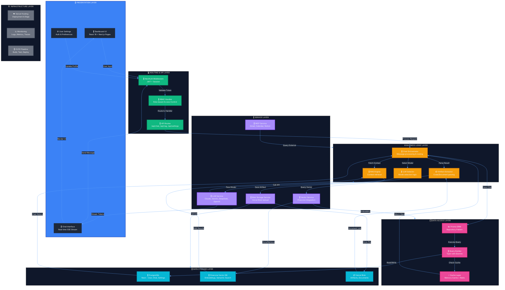

# Arquitectura del Sistema - cjhirashi-agents

Diagrama de componentes y flujos principales de la arquitectura MVP, mostrando las 7 capas y sus interacciones.

## Descripción de Capas

### 1. Presentation Layer (Azul #3B82F6)
- **Interfaz de usuario** con React 18
- Dashboard centralizado para gestión de chats
- Chat real-time con SSE streaming
- Configuración de usuario y preferencias

### 2. Routing & API Layer (Verde #10B981)
- **NextAuth** para autenticación y JWT
- API Routes de Next.js para endpoints
- RBAC (Role-Based Access Control) para autorización
- Validación de headers y tokens

### 3. Business Logic Layer (Naranja #F59E0B)
- **LLM Selector** elige modelo según contexto
- **RAG Engine** recupera contexto de Pinecone
- **Chat Orchestrator** coordina flujos
- **Artifact Extractor** procesa código y documentos

### 4. Service Layer (Púrpura #A78BFA)
- **LLM Service**: Claude, Gemini, DeepSeek, OpenAI
- **MCP Service**: Gmail, Google Calendar, Notion
- **Vector Service**: Integración con Pinecone
- **Storage Service**: Vercel Blob para artifacts

### 5. Data Access Layer (Rosa #EC4899)
- **Prisma ORM** con patrón Repository
- **Query Builder** type-safe
- **Cache Layer** para optimización
- Memory cache y Redis

### 6. Data Storage Layer (Cyan #06B6D4)
- **PostgreSQL** (Neon): usuarios, chats, configuración
- **Pinecone**: embeddings y búsqueda semántica
- **Vercel Blob**: almacenamiento de artifacts

### 7. Infrastructure Layer (Gris #6B7280)
- **Vercel**: hosting y edge functions
- **Monitoring**: logs, métricas, traces
- **CI/CD**: build, test, deploy automatizado

## Flujos Principales

1. **Chat Request**: Dashboard → Auth → API → Business Logic → Services → Storage → Response
2. **RAG Retrieval**: Business Logic → Vector Service → Pinecone → Context
3. **Artifact Save**: Business Logic → Storage Service → Vercel Blob → Link
4. **Real-time Stream**: LLM Service → SSE → Browser → UI
