# Arquitectura de 7 Capas - cjhirashi-agents

Visualización vertical del stack de capas mostrando responsabilidades, tecnologías y componentes clave.

```mermaid
%%{init: {'theme':'base', 'themeVariables': {
  'primaryColor':'#0F172A',
  'primaryTextColor':'#F3F4F6',
  'primaryBorderColor':'#3B82F6',
  'lineColor':'#60A5FA',
  'secondaryColor':'#1E293B',
  'tertiaryColor':'#0F172A',
  'background':'#0F172A',
  'fontSize':'12px'
}}}%%

graph TB
    Start["👤 Usuario"]

    Start -->|Interaction| Layer1["<b>🎨 PRESENTATION LAYER</b><br/>━━━━━━━━━━━━━━━━━<br/>📱 React 18 + Next.js Pages<br/>💬 Chat Interface (SSE)<br/>⚙️ Settings & Profile<br/>🎯 Responsabilidad:<br/>Renderizar UI, manejar eventos<br/>Formato: JSON Request/Response"]

    Layer1 -->|HTTP Request| Layer2["<b>🛣️ ROUTING & API LAYER</b><br/>━━━━━━━━━━━━━━━━━<br/>🔐 NextAuth v5 (JWT/Session)<br/>🔀 Next.js API Routes<br/>👮 RBAC Middleware<br/>🎯 Responsabilidad:<br/>Validar, autorizar, rutear<br/>Limpieza de datos, error handling"]

    Layer2 -->|Validated Request| Layer3["<b>⚙️ BUSINESS LOGIC LAYER</b><br/>━━━━━━━━━━━━━━━━━<br/>🎯 Chat Orchestrator<br/>🤖 LLM Model Selector<br/>🧠 RAG Engine<br/>📦 Artifact Extractor<br/>🎯 Responsabilidad:<br/>Seleccionar modelo, recuperar contexto<br/>Orquestar flujos, parsear resultados"]

    Layer3 -->|Service Calls| Layer4["<b>🔌 SERVICE LAYER</b><br/>━━━━━━━━━━━━━━━━━<br/>🧬 LLM Service<br/>├─ Claude Sonnet 4.5<br/>├─ Gemini 2.5 Flash<br/>├─ DeepSeek-R1<br/>└─ OpenAI gpt-realtime<br/>🔗 MCP Service<br/>├─ Gmail Integration<br/>├─ Google Calendar<br/>└─ Notion Sync<br/>📍 Vector Service (Pinecone)<br/>💾 Blob Storage Service<br/>🎯 Responsabilidad:<br/>Integración con APIs externas<br/>Manejo de latencia, retry logic"]

    Layer4 -->|Queries| Layer5["<b>🗂️ DATA ACCESS LAYER</b><br/>━━━━━━━━━━━━━━━━━<br/>📊 Prisma ORM<br/>├─ User Repository<br/>├─ Chat Repository<br/>└─ Config Repository<br/>🔨 Query Builder (Type-safe)<br/>⚡ Cache Layer<br/>├─ Memory Cache<br/>└─ Redis (optional)<br/>🎯 Responsabilidad:<br/>Abstracción de datos, queries type-safe<br/>Caché, optimización de BD"]

    Layer5 -->|Read/Write| Layer6["<b>💽 DATA STORAGE LAYER</b><br/>━━━━━━━━━━━━━━━━━<br/>🐘 PostgreSQL (Neon)<br/>├─ Users & Auth<br/>├─ Chat History<br/>├─ Settings & Config<br/>└─ Embeddings Metadata<br/><br/>🎲 Pinecone Vector DB<br/>├─ Document Embeddings<br/>├─ Semantic Search<br/>└─ RAG Context<br/><br/>📦 Vercel Blob<br/>├─ Code Artifacts<br/>├─ Documents<br/>└─ Media Files<br/>🎯 Responsabilidad:<br/>Persistencia de datos<br/>Disponibilidad y recuperación"]

    Layer6 -->|Hosted On| Layer7["<b>🏗️ INFRASTRUCTURE LAYER</b><br/>━━━━━━━━━━━━━━━━━<br/>☁️ Vercel Platform<br/>├─ App Deployment<br/>├─ Edge Functions<br/>└─ Environment Management<br/><br/>📈 Observability<br/>├─ Logging (Vercel Logs)<br/>├─ Metrics (Performance)<br/>└─ Tracing (Error tracking)<br/><br/>🔄 CI/CD Pipeline<br/>├─ GitHub Integration<br/>├─ Automated Tests<br/>└─ Blue-Green Deploy<br/>🎯 Responsabilidad:<br/>Hosting, deployment, monitoreo<br/>Escalabilidad, disponibilidad"]

    Layer7 -->|Ready for Users| End["✅ Producción Live"]

    %% Layer styling
    classDef layer1 fill:#3B82F6,stroke:#1E40AF,stroke-width:2px,color:#F3F4F6,padding:20px
    classDef layer2 fill:#10B981,stroke:#047857,stroke-width:2px,color:#F3F4F6,padding:20px
    classDef layer3 fill:#F59E0B,stroke:#D97706,stroke-width:2px,color:#F3F4F6,padding:20px
    classDef layer4 fill:#A78BFA,stroke:#7C3AED,stroke-width:2px,color:#F3F4F6,padding:20px
    classDef layer5 fill:#EC4899,stroke:#BE185D,stroke-width:2px,color:#F3F4F6,padding:20px
    classDef layer6 fill:#06B6D4,stroke:#0891B2,stroke-width:2px,color:#F3F4F6,padding:20px
    classDef layer7 fill:#6B7280,stroke:#374151,stroke-width:2px,color:#F3F4F6,padding:20px
    classDef endpoint fill:#047857,stroke:#065F46,stroke-width:2px,color:#F3F4F6
    classDef user fill:#3B82F6,stroke:#1E40AF,stroke-width:2px,color:#F3F4F6

    class Layer1 layer1
    class Layer2 layer2
    class Layer3 layer3
    class Layer4 layer4
    class Layer5 layer5
    class Layer6 layer6
    class Layer7 layer7
    class Start user
    class End endpoint
```



## Leyenda de Capas

### Capa 1: PRESENTATION (Azul #3B82F6)
**Qué hace**: Renderiza interfaz de usuario
- React 18 con componentes reutilizables
- Chat interface con streaming real-time
- Formularios de settings
- Manejo de eventos del usuario

**Responsabilidad**: UI/UX, experiencia del usuario
**Tecnologías**: React 18, Next.js Pages, Tailwind CSS

---

### Capa 2: ROUTING & API (Verde #10B981)
**Qué hace**: Valida, autoriza y rutea requests
- NextAuth v5 maneja autenticación
- Middleware RBAC verifica permisos
- API routes procesan requests
- Validación de entrada y sanitización

**Responsabilidad**: Seguridad, validación, routing
**Tecnologías**: Next.js API Routes, NextAuth, Middleware

---

### Capa 3: BUSINESS LOGIC (Naranja #F59E0B)
**Qué hace**: Implementa la lógica de negocio
- Chat Orchestrator coordina flujos
- LLM Selector elige modelo óptimo
- RAG Engine recupera contexto
- Artifact Extractor procesa outputs

**Responsabilidad**: Orquestación, decisiones, procesamiento
**Tecnologías**: TypeScript, Lógica pura

---

### Capa 4: SERVICE LAYER (Púrpura #A78BFA)
**Qué hace**: Integra servicios externos
- **LLM Service**: Claude, Gemini, DeepSeek, OpenAI
- **MCP Service**: Gmail, Calendar, Notion
- **Vector Service**: Pinecone
- **Storage Service**: Vercel Blob

**Responsabilidad**: Integraciones, manejo de APIs
**Tecnologías**: SDK de proveedores, API clients

---

### Capa 5: DATA ACCESS (Rosa #EC4899)
**Qué hace**: Abstrae acceso a datos
- Prisma ORM con repositorios type-safe
- Query Builder para consultas seguras
- Cache layer para rendimiento
- Connection pooling

**Responsabilidad**: Seguridad de datos, optimización
**Tecnologías**: Prisma, SQL Query Builder

---

### Capa 6: DATA STORAGE (Cyan #06B6D4)
**Qué hace**: Persiste datos
- **PostgreSQL (Neon)**: Usuarios, chats, config
- **Pinecone**: Embeddings y búsqueda semántica
- **Vercel Blob**: Artifacts y documentos

**Responsabilidad**: Persistencia, integridad, recuperación
**Tecnologías**: PostgreSQL, Pinecone, Vercel Blob

---

### Capa 7: INFRASTRUCTURE (Gris #6B7280)
**Qué hace**: Aloja, monitorea, despliega
- Vercel para hosting y edge
- Observability: logs, métricas, traces
- CI/CD: automated tests y deploy
- Escalabilidad automática

**Responsabilidad**: Operaciones, disponibilidad, escala
**Tecnologías**: Vercel, GitHub Actions, Monitoring

---

## Flujo de Datos (De Arriba a Abajo)

```
Usuario → Presentation Layer (React UI)
   ↓
Routing Layer (Auth + Validation)
   ↓
Business Logic (Orquestación)
   ↓
Service Layer (APIs externas)
   ↓
Data Access (Prisma/Queries)
   ↓
Storage Layer (Persistencia)
   ↓
Infrastructure (Hosting/Monitoreo)
```

## Características Clave

- **Type-Safety**: TypeScript en todas las capas
- **Escalabilidad**: Edge functions en Vercel
- **Performance**: Caching, query optimization
- **Security**: RBAC, validación, sanitización
- **Observability**: Logs, métricas, traces
- **Reliability**: Retry logic, circuit breaker
- **Maintainability**: Separación de concerns clara
