# Flujo de Request - Chat Message Flow

Diagrama de secuencia que muestra el flujo completo de un mensaje de usuario desde el chat hasta la respuesta renderizada.

```mermaid
%%{init: {'theme':'base', 'themeVariables': {
  'primaryColor':'#0F172A',
  'primaryTextColor':'#F3F4F6',
  'primaryBorderColor':'#3B82F6',
  'lineColor':'#60A5FA',
  'secondaryColor':'#1E293B',
  'tertiaryColor':'#0F172A',
  'background':'#0F172A',
  'fontSize':'11px'
}}}%%

sequenceDiagram
    participant User as User
    participant Browser as Browser
    participant NextAuth as NextAuth
    participant APIRoute as API Route
    participant RBAC as RBAC
    participant Orchestrator as Orchestrator
    participant Selector as LLM Selector
    participant RAGEngine as RAG Engine
    participant VectorDB as Pinecone
    participant LLMService as LLM Service
    participant LLMProvider as LLM Provider
    participant Extractor as Extractor
    participant Prisma as Prisma
    participant PostgreSQL as PostgreSQL
    participant SSEStream as SSE

    rect rgb(31, 41, 55)
        Note over User,SSEStream: PASO 1-2: Usuario envia mensaje
        User->>Browser: Tipea mensaje
        Browser->>Browser: Validacion local
        Browser->>Browser: Mostrar Typing
    end

    rect rgb(15, 23, 42)
        Note over User,SSEStream: PASO 3: POST con autenticacion
        Browser->>NextAuth: POST /api/chat
        NextAuth->>NextAuth: Validar JWT token
    end

    rect rgb(31, 41, 55)
        Note over User,SSEStream: PASO 4-5: Validacion y autorizacion
        NextAuth-->>APIRoute: Token valido
        APIRoute->>RBAC: Verificar permisos
        RBAC-->>APIRoute: Autorizado
    end

    rect rgb(15, 23, 42)
        Note over User,SSEStream: PASO 6: Seleccionar Modelo
        APIRoute->>Orchestrator: Mensaje validado
        Orchestrator->>Selector: selectLLMModel()
        Selector-->>Orchestrator: Modelo seleccionado
    end

    rect rgb(31, 41, 55)
        Note over User,SSEStream: PASO 7-8: RAG - Recuperar Contexto
        Orchestrator->>RAGEngine: fetchRAGContext()
        RAGEngine->>VectorDB: Buscar similares
        VectorDB-->>RAGEngine: Top 5 documentos
        RAGEngine->>Prisma: Hidratar metadata
        Prisma->>PostgreSQL: SELECT documents
        PostgreSQL-->>Prisma: Documentos
        Prisma-->>RAGEngine: Contexto
        RAGEngine-->>Orchestrator: Contexto RAG
    end

    rect rgb(15, 23, 42)
        Note over User,SSEStream: PASO 9: LLM Call Streaming
        Orchestrator->>LLMService: callLLM()
        LLMService->>LLMProvider: Conexion SSE
        LLMProvider-->>LLMService: Stream tokens
        LLMService-->>Orchestrator: Pipeline tokens
    end

    rect rgb(31, 41, 55)
        Note over User,SSEStream: PASO 10-11: Extraer Artifacts
        Orchestrator->>Extractor: extractArtifacts()
        Extractor->>Extractor: Detectar patrones
        Extractor-->>Orchestrator: Artifacts separados
    end

    rect rgb(15, 23, 42)
        Note over User,SSEStream: PASO 12-13: Guardar en BD
        Orchestrator->>Prisma: createChatMessage()
        Prisma->>PostgreSQL: INSERT messages
        PostgreSQL-->>Prisma: ID guardado
        Prisma-->>Orchestrator: Chat saved
    end

    rect rgb(31, 41, 55)
        Note over User,SSEStream: PASO 14-15: SSE Stream a Browser
        Orchestrator->>SSEStream: Enviar chunks
        SSEStream-->>Browser: SSE events
        Browser->>Browser: Renderizar real-time
    end

    rect rgb(15, 23, 42)
        Note over User,SSEStream: PASO 16: Completar
        LLMProvider-->>LLMService: DONE
        LLMService-->>Orchestrator: Stream complete
        Orchestrator->>Browser: event done
        Browser->>Browser: Habilitar input
        Browser->>User: Respuesta completa
    end
```



## Descripción de Pasos

### FASE 1: Validación Local (0-50ms)
**Pasos 1-2**: Usuario escribe mensaje
- Validación local en el navegador
- Mostrar indicador "escribiendo"
- Preparar payload

### FASE 2: Autenticación (50-100ms)
**Pasos 3-4**: Request llega a servidor
- NextAuth valida JWT token
- Verifica expiración y firma
- Si inválido: error 401

### FASE 3: Autorización (100-150ms)
**Pasos 5**: RBAC verifica permisos
- Consultar roles del usuario
- Verificar acceso a chat room
- Si no autorizado: error 403

### FASE 4: Selección de Modelo (150-200ms)
**Pasos 6**: Elegir LLM óptimo
- **Análisis de contexto**:
  - Complejidad de la pregunta
  - Tokens necesarios
  - Tiempo de respuesta requerido
- **Estrategia**:
  - Preguntas simples: Gemini Flash (rápido)
  - Análisis profundo: Claude 4.5 (calidad)
  - Lógica compleja: DeepSeek-R1 (razonamiento)

### FASE 5: Recuperación RAG (200-600ms)
**Pasos 7-8**: Recuperar contexto de vector DB
- Crear embedding del mensaje
- Búsqueda semántica en Pinecone (top 5)
- Hidratar metadata desde PostgreSQL
- Retornar ~2-3KB de contexto

### FASE 6: LLM Call (600-1800ms)
**Pasos 9**: Llamar a proveedor LLM
- Abrir conexión SSE
- Enviar streaming request
- Recibir tokens en tiempo real
- Tiempo a primer token: 800-1200ms

### FASE 7: Extracción de Artifacts (1800-1900ms)
**Pasos 10-11**: Procesar response
- Detectar bloques de código
- Parsear JSON structures
- Separar artifacts del texto
- Clasificar por tipo (code, json, math)

### FASE 8: Guardar en BD (1900-2000ms)
**Pasos 12-13**: Persistir chat
- Crear transacción
- INSERT chat_message
- INSERT artifacts
- Guardar con índices

### FASE 9: SSE Stream (En paralelo)
**Pasos 14-15**: Enviar a usuario
- Stream tokens cada 100-500ms
- Renderizar en tiempo real
- Mostrar artifacts progresivamente
- Auto-scroll

---

## Tratamiento de Errores

### Retry Logic (Circuit Breaker)

```
Si LLM falla:
├─ Reintento 1: Mismo proveedor (100ms delay)
├─ Reintento 2: Mismo proveedor (500ms delay)
├─ Fallback 1: Cambiar a Claude (backup)
└─ Fallback 2: Retornar error al usuario

Si Pinecone timeout:
├─ Reintento 1: 200ms
├─ Fallback: Usar chat history sin RAG
└─ Log: Marcar como degraded

Si PostgreSQL slow:
├─ Usar cache layer
├─ Timeout: 2s
└─ Retornar parcial
```

### Monitoreo

- **Logs**: Cada paso con timestamp
- **Métricas**: Latencia por componente
- **Traces**: Correlación request_id
- **Alerts**: Si mayor 3s total latency

---

## Optimizaciones

### 1. Paralelización
- RAG retrieval mientras se valida
- LLM call mientras se prepara contexto
- DB save en background (no bloquea SSE)

### 2. Caching
- Documentos frecuentes en memory cache
- Embeddings reusables
- User settings en Redis

### 3. Streaming
- SSE para tokens en tiempo real
- No esperar respuesta completa
- Inicio de renderizado en ~900ms

### 4. Compresión
- Gzip en responses
- Minify en artifacts
- Lazy load en UI

---

## SLA (Service Level Agreement)

| Métrica | Target | Max | Status |
|---------|--------|-----|--------|
| Latencia Total | menor 1500ms | menor 2000ms | Nominal |
| Time-to-First-Token | menor 1200ms | menor 1500ms | Nominal |
| Uptime | 99.9% | 99% | SLA |
| RAG Latency | menor 400ms | menor 600ms | Nominal |
| Error Rate | menor 0.1% | menor 1% | Nominal |
