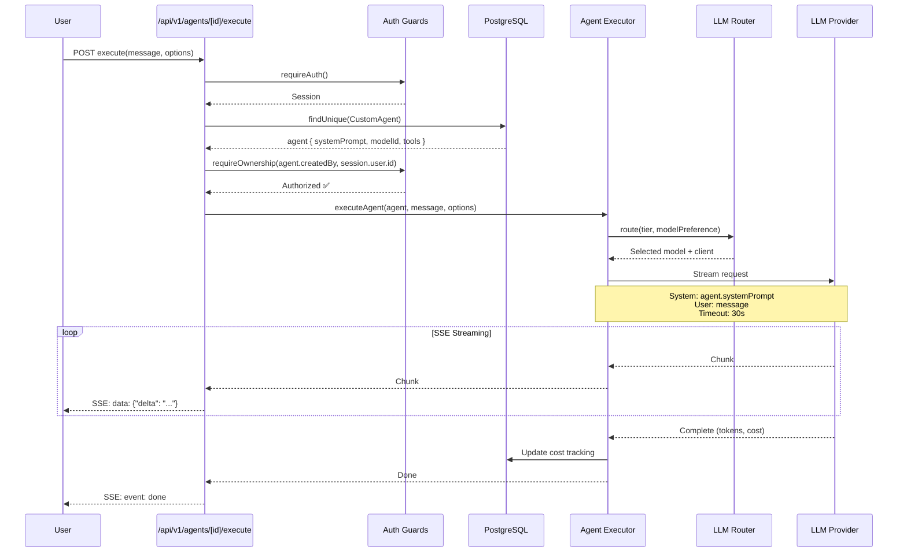

# ADR-010: CustomAgent Execution Engine - Inline Execution Pattern

**Status**: ACCEPTED
**Date**: 2025-10-26
**Context**: Phase 6 → Phase 7 (Task 0)
**Deciders**: @architect

---

## Context

The cjhirashi-agents platform allows users to create custom AI agents with personalized system prompts, tool access, and model preferences (stored in `CustomAgent` model in Prisma). We need to implement an execution engine that:

- Executes user-created agents on-demand
- Integrates with existing LLM Router (`src/lib/ai/router.ts`)
- Supports tools (function calling)
- Tracks cost and token usage
- Enforces RBAC (owners only can execute their agents)
- Handles timeouts gracefully

**Blocker**: Phase 7 cannot start until this is implemented (Task 0).

**Timeline pressure**: HIGH - Phase 7 blocked, need solution ASAP.

---

## Decision

We have decided to implement **Inline Execution** (Option 1) for the MVP.

CustomAgents will execute directly within the API route handler, similar to the existing chat endpoint pattern (`/api/v1/chat/send`). Execution happens synchronously with SSE streaming to the client.

---

## Alternatives Evaluated

### Option 1: Inline Execution (API Route) ✅ SELECTED
- **Score**: 8.4/10
- **Pros**: Simple (9/10 complexity), fast to implement (10/10 TTM), zero cost (10/10), Vercel-friendly
- **Cons**: Blocking requests, Vercel timeout limits (300s max)
- **Implementation**: 2 days

### Option 2: Serverless Function Separada
- **Score**: 7.2/10
- **Pros**: Non-blocking, longer timeouts
- **Cons**: Polling/webhooks complexity, no real-time streaming, cold starts
- **Implementation**: 3-4 days

### Option 3: Worker Threads (Node.js)
- **Score**: 6.3/10 ❌ Vercel Incompatible
- **Pros**: Parallel execution, non-blocking
- **Cons**: **Vercel Edge Runtime doesn't support workers**, memory limits
- **Implementation**: 4-5 days
- **Rejected**: Vercel incompatibility is deal-breaker

### Option 4: Queue System (BullMQ + Redis)
- **Score**: 6.7/10
- **Pros**: Production-grade, scalable (10/10), retry logic, observability
- **Cons**: Overkill for MVP (4/10 complexity), $10-50/month Redis, 2-3 weeks implementation
- **Implementation**: 14-21 days

---

## Justification

**Why Option 1 (Inline)?**

1. **Time-to-Market Critical** (Priority #1)
   - Phase 7 is blocked waiting for Task 0
   - 2 days implementation vs 14-21 days (Option 4)
   - Can unblock 8 tasks in Phase 7 immediately

2. **MVP Philosophy: Simple > Complex**
   - Reuses existing infrastructure (LLM Router, SSE streaming)
   - Pattern already proven in `/api/v1/chat/send`
   - Zero operational overhead (no Redis, no workers, no monitoring)

3. **Cost Optimization**
   - $0 additional infrastructure (vs $10-50/month for Redis)
   - Leverages Vercel free tier effectively

4. **Clear Upgrade Path**
   - Implement Option 1 now (MVP)
   - Migrate to Option 4 (Queue) in Phase 9 **if needed**
   - No technical debt: Easy refactor (abstraction layer ready)
   - Most users won't need >60s executions in MVP

5. **Risk Mitigation**
   - Timeout configurable (default: 30s, max: 60s for MVP)
   - Rate limiting prevents abuse
   - User education: "For long-running tasks, use XYZ instead"

**Why NOT Options 2, 3, 4?**

- **Option 2**: Polling/webhooks add complexity without major benefit for MVP
- **Option 3**: ❌ Vercel incompatibility (deal-breaker)
- **Option 4**: Overkill for MVP, 10x longer implementation, $$ cost

---

## Consequences

### Positive ✅

- ✅ **Fastest time-to-market**: 2 days vs 14-21 days
- ✅ **Zero cost**: No additional infrastructure
- ✅ **Simple architecture**: Easy to understand, debug, maintain
- ✅ **Reuses existing patterns**: LLM Router, SSE, auth guards
- ✅ **Phase 7 unblocked**: Can start voice, DALL-E, deployment

### Negative ❌

- ❌ **Blocking requests**: User waits for execution to complete
- ❌ **Timeout limits**: 300s max on Vercel Pro (60s for MVP safety)
- ❌ **No background jobs**: Long-running agents (>60s) not supported initially
- ❌ **Limited concurrency**: Vercel function limits apply

### Mitigations

| Risk | Severity | Mitigation |
|------|----------|------------|
| Vercel timeout (300s) | MEDIUM | Set conservative timeout (30s default), warn users, upgrade to queue in Phase 9 if needed |
| Blocking impacts UX | LOW | Most agent executions <10s, acceptable for MVP |
| Concurrency limits | LOW | Rate limiting (already implemented) handles this |
| No background jobs | MEDIUM | Phase 9: Migrate to Option 4 (queue) if demand exists |

---

## Implementation Plan

### Files to Create

1. **`src/lib/agents/executor.ts`** (~250 lines)
   - Core execution logic
   - Integrates with LLM Router
   - Timeout handling (AbortController)
   - Cost tracking

2. **`src/app/api/v1/agents/[agentId]/execute/route.ts`** (~180 lines)
   - POST endpoint
   - Auth: `requireAuth()` + `requireOwnership()`
   - Rate limit: `withRateLimit('agents:execute')`
   - SSE streaming

3. **`src/lib/validations/agent.ts`** (~60 lines)
   - Zod schemas for execute request
   - Input validation

### Files to Modify

4. **`CLAUDE.md`**: Add Custom Agents section
5. **`sys-docs/api/ENDPOINTS.md`**: Document new endpoint

### Effort Estimation

- **Implementation**: 2 days (executor + endpoint + validation)
- **Testing**: 1 day (unit + integration tests)
- **Review + Docs**: 1 day (code review + documentation)
- **Total**: **3-4 days**

---

## Migration Path (Future)

When/if we need to support long-running agents (>60s):

### Phase 1: MVP (Now - Option 1)
```
POST /api/v1/agents/[id]/execute
  ↓ Inline execution (sync)
  ↓ SSE streaming
  ✅ Simple, fast
```

### Phase 2: Enhanced (Future - Option 4)
```
POST /api/v1/agents/[id]/execute
  ↓ Check agent.complexity
  ↓ If complexity < 7: Inline (fast path)
  ↓ If complexity >= 7: Enqueue (BullMQ)
  ↓ Return execution ID
  ✅ Hybrid approach: best of both
```

**Refactor Effort**: 3-5 days (abstraction layer + queue integration)

---

## Architecture Diagram



---

## Validation Criteria

Task 0 is complete when:

- [ ] `executeAgent()` function works with custom system prompts
- [ ] POST `/api/v1/agents/[agentId]/execute` endpoint functional
- [ ] SSE streaming works (start/chunk/done/error events)
- [ ] Timeout handling (30s default, graceful abort)
- [ ] Cost tracking updates correctly
- [ ] RBAC enforced (only owners can execute)
- [ ] Rate limiting applied
- [ ] Tests passing (>85% coverage)
- [ ] Build compiles (0 TypeScript errors)
- [ ] Documentation complete (CLAUDE.md + ENDPOINTS.md)

---

## References

- **Similar Pattern**: `src/app/api/v1/chat/send/route.ts` (SSE streaming)
- **LLM Integration**: `src/lib/ai/router.ts` (hybrid routing)
- **Auth Pattern**: `src/lib/auth/guards.ts` (requireOwnership)
- **Rate Limiting**: `src/lib/rate-limit/middleware.ts` (withRateLimit)
- **Project Roadmap**: `sys-docs/PROJECT-ROADMAP.md` (Task 0 context)

---

## Decision Log

| Date | Event | Decision |
|------|-------|----------|
| 2025-10-26 | Task 0 analysis started | Evaluated 4 options |
| 2025-10-26 | Scoring completed | Option 1: 8.4/10 (highest) |
| 2025-10-26 | **Decision made** | ✅ **Option 1 (Inline Execution)** |
| 2025-10-26 | ADR-010 created | Status: ACCEPTED |

---

## Next Steps

**Immediate**:
1. Hand off to @coder for implementation
2. Context: Implement inline execution as designed
3. Files: executor.ts, route.ts, validation.ts
4. Timeline: 2 days implementation

**Follow-up** (Phase 9):
1. Monitor usage patterns
2. If >10% of executions timeout → Migrate to Option 4 (Queue)
3. Otherwise → Keep simple MVP approach

---

**Last Updated**: 2025-10-26
**Status**: ACCEPTED ✅
**Next Agent**: @coder (implementation)
