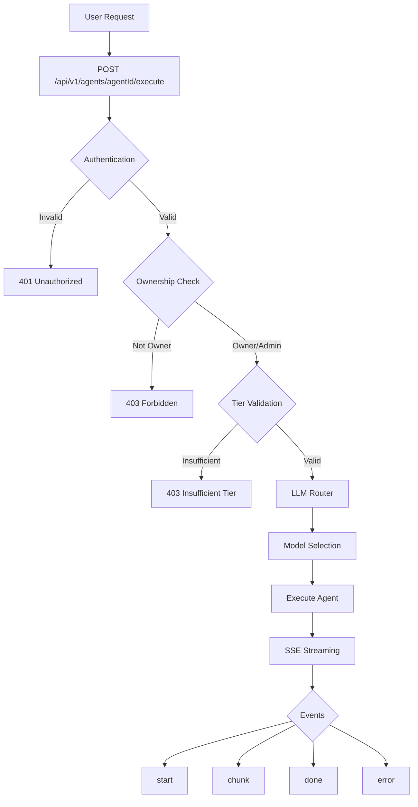

# Custom Agents - User Guide

**Status**: Production Ready
**Phase**: Task 0 (Agent System Foundation)
**Version**: 1.0.0
**Last Updated**: 2025-10-26

---

## Overview

Custom Agents allow users to create and execute their own AI assistants with personalized system prompts, model preferences, and behavior configurations. This guide covers everything you need to know about creating, managing, and executing custom agents.

### What is a Custom Agent?

A Custom Agent is a user-created AI assistant that:
- Has a custom system prompt defining its personality and expertise
- Can use specific LLM models (Claude 3.5 Sonnet, GPT-4o, etc.)
- Supports real-time streaming responses via Server-Sent Events (SSE)
- Tracks token usage and costs
- Enforces tier-based access controls
- Respects timeout limits (5-60 seconds)

### Use Cases

- **Specialized Assistants**: Create domain-specific experts (legal advisor, coding mentor, marketing strategist)
- **Branded Personalities**: Build agents with unique tones and communication styles
- **Task Automation**: Configure agents for specific workflows (code review, content writing, data analysis)
- **Multi-Model Testing**: Compare responses from different LLM models

---

## Architecture



**Key Components**:
- **Executor**: `src/lib/agents/executor.ts` - Core execution engine
- **API Endpoint**: `src/app/api/v1/agents/[agentId]/execute/route.ts` - HTTP handler
- **Validation**: `src/lib/validations/agent.ts` - Zod schemas
- **LLM Router**: `src/lib/ai/router.ts` - Model selection logic

**Related ADR**: [ADR-010: Custom Agent Execution](../architecture/ADR-010-custom-agent-execution.md)

---

## Creating a Custom Agent

### Prerequisites

1. **Account**: You must have a registered account
2. **Authentication**: You must be logged in
3. **Tier**: Some features require PRO or ENTERPRISE tier

### Step 1: Define Your Agent

Create a CustomAgent in the database with the following fields:

```typescript
interface CustomAgent {
  id: string;                    // Auto-generated (cuid)
  createdBy: string;             // Your user ID
  name: string;                  // Agent name (e.g., "Legal Advisor Bot")
  description: string;           // What the agent does
  systemPrompt: string;          // Core personality/instructions
  modelId: string;               // Preferred model (optional)
  modelProvider: string;         // Provider (e.g., "anthropic")
  tools: string[];               // Available tools (empty for MVP)
  visibilityLevel: string;       // PUBLIC, ADMIN, SUPER_ADMIN
  category: string;              // Category (e.g., "legal", "coding")
  tier: string;                  // Required tier (FREE, PRO, ENTERPRISE)
  isPublic: boolean;             // Public marketplace listing
  additionalCost: number | null; // Extra cost per execution
  complexity: number;            // 1-10 complexity score
}
```

### Step 2: Write an Effective System Prompt

**Best Practices**:

1. **Be Specific**: Define expertise, tone, and constraints clearly
2. **Set Boundaries**: Specify what the agent should/shouldn't do
3. **Provide Context**: Include relevant background information
4. **Use Examples**: Show desired response format

**Example - Coding Assistant**:
```
You are an expert senior software engineer specializing in TypeScript, React, and Next.js.

Your responsibilities:
- Review code for bugs, performance issues, and best practices
- Suggest improvements with clear explanations
- Provide working code examples
- Follow industry standards (SOLID, DRY, KISS)

Your communication style:
- Concise and technical
- Use code examples liberally
- Explain the "why" behind recommendations
- Be encouraging and constructive

Constraints:
- Do not generate insecure code
- Always validate inputs
- Prefer TypeScript strict mode
- Follow the project's existing patterns
```

**Example - Customer Support Bot**:
```
You are a friendly and professional customer support agent for AcmeCorp.

Your role:
- Answer customer questions about products, billing, and policies
- Resolve issues with empathy and patience
- Escalate complex issues to human agents
- Maintain a positive brand image

Your tone:
- Warm and approachable
- Professional but not robotic
- Use customer's name when appropriate
- Apologize genuinely when needed

Knowledge base:
- Return policy: 30 days, full refund
- Shipping: Free over $50, 2-5 business days
- Support hours: Mon-Fri 9am-6pm EST

Constraints:
- Never make promises you can't keep
- Don't share internal company information
- Escalate billing disputes to human agents
```

### Step 3: Choose a Model (Optional)

If you specify a `modelId`, the agent will prefer that model. Otherwise, the LLM Router selects the best model based on:
- Your tier (FREE, PRO, ENTERPRISE)
- Prompt complexity
- Model availability
- Cost optimization

**Available Models**:
- `claude-3-5-sonnet-20241022` - Best overall quality (default)
- `gpt-4o` - Strong reasoning, coding
- `gemini-2.0-flash` - Fast, cost-effective
- `deepseek-chat` - Budget-friendly

---

## Executing a Custom Agent

### HTTP API

**Endpoint**: `POST /api/v1/agents/{agentId}/execute`

**Authentication**: Required (Bearer token or session cookie)

**Rate Limits**:
- FREE: 10 requests/min
- PRO: 50 requests/min
- ENTERPRISE: 500 requests/min

### Request Schema

```typescript
interface AgentExecuteRequest {
  message: string;           // User message (1-10000 characters)
  temperature?: number;      // 0-2, default 0.7 (creativity)
  maxTokens?: number;        // 1-8192, default 4096
  timeout?: number;          // 5-60 seconds, default 30
  stream?: boolean;          // Default true (SSE streaming)
}
```

**Validation Rules**:
- `message`: Required, non-empty, max 10,000 characters
- `temperature`: Optional, 0-2 (lower = more focused, higher = more creative)
- `maxTokens`: Optional, 1-8192 (max response length)
- `timeout`: Optional, 5-60 seconds (request timeout)
- `stream`: Optional, defaults to true

### Example - cURL

```bash
curl -X POST https://api.yourapp.com/api/v1/agents/clx123abc/execute \
  -H "Authorization: Bearer YOUR_TOKEN" \
  -H "Content-Type: application/json" \
  -d '{
    "message": "Review this React component for performance issues",
    "temperature": 0.7,
    "maxTokens": 2048,
    "timeout": 30
  }'
```

### Example - JavaScript/TypeScript

```typescript
async function executeAgent(
  agentId: string,
  message: string,
  options?: {
    temperature?: number;
    maxTokens?: number;
    timeout?: number;
  }
) {
  const response = await fetch(`/api/v1/agents/${agentId}/execute`, {
    method: 'POST',
    headers: {
      'Content-Type': 'application/json',
    },
    body: JSON.stringify({
      message,
      ...options,
    }),
  });

  if (!response.ok) {
    const error = await response.json();
    throw new Error(error.error.message);
  }

  return response.body; // ReadableStream for SSE
}

// Usage
try {
  const stream = await executeAgent('clx123abc', 'Hello, agent!', {
    temperature: 0.8,
    maxTokens: 4096,
  });

  // Process SSE stream (see SSE Streaming section)
} catch (error) {
  console.error('Agent execution failed:', error);
}
```

---

## SSE Streaming Response

### Event Types

The agent execution returns a Server-Sent Events (SSE) stream with the following events:

#### 1. `start` - Execution Started
```typescript
{
  executionId: string;      // Unique execution ID
  agentId: string;          // Agent ID
  agentName: string;        // Agent name
  modelId: string;          // Selected model
  timestamp: string;        // ISO 8601 timestamp
}
```

#### 2. `chunk` - Content Chunk
```typescript
{
  content: string;          // Full content so far
  delta: string;            // New text in this chunk
}
```

#### 3. `done` - Execution Complete
```typescript
{
  executionId: string;      // Unique execution ID
  tokensUsed: number;       // Total tokens
  promptTokens: number;     // Input tokens
  completionTokens: number; // Output tokens
  cost: number;             // Cost in USD
  duration: number;         // Duration in milliseconds
  completedAt: string;      // ISO 8601 timestamp
}
```

#### 4. `error` - Execution Error
```typescript
{
  error: string;            // Error message
  code: string;             // Error code
  executionId?: string;     // Execution ID (if available)
}
```

### Parsing SSE Stream

```typescript
async function handleSSEStream(stream: ReadableStream) {
  const reader = stream.getReader();
  const decoder = new TextDecoder();

  let fullContent = '';

  try {
    while (true) {
      const { done, value } = await reader.read();
      if (done) break;

      const chunk = decoder.decode(value, { stream: true });
      const lines = chunk.split('\n');

      for (const line of lines) {
        if (line.startsWith('event: ')) {
          const eventType = line.slice(7).trim();
          continue;
        }

        if (line.startsWith('data: ')) {
          const data = JSON.parse(line.slice(6));

          if (eventType === 'start') {
            console.log('Execution started:', data.executionId);
          } else if (eventType === 'chunk') {
            fullContent = data.content;
            console.log('Delta:', data.delta);
            // Update UI with new content
          } else if (eventType === 'done') {
            console.log('Execution complete');
            console.log('Tokens used:', data.tokensUsed);
            console.log('Cost:', data.cost);
            console.log('Duration:', data.duration, 'ms');
          } else if (eventType === 'error') {
            console.error('Execution error:', data.error);
            throw new Error(data.error);
          }
        }
      }
    }

    return fullContent;
  } finally {
    reader.releaseLock();
  }
}
```

### React Hook Example

```typescript
import { useState, useCallback } from 'react';

interface UseAgentExecuteOptions {
  onStart?: (data: any) => void;
  onChunk?: (delta: string, fullContent: string) => void;
  onDone?: (data: any) => void;
  onError?: (error: string) => void;
}

export function useAgentExecute(
  agentId: string,
  options?: UseAgentExecuteOptions
) {
  const [content, setContent] = useState('');
  const [isLoading, setIsLoading] = useState(false);
  const [error, setError] = useState<string | null>(null);
  const [metrics, setMetrics] = useState<any>(null);

  const execute = useCallback(
    async (message: string, executeOptions?: {
      temperature?: number;
      maxTokens?: number;
      timeout?: number;
    }) => {
      setIsLoading(true);
      setError(null);
      setContent('');
      setMetrics(null);

      try {
        const response = await fetch(`/api/v1/agents/${agentId}/execute`, {
          method: 'POST',
          headers: { 'Content-Type': 'application/json' },
          body: JSON.stringify({ message, ...executeOptions }),
        });

        if (!response.ok) {
          const errorData = await response.json();
          throw new Error(errorData.error.message);
        }

        const reader = response.body!.getReader();
        const decoder = new TextDecoder();

        let eventType = '';

        while (true) {
          const { done, value } = await reader.read();
          if (done) break;

          const chunk = decoder.decode(value, { stream: true });
          const lines = chunk.split('\n');

          for (const line of lines) {
            if (line.startsWith('event: ')) {
              eventType = line.slice(7).trim();
            } else if (line.startsWith('data: ')) {
              const data = JSON.parse(line.slice(6));

              if (eventType === 'start') {
                options?.onStart?.(data);
              } else if (eventType === 'chunk') {
                setContent(data.content);
                options?.onChunk?.(data.delta, data.content);
              } else if (eventType === 'done') {
                setMetrics(data);
                options?.onDone?.(data);
              } else if (eventType === 'error') {
                throw new Error(data.error);
              }
            }
          }
        }
      } catch (err) {
        const errorMessage = err instanceof Error ? err.message : 'Unknown error';
        setError(errorMessage);
        options?.onError?.(errorMessage);
      } finally {
        setIsLoading(false);
      }
    },
    [agentId, options]
  );

  return {
    execute,
    content,
    isLoading,
    error,
    metrics,
  };
}

// Usage in component
function AgentChat({ agentId }: { agentId: string }) {
  const { execute, content, isLoading, error, metrics } = useAgentExecute(
    agentId,
    {
      onChunk: (delta) => console.log('New text:', delta),
      onDone: (data) => console.log('Cost:', data.cost),
    }
  );

  return (
    <div>
      <button
        onClick={() => execute('Hello, agent!')}
        disabled={isLoading}
      >
        Send Message
      </button>

      {isLoading && <p>Generating...</p>}
      {error && <p>Error: {error}</p>}
      {content && <pre>{content}</pre>}
      {metrics && (
        <div>
          <p>Tokens: {metrics.tokensUsed}</p>
          <p>Cost: ${metrics.cost.toFixed(4)}</p>
          <p>Duration: {metrics.duration}ms</p>
        </div>
      )}
    </div>
  );
}
```

---

## Authorization & Access Control

### Ownership Validation

Only the agent **creator** can execute their agent, unless:
- User is an **ADMIN** (can execute any agent)
- User is a **SUPER_ADMIN** (can execute any agent)

**Example**:
```
Agent created by: user-123
Current user: user-456
Result: 403 Forbidden

Agent created by: user-123
Current user: user-123
Result: ✅ Allowed

Agent created by: user-123
Current user: admin-user (role: ADMIN)
Result: ✅ Allowed (admin bypass)
```

### Tier Validation

Users can only execute agents at or below their tier level:

**Tier Hierarchy**: `FREE < BASIC < PRO < ENTERPRISE < CUSTOM < UNLIMITED`

**Examples**:
- FREE user + FREE agent = ✅ Allowed
- FREE user + PRO agent = ❌ 403 Insufficient Tier
- PRO user + FREE agent = ✅ Allowed
- PRO user + PRO agent = ✅ Allowed
- ENTERPRISE user + Any agent = ✅ Allowed

### Rate Limiting

Endpoint: `agents:execute`

**Limits by Tier**:
- FREE: 10 requests/minute
- PRO: 50 requests/minute
- ENTERPRISE: 500 requests/minute

**Headers**:
```
X-RateLimit-Limit: 50
X-RateLimit-Remaining: 42
X-RateLimit-Reset: 1698765432
```

**Error Response** (429):
```json
{
  "error": {
    "code": "RATE_LIMIT_EXCEEDED",
    "message": "Rate limit exceeded. Try again in 45 seconds.",
    "statusCode": 429,
    "timestamp": "2025-10-26T12:34:56.789Z"
  }
}
```

---

## Cost Tracking

### Model Pricing (per 1M tokens)

| Model | Input Cost | Output Cost |
|-------|-----------|------------|
| Claude 3.5 Sonnet | $3.00 | $15.00 |
| Claude 3.5 Haiku | $0.80 | $4.00 |
| Claude 3 Opus | $15.00 | $75.00 |

**Example Calculation**:
```
Prompt tokens: 1,000
Completion tokens: 500
Model: Claude 3.5 Sonnet

Input cost = (1,000 / 1,000,000) × $3.00 = $0.003
Output cost = (500 / 1,000,000) × $15.00 = $0.0075
Total cost = $0.0105
```

### Cost in `done` Event

```typescript
{
  "tokensUsed": 1500,
  "promptTokens": 1000,
  "completionTokens": 500,
  "cost": 0.0105,  // In USD
  "duration": 3200
}
```

---

## Timeout Handling

### Timeout Configuration

- **Minimum**: 5 seconds
- **Maximum**: 60 seconds (MVP limit)
- **Default**: 30 seconds

### Timeout Behavior

When a timeout occurs:
1. Request is **aborted** using `AbortController`
2. SSE stream emits an `error` event
3. Response: 408 Request Timeout

**Error Event**:
```json
{
  "error": "Agent execution timed out after 30 seconds",
  "code": "EXECUTION_TIMEOUT",
  "executionId": "exec-123abc"
}
```

**Best Practices**:
- Use **longer timeouts** for complex queries
- Use **shorter timeouts** for simple queries (save costs)
- Monitor `duration` in `done` events to optimize timeout values

---

## Error Handling

### Error Response Format

All errors follow this schema:

```json
{
  "error": {
    "code": "ERROR_CODE",
    "message": "Human-readable message",
    "statusCode": 400,
    "timestamp": "2025-10-26T12:34:56.789Z",
    "details": { /* optional */ }
  }
}
```

### Common Error Codes

| Status | Code | Description | Solution |
|--------|------|-------------|----------|
| 400 | `VALIDATION_ERROR` | Invalid request data | Check request schema |
| 400 | `MISSING_AGENT_ID` | Agent ID missing | Provide valid agentId |
| 401 | `UNAUTHORIZED` | Not authenticated | Login or provide auth token |
| 403 | `FORBIDDEN` | Not agent owner | Only owner/admin can execute |
| 403 | `INSUFFICIENT_TIER` | User tier too low | Upgrade to required tier |
| 404 | `AGENT_NOT_FOUND` | Agent doesn't exist | Check agentId is correct |
| 408 | `EXECUTION_TIMEOUT` | Request timed out | Increase timeout or simplify query |
| 429 | `RATE_LIMIT_EXCEEDED` | Too many requests | Wait before retrying |
| 500 | `EXECUTION_ERROR` | Agent execution failed | Check logs, retry |
| 500 | `SERVICE_CONFIG_ERROR` | Missing API key | Contact support |

See [Troubleshooting Guide](../troubleshooting/CUSTOM-AGENTS.md) for detailed solutions.

---

## Best Practices

### 1. System Prompt Design

✅ **DO**:
- Be specific and detailed
- Provide clear examples
- Set explicit boundaries
- Define personality/tone
- Include relevant context

❌ **DON'T**:
- Use vague instructions
- Contradict yourself
- Make prompts too long (>2000 chars)
- Include sensitive information
- Use offensive language

### 2. Parameter Tuning

**Temperature**:
- **0.0-0.3**: Factual, deterministic (code, math, legal)
- **0.4-0.7**: Balanced (general conversation)
- **0.8-1.5**: Creative (writing, brainstorming)
- **1.6-2.0**: Very creative (experimental)

**Max Tokens**:
- Short answers: 512-1024
- Medium responses: 1024-2048
- Long-form: 2048-4096
- Maximum: 8192 (use sparingly, costs more)

**Timeout**:
- Simple queries: 10-15 seconds
- Complex analysis: 30-45 seconds
- Maximum safety: 60 seconds

### 3. Cost Optimization

- Use **lower temperature** for predictable outputs (fewer retries)
- Set **appropriate maxTokens** (don't over-allocate)
- Use **faster models** (Haiku, Gemini Flash) for simple tasks
- Cache responses client-side when possible
- Monitor costs via `done` event metrics

### 4. Error Handling

```typescript
async function executeAgentSafely(agentId: string, message: string) {
  let retries = 0;
  const MAX_RETRIES = 3;

  while (retries < MAX_RETRIES) {
    try {
      return await executeAgent(agentId, message);
    } catch (error) {
      if (error.code === 'EXECUTION_TIMEOUT' && retries < MAX_RETRIES - 1) {
        retries++;
        console.log(`Timeout, retrying (${retries}/${MAX_RETRIES})...`);
        continue;
      }

      if (error.code === 'RATE_LIMIT_EXCEEDED') {
        const waitTime = error.retryAfter || 60;
        console.log(`Rate limited, waiting ${waitTime}s...`);
        await new Promise(resolve => setTimeout(resolve, waitTime * 1000));
        retries++;
        continue;
      }

      // Non-retryable error
      throw error;
    }
  }

  throw new Error('Max retries exceeded');
}
```

---

## Advanced Usage

### Multi-Turn Conversations

For conversation history, maintain context in your `message`:

```typescript
const conversationHistory = [
  { role: 'user', content: 'What is React?' },
  { role: 'assistant', content: 'React is a JavaScript library...' },
];

const newMessage = 'Can you give me an example?';

const contextualMessage = `
Conversation history:
${conversationHistory.map(m => `${m.role}: ${m.content}`).join('\n')}

User: ${newMessage}
`;

await executeAgent(agentId, contextualMessage);
```

**Note**: Future versions will support native conversation sessions.

### Custom Tool Integration

Currently, agents don't support external tools (MVP limitation). Future versions will allow:
- Web search
- Calculator
- Code execution
- API integrations

---

## Related Documentation

- **Architecture**: [ADR-010: Custom Agent Execution](../architecture/ADR-010-custom-agent-execution.md)
- **API Reference**: [ENDPOINTS.md](../api/ENDPOINTS.md#post-apiv1agentsagentidexecute)
- **Troubleshooting**: [Custom Agents Troubleshooting](../troubleshooting/CUSTOM-AGENTS.md)
- **LLM Router**: [LLM Router Documentation](../../src/lib/ai/README.md)
- **Development**: [CLAUDE.md - Custom Agents Section](../../CLAUDE.md#custom-agents)

---

## Changelog

### v1.0.0 (2025-10-26)
- Initial release
- SSE streaming support
- Timeout handling (5-60s)
- Cost tracking
- Tier validation
- LLM Router integration

---

**Questions or Issues?**
- GitHub Issues: [Create an issue](https://github.com/your-repo/issues)
- Documentation: [All guides](../guides/)
- Troubleshooting: [Common issues](../troubleshooting/CUSTOM-AGENTS.md)
