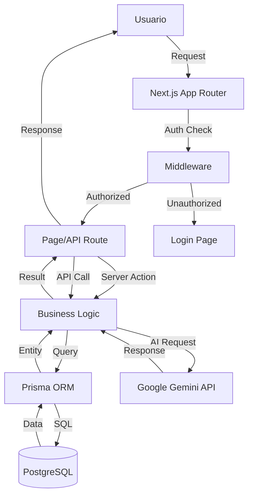
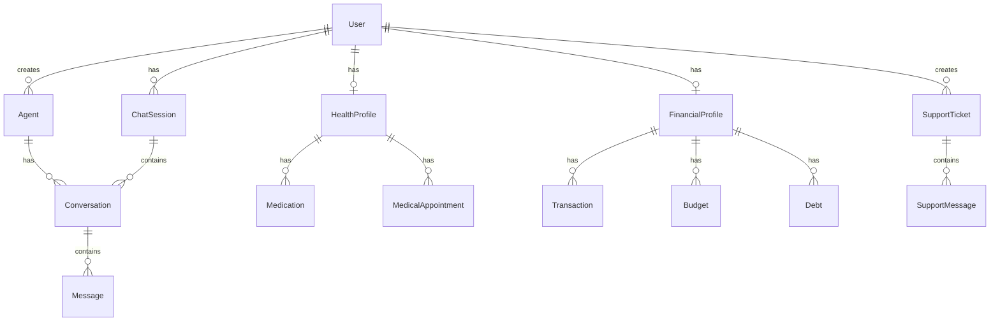

# CJHIRASHI Agents - Documentación del Sistema

## Descripción General

**CJHIRASHI Agents** es un **Hub Multi-Agente de IA** - Una plataforma avanzada que permite a los usuarios crear, gestionar e interactuar con múltiples agentes de inteligencia artificial especializados, cada uno equipado con herramientas específicas para diferentes dominios.

### Visión del Proyecto

**Un ecosistema completo de agentes IA donde cada agente es un especialista con acceso a herramientas poderosas.**

Es una **plataforma de agentes IA** donde los agentes pueden tener herramientas de salud, finanzas, código, contenido, o cualquier otro dominio.

### Propósito

Proporcionar una plataforma centralizada donde los usuarios puedan:
- 🤖 **Gestionar múltiples agentes IA** personalizados
- 🛠️ **Equipar agentes con herramientas especializadas** (health, finance, code, content, etc.)
- 💬 **Conversar con agentes** que entienden contexto y usan herramientas
- 🧠 **RAG (Retrieval-Augmented Generation)** para conocimiento personalizado
- 🎭 **Multi-modal**: Texto, imágenes, voz, documentos
- 🔗 **Multi-tool**: Cada agente puede usar múltiples herramientas
- 📊 **Monitorear uso y costos** de cada agente y herramienta

### Arquitectura del Hub

```
┌─────────────────────────────────────────────────────────┐
│           CJHIRASHI Agents Platform (Hub)               │
├─────────────────────────────────────────────────────────┤
│  Core Platform Layer                                    │
│  • Auth & Users (RBAC)                                  │
│  • Storage System (files, documents, RAG data)          │
│  • Admin Panel (management & analytics)                 │
│  • Support System (AI-powered tickets)                  │
│  • Theme Customization (white-label)                    │
└─────────────────────────────────────────────────────────┘
                          ↓
┌─────────────────────────────────────────────────────────┐
│           Agent Engine (Multi-Agent System)             │
├─────────────────────────────────────────────────────────┤
│  • Agent Orchestration (multi-agent conversations)      │
│  • Tool System (extensible tool architecture)           │
│  • RAG System (vector DB, embeddings, retrieval)        │
│  • Context Management (memory, session, history)        │
│  • Multi-Modal Support (text, images, voice, docs)      │
│  • Streaming & Real-time (WebSocket, SSE)               │
└─────────────────────────────────────────────────────────┘
                          ↓
┌─────────────────────────────────────────────────────────┐
│                   Agent Instances                       │
├─────────────────────────────────────────────────────────┤
│  Agent #1: Personal Assistant                           │
│    Tools: Health, Finance, Calendar, Reminders          │
│    RAG: Personal documents, health records              │
│                                                          │
│  Agent #2: Code Assistant (future)                      │
│    Tools: Code gen, Review, Docs, Testing               │
│    RAG: Codebase, documentation                         │
│                                                          │
│  Agent #3: Content Creator (future)                     │
│    Tools: Writing, Image gen, Social media              │
│    RAG: Brand guidelines, past content                  │
│                                                          │
│  Agent #N: Custom user-created agents                   │
│    Tools: User-defined                                  │
│    RAG: User-uploaded knowledge                         │
└─────────────────────────────────────────────────────────┘
```

### Características Principales

#### 🤖 Multi-Agent System
- Crear múltiples agentes especializados
- Cada agente con personalidad y propósito único
- Agentes pueden colaborar entre sí (futuro)
- Marketplace de agentes pre-configurados

#### 🛠️ Multi-Tool Architecture
- Sistema extensible de herramientas
- Herramientas organizadas por dominio (health, finance, code, etc.)
- Agentes eligen herramientas según la tarea
- Usuarios pueden crear herramientas personalizadas (futuro)

#### 🧠 RAG (Retrieval-Augmented Generation)
- Upload de documentos personales
- Vector embeddings para búsqueda semántica
- Contexto personalizado por usuario/agente
- Memoria a largo plazo

#### 🎭 Multi-Modal Support
- Texto (conversaciones naturales)
- Imágenes (análisis, generación)
- Voz (speech-to-text, text-to-speech) (futuro)
- Documentos (PDF, Word, Excel parsing)

#### 👥 Platform Features
- RBAC con 6 roles
- Storage system robusto
- Métricas y analytics
- Soporte con IA
- White-label customization

---

## Stack Tecnológico

### Frontend

| Tecnología | Versión | Propósito |
|------------|---------|-----------|
| **Next.js** | 15.5.5 | Framework React full-stack con App Router |
| **React** | 19.1.0 | UI library con Server Components |
| **TypeScript** | 5.x | Type safety |
| **Tailwind CSS** | 4.x | Utility-first CSS framework |
| **shadcn/ui** | latest | Component library basada en Radix UI |
| **Lucide React** | 0.545.0 | Icon library |
| **next-themes** | 0.4.6 | Dark mode support |
| **Recharts** | 3.2.1 | Charting library |

### Backend

| Tecnología | Versión | Propósito |
|------------|---------|-----------|
| **Next.js API Routes** | 15.5.5 | REST API endpoints |
| **NextAuth.js** | 4.24.11 | Authentication con OAuth |
| **Prisma** | 6.17.1 | ORM para PostgreSQL |
| **PostgreSQL** | - | Base de datos (Neon serverless) |

### State Management & Validation

| Tecnología | Versión | Propósito |
|------------|---------|-----------|
| **Zustand** | 5.0.8 | Client state management |
| **Zod** | 4.1.12 | Schema validation |

### External Services

| Servicio | Propósito |
|----------|-----------|
| **Google Gemini** | AI conversacional (gemini-2.0-flash-exp) |
| **Google OAuth** | Autenticación de usuarios |
| **Neon** | PostgreSQL serverless database |
| **Vercel** | Hosting y deployment |

### Development Tools

| Tool | Versión | Propósito |
|------|---------|-----------|
| **tsx** | 4.20.6 | TypeScript execution para scripts |
| **ESLint** | 9.x | Code linting |
| **date-fns** | 4.1.0 | Date manipulation |

---

## Arquitectura del Sistema

### Patrón Arquitectónico

**Arquitectura en Capas (Layered Architecture)** con enfoque en Server Components:

```
┌─────────────────────────────────────────────┐
│         CLIENT LAYER (Browser)              │
│  - React 19 Client Components               │
│  - Zustand State Management                 │
│  - shadcn/ui Components                     │
└──────────────┬──────────────────────────────┘
               │ HTTP/WebSocket
┌──────────────▼──────────────────────────────┐
│      PRESENTATION LAYER (Next.js)           │
│  - App Router (RSC + Client Components)     │
│  - Server Components                        │
│  - Middleware (Auth, Rate Limiting)         │
└──────────────┬──────────────────────────────┘
               │
┌──────────────▼──────────────────────────────┐
│         API LAYER (Next.js Routes)          │
│  - /api/auth/* (NextAuth)                   │
│  - /api/agents/*                            │
│  - /api/users/*                             │
│  - /api/health/*                            │
│  - /api/finance/*                           │
│  - /api/support/*                           │
└──────────────┬──────────────────────────────┘
               │
┌──────────────▼──────────────────────────────┐
│      BUSINESS LOGIC LAYER                   │
│  - Services (lib/services/)                 │
│  - Utilities (lib/utils/)                   │
│  - Validation (Zod schemas)                 │
└──────────────┬──────────────────────────────┘
               │
┌──────────────▼──────────────────────────────┐
│      DATA ACCESS LAYER (Prisma)             │
│  - Prisma Client                            │
│  - Query optimization                       │
│  - Transaction management                   │
└──────────────┬──────────────────────────────┘
               │
┌──────────────▼──────────────────────────────┐
│         DATABASE (PostgreSQL/Neon)          │
│  - 32 tablas organizadas en 6 esquemas      │
│  - Índices optimizados                      │
└─────────────────────────────────────────────┘

      EXTERNAL SERVICES
┌──────────────┬──────────────────────────────┐
│ Google AI    │ Google OAuth                 │
└──────────────┴──────────────────────────────┘
```

### Flujo de Datos



---

## Arquitectura del Sistema

El sistema está organizado en **3 capas principales**:

### 📦 Layer 1: Core Platform (6 módulos base)

Infraestructura y servicios fundamentales que soportan toda la plataforma.

### 🤖 Layer 2: Agent Engine (EL CORAZÓN)

Motor multi-agente con capacidades avanzadas de IA.

### 🎯 Layer 3: Agent Tools & Instances

Herramientas específicas y agentes pre-configurados.

---

## Core Platform Modules

### 1. Authentication & Authorization (`auth`)

**Responsabilidad**: Gestión de autenticación y autorización de usuarios.

**Características Implementadas**:
- ✅ OAuth con Google (NextAuth.js)
- ✅ Sistema de roles (RBAC) con 6 niveles
- ✅ JWT tokens
- ✅ Session management
- ✅ Middleware de protección de rutas

**Pendientes**:
- ⚠️ **Email/Password authentication** - Solo OAuth Google implementado actualmente
  - Agregar provider de Credentials a NextAuth
  - Hash de passwords (bcrypt)
  - Email verification
  - Password reset flow
  - Registro de usuarios vía email

**Archivos clave**:
- `src/app/api/auth/[...nextauth]/route.ts`
- `src/middleware.ts`
- `src/lib/auth.ts`

**Estado**: ✅ Funcional (solo Google OAuth) | ⚠️ Pendiente: Email/Password

[Ver documentación detallada](./auth.md)

---

### 2. User Management (`users`)

**Responsabilidad**: Administración completa de usuarios.

**Características**:
- CRUD de usuarios
- Sistema de invitaciones
- Gestión de roles y permisos
- Métricas de uso por usuario
- Audit logs
- Suscripciones (FREE, BASIC, PRO, ENTERPRISE, CUSTOM, UNLIMITED)

**Archivos clave**:
- `src/app/(protected)/admin/users/`
- `src/app/api/users/`
- `scripts/set-admin.ts`
- `scripts/set-super-admin.js`

[Ver documentación detallada](./users.md)

---

### 3. Support System (`support`)

**Responsabilidad**: Sistema de tickets de soporte con IA.

**Características**:
- Creación de tickets
- Respuestas automáticas con IA
- Sistema de prioridades (LOW, MEDIUM, HIGH, URGENT)
- Categorización (BUG, FEATURE, QUESTION, ACCOUNT, BILLING, etc.)
- Chat entre usuario y staff
- Asignación de tickets a admins
- Estados del ticket (OPEN, IN_PROGRESS, WAITING_USER, RESOLVED, CLOSED)

**Archivos clave**:
- `src/app/(protected)/support/`
- `src/app/api/support/`

[Ver documentación detallada](./support.md)

---

### 4. Admin Panel (`admin`)

**Responsabilidad**: Panel de administración para SUPER_ADMIN y ADMIN.

**Características**:
- Dashboard con métricas generales
- Gestión de usuarios
- Sistema de invitaciones
- Visualización de métricas de uso
- Audit logs
- Gestión de tickets de soporte
- Análisis de costos

**Archivos clave**:
- `src/app/(protected)/admin/`
- `src/components/admin/`

[Ver documentación detallada](./admin.md)

---

### 5. Storage System (`storage`)

**Responsabilidad**: Sistema integral de almacenamiento de archivos con multi-provider, encriptación y control de acceso granular.

**Características Implementadas** ✅:
- **Core Features**:
  - ✅ Upload/Download de archivos (File API y Buffer)
  - ✅ Multi-provider architecture (Local, Vercel Blob, AWS S3*, Cloudflare R2*)
  - ✅ Factory pattern para selección dinámica de provider
  - ✅ Adapter pattern para abstracción de storage backends

- **Seguridad**:
  - ✅ Encriptación AES-256-GCM para datos sensibles (HEALTH, FINANCE)
  - ✅ Checksums SHA-256 para integridad de archivos
  - ✅ Control de acceso por niveles (PRIVATE, INTERNAL, PUBLIC, SHARED)
  - ✅ Audit logs detallados (upload, download, view, delete, share)

- **Cuotas y Límites**:
  - ✅ Sistema de cuotas por tier de suscripción
  - ✅ Validación de tamaños por contexto de uso
  - ✅ Tracking de uso por usuario y contexto
  - ✅ Límites configurables por subscription tier

- **Compartición**:
  - ✅ Share links con tokens únicos
  - ✅ Protección con contraseña (bcrypt)
  - ✅ Límite de descargas configurables
  - ✅ Expiración temporal de links
  - ✅ Permisos granulares (view/download)

- **Validación**:
  - ✅ Validación de MIME types por contexto
  - ✅ Validación de tamaños por contexto
  - ✅ Sanitización de nombres de archivo
  - ✅ Detección de magic numbers (tipo real del archivo)

- **Utilidades**:
  - ✅ Generación de nombres únicos
  - ✅ Checksums y verificación
  - ✅ Path sanitization
  - ✅ Formateo de bytes legible

**Contextos de Uso**:

| Contexto | Max Size | Encriptación | MIME Types |
|----------|----------|--------------|------------|
| THEME | 5 MB | No | Images only |
| AVATAR | 2 MB | No | Images only |
| TICKET | 10 MB | No | Images, Docs, Archives |
| ARTIFACT | 50 MB | No | Most types |
| HEALTH | 20 MB | **Sí (obligatorio)** | Images, Docs |
| FINANCE | 20 MB | **Sí (obligatorio)** | Images, Docs |
| BACKUP | 1 GB | No | Archives |
| TEMP | 100 MB | No | All types |
| OTHER | 20 MB | No | All types |

**Cuotas por Tier**:

| Tier | Max Storage | Max File Size | Max Files |
|------|-------------|---------------|-----------|
| FREE | 100 MB | 5 MB | 50 |
| BASIC | 1 GB | 20 MB | 500 |
| PRO | 10 GB | 100 MB | 5,000 |
| ENTERPRISE | 100 GB | 500 MB | 50,000 |
| UNLIMITED | ∞ | ∞ | ∞ |

**Arquitectura**:

```typescript
StorageService (Business Logic)
    ↓
StorageAdapter (Interface)
    ↓
├─ LocalStorageAdapter (filesystem)
├─ VercelBlobAdapter (@vercel/blob)
├─ AWSS3Adapter (futuro)
└─ CloudflareR2Adapter (futuro)
```

**Archivos implementados**:
- ✅ `src/lib/storage/types.ts` - Interfaces y tipos TypeScript
- ✅ `src/lib/storage/storage-service.ts` - Servicio principal
- ✅ `src/lib/storage/adapters/factory.ts` - Factory pattern
- ✅ `src/lib/storage/adapters/local-adapter.ts` - Local filesystem
- ✅ `src/lib/storage/adapters/vercel-blob-adapter.ts` - Vercel Blob
- ✅ `src/lib/storage/utils/validation.ts` - Validaciones
- ✅ `src/lib/storage/utils/encryption.ts` - Encriptación
- ✅ `src/lib/storage/index.ts` - Public API exports
- ✅ `src/lib/storage/README.md` - Documentación detallada

**Pendientes** (Fases 2-4):
- ⏳ API endpoints REST (`/api/storage/*`)
- ⏳ UI components para upload/download
- ⏳ Generación de thumbnails automática
- ⏳ Optimización de imágenes (Sharp)
- ⏳ Virus scanning (ClamAV integration)
- ⏳ Versionamiento de archivos
- ⏳ Rate limiting por usuario
- ⏳ Deduplicación por checksum

**Variables de Entorno Requeridas**:

```bash
# Provider selection
STORAGE_PROVIDER=LOCAL # LOCAL | VERCEL_BLOB | AWS_S3 | CLOUDFLARE_R2

# Encriptación (REQUERIDO para HEALTH/FINANCE)
STORAGE_MASTER_KEY=your_64_char_hex_key

# Local Storage (desarrollo)
LOCAL_STORAGE_DIR=./.storage

# Vercel Blob (producción)
BLOB_READ_WRITE_TOKEN=vercel_blob_rw_xxxxx
BLOB_STORE_URL=https://your-account.public.blob.vercel-storage.com
```

**Estado**: ✅ Fase 1 Core Infrastructure Completa (implementación, testing pendiente)

[Ver documentación completa](./storage.md) | [Ver README técnico](../src/lib/storage/README.md)

---

### 6. Theme Customization (`theme`)

**Responsabilidad**: Personalización corporativa (white-label).

**Características** (SUPER_ADMIN only):
- Cambiar paleta de colores (light/dark)
- Upload de logos corporativos
- Upload de favicon
- Personalizar tipografías
- Nombre de marca personalizable
- Live preview
- Reset a defaults
- Historial de cambios

**Archivos clave**:
- `src/app/admin/theme/` (planificado)
- `src/app/api/admin/theme/` (planificado)
- `src/components/theme-provider.tsx` (actualizar)

**Estado**: Diseño completo, implementación pendiente (PRIORIDAD MEDIA-ALTA)
**Dependencia**: Storage Module (para logos/favicon)

[Ver documentación detallada](./theme.md)

---

## Agent Engine (Multi-Agent System)

**EL CORAZÓN DE LA PLATAFORMA** 🤖

El Agent Engine es el motor que convierte CJHIRASHI Agents en un verdadero hub multi-agente. Proporciona todas las capacidades avanzadas de IA que los agentes necesitan.

### Componentes del Agent Engine

#### 1. Agent Orchestration

**Responsabilidad**: Gestión del ciclo de vida de agentes y orquestación de multi-agentes.

**Características**:
- Crear, actualizar, eliminar agentes
- Gestión de conversaciones por agente
- Orquestación multi-agente (agentes colaborando)
- Context switching entre agentes
- Agent marketplace (futuro)

**Archivos clave**:
- `src/lib/agents/orchestrator.ts`
- `src/lib/agents/agent-manager.ts`
- `src/app/api/agents/`

---

#### 2. Tool System

**Responsabilidad**: Sistema extensible de herramientas que los agentes pueden usar.

**Características**:
- Registro de herramientas
- Tool calling (function calling)
- Tool execution engine
- Tool permissions por agente
- Tool marketplace (futuro)
- Custom tools por usuarios (futuro)

**Tool Categories**:
- **Health Tools**: Medicamentos, citas, mediciones
- **Finance Tools**: Transacciones, presupuestos, inversiones
- **Productivity Tools**: Calendar, reminders, notes
- **Code Tools**: Code gen, review, testing (futuro)
- **Content Tools**: Writing, images, social media (futuro)
- **Search Tools**: Web search, Wikipedia, etc.
- **Integration Tools**: Email, Slack, etc. (futuro)

**Archivos clave**:
- `src/lib/agents/tools/` (tool definitions)
- `src/lib/agents/tool-registry.ts`
- `src/lib/agents/tool-executor.ts`

[Ver documentación detallada](./tool-system.md)

---

#### 3. RAG System (Retrieval-Augmented Generation)

**Responsabilidad**: Sistema de conocimiento personalizado para cada agente/usuario.

**Características**:
- Document upload y parsing (PDF, Word, Excel, etc.)
- Vector embeddings (OpenAI, Gemini, o local)
- Vector database (Pinecone, Weaviate, o PostgreSQL pgvector)
- Semantic search
- Context retrieval
- Citation tracking

**Flujo RAG**:
```
1. User uploads document → Parse & chunk
2. Generate embeddings → Store in vector DB
3. User asks question → Generate query embedding
4. Semantic search → Retrieve relevant chunks
5. Inject context into LLM → Generate answer with citations
```

**Archivos clave**:
- `src/lib/agents/rag/embeddings.ts`
- `src/lib/agents/rag/vector-store.ts`
- `src/lib/agents/rag/retriever.ts`
- `src/lib/agents/rag/document-parser.ts`

[Ver documentación detallada](./rag-system.md)

---

#### 4. Context Management

**Responsabilidad**: Gestión de memoria y contexto de conversaciones.

**Características**:
- Short-term memory (sesión actual)
- Long-term memory (historial completo)
- Context window management
- Memory summarization
- Context retrieval
- User preferences y personalization

**Archivos clave**:
- `src/lib/agents/context/memory-manager.ts`
- `src/lib/agents/context/session-manager.ts`
- `src/lib/agents/context/summarizer.ts`

---

#### 5. Multi-Modal Support

**Responsabilidad**: Soporte para diferentes modalidades de entrada/salida.

**Características**:
- **Texto**: Conversaciones naturales (✅ implementado)
- **Imágenes**: Análisis y generación (🚧 parcial)
- **Documentos**: PDF, Word, Excel parsing (📋 planificado)
- **Voz**: Speech-to-text, Text-to-speech (📋 futuro)
- **Video**: Análisis de videos (📋 futuro)

**Archivos clave**:
- `src/lib/agents/modalities/text.ts`
- `src/lib/agents/modalities/image.ts`
- `src/lib/agents/modalities/document.ts`

---

#### 6. Streaming & Real-time

**Responsabilidad**: Comunicación en tiempo real con agentes.

**Características**:
- Server-Sent Events (SSE) para streaming
- WebSocket para real-time bidireccional
- Token-by-token streaming de respuestas
- Real-time tool execution updates
- Live typing indicators

**Archivos clave**:
- `src/lib/agents/streaming/sse-handler.ts`
- `src/lib/agents/streaming/websocket-handler.ts`

---

### Estado del Agent Engine

| Componente | Estado | Prioridad |
|------------|--------|-----------|
| **Agent Orchestration** | 🚧 Parcial | CRÍTICA |
| **Tool System** | 📋 Diseño | CRÍTICA |
| **RAG System** | 📋 Planificado | ALTA |
| **Context Management** | 🚧 Básico | ALTA |
| **Multi-Modal** | 🚧 Solo texto | MEDIA |
| **Streaming** | 📋 Planificado | MEDIA |

[Ver documentación completa del Agent Engine](./agent-engine.md)

---

## Agent Tools & Instances

Herramientas específicas y agentes pre-configurados listos para usar.

### Agent #1: Personal Assistant (Asistente Personal)

**Propósito**: Ayudar al usuario con tareas de vida diaria (salud, finanzas, productividad).

**Tools Equipadas**:

#### Health Tools
- `health:medications:list` - Listar medicamentos
- `health:medications:add` - Agregar medicamento
- `health:medications:log` - Registrar toma
- `health:appointments:list` - Listar citas médicas
- `health:appointments:create` - Crear cita
- `health:measurements:add` - Agregar medición (peso, presión, etc.)
- `health:reminders:set` - Configurar recordatorios

[Ver documentación de Health Tools](./agent-tools-health.md)

#### Finance Tools
- `finance:accounts:list` - Listar cuentas
- `finance:transactions:list` - Listar transacciones
- `finance:transactions:add` - Agregar transacción
- `finance:budget:check` - Ver presupuesto
- `finance:budget:create` - Crear presupuesto
- `finance:debts:list` - Listar deudas
- `finance:debts:payoff-plan` - Generar plan de pago

[Ver documentación de Finance Tools](./agent-tools-finance.md)

#### Productivity Tools
- `productivity:calendar:events` - Ver calendario
- `productivity:reminders:set` - Crear recordatorio
- `productivity:notes:create` - Crear nota

**RAG Knowledge**:
- Documentos personales del usuario
- Historial de conversaciones
- Preferencias y contexto

**Estado**: 📋 Diseño completo, implementación pendiente

---

### Agent #2: Code Assistant (Futuro)

**Propósito**: Asistir en desarrollo de software.

**Tools Equipadas**:
- Code generation
- Code review
- Testing
- Documentation
- Git operations

**RAG Knowledge**:
- Codebase del usuario
- Documentación técnica
- Best practices

**Estado**: 📋 Concepto definido

---

### Agent #3: Content Creator (Futuro)

**Propósito**: Crear contenido para redes sociales, blogs, marketing.

**Tools Equipadas**:
- Writing tools
- Image generation
- Social media scheduling
- SEO optimization

**RAG Knowledge**:
- Brand guidelines
- Past content
- Style guide

**Estado**: 📋 Concepto definido

---

### Agent #N: Custom User Agents

Los usuarios podrán crear sus propios agentes personalizados, equipándolos con las herramientas que necesiten.

**Estado**: 📋 Futuro

---

## Base de Datos

### Esquema General

La base de datos PostgreSQL está organizada en **6 esquemas lógicos** con un total de **32 tablas**:

#### 1. Users Schema (6 tablas)
- `users` - Usuarios del sistema
- `accounts` - Cuentas OAuth
- `auth_sessions` - Sesiones de autenticación
- `verification_tokens` - Tokens de verificación
- `invitations` - Invitaciones de usuarios
- `audit_logs` - Logs de auditoría

#### 2. Health Schema (7 tablas)
- `health_profiles` - Perfiles de salud
- `medical_conditions` - Condiciones médicas
- `medications` - Medicamentos
- `medication_logs` - Registros de toma
- `allergies` - Alergias
- `medical_appointments` - Citas médicas
- `health_measurements` - Mediciones de salud

#### 3. Finance Schema (8 tablas)
- `financial_profiles` - Perfiles financieros
- `financial_accounts` - Cuentas bancarias/tarjetas
- `transactions` - Transacciones
- `budgets` - Presupuestos
- `debts` - Deudas
- `debt_payments` - Pagos de deudas
- `investments` - Inversiones
- `recurring_payments` - Pagos recurrentes

#### 4. Agents Schema (6 tablas)
- `agents` - Agentes IA
- `conversations` - Conversaciones
- `messages` - Mensajes
- `chat_sessions` - Sesiones de chat
- `user_agent_permissions` - Permisos de usuarios a agentes
- `artifacts` - Artefactos generados (con versionamiento)

#### 5. Metrics Schema (4 tablas)
- `usage_logs` - Logs detallados de uso
- `monthly_usage` - Resumen mensual de uso
- `usage_alerts` - Alertas de límites
- (+ `support_tickets` incluido aquí lógicamente)

#### 6. Support Schema (2 tablas)
- `support_tickets` - Tickets de soporte
- `support_messages` - Mensajes de tickets

### Diagrama Entidad-Relación (Simplificado)



---

## Sistema de Roles y Permisos

### Roles Disponibles

```typescript
enum UserRole {
  SUPER_ADMIN  // Control total - Solo cjhirashi@gmail.com
  ADMIN        // Gestión de usuarios y permisos
  MANAGER      // Supervisión y reportes (futuro)
  DEVELOPER    // Crear y gestionar agentes (futuro)
  USER         // Usuario estándar
  GUEST        // Acceso limitado (futuro)
}
```

### Matriz de Permisos

| Acción | SUPER_ADMIN | ADMIN | MANAGER | DEVELOPER | USER | GUEST |
|--------|-------------|-------|---------|-----------|------|-------|
| Ver usuarios | ✅ | ✅ | ✅ | ❌ | ❌ | ❌ |
| Crear usuarios | ✅ | ✅ | ❌ | ❌ | ❌ | ❌ |
| Eliminar usuarios | ✅ | ✅ | ❌ | ❌ | ❌ | ❌ |
| Cambiar roles | ✅ | ⚠️ | ❌ | ❌ | ❌ | ❌ |
| Ver métricas globales | ✅ | ✅ | ✅ | ❌ | ❌ | ❌ |
| Gestionar tickets | ✅ | ✅ | ✅ | ❌ | ❌ | ❌ |
| Crear agentes | ✅ | ✅ | ✅ | ✅ | ✅ | ❌ |
| Usar agentes | ✅ | ✅ | ✅ | ✅ | ✅ | ⚠️ |
| Ver propios datos | ✅ | ✅ | ✅ | ✅ | ✅ | ✅ |

⚠️ = Con limitaciones

---

## Sistema de Suscripciones

### Tiers Disponibles

```typescript
enum SubscriptionTier {
  FREE           // Límites básicos
  BASIC          // Plan entrada
  PRO            // Plan profesional
  ENTERPRISE     // Plan empresarial
  CUSTOM         // Plan personalizado por super admin
  UNLIMITED      // Sin límites (para usuarios especiales)
}
```

### Límites por Tier (Planificado)

| Feature | FREE | BASIC | PRO | ENTERPRISE | UNLIMITED |
|---------|------|-------|-----|------------|-----------|
| Mensajes/mes | 100 | 1,000 | 10,000 | 50,000 | ∞ |
| Tokens/mes | 50K | 500K | 5M | 25M | ∞ |
| Agentes propios | 1 | 5 | 20 | 100 | ∞ |
| Agentes públicos | ✅ | ✅ | ✅ | ✅ | ✅ |
| Soporte IA | ✅ | ✅ | ✅ | ✅ | ✅ |
| Soporte humano | ❌ | Email | Email+Chat | Prioritario | Dedicado |

---

## Integraciones Externas

### Google Gemini AI

**Modelo**: `gemini-2.0-flash-exp`

**Uso**:
- Conversaciones con agentes
- Respuestas automáticas en tickets de soporte
- Análisis de personalidad (futuro)
- Análisis financiero (futuro)

**Configuración**:
```env
GEMINI_API_KEY=your_api_key
```

### Google OAuth

**Provider**: Google

**Uso**:
- Autenticación de usuarios
- Single Sign-On (SSO)

**Configuración**:
```env
GOOGLE_CLIENT_ID=your_client_id
GOOGLE_CLIENT_SECRET=your_client_secret
```

### Neon PostgreSQL

**Tipo**: Serverless PostgreSQL

**Configuración**:
```env
DATABASE_URL=postgresql://...
```

---

## Seguridad

### Medidas Implementadas

✅ **Autenticación**:
- OAuth con Google
- JWT tokens seguros
- Session management con NextAuth.js

✅ **Autorización**:
- RBAC con 6 roles
- Middleware de protección de rutas
- Permisos granulares por recurso

✅ **Auditoría**:
- Audit logs de acciones administrativas
- Tracking de cambios en usuarios
- Logs de uso de agentes

✅ **Data Protection**:
- Validación con Zod en todas las entradas
- Sanitización de inputs
- Prepared statements (Prisma)

### Medidas Planificadas

🚧 **Encriptación**:
- Datos médicos sensibles (AES-256)
- Información financiera
- PII (Personally Identifiable Information)

🚧 **Compliance**:
- GDPR compliance (delete user functionality ya existe)
- HIPAA para datos de salud
- PCI-DSS para datos financieros (si se implementa pagos)

---

## Performance

### Optimizaciones Actuales

- Server Components por defecto (React 19)
- API Routes con edge runtime donde sea posible
- Índices optimizados en PostgreSQL
- Caching de sesiones con NextAuth
- Lazy loading de componentes pesados

### Métricas Objetivo

- **Time to First Byte (TTFB)**: < 200ms
- **First Contentful Paint (FCP)**: < 1s
- **Largest Contentful Paint (LCP)**: < 2.5s
- **Time to Interactive (TTI)**: < 3s
- **API Response Time**: < 500ms (p95)

---

## Deployment

### Plataforma

**Vercel** (optimizado para Next.js 15)

### Pipeline

```
Git Push → Vercel Build → Deploy Preview → Merge → Production
```

### Environments

- **Development**: Local con PostgreSQL local o Neon dev
- **Preview**: Branch previews en Vercel
- **Production**: Main branch → Vercel production

### Scripts Disponibles

```bash
npm run dev          # Desarrollo local
npm run build        # Build de producción
npm run start        # Servidor de producción
npm run lint         # Linting
npm run set-admin    # Dar rol ADMIN a un usuario
npm run set-super-admin  # Dar rol SUPER_ADMIN
```

---

## Monitoreo y Métricas

### Sistema de Métricas

El sistema registra automáticamente:

- **Uso de agentes**: Mensajes, tokens, costos
- **Métricas de usuarios**: Actividad, límites, alertas
- **Performance**: Tiempos de respuesta, errores
- **Costos**: Por usuario, por agente, totales mensuales

### Tablas de Métricas

- `usage_logs`: Registro detallado de cada interacción
- `monthly_usage`: Resumen mensual por usuario
- `usage_alerts`: Alertas cuando se acercan a límites
- `audit_logs`: Acciones administrativas

---

## Estado del Proyecto y Roadmap

### 🎯 Visión: Hub Multi-Agente de IA

**Objetivo Principal**: Construir un ecosistema completo donde múltiples agentes IA especializados colaboran usando herramientas específicas y conocimiento personalizado (RAG).

---

### ✅ Core Platform - Implementado

**Fundación sólida para el hub de agentes:**

| Módulo | Estado | Descripción |
|--------|--------|-------------|
| **Auth & Users** | ✅ Completo | OAuth Google, RBAC (6 roles), permisos granulares |
| **Admin Panel** | ✅ Completo | Dashboard, gestión de usuarios, métricas, audit logs |
| **Support System** | ✅ Completo | Tickets con respuestas automáticas de IA (Gemini 2.0) |
| **Database** | ✅ Completo | 32 tablas, schema optimizado, índices |

---

### 🚧 Core Platform - En Desarrollo

| Módulo | Estado | Prioridad | Próximo Milestone |
|--------|--------|-----------|-------------------|
| **Storage System** | ✅ Fase 1 Implementada | **CRÍTICA** | Testing + API Endpoints (Fase 2-4) |
| **Theme Customization** | 📋 Diseño | Alta | Storage completado ✅ - Listo para implementar |

---

### 🤖 Agent Engine - Estado Actual

**EL CORAZÓN DEL PROYECTO - Necesita desarrollo intensivo**

⚠️ **IMPORTANTE**: Actualmente **NO hay ningún agente implementado**. Tenemos solo la infraestructura base (DB schema, API endpoints básicos, UI básica).

| Componente | Estado Actual | Prioridad | Objetivo |
|------------|---------------|-----------|----------|
| **Agent Orchestration** | 🚧 10% | **CRÍTICA** | Sistema completo de gestión de agentes |
| **Tool System** | ❌ 0% | **CRÍTICA** | Arquitectura extensible de herramientas |
| **RAG System** | ❌ 0% | **CRÍTICA** | Vector DB + embeddings + retrieval |
| **Context Management** | 🚧 5% | Alta | Memoria a corto y largo plazo |
| **Multi-Modal** | ❌ 0% | Media | Solo estructura básica de texto |
| **Streaming** | ❌ 0% | Media | SSE/WebSocket para real-time |

**Evaluación Técnica Realista:**
- ✅ Tenemos: DB schema de agents/conversations, algunos API endpoints, UI mockup
- ❌ Falta TODO el core: Tool calling, RAG, agentes funcionales, memoria, multi-modal
- 🎯 Gap crítico: **Sistema de herramientas (tool calling) y RAG son bloqueadores absolutos**
- 📊 Estimación real: **Agent Engine está al ~5% de completitud**

**Estado de Agentes:**
- **Agentes implementados**: 0
- **Agentes en desarrollo**: 0
- **Agentes diseñados**: 1 (Personal Assistant)
- **Necesitamos**: Implementar TODO el Agent Engine antes de tener un agente funcional

---

### 🎯 Agent Tools & Instances - Estado

| Agent/Tool Set | Estado | Prioridad | Descripción |
|----------------|--------|-----------|-------------|
| **Personal Assistant Agent** | 📋 Diseño | **CRÍTICA** | Primer agente completo |
| → Health Tools | 📋 DB lista | **CRÍTICA** | 7 herramientas definidas |
| → Finance Tools | 📋 DB lista | **CRÍTICA** | 7 herramientas definidas |
| → Productivity Tools | ❌ 0% | Alta | Calendar, reminders, notes |
| **Code Assistant** | 📋 Concepto | Baja | Futuro (después de PA) |
| **Content Creator** | 📋 Concepto | Baja | Futuro (después de PA) |

---

### 📊 Roadmap Priorizado

#### **FASE 1: Foundation (Crítico)** - 6-8 semanas

**Objetivo**: Tener la base sólida para construir agentes.

1. **Storage System** (Semanas 1-4)
   - ✅ Fase 1: Core Infrastructure COMPLETADA
     - ✅ StorageService implementado
     - ✅ Adapters (Local, Vercel Blob)
     - ✅ Validación y encriptación
     - ✅ Sistema de cuotas
     - ✅ Share links
   - ⏳ Fase 2-4: APIs + UI + Testing (Próximas 2-3 semanas)
   - Estado: ✅ Core implementado, pendiente testing y endpoints
   - [Ver documentación completa](../src/lib/storage/README.md)

2. **Tool System Architecture** (Semanas 3-4)
   - Diseñar sistema de tool calling
   - Implementar tool registry
   - Implementar tool executor
   - Tool permissions
   - Estado: 📋 Por diseñar

3. **RAG System MVP** (Semanas 5-6)
   - Document parsing (PDF, Word, Text)
   - Embeddings (Gemini o OpenAI)
   - Vector storage (PostgreSQL pgvector)
   - Basic retrieval
   - Estado: 📋 Por diseñar

4. **Agent Orchestration Mejorado** (Semanas 7-8)
   - Tool calling integration
   - Context management mejorado
   - Streaming responses
   - Estado: 🚧 Expandir lo existente

---

#### **FASE 2: First Agent** (Alta Prioridad) - 4-6 semanas

**Objetivo**: Lanzar el Personal Assistant Agent completamente funcional.

1. **Health Tools Implementation** (Semanas 9-10)
   - Implementar 7 health tools
   - Integrar con tool system
   - Testing completo
   - UI para visualizar datos

2. **Finance Tools Implementation** (Semanas 11-12)
   - Implementar 7 finance tools
   - Integrar con tool system
   - Testing completo
   - UI para visualizar datos

3. **Personal Assistant Agent** (Semanas 13-14)
   - Configurar agente con tools
   - System prompt optimizado
   - RAG con documentos personales
   - Testing end-to-end
   - Launch 🚀

---

#### **FASE 3: Platform Features** (Media Prioridad) - 4-6 semanas

**Objetivo**: Features de plataforma y UX.

1. **Theme Customization** (Semanas 15-16)
   - Implementar según diseño
   - Depende de Storage

2. **Advanced RAG** (Semanas 17-18)
   - Multi-document retrieval
   - Citation tracking
   - Hybrid search

3. **Multi-Modal Expansion** (Semanas 19-20)
   - Image analysis
   - Document parsing mejorado
   - Voice (futuro)

---

#### **FASE 4: Scaling** (Baja Prioridad) - Futuro

- Agent Marketplace
- Custom user agents
- Agent collaboration (multi-agent)
- More agent templates (Code, Content, etc.)
- Mobile app
- API pública

---

### 🎯 Siguiente Sprint Recomendado

**Sprint 1 (Próximas 2 semanas): Storage System - Fase 1-2**

**Objetivo**: Implementar Storage System core con security.

**Entregables**:
1. ✅ Database schema migrado
2. ✅ StorageService implementado
3. ✅ Vercel Blob adapter funcionando
4. ✅ Local adapter (dev)
5. ✅ Access control completo
6. ✅ Quota management
7. ✅ Rate limiting
8. ✅ API endpoints básicos

**Métricas de éxito**:
- Upload/download funcionando
- Quotas aplicándose
- Security validada
- 80%+ test coverage

[Ver plan detallado](./storage.md#implementación)

---

### 📈 Métricas del Proyecto

| Métrica | Estado Actual | Objetivo | Gap |
|---------|---------------|----------|-----|
| **Core Platform** | 5/6 (83%) | 6/6 (100%) | 1 módulo (Theme) |
| **Agent Engine** | ~5% | 90%+ | **85% - GAP CRÍTICO** |
| **Agent Tools** | 0/14 (0%) | 14 tools | 14 herramientas |
| **Agentes Implementados** | 0 | 1 (PA) | 1 agente completo |
| **Auth Methods** | 1/2 (50%) | 2 | Email/Password falta |
| **Test Coverage** | ~30% | 80%+ | 50% más |
| **Documentation** | 90% | 100% | 10% más |

**Estado General del Proyecto**:
- ✅ **Infraestructura**: Muy Sólida (83%) ⬆️ +16%
- ⚠️ **Core del Producto (Agentes)**: Crítico (5%)
- 📚 **Documentación**: Excelente (90%) ⬆️ +5%

---

### 🚀 Hitos Clave

| Hito | Fecha Objetivo | Estado |
|------|----------------|--------|
| **Storage System Completo** | Semana 4 | 📋 Planificado |
| **Tool System + RAG MVP** | Semana 6 | 📋 Planificado |
| **Health Tools Completas** | Semana 10 | 📋 Planificado |
| **Finance Tools Completas** | Semana 12 | 📋 Planificado |
| **🎉 Personal Assistant Launch** | Semana 14 | 📋 Planificado |
| **Theme Customization** | Semana 16 | 📋 Planificado |
| **RAG Avanzado** | Semana 18 | 📋 Planificado |

---

### ⚠️ Riesgos y Dependencias

| Riesgo | Impacto | Mitigación |
|--------|---------|------------|
| **RAG complejidad** | Alto | Empezar con MVP simple (pgvector) |
| **Tool calling bugs** | Medio | Testing exhaustivo, error handling robusto |
| **Storage costs** | Medio | Implementar quotas estrictas, optimización |
| **LLM API limits** | Medio | Rate limiting, caching, fallbacks |
| **Vector DB scaling** | Bajo | PostgreSQL pgvector suficiente para MVP |

---

### 💡 Decisiones Técnicas Pendientes

1. **Vector DB**: ¿PostgreSQL pgvector, Pinecone, o Weaviate?
   - **Recomendación**: pgvector para MVP (ya tenemos PostgreSQL)

2. **Embeddings**: ¿OpenAI, Gemini, o modelo local?
   - **Recomendación**: Gemini (ya lo usamos, consistencia)

3. **Document Parsing**: ¿PDF.js, PyPDF2, o servicio?
   - **Recomendación**: PDF.js para web, PyPDF2 para backend

4. **Streaming**: ¿SSE o WebSocket?
   - **Recomendación**: SSE para simplicidad, WebSocket futuro

5. **Tool Execution**: ¿Sync o async?
   - **Recomendación**: Async con queue para long-running tools

---

## Estructura de Directorios

```
cjhirashi-agents/
├── .claude/                 # Claude AI configuration
│   ├── agents/             # Specialized agents
│   ├── CLAUDE.md           # Main orchestrator instructions
│   └── STACK-INSTRUCTIONS.md
├── prisma/
│   └── schema.prisma       # Database schema (32 tables)
├── public/                 # Static assets
├── scripts/                # Utility scripts
│   ├── set-admin.ts
│   └── set-super-admin.js
├── src/
│   ├── app/
│   │   ├── (auth)/        # Auth pages (login, signup)
│   │   ├── (protected)/   # Protected pages
│   │   │   ├── admin/     # Admin panel
│   │   │   ├── agents/    # Agents management
│   │   │   ├── chat/      # Chat interface
│   │   │   ├── support/   # Support tickets
│   │   │   ├── health/    # Health module (planned)
│   │   │   └── finance/   # Finance module (planned)
│   │   ├── api/           # API routes
│   │   │   ├── auth/      # NextAuth routes
│   │   │   ├── users/     # User management
│   │   │   ├── agents/    # Agent management
│   │   │   └── support/   # Support system
│   │   ├── layout.tsx
│   │   └── page.tsx
│   ├── components/         # React components
│   │   ├── ui/            # shadcn/ui components
│   │   ├── admin/         # Admin components
│   │   └── ...
│   ├── lib/
│   │   ├── auth.ts        # Auth utilities
│   │   ├── prisma.ts      # Prisma client
│   │   ├── services/      # Business logic
│   │   └── utils.ts       # Utilities
│   └── middleware.ts      # Auth middleware
├── system-docs/            # System documentation
│   ├── SYSTEM.md          # This file
│   ├── VERSIONS.md        # Technology versions
│   └── [module].md        # Module docs
├── package.json
├── tsconfig.json
├── tailwind.config.ts
└── next.config.js
```

---

## Referencias

- [Next.js 15 Documentation](https://nextjs.org/docs)
- [Prisma Documentation](https://www.prisma.io/docs)
- [NextAuth.js Documentation](https://next-auth.js.org)
- [Google Gemini API](https://ai.google.dev/docs)
- [shadcn/ui](https://ui.shadcn.com)

---

**Última actualización**: 2025-10-16
**Versión del sistema**: 0.2.0 (Re-arquitecturado como Hub Multi-Agente)
**Visión**: Hub de Agentes IA con capacidades multi-tool, multi-modal y RAG
**Mantenido por**: cjhirashi@gmail.com

---

## 🎯 Resumen Ejecutivo

**CJHIRASHI Agents** no es una app de salud o finanzas. Es un **Hub Multi-Agente de IA** donde:

- 🤖 Los usuarios crean y gestionan **múltiples agentes especializados**
- 🛠️ Cada agente tiene acceso a **herramientas específicas** (health, finance, code, content, etc.)
- 🧠 Los agentes usan **RAG** para personalizar respuestas con conocimiento del usuario
- 🎭 Soporte **multi-modal** (texto, imágenes, documentos, voz)
- 🔗 Sistema **extensible** donde usuarios y devs pueden crear nuevas herramientas y agentes

**Primer Agente**: Personal Assistant (salud + finanzas + productividad)
**Siguientes**: Code Assistant, Content Creator, y agentes personalizados por usuarios
