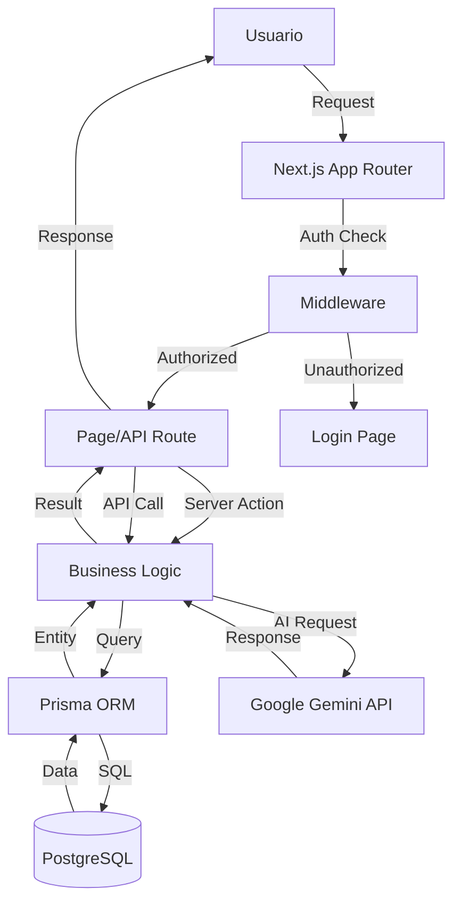
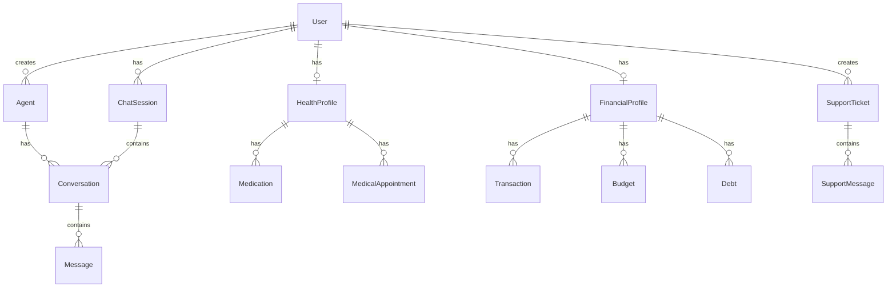

# CJHIRASHI Agents - Documentación del Sistema

## Descripción General

**CJHIRASHI Agents** es una plataforma integral de asistentes personales de IA que combina múltiples funcionalidades para ayudar a los usuarios a gestionar diferentes aspectos de su vida diaria.

### Propósito

Proporcionar una plataforma centralizada donde los usuarios puedan:
- Interactuar con agentes IA personalizados
- Gestionar su salud (medicamentos, citas médicas, alergias)
- Administrar sus finanzas (cuentas, transacciones, presupuestos, deudas)
- Recibir soporte técnico asistido por IA
- Acceder a un sistema de administración avanzado con control granular de roles

### Características Principales

- 🤖 **Sistema de Agentes IA**: Agentes conversacionales personalizados con Google Gemini 2.0
- 🏥 **Gestión de Salud**: Medicamentos, citas, alergias, mediciones de salud
- 💰 **Gestión Financiera**: Cuentas, transacciones, presupuestos, deudas, inversiones
- 👥 **Administración de Usuarios**: Sistema RBAC con 6 roles y permisos granulares
- 🎫 **Sistema de Soporte**: Tickets con respuestas automáticas de IA
- 📊 **Métricas y Auditoría**: Seguimiento completo de uso y costos

---

## Stack Tecnológico

### Frontend

| Tecnología | Versión | Propósito |
|------------|---------|-----------|
| **Next.js** | 15.5.5 | Framework React full-stack con App Router |
| **React** | 19.1.0 | UI library con Server Components |
| **TypeScript** | 5.x | Type safety |
| **Tailwind CSS** | 4.x | Utility-first CSS framework |
| **shadcn/ui** | latest | Component library basada en Radix UI |
| **Lucide React** | 0.545.0 | Icon library |
| **next-themes** | 0.4.6 | Dark mode support |
| **Recharts** | 3.2.1 | Charting library |

### Backend

| Tecnología | Versión | Propósito |
|------------|---------|-----------|
| **Next.js API Routes** | 15.5.5 | REST API endpoints |
| **NextAuth.js** | 4.24.11 | Authentication con OAuth |
| **Prisma** | 6.17.1 | ORM para PostgreSQL |
| **PostgreSQL** | - | Base de datos (Neon serverless) |

### State Management & Validation

| Tecnología | Versión | Propósito |
|------------|---------|-----------|
| **Zustand** | 5.0.8 | Client state management |
| **Zod** | 4.1.12 | Schema validation |

### External Services

| Servicio | Propósito |
|----------|-----------|
| **Google Gemini** | AI conversacional (gemini-2.0-flash-exp) |
| **Google OAuth** | Autenticación de usuarios |
| **Neon** | PostgreSQL serverless database |
| **Vercel** | Hosting y deployment |

### Development Tools

| Tool | Versión | Propósito |
|------|---------|-----------|
| **tsx** | 4.20.6 | TypeScript execution para scripts |
| **ESLint** | 9.x | Code linting |
| **date-fns** | 4.1.0 | Date manipulation |

---

## Arquitectura del Sistema

### Patrón Arquitectónico

**Arquitectura en Capas (Layered Architecture)** con enfoque en Server Components:

```
┌─────────────────────────────────────────────┐
│         CLIENT LAYER (Browser)              │
│  - React 19 Client Components               │
│  - Zustand State Management                 │
│  - shadcn/ui Components                     │
└──────────────┬──────────────────────────────┘
               │ HTTP/WebSocket
┌──────────────▼──────────────────────────────┐
│      PRESENTATION LAYER (Next.js)           │
│  - App Router (RSC + Client Components)     │
│  - Server Components                        │
│  - Middleware (Auth, Rate Limiting)         │
└──────────────┬──────────────────────────────┘
               │
┌──────────────▼──────────────────────────────┐
│         API LAYER (Next.js Routes)          │
│  - /api/auth/* (NextAuth)                   │
│  - /api/agents/*                            │
│  - /api/users/*                             │
│  - /api/health/*                            │
│  - /api/finance/*                           │
│  - /api/support/*                           │
└──────────────┬──────────────────────────────┘
               │
┌──────────────▼──────────────────────────────┐
│      BUSINESS LOGIC LAYER                   │
│  - Services (lib/services/)                 │
│  - Utilities (lib/utils/)                   │
│  - Validation (Zod schemas)                 │
└──────────────┬──────────────────────────────┘
               │
┌──────────────▼──────────────────────────────┐
│      DATA ACCESS LAYER (Prisma)             │
│  - Prisma Client                            │
│  - Query optimization                       │
│  - Transaction management                   │
└──────────────┬──────────────────────────────┘
               │
┌──────────────▼──────────────────────────────┐
│         DATABASE (PostgreSQL/Neon)          │
│  - 32 tablas organizadas en 6 esquemas      │
│  - Índices optimizados                      │
└─────────────────────────────────────────────┘

      EXTERNAL SERVICES
┌──────────────┬──────────────────────────────┐
│ Google AI    │ Google OAuth                 │
└──────────────┴──────────────────────────────┘
```

### Flujo de Datos



---

## Módulos del Sistema

El sistema está organizado en **10 módulos principales** (8 implementados/planificados + 2 en diseño):

### 1. Authentication & Authorization (`auth`)

**Responsabilidad**: Gestión de autenticación y autorización de usuarios.

**Características**:
- OAuth con Google (NextAuth.js)
- Sistema de roles (RBAC) con 6 niveles
- JWT tokens
- Session management
- Middleware de protección de rutas

**Archivos clave**:
- `src/app/api/auth/[...nextauth]/route.ts`
- `src/middleware.ts`
- `src/lib/auth.ts`

[Ver documentación detallada](./auth.md)

---

### 2. User Management (`users`)

**Responsabilidad**: Administración completa de usuarios.

**Características**:
- CRUD de usuarios
- Sistema de invitaciones
- Gestión de roles y permisos
- Métricas de uso por usuario
- Audit logs
- Suscripciones (FREE, BASIC, PRO, ENTERPRISE, CUSTOM, UNLIMITED)

**Archivos clave**:
- `src/app/(protected)/admin/users/`
- `src/app/api/users/`
- `scripts/set-admin.ts`
- `scripts/set-super-admin.js`

[Ver documentación detallada](./users.md)

---

### 3. AI Agents (`agents`)

**Responsabilidad**: Sistema de agentes IA conversacionales.

**Características**:
- Creación de agentes personalizados
- Configuración de modelos (Google Gemini)
- System prompts personalizados
- Permisos granulares por agente
- Estadísticas de uso
- Categorización de agentes
- Artefactos versionados

**Archivos clave**:
- `src/app/(protected)/agents/`
- `src/app/api/agents/`
- `src/lib/services/ai-service.ts`

**Modelos de IA soportados**:
- Google Gemini 2.0 Flash (experimental)

[Ver documentación detallada](./agents.md)

---

### 4. Conversations (`conversations`)

**Responsabilidad**: Gestión de conversaciones con agentes.

**Características**:
- Chat sessions
- Historial de mensajes
- Conteo de tokens
- Métricas por conversación
- Resúmenes automáticos

**Archivos clave**:
- `src/app/(protected)/chat/`
- `src/app/api/conversations/`

[Ver documentación en agents.md](./agents.md)

---

### 5. Health Management (`health`)

**Responsabilidad**: Gestión integral de salud personal.

**Características** (en desarrollo):
- Perfil de salud
- Registro de medicamentos
- Control de toma de medicamentos
- Citas médicas
- Alergias
- Mediciones de salud (peso, presión, glucosa, etc.)
- Recordatorios automáticos

**Archivos clave**:
- `src/app/(protected)/health/` (planificado)
- `src/app/api/health/` (planificado)

**Estado**: Estructura de DB completa, implementación pendiente.

[Ver documentación detallada](./health.md)

---

### 6. Finance Management (`finance`)

**Responsabilidad**: Gestión integral de finanzas personales.

**Características** (en desarrollo):
- Cuentas financieras (checking, savings, credit, investment)
- Transacciones
- Presupuestos
- Deudas y plan de pago
- Inversiones
- Pagos recurrentes
- Análisis financiero con IA

**Archivos clave**:
- `src/app/(protected)/finance/` (planificado)
- `src/app/api/finance/` (planificado)

**Estado**: Estructura de DB completa, implementación pendiente.

[Ver documentación detallada](./finance.md)

---

### 7. Support System (`support`)

**Responsabilidad**: Sistema de tickets de soporte con IA.

**Características**:
- Creación de tickets
- Respuestas automáticas con IA
- Sistema de prioridades (LOW, MEDIUM, HIGH, URGENT)
- Categorización (BUG, FEATURE, QUESTION, ACCOUNT, BILLING, etc.)
- Chat entre usuario y staff
- Asignación de tickets a admins
- Estados del ticket (OPEN, IN_PROGRESS, WAITING_USER, RESOLVED, CLOSED)

**Archivos clave**:
- `src/app/(protected)/support/`
- `src/app/api/support/`

[Ver documentación detallada](./support.md)

---

### 8. Admin Panel (`admin`)

**Responsabilidad**: Panel de administración para SUPER_ADMIN y ADMIN.

**Características**:
- Dashboard con métricas generales
- Gestión de usuarios
- Sistema de invitaciones
- Visualización de métricas de uso
- Audit logs
- Gestión de tickets de soporte
- Análisis de costos

**Archivos clave**:
- `src/app/(protected)/admin/`
- `src/components/admin/`

[Ver documentación detallada](./admin.md)

---

### 9. Storage System (`storage`)

**Responsabilidad**: Sistema integral de almacenamiento de archivos.

**Características**:
- Upload/Download de archivos
- Múltiples proveedores (Vercel Blob, Local, S3, R2)
- Optimización automática de imágenes
- Control de acceso granular
- Quota management por tier
- Encriptación para datos sensibles
- Versionamiento de archivos
- Shared links con expiración
- Audit logs completos
- Virus scanning (opcional)
- HIPAA/GDPR compliance

**Archivos clave**:
- `src/lib/storage/` (planificado)
- `src/app/api/storage/` (planificado)
- `src/components/storage/` (planificado)

**Estado**: Diseño completo, implementación pendiente (PRIORIDAD CRÍTICA)

[Ver documentación detallada](./storage.md)

---

### 10. Theme Customization (`theme`)

**Responsabilidad**: Personalización corporativa (white-label).

**Características** (SUPER_ADMIN only):
- Cambiar paleta de colores (light/dark)
- Upload de logos corporativos
- Upload de favicon
- Personalizar tipografías
- Nombre de marca personalizable
- Live preview
- Reset a defaults
- Historial de cambios

**Archivos clave**:
- `src/app/admin/theme/` (planificado)
- `src/app/api/admin/theme/` (planificado)
- `src/components/theme-provider.tsx` (actualizar)

**Estado**: Diseño completo, implementación pendiente (PRIORIDAD MEDIA-ALTA)
**Dependencia**: Storage Module (para logos/favicon)

[Ver documentación detallada](./theme.md)

---

## Base de Datos

### Esquema General

La base de datos PostgreSQL está organizada en **6 esquemas lógicos** con un total de **32 tablas**:

#### 1. Users Schema (6 tablas)
- `users` - Usuarios del sistema
- `accounts` - Cuentas OAuth
- `auth_sessions` - Sesiones de autenticación
- `verification_tokens` - Tokens de verificación
- `invitations` - Invitaciones de usuarios
- `audit_logs` - Logs de auditoría

#### 2. Health Schema (7 tablas)
- `health_profiles` - Perfiles de salud
- `medical_conditions` - Condiciones médicas
- `medications` - Medicamentos
- `medication_logs` - Registros de toma
- `allergies` - Alergias
- `medical_appointments` - Citas médicas
- `health_measurements` - Mediciones de salud

#### 3. Finance Schema (8 tablas)
- `financial_profiles` - Perfiles financieros
- `financial_accounts` - Cuentas bancarias/tarjetas
- `transactions` - Transacciones
- `budgets` - Presupuestos
- `debts` - Deudas
- `debt_payments` - Pagos de deudas
- `investments` - Inversiones
- `recurring_payments` - Pagos recurrentes

#### 4. Agents Schema (6 tablas)
- `agents` - Agentes IA
- `conversations` - Conversaciones
- `messages` - Mensajes
- `chat_sessions` - Sesiones de chat
- `user_agent_permissions` - Permisos de usuarios a agentes
- `artifacts` - Artefactos generados (con versionamiento)

#### 5. Metrics Schema (4 tablas)
- `usage_logs` - Logs detallados de uso
- `monthly_usage` - Resumen mensual de uso
- `usage_alerts` - Alertas de límites
- (+ `support_tickets` incluido aquí lógicamente)

#### 6. Support Schema (2 tablas)
- `support_tickets` - Tickets de soporte
- `support_messages` - Mensajes de tickets

### Diagrama Entidad-Relación (Simplificado)



---

## Sistema de Roles y Permisos

### Roles Disponibles

```typescript
enum UserRole {
  SUPER_ADMIN  // Control total - Solo cjhirashi@gmail.com
  ADMIN        // Gestión de usuarios y permisos
  MANAGER      // Supervisión y reportes (futuro)
  DEVELOPER    // Crear y gestionar agentes (futuro)
  USER         // Usuario estándar
  GUEST        // Acceso limitado (futuro)
}
```

### Matriz de Permisos

| Acción | SUPER_ADMIN | ADMIN | MANAGER | DEVELOPER | USER | GUEST |
|--------|-------------|-------|---------|-----------|------|-------|
| Ver usuarios | ✅ | ✅ | ✅ | ❌ | ❌ | ❌ |
| Crear usuarios | ✅ | ✅ | ❌ | ❌ | ❌ | ❌ |
| Eliminar usuarios | ✅ | ✅ | ❌ | ❌ | ❌ | ❌ |
| Cambiar roles | ✅ | ⚠️ | ❌ | ❌ | ❌ | ❌ |
| Ver métricas globales | ✅ | ✅ | ✅ | ❌ | ❌ | ❌ |
| Gestionar tickets | ✅ | ✅ | ✅ | ❌ | ❌ | ❌ |
| Crear agentes | ✅ | ✅ | ✅ | ✅ | ✅ | ❌ |
| Usar agentes | ✅ | ✅ | ✅ | ✅ | ✅ | ⚠️ |
| Ver propios datos | ✅ | ✅ | ✅ | ✅ | ✅ | ✅ |

⚠️ = Con limitaciones

---

## Sistema de Suscripciones

### Tiers Disponibles

```typescript
enum SubscriptionTier {
  FREE           // Límites básicos
  BASIC          // Plan entrada
  PRO            // Plan profesional
  ENTERPRISE     // Plan empresarial
  CUSTOM         // Plan personalizado por super admin
  UNLIMITED      // Sin límites (para usuarios especiales)
}
```

### Límites por Tier (Planificado)

| Feature | FREE | BASIC | PRO | ENTERPRISE | UNLIMITED |
|---------|------|-------|-----|------------|-----------|
| Mensajes/mes | 100 | 1,000 | 10,000 | 50,000 | ∞ |
| Tokens/mes | 50K | 500K | 5M | 25M | ∞ |
| Agentes propios | 1 | 5 | 20 | 100 | ∞ |
| Agentes públicos | ✅ | ✅ | ✅ | ✅ | ✅ |
| Soporte IA | ✅ | ✅ | ✅ | ✅ | ✅ |
| Soporte humano | ❌ | Email | Email+Chat | Prioritario | Dedicado |

---

## Integraciones Externas

### Google Gemini AI

**Modelo**: `gemini-2.0-flash-exp`

**Uso**:
- Conversaciones con agentes
- Respuestas automáticas en tickets de soporte
- Análisis de personalidad (futuro)
- Análisis financiero (futuro)

**Configuración**:
```env
GEMINI_API_KEY=your_api_key
```

### Google OAuth

**Provider**: Google

**Uso**:
- Autenticación de usuarios
- Single Sign-On (SSO)

**Configuración**:
```env
GOOGLE_CLIENT_ID=your_client_id
GOOGLE_CLIENT_SECRET=your_client_secret
```

### Neon PostgreSQL

**Tipo**: Serverless PostgreSQL

**Configuración**:
```env
DATABASE_URL=postgresql://...
```

---

## Seguridad

### Medidas Implementadas

✅ **Autenticación**:
- OAuth con Google
- JWT tokens seguros
- Session management con NextAuth.js

✅ **Autorización**:
- RBAC con 6 roles
- Middleware de protección de rutas
- Permisos granulares por recurso

✅ **Auditoría**:
- Audit logs de acciones administrativas
- Tracking de cambios en usuarios
- Logs de uso de agentes

✅ **Data Protection**:
- Validación con Zod en todas las entradas
- Sanitización de inputs
- Prepared statements (Prisma)

### Medidas Planificadas

🚧 **Encriptación**:
- Datos médicos sensibles (AES-256)
- Información financiera
- PII (Personally Identifiable Information)

🚧 **Compliance**:
- GDPR compliance (delete user functionality ya existe)
- HIPAA para datos de salud
- PCI-DSS para datos financieros (si se implementa pagos)

---

## Performance

### Optimizaciones Actuales

- Server Components por defecto (React 19)
- API Routes con edge runtime donde sea posible
- Índices optimizados en PostgreSQL
- Caching de sesiones con NextAuth
- Lazy loading de componentes pesados

### Métricas Objetivo

- **Time to First Byte (TTFB)**: < 200ms
- **First Contentful Paint (FCP)**: < 1s
- **Largest Contentful Paint (LCP)**: < 2.5s
- **Time to Interactive (TTI)**: < 3s
- **API Response Time**: < 500ms (p95)

---

## Deployment

### Plataforma

**Vercel** (optimizado para Next.js 15)

### Pipeline

```
Git Push → Vercel Build → Deploy Preview → Merge → Production
```

### Environments

- **Development**: Local con PostgreSQL local o Neon dev
- **Preview**: Branch previews en Vercel
- **Production**: Main branch → Vercel production

### Scripts Disponibles

```bash
npm run dev          # Desarrollo local
npm run build        # Build de producción
npm run start        # Servidor de producción
npm run lint         # Linting
npm run set-admin    # Dar rol ADMIN a un usuario
npm run set-super-admin  # Dar rol SUPER_ADMIN
```

---

## Monitoreo y Métricas

### Sistema de Métricas

El sistema registra automáticamente:

- **Uso de agentes**: Mensajes, tokens, costos
- **Métricas de usuarios**: Actividad, límites, alertas
- **Performance**: Tiempos de respuesta, errores
- **Costos**: Por usuario, por agente, totales mensuales

### Tablas de Métricas

- `usage_logs`: Registro detallado de cada interacción
- `monthly_usage`: Resumen mensual por usuario
- `usage_alerts`: Alertas cuando se acercan a límites
- `audit_logs`: Acciones administrativas

---

## Estado del Proyecto

### Módulos Implementados ✅

- ✅ Autenticación con Google OAuth
- ✅ Sistema de roles y permisos
- ✅ Panel de administración de usuarios
- ✅ Sistema de invitaciones
- ✅ Sistema de tickets de soporte
- ✅ Respuestas automáticas con IA en tickets
- ✅ Métricas de uso básicas
- ✅ Audit logs

### Módulos en Desarrollo 🚧

- 🚧 Sistema de agentes IA (estructura lista, implementación pendiente)
- 🚧 Chat con agentes (estructura lista)
- 🚧 Sistema de salud (DB lista, UI pendiente)
- 🚧 Sistema financiero (DB lista, UI pendiente)
- 🚧 Sistema de artefactos versionados
- 🚧 Análisis de personalidad con IA

### Módulos Planificados 📋

**Prioridad CRÍTICA:**
- 📋 **Storage System** (diseño completo) - Base para múltiples módulos
  - Upload/download de archivos
  - Múltiples providers (Vercel Blob, Local, S3, R2)
  - Optimización de imágenes
  - Quota management
  - Encriptación para datos sensibles
  - [Ver documentación](./storage.md)

**Prioridad ALTA:**
- 📋 **Theme Customization** (diseño completo) - Personalización corporativa
  - Paleta de colores
  - Logos y favicon
  - Tipografías
  - SUPER_ADMIN only
  - Depende de Storage Module
  - [Ver documentación](./theme.md)

### Próximas Funcionalidades 📋

- 📋 Dashboard financiero con gráficos
- 📋 Dashboard de salud con tendencias
- 📋 Recordatorios automáticos (medicamentos, citas, pagos)
- 📋 Exportación de datos
- 📋 API pública para integraciones
- 📋 Mobile app (React Native)
- 📋 Sistema de notificaciones push
- 📋 Marketplace de agentes

---

## Estructura de Directorios

```
cjhirashi-agents/
├── .claude/                 # Claude AI configuration
│   ├── agents/             # Specialized agents
│   ├── CLAUDE.md           # Main orchestrator instructions
│   └── STACK-INSTRUCTIONS.md
├── prisma/
│   └── schema.prisma       # Database schema (32 tables)
├── public/                 # Static assets
├── scripts/                # Utility scripts
│   ├── set-admin.ts
│   └── set-super-admin.js
├── src/
│   ├── app/
│   │   ├── (auth)/        # Auth pages (login, signup)
│   │   ├── (protected)/   # Protected pages
│   │   │   ├── admin/     # Admin panel
│   │   │   ├── agents/    # Agents management
│   │   │   ├── chat/      # Chat interface
│   │   │   ├── support/   # Support tickets
│   │   │   ├── health/    # Health module (planned)
│   │   │   └── finance/   # Finance module (planned)
│   │   ├── api/           # API routes
│   │   │   ├── auth/      # NextAuth routes
│   │   │   ├── users/     # User management
│   │   │   ├── agents/    # Agent management
│   │   │   └── support/   # Support system
│   │   ├── layout.tsx
│   │   └── page.tsx
│   ├── components/         # React components
│   │   ├── ui/            # shadcn/ui components
│   │   ├── admin/         # Admin components
│   │   └── ...
│   ├── lib/
│   │   ├── auth.ts        # Auth utilities
│   │   ├── prisma.ts      # Prisma client
│   │   ├── services/      # Business logic
│   │   └── utils.ts       # Utilities
│   └── middleware.ts      # Auth middleware
├── system-docs/            # System documentation
│   ├── SYSTEM.md          # This file
│   ├── VERSIONS.md        # Technology versions
│   └── [module].md        # Module docs
├── package.json
├── tsconfig.json
├── tailwind.config.ts
└── next.config.js
```

---

## Referencias

- [Next.js 15 Documentation](https://nextjs.org/docs)
- [Prisma Documentation](https://www.prisma.io/docs)
- [NextAuth.js Documentation](https://next-auth.js.org)
- [Google Gemini API](https://ai.google.dev/docs)
- [shadcn/ui](https://ui.shadcn.com)

---

**Última actualización**: 2025-10-16
**Versión del sistema**: 0.1.0
**Mantenido por**: cjhirashi@gmail.com
