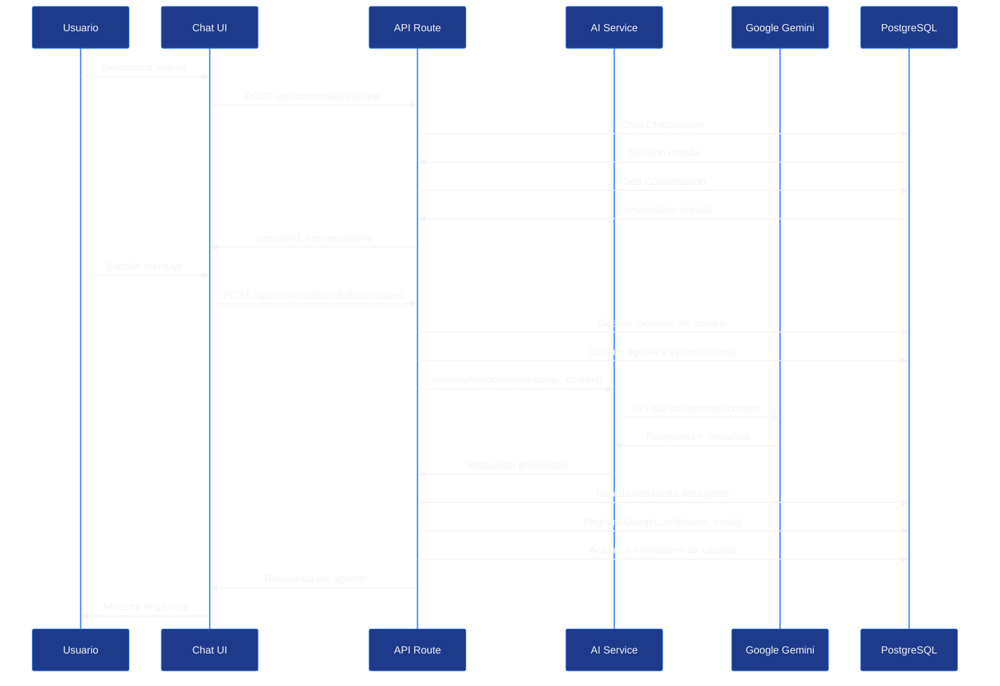
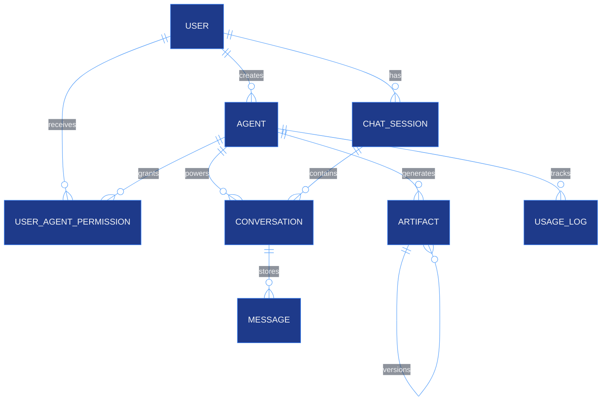

# AI Agents Module

## Descripción General

El módulo de Agentes IA permite crear y gestionar asistentes conversacionales personalizados potenciados por Google Gemini 2.0 Flash. Los usuarios pueden crear agentes con personalidades, capacidades y configuraciones únicas, y compartirlos públicamente o mantenerlos privados.

---

## Características Principales

- Creación ilimitada de agentes IA personalizados (según tier de suscripción)
- Integración con Google Gemini 2.0 Flash (experimental)
- System prompts personalizados por agente
- Categorización de agentes (personal, productivity, creative, health, finance, etc.)
- Agentes públicos y privados
- Sistema de permisos granulares por agente
- Conversaciones multi-agente en una misma sesión de chat
- Tracking de uso y costos por agente
- Artefactos versionados (código, documentos, imágenes generadas)
- Estadísticas de uso y rating

---

## Arquitectura del Módulo

### Flujo de Interacción con Agentes



---

## Base de Datos

### Tabla Agents

```sql
CREATE TABLE agents (
  id VARCHAR PRIMARY KEY DEFAULT uuid(),
  createdBy VARCHAR REFERENCES users(id) ON DELETE CASCADE,

  name VARCHAR NOT NULL,
  slug VARCHAR UNIQUE NOT NULL,
  description TEXT,
  category VARCHAR NOT NULL,

  -- Configuración técnica
  model VARCHAR NOT NULL,  -- "gemini-2.0-flash-exp"
  config JSONB,
  endpointUrl VARCHAR NOT NULL,
  systemPrompt TEXT,

  -- Visibilidad
  isPublic BOOLEAN DEFAULT false,
  isActive BOOLEAN DEFAULT true,

  -- Documentación
  documentationUrl VARCHAR,
  tutorialUrl VARCHAR,
  capabilities JSONB,

  -- Estadísticas
  totalUses INTEGER DEFAULT 0,
  totalMessages INTEGER DEFAULT 0,
  averageRating DECIMAL(3, 2),

  createdAt TIMESTAMP DEFAULT NOW(),
  updatedAt TIMESTAMP DEFAULT NOW()
);

CREATE INDEX idx_agents_slug ON agents(slug);
CREATE INDEX idx_agents_creator ON agents(createdBy);
CREATE INDEX idx_agents_category ON agents(category);
CREATE INDEX idx_agents_public ON agents(isPublic);
```

### Tabla Conversations

```sql
CREATE TABLE conversations (
  id VARCHAR PRIMARY KEY DEFAULT uuid(),
  chatSessionId VARCHAR REFERENCES chat_sessions(id) ON DELETE CASCADE,
  agentId VARCHAR REFERENCES agents(id) ON DELETE CASCADE,

  title VARCHAR NOT NULL,
  summary TEXT,

  messageCount INTEGER DEFAULT 0,
  tokenCount INTEGER DEFAULT 0,

  createdAt TIMESTAMP DEFAULT NOW(),
  updatedAt TIMESTAMP DEFAULT NOW()
);

CREATE INDEX idx_conversations_session ON conversations(chatSessionId);
CREATE INDEX idx_conversations_agent ON conversations(agentId);
```

### Tabla Messages

```sql
CREATE TABLE messages (
  id VARCHAR PRIMARY KEY DEFAULT uuid(),
  conversationId VARCHAR REFERENCES conversations(id) ON DELETE CASCADE,

  role VARCHAR NOT NULL,  -- 'user', 'assistant', 'system'
  content TEXT NOT NULL,

  tokensInput INTEGER,
  tokensOutput INTEGER,

  metadata JSONB,
  timestamp TIMESTAMP DEFAULT NOW()
);

CREATE INDEX idx_messages_conversation ON messages(conversationId);
CREATE INDEX idx_messages_timestamp ON messages(timestamp);
```

### Tabla ChatSession

```sql
CREATE TABLE chat_sessions (
  id VARCHAR PRIMARY KEY DEFAULT uuid(),
  userId VARCHAR REFERENCES users(id) ON DELETE CASCADE,

  startedAt TIMESTAMP DEFAULT NOW(),
  lastActivity TIMESTAMP DEFAULT NOW(),
  metadata JSONB
);

CREATE INDEX idx_chat_sessions_user ON chat_sessions(userId);
```

### Tabla UserAgentPermission

```sql
CREATE TABLE user_agent_permissions (
  id VARCHAR PRIMARY KEY DEFAULT uuid(),
  userId VARCHAR REFERENCES users(id) ON DELETE CASCADE,
  agentId VARCHAR REFERENCES agents(id) ON DELETE CASCADE,
  grantedBy VARCHAR,
  grantedAt TIMESTAMP DEFAULT NOW(),

  UNIQUE(userId, agentId)
);

CREATE INDEX idx_uap_user ON user_agent_permissions(userId);
CREATE INDEX idx_uap_agent ON user_agent_permissions(agentId);
```

### Tabla Artifacts

```sql
CREATE TABLE artifacts (
  id VARCHAR PRIMARY KEY DEFAULT uuid(),
  agentId VARCHAR REFERENCES agents(id) ON DELETE CASCADE,
  userId VARCHAR NOT NULL,
  conversationId VARCHAR,

  name VARCHAR NOT NULL,
  type VARCHAR NOT NULL,  -- 'code', 'document', 'image', 'data'
  content TEXT NOT NULL,

  version INTEGER DEFAULT 1,
  parentId VARCHAR REFERENCES artifacts(id),

  metadata JSONB,
  tags JSONB,

  createdAt TIMESTAMP DEFAULT NOW(),
  updatedAt TIMESTAMP DEFAULT NOW()
);

CREATE INDEX idx_artifacts_agent ON artifacts(agentId);
CREATE INDEX idx_artifacts_user ON artifacts(userId);
CREATE INDEX idx_artifacts_parent ON artifacts(parentId);
```

### Diagrama de Relaciones



---

## Categorías de Agentes

```typescript
const AGENT_CATEGORIES = {
  PERSONAL: "personal",           // Asistente personal general
  PRODUCTIVITY: "productivity",   // Organización, tareas
  CREATIVE: "creative",           // Escritura creativa, diseño
  TECHNICAL: "technical",         // Programación, debugging
  LEARNING: "learning",           // Educación, tutorías
  HEALTH: "health",               // Salud y bienestar
  FINANCE: "finance",             // Finanzas personales
  TRAVEL: "travel",               // Viajes y turismo
  COOKING: "cooking",             // Recetas y cocina
  CUSTOM: "custom",               // Personalizados
};
```

---

## API Endpoints

### 1. Crear Agente

**Endpoint:** POST `/api/agents`

**Requiere:** Usuario autenticado (límites según tier)

```typescript
// Request
{
  "name": "My Helper",
  "description": "An AI assistant to help with daily tasks",
  "category": "productivity",
  "model": "gemini-2.0-flash-exp",
  "systemPrompt": "You are a helpful productivity assistant...",
  "isPublic": false,
  "capabilities": [
    "task management",
    "scheduling",
    "reminders"
  ]
}

// Response 201
{
  "success": true,
  "agent": {
    "id": "uuid",
    "slug": "my-helper",
    "name": "My Helper",
    "description": "An AI assistant to help with daily tasks",
    "category": "productivity",
    "model": "gemini-2.0-flash-exp",
    "isPublic": false,
    "isActive": true,
    "createdBy": "user-uuid",
    "createdAt": "2025-10-16T..."
  }
}
```

### 2. Listar Agentes

**Endpoint:** GET `/api/agents`

**Query Params:**
- `category` (filtro por categoría)
- `isPublic` (true para ver solo públicos)
- `createdBy` (ver solo los propios: "me")
- `search` (búsqueda por nombre/descripción)

```typescript
// Response 200
{
  "agents": [
    {
      "id": "uuid",
      "slug": "my-helper",
      "name": "My Helper",
      "description": "An AI assistant...",
      "category": "productivity",
      "isPublic": false,
      "createdBy": {
        "id": "user-uuid",
        "name": "John Doe"
      },
      "totalUses": 150,
      "averageRating": 4.5,
      "createdAt": "2025-10-16T..."
    }
  ]
}
```

### 3. Obtener Agente

**Endpoint:** GET `/api/agents/[slug]`

```typescript
// Response 200
{
  "agent": {
    "id": "uuid",
    "slug": "my-helper",
    "name": "My Helper",
    "description": "An AI assistant to help with daily tasks",
    "category": "productivity",
    "model": "gemini-2.0-flash-exp",
    "systemPrompt": "You are a helpful...",
    "isPublic": false,
    "isActive": true,
    "capabilities": ["task management", "scheduling"],
    "createdBy": {
      "id": "user-uuid",
      "name": "John Doe",
      "avatar": "https://..."
    },
    "stats": {
      "totalUses": 150,
      "totalMessages": 1523,
      "averageRating": 4.5,
      "uniqueUsers": 1
    },
    "createdAt": "2025-10-16T...",
    "updatedAt": "2025-10-16T..."
  },
  "hasAccess": true
}
```

### 4. Actualizar Agente

**Endpoint:** PATCH `/api/agents/[slug]`

**Requiere:** Creador del agente o ADMIN

```typescript
// Request
{
  "name": "My Updated Helper",
  "description": "Updated description",
  "systemPrompt": "New system prompt...",
  "isPublic": true
}

// Response 200
{
  "success": true,
  "agent": { /* agente actualizado */ }
}
```

### 5. Eliminar Agente

**Endpoint:** DELETE `/api/agents/[slug]`

**Requiere:** Creador del agente o ADMIN

```typescript
// Response 200
{
  "success": true,
  "message": "Agent deleted successfully",
  "deletedData": {
    "conversationsDeleted": 45,
    "messagesDeleted": 1523,
    "artifactsDeleted": 12
  }
}
```

---

## Conversaciones y Mensajes

### 1. Crear Conversación

**Endpoint:** POST `/api/conversations/new`

```typescript
// Request
{
  "agentSlug": "my-helper",
  "initialMessage": "Hello, I need help with task management"
}

// Response 201
{
  "success": true,
  "chatSession": {
    "id": "session-uuid"
  },
  "conversation": {
    "id": "conversation-uuid",
    "title": "Task Management Help",
    "agentId": "agent-uuid"
  },
  "messages": [
    {
      "id": "msg-uuid",
      "role": "user",
      "content": "Hello, I need help...",
      "timestamp": "2025-10-16T..."
    },
    {
      "id": "msg-uuid-2",
      "role": "assistant",
      "content": "Hello! I'd be happy to help...",
      "tokensInput": 15,
      "tokensOutput": 45,
      "timestamp": "2025-10-16T..."
    }
  ]
}
```

### 2. Enviar Mensaje

**Endpoint:** POST `/api/conversations/[conversationId]/messages`

```typescript
// Request
{
  "content": "Can you create a task for tomorrow?"
}

// Response 201
{
  "success": true,
  "messages": [
    {
      "id": "msg-uuid",
      "role": "user",
      "content": "Can you create a task...",
      "timestamp": "2025-10-16T..."
    },
    {
      "id": "msg-uuid-2",
      "role": "assistant",
      "content": "Sure! I've created...",
      "tokensInput": 12,
      "tokensOutput": 38,
      "timestamp": "2025-10-16T..."
    }
  ],
  "usage": {
    "tokensInput": 12,
    "tokensOutput": 38,
    "totalCost": 0.00025
  }
}
```

### 3. Obtener Historial de Conversación

**Endpoint:** GET `/api/conversations/[conversationId]`

```typescript
// Response 200
{
  "conversation": {
    "id": "conversation-uuid",
    "title": "Task Management Help",
    "agent": {
      "id": "agent-uuid",
      "name": "My Helper",
      "slug": "my-helper"
    },
    "messageCount": 15,
    "tokenCount": 1250,
    "createdAt": "2025-10-16T...",
    "updatedAt": "2025-10-16T..."
  },
  "messages": [
    {
      "id": "msg-uuid",
      "role": "user",
      "content": "Hello...",
      "timestamp": "2025-10-16T10:00:00Z"
    },
    {
      "id": "msg-uuid-2",
      "role": "assistant",
      "content": "Hello!...",
      "tokensInput": 15,
      "tokensOutput": 45,
      "timestamp": "2025-10-16T10:00:02Z"
    }
  ]
}
```

### 4. Listar Conversaciones del Usuario

**Endpoint:** GET `/api/conversations`

```typescript
// Response 200
{
  "conversations": [
    {
      "id": "uuid",
      "title": "Task Management Help",
      "agent": {
        "name": "My Helper",
        "slug": "my-helper"
      },
      "messageCount": 15,
      "lastMessage": {
        "content": "Sure! I've created...",
        "timestamp": "2025-10-16T..."
      },
      "createdAt": "2025-10-15T...",
      "updatedAt": "2025-10-16T..."
    }
  ]
}
```

---

## Sistema de Permisos

### Acceso a Agentes

```typescript
function canAccessAgent(user: User, agent: Agent): boolean {
  // 1. Creador siempre tiene acceso
  if (agent.createdBy === user.id) return true;

  // 2. Agente público, cualquiera puede usar
  if (agent.isPublic) return true;

  // 3. Permiso explícito
  const permission = await prisma.userAgentPermission.findUnique({
    where: {
      userId_agentId: {
        userId: user.id,
        agentId: agent.id,
      },
    },
  });

  return !!permission;
}
```

### Otorgar Permiso

**Endpoint:** POST `/api/agents/[slug]/permissions`

**Requiere:** Creador del agente

```typescript
// Request
{
  "userId": "user-uuid",
  "email": "user@example.com"  // Alternativa al ID
}

// Response 201
{
  "success": true,
  "permission": {
    "userId": "user-uuid",
    "agentId": "agent-uuid",
    "grantedBy": "creator-uuid",
    "grantedAt": "2025-10-16T..."
  }
}
```

---

## Integración con Google Gemini

### AI Service

**Archivo:** `src/lib/services/ai-service.ts`

```typescript
import { GoogleGenerativeAI } from "@google/generative-ai";

const genAI = new GoogleGenerativeAI(process.env.GEMINI_API_KEY!);

export async function generateResponse(
  message: string,
  agent: Agent,
  conversationHistory: Message[]
) {
  const model = genAI.getGenerativeModel({ model: agent.model });

  // Construir contexto
  const systemInstruction = agent.systemPrompt || "You are a helpful assistant.";

  const history = conversationHistory.map((msg) => ({
    role: msg.role === "user" ? "user" : "model",
    parts: [{ text: msg.content }],
  }));

  const chat = model.startChat({
    history,
    generationConfig: {
      maxOutputTokens: 2048,
      temperature: 0.7,
      topP: 0.95,
    },
  });

  // Enviar mensaje
  const result = await chat.sendMessage(message);
  const response = result.response;

  // Calcular tokens (estimación)
  const tokensInput = countTokens(message);
  const tokensOutput = countTokens(response.text());

  // Calcular costo
  const cost = calculateCost(tokensInput, tokensOutput, agent.model);

  return {
    content: response.text(),
    tokensInput,
    tokensOutput,
    totalTokens: tokensInput + tokensOutput,
    cost,
    metadata: {
      model: agent.model,
      finishReason: response.candidates?.[0]?.finishReason,
    },
  };
}
```

### Cálculo de Costos

```typescript
const PRICING = {
  "gemini-2.0-flash-exp": {
    input: 0.00001,   // $0.01 per 1K tokens
    output: 0.00003,  // $0.03 per 1K tokens
  },
};

function calculateCost(
  tokensInput: number,
  tokensOutput: number,
  model: string
): number {
  const pricing = PRICING[model] || PRICING["gemini-2.0-flash-exp"];

  const costInput = (tokensInput / 1000) * pricing.input;
  const costOutput = (tokensOutput / 1000) * pricing.output;

  return costInput + costOutput;
}
```

---

## Artefactos

### Tipos de Artefactos

```typescript
enum ArtifactType {
  CODE = "code",           // Código generado
  DOCUMENT = "document",   // Documentos
  IMAGE = "image",         // Imágenes (URL)
  DATA = "data",           // Datos estructurados (JSON, CSV)
}
```

### Crear Artefacto

**Endpoint:** POST `/api/artifacts`

```typescript
// Request
{
  "agentId": "agent-uuid",
  "conversationId": "conv-uuid",
  "name": "Task Manager Component",
  "type": "code",
  "content": "import React from 'react'...",
  "metadata": {
    "language": "typescript",
    "framework": "react"
  },
  "tags": ["component", "react", "typescript"]
}

// Response 201
{
  "success": true,
  "artifact": {
    "id": "artifact-uuid",
    "name": "Task Manager Component",
    "type": "code",
    "version": 1,
    "createdAt": "2025-10-16T..."
  }
}
```

### Versionamiento

Cuando se actualiza un artefacto, se crea una nueva versión:

```typescript
// Request PATCH /api/artifacts/[id]
{
  "content": "Updated code...",
  "changeLog": "Fixed bug in useEffect"
}

// Se crea nueva versión
{
  "id": "new-artifact-uuid",
  "name": "Task Manager Component",
  "type": "code",
  "version": 2,
  "parentId": "original-artifact-uuid",
  "content": "Updated code...",
  "metadata": {
    "changeLog": "Fixed bug in useEffect"
  }
}
```

### Ver Historial de Versiones

**Endpoint:** GET `/api/artifacts/[id]/versions`

```typescript
// Response 200
{
  "artifact": {
    "id": "artifact-uuid",
    "name": "Task Manager Component",
    "currentVersion": 3
  },
  "versions": [
    {
      "version": 1,
      "createdAt": "2025-10-15T...",
      "changes": "Initial version"
    },
    {
      "version": 2,
      "createdAt": "2025-10-16T...",
      "changes": "Fixed bug in useEffect"
    },
    {
      "version": 3,
      "createdAt": "2025-10-16T...",
      "changes": "Added error handling"
    }
  ]
}
```

---

## Métricas y Estadísticas

### Métricas por Agente

```typescript
// GET /api/agents/[slug]/stats
{
  "agent": {
    "name": "My Helper",
    "slug": "my-helper"
  },
  "stats": {
    "totalUses": 150,
    "totalMessages": 1523,
    "totalTokens": 125000,
    "totalCost": 3.75,
    "averageRating": 4.5,
    "uniqueUsers": 12,
    "conversationsStarted": 45,
    "averageConversationLength": 33.8,  // mensajes
    "mostActiveHours": [9, 10, 14, 15, 16],
    "topics": [
      { topic: "task management", count: 45 },
      { topic: "scheduling", count: 32 },
      { topic: "reminders", count: 28 }
    ]
  },
  "usage": {
    "last7Days": [
      { date: "2025-10-10", messages: 15, tokens: 1250 },
      { date: "2025-10-11", messages: 22, tokens: 1850 }
    ],
    "last30Days": {
      "messages": 456,
      "tokens": 38000,
      "cost": 1.14
    }
  }
}
```

### Ranking de Agentes

```typescript
// GET /api/agents/ranking?sortBy=totalUses&limit=10
{
  "ranking": [
    {
      "rank": 1,
      "agent": {
        "slug": "productivity-master",
        "name": "Productivity Master",
        "category": "productivity"
      },
      "totalUses": 5420,
      "averageRating": 4.8
    },
    {
      "rank": 2,
      "agent": {
        "slug": "code-wizard",
        "name": "Code Wizard",
        "category": "technical"
      },
      "totalUses": 4823,
      "averageRating": 4.7
    }
  ]
}
```

---

## Componentes UI

### Galería de Agentes

```
┌─────────────────────────────────────────────────────────┐
│  Mis Agentes                            [+ Crear Agente]│
│─────────────────────────────────────────────────────────│
│  Filtros: [Todos ▼] [🔍 Buscar...]                     │
│─────────────────────────────────────────────────────────│
│  ┌──────────────┐  ┌──────────────┐  ┌──────────────┐ │
│  │ 🤖           │  │ 💼           │  │ ✍️           │ │
│  │ My Helper    │  │ Code Wizard  │  │ Writer Pro   │ │
│  │ Productivity │  │ Technical    │  │ Creative     │ │
│  │ 150 usos     │  │ 523 usos     │  │ 89 usos      │ │
│  │ ⭐ 4.5       │  │ ⭐ 4.8       │  │ ⭐ 4.3       │ │
│  │ [Chat] [⚙️]  │  │ [Chat] [⚙️]  │  │ [Chat] [⚙️]  │ │
│  └──────────────┘  └──────────────┘  └──────────────┘ │
└─────────────────────────────────────────────────────────┘
```

### Interfaz de Chat

```
┌─────────────────────────────────────────────────────────┐
│  🤖 My Helper                                     [⚙️]  │
│─────────────────────────────────────────────────────────│
│                                                         │
│  👤 You (10:30 AM)                                      │
│  Hello, I need help with task management                │
│                                                         │
│  🤖 My Helper (10:30 AM)                                │
│  Hello! I'd be happy to help you with task management.  │
│  What specific aspect would you like assistance with?   │
│                                                         │
│  👤 You (10:31 AM)                                      │
│  Can you create a task for tomorrow?                    │
│                                                         │
│  🤖 My Helper (10:31 AM)                                │
│  Sure! I've created a task for tomorrow. What should    │
│  the task be called?                                    │
│                                                         │
│─────────────────────────────────────────────────────────│
│  [💬 Type your message...                        ] [↑] │
│  Tokens usado este mes: 1,250 / 5M (0.02%)             │
└─────────────────────────────────────────────────────────┘
```

---

## Archivos Clave

```
src/
├── lib/
│   └── services/
│       └── ai-service.ts              # Integración con Gemini
├── app/
│   ├── (protected)/
│   │   ├── agents/
│   │   │   ├── page.tsx              # Galería de agentes
│   │   │   ├── new/
│   │   │   │   └── page.tsx          # Crear agente
│   │   │   └── [slug]/
│   │   │       ├── page.tsx          # Detalle de agente
│   │   │       └── edit/
│   │   │           └── page.tsx      # Editar agente
│   │   └── chat/
│   │       ├── page.tsx              # Interfaz de chat
│   │       └── [conversationId]/
│   │           └── page.tsx          # Conversación específica
│   └── api/
│       ├── agents/
│       │   ├── route.ts              # GET/POST agentes
│       │   └── [slug]/
│       │       ├── route.ts          # GET/PATCH/DELETE agente
│       │       └── permissions/
│       │           └── route.ts      # Gestión de permisos
│       ├── conversations/
│       │   ├── route.ts              # GET conversaciones
│       │   ├── new/
│       │   │   └── route.ts          # POST nueva conversación
│       │   └── [id]/
│       │       ├── route.ts          # GET conversación
│       │       └── messages/
│       │           └── route.ts      # POST mensaje
│       └── artifacts/
│           └── route.ts              # CRUD artifacts
```

---

## Estado del Módulo

### Implementado ✅

- ✅ Creación de agentes personalizados
- ✅ Integración con Google Gemini 2.0 Flash
- ✅ System prompts personalizados
- ✅ Agentes públicos y privados
- ✅ Conversaciones con historial
- ✅ Tracking de tokens y costos
- ✅ Categorización de agentes

### En Desarrollo 🚧

- 🚧 Interfaz de chat completa
- 🚧 Sistema de artefactos versionados
- 🚧 Galería de agentes públicos
- 🚧 Sistema de rating y reviews
- 🚧 Compartir conversaciones
- 🚧 Exportar conversaciones

### Pendiente 📋

- 📋 Multi-modal (imágenes, audio, video)
- 📋 Plugins y extensiones para agentes
- 📋 Marketplace de agentes
- 📋 Agentes colaborativos (múltiples agentes en una conversación)
- 📋 Fine-tuning de modelos
- 📋 Analytics avanzados por agente
- 📋 A/B testing de system prompts
- 📋 Rate limiting por agente
- 📋 Webhooks para eventos de agentes

---

**Última actualización:** 2025-10-16
**Estado:** En desarrollo activo
**Mantenido por:** cjhirashi@gmail.com
