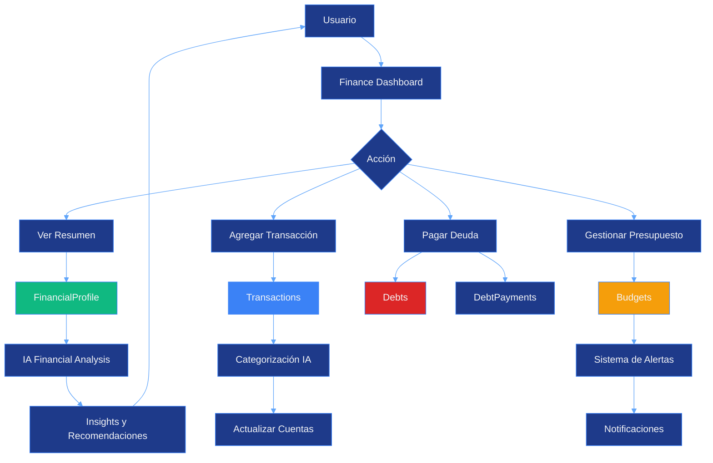
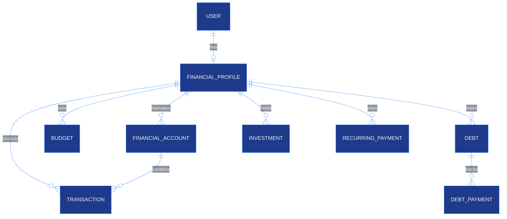

# Finance Management Module

## Descripción General

El módulo de gestión financiera permite a los usuarios llevar un control completo de sus finanzas personales, incluyendo cuentas bancarias, transacciones, presupuestos, deudas, inversiones y pagos recurrentes. Incluye análisis inteligente potenciado por IA para proporcionar insights y recomendaciones financieras.

---

## ⚠️ ESTADO DEL MÓDULO

**Estado Actual:** PLANIFICADO / EN DESARROLLO

- ✅ Schema de base de datos completo y migrado
- ✅ Modelos de Prisma definidos
- 🚧 API endpoints (pendiente)
- 🚧 Interfaz de usuario (pendiente)
- 🚧 Integración con IA para análisis (pendiente)
- 🚧 Sistema de alertas de presupuesto (pendiente)
- 🚧 Recordatorios de pagos (pendiente)

---

## Características Principales

- Perfil financiero personalizado
- Gestión de múltiples cuentas (corriente, ahorro, tarjetas de crédito, inversiones)
- Registro de transacciones con categorización
- Presupuestos con alertas automáticas
- Gestión de deudas con estrategias de pago
- Tracking de inversiones
- Pagos recurrentes (suscripciones, servicios)
- Análisis financiero con IA
- Reportes y gráficos de tendencias
- Proyecciones futuras
- Exportación de datos (CSV, Excel, PDF)
- Encriptación de datos financieros sensibles

---

## Arquitectura del Módulo

### Flujo de Datos



---

## Base de Datos

### 1. FinancialProfile

Perfil financiero del usuario.

```sql
CREATE TABLE financial_profiles (
  id VARCHAR PRIMARY KEY DEFAULT uuid(),
  userId VARCHAR UNIQUE REFERENCES users(id) ON DELETE CASCADE,

  currency VARCHAR DEFAULT 'MXN',
  fiscalYear VARCHAR DEFAULT 'calendar',  -- 'calendar' o 'fiscal'

  -- Metas financieras
  financialGoals JSONB,

  -- Análisis generado por IA
  aiAnalysis JSONB,

  createdAt TIMESTAMP DEFAULT NOW(),
  updatedAt TIMESTAMP DEFAULT NOW()
);
```

**Estructura de financialGoals:**
```json
{
  "goals": [
    {
      "id": "uuid",
      "name": "Fondo de emergencia",
      "type": "savings",
      "targetAmount": 50000,
      "currentAmount": 15000,
      "deadline": "2025-12-31",
      "priority": "high"
    },
    {
      "id": "uuid",
      "name": "Viaje a Europa",
      "type": "vacation",
      "targetAmount": 80000,
      "currentAmount": 5000,
      "deadline": "2026-06-30",
      "priority": "medium"
    }
  ]
}
```

### 2. FinancialAccount

Cuentas financieras del usuario.

```sql
CREATE TABLE financial_accounts (
  id VARCHAR PRIMARY KEY DEFAULT uuid(),
  financialProfileId VARCHAR REFERENCES financial_profiles(id) ON DELETE CASCADE,

  name VARCHAR NOT NULL,
  type VARCHAR NOT NULL,              -- "checking", "savings", "credit", "investment"
  institution VARCHAR,

  balance DECIMAL(15, 2) NOT NULL,
  currency VARCHAR DEFAULT 'MXN',

  lastSyncDate TIMESTAMP,
  isActive BOOLEAN DEFAULT true,

  -- Para tarjetas de crédito
  creditLimit DECIMAL(15, 2),
  availableCredit DECIMAL(15, 2),
  closingDate INTEGER,                -- Día del mes (1-31)
  paymentDueDate INTEGER,             -- Día del mes (1-31)

  notes TEXT,

  createdAt TIMESTAMP DEFAULT NOW(),
  updatedAt TIMESTAMP DEFAULT NOW()
);

CREATE INDEX idx_financial_accounts_profile ON financial_accounts(financialProfileId);
```

### 3. Transaction

Transacciones financieras.

```sql
CREATE TABLE transactions (
  id VARCHAR PRIMARY KEY DEFAULT uuid(),
  financialProfileId VARCHAR REFERENCES financial_profiles(id) ON DELETE CASCADE,
  accountId VARCHAR REFERENCES financial_accounts(id) ON DELETE SET NULL,

  date TIMESTAMP NOT NULL,
  description VARCHAR NOT NULL,
  amount DECIMAL(15, 2) NOT NULL,
  type VARCHAR NOT NULL,              -- "income", "expense", "transfer"

  category VARCHAR NOT NULL,
  subcategory VARCHAR,
  tags JSONB,

  -- Para transferencias
  fromAccountId VARCHAR,
  toAccountId VARCHAR,

  isRecurring BOOLEAN DEFAULT false,
  recurringPaymentId VARCHAR,

  notes TEXT,
  receipt VARCHAR,                    -- URL del comprobante

  createdAt TIMESTAMP DEFAULT NOW(),
  updatedAt TIMESTAMP DEFAULT NOW()
);

CREATE INDEX idx_transactions_profile_date ON transactions(financialProfileId, date);
CREATE INDEX idx_transactions_category_date ON transactions(category, date);
```

**Categorías Predefinidas:**
```typescript
const TRANSACTION_CATEGORIES = {
  INCOME: {
    SALARY: "Salario",
    FREELANCE: "Freelance",
    INVESTMENT: "Inversiones",
    OTHER: "Otros ingresos",
  },
  EXPENSE: {
    FOOD: "Alimentos",
    TRANSPORT: "Transporte",
    HOUSING: "Vivienda",
    UTILITIES: "Servicios",
    ENTERTAINMENT: "Entretenimiento",
    HEALTH: "Salud",
    EDUCATION: "Educación",
    SHOPPING: "Compras",
    DEBT_PAYMENT: "Pago de deudas",
    SAVINGS: "Ahorros",
    OTHER: "Otros gastos",
  },
};
```

### 4. Budget

Presupuestos.

```sql
CREATE TABLE budgets (
  id VARCHAR PRIMARY KEY DEFAULT uuid(),
  financialProfileId VARCHAR REFERENCES financial_profiles(id) ON DELETE CASCADE,

  name VARCHAR NOT NULL,
  category VARCHAR NOT NULL,
  amount DECIMAL(15, 2) NOT NULL,
  period VARCHAR DEFAULT 'monthly',   -- "weekly", "monthly", "yearly"

  startDate TIMESTAMP NOT NULL,
  endDate TIMESTAMP,

  alertThreshold INTEGER DEFAULT 80,  -- Porcentaje para alertar
  alertSent BOOLEAN DEFAULT false,

  isActive BOOLEAN DEFAULT true,

  createdAt TIMESTAMP DEFAULT NOW(),
  updatedAt TIMESTAMP DEFAULT NOW()
);

CREATE INDEX idx_budgets_profile ON budgets(financialProfileId);
```

### 5. Debt

Deudas.

```sql
CREATE TABLE debts (
  id VARCHAR PRIMARY KEY DEFAULT uuid(),
  financialProfileId VARCHAR REFERENCES financial_profiles(id) ON DELETE CASCADE,

  name VARCHAR NOT NULL,
  type VARCHAR NOT NULL,              -- "credit_card", "loan", "mortgage", "personal"

  principal DECIMAL(15, 2) NOT NULL,  -- Monto original
  balance DECIMAL(15, 2) NOT NULL,    -- Saldo actual
  interestRate DECIMAL(5, 2) NOT NULL,

  monthlyPayment DECIMAL(15, 2) NOT NULL,
  minimumPayment DECIMAL(15, 2),

  startDate TIMESTAMP NOT NULL,
  maturityDate TIMESTAMP,
  paymentDueDay INTEGER NOT NULL,     -- Día del mes (1-31)

  creditor VARCHAR NOT NULL,
  accountNumber VARCHAR,

  status VARCHAR DEFAULT 'active',    -- "active", "paid_off", "defaulted"
  payoffStrategy VARCHAR,             -- "avalanche", "snowball", "custom"
  priority INTEGER DEFAULT 1,

  notes TEXT,

  createdAt TIMESTAMP DEFAULT NOW(),
  updatedAt TIMESTAMP DEFAULT NOW()
);

CREATE INDEX idx_debts_profile ON debts(financialProfileId);
```

### 6. DebtPayment

Pagos de deudas.

```sql
CREATE TABLE debt_payments (
  id VARCHAR PRIMARY KEY DEFAULT uuid(),
  debtId VARCHAR REFERENCES debts(id) ON DELETE CASCADE,

  date TIMESTAMP NOT NULL,
  amount DECIMAL(15, 2) NOT NULL,
  principalPaid DECIMAL(15, 2) NOT NULL,
  interestPaid DECIMAL(15, 2) NOT NULL,

  notes VARCHAR,

  createdAt TIMESTAMP DEFAULT NOW()
);

CREATE INDEX idx_debt_payments_debt_date ON debt_payments(debtId, date);
```

### 7. Investment

Inversiones.

```sql
CREATE TABLE investments (
  id VARCHAR PRIMARY KEY DEFAULT uuid(),
  financialProfileId VARCHAR REFERENCES financial_profiles(id) ON DELETE CASCADE,

  name VARCHAR NOT NULL,
  type VARCHAR NOT NULL,              -- "stock", "bond", "mutual_fund", "etf", "crypto", "real_estate"
  symbol VARCHAR,                     -- Ticker symbol

  quantity DECIMAL(20, 8),            -- Para acciones, crypto, etc.
  purchasePrice DECIMAL(15, 2) NOT NULL,
  currentPrice DECIMAL(15, 2),
  currentValue DECIMAL(15, 2),

  purchaseDate TIMESTAMP NOT NULL,
  platform VARCHAR,                   -- "GBM", "Robinhood", etc.

  returns DECIMAL(15, 2),             -- Ganancia/pérdida en monto
  returnsPercentage DECIMAL(5, 2),    -- Ganancia/pérdida en %

  notes TEXT,

  createdAt TIMESTAMP DEFAULT NOW(),
  updatedAt TIMESTAMP DEFAULT NOW()
);

CREATE INDEX idx_investments_profile ON investments(financialProfileId);
```

### 8. RecurringPayment

Pagos recurrentes (suscripciones, servicios).

```sql
CREATE TABLE recurring_payments (
  id VARCHAR PRIMARY KEY DEFAULT uuid(),
  financialProfileId VARCHAR REFERENCES financial_profiles(id) ON DELETE CASCADE,

  name VARCHAR NOT NULL,
  amount DECIMAL(15, 2) NOT NULL,
  frequency VARCHAR NOT NULL,         -- "daily", "weekly", "monthly", "yearly"
  category VARCHAR NOT NULL,

  nextDueDate TIMESTAMP NOT NULL,
  dayOfMonth INTEGER,                 -- Para mensuales
  dayOfWeek INTEGER,                  -- Para semanales

  autoDebit BOOLEAN DEFAULT false,
  accountId VARCHAR,

  startDate TIMESTAMP NOT NULL,
  endDate TIMESTAMP,

  isActive BOOLEAN DEFAULT true,
  reminderEnabled BOOLEAN DEFAULT true,
  reminderDaysBefore INTEGER DEFAULT 3,

  notes TEXT,

  createdAt TIMESTAMP DEFAULT NOW(),
  updatedAt TIMESTAMP DEFAULT NOW()
);

CREATE INDEX idx_recurring_payments_profile_next ON recurring_payments(financialProfileId, nextDueDate);
```

### Diagrama ER



---

## API Endpoints (Planificados)

### Financial Profile

```typescript
// GET /api/finance/profile
// POST /api/finance/profile
// PATCH /api/finance/profile

// Response
{
  "profile": {
    "id": "uuid",
    "currency": "MXN",
    "financialGoals": [...],
    "aiAnalysis": {...}
  },
  "summary": {
    "totalAssets": 150000,
    "totalLiabilities": 50000,
    "netWorth": 100000,
    "monthlyIncome": 30000,
    "monthlyExpenses": 22000,
    "monthlySavings": 8000
  }
}
```

### Accounts

```typescript
// GET /api/finance/accounts
// POST /api/finance/accounts
// PATCH /api/finance/accounts/[id]
// DELETE /api/finance/accounts/[id]

// Response
{
  "accounts": [
    {
      "id": "uuid",
      "name": "Cuenta de Cheques",
      "type": "checking",
      "institution": "BBVA",
      "balance": 25000,
      "isActive": true
    },
    {
      "id": "uuid",
      "name": "Tarjeta Oro",
      "type": "credit",
      "institution": "Citibanamex",
      "balance": -5000,
      "creditLimit": 50000,
      "availableCredit": 45000
    }
  ]
}
```

### Transactions

```typescript
// GET /api/finance/transactions
// POST /api/finance/transactions
// PATCH /api/finance/transactions/[id]
// DELETE /api/finance/transactions/[id]

// POST /api/finance/transactions
{
  "date": "2025-10-16",
  "description": "Supermercado",
  "amount": 1250.50,
  "type": "expense",
  "category": "FOOD",
  "accountId": "account-uuid",
  "notes": "Compra mensual"
}

// GET /api/finance/transactions?from=2025-10-01&to=2025-10-16&category=FOOD
```

### Budgets

```typescript
// GET /api/finance/budgets
// POST /api/finance/budgets
// PATCH /api/finance/budgets/[id]
// DELETE /api/finance/budgets/[id]

// GET /api/finance/budgets/[id]/status
{
  "budget": {
    "name": "Alimentos",
    "amount": 5000,
    "period": "monthly"
  },
  "spent": 3250.50,
  "remaining": 1749.50,
  "percentage": 65,
  "status": "on_track"  // "on_track", "warning", "exceeded"
}
```

### Debts

```typescript
// GET /api/finance/debts
// POST /api/finance/debts
// PATCH /api/finance/debts/[id]
// DELETE /api/finance/debts/[id]

// POST /api/finance/debts/[id]/payment
{
  "date": "2025-10-16",
  "amount": 1500,
  "principalPaid": 1200,
  "interestPaid": 300
}

// GET /api/finance/debts/[id]/payoff-plan
{
  "strategy": "avalanche",
  "monthsToPayoff": 24,
  "totalInterest": 3500,
  "projectedPayoffDate": "2027-10-16",
  "monthlyPayments": [
    { "month": 1, "payment": 1500, "principal": 1200, "interest": 300, "balance": 28800 },
    { "month": 2, "payment": 1500, "principal": 1215, "interest": 285, "balance": 27585 }
  ]
}
```

---

## Interfaz de Usuario (Planificada)

### Dashboard Financiero

```
┌─────────────────────────────────────────────────────────┐
│  Mis Finanzas                                           │
│─────────────────────────────────────────────────────────│
│  PATRIMONIO NETO                                        │
│  ┌──────────────────────────────────────┐              │
│  │  $100,000 MXN                        │              │
│  │  [Gráfico de dona: Activos vs Pasivos]              │
│  │  Activos: $150,000 │ Pasivos: $50,000              │
│  └──────────────────────────────────────┘              │
│─────────────────────────────────────────────────────────│
│  RESUMEN MENSUAL (Octubre 2025)                         │
│  ┌─────────────┐ ┌─────────────┐ ┌─────────────┐      │
│  │ $30,000     │ │ $22,000     │ │ $8,000      │      │
│  │ Ingresos    │ │ Gastos      │ │ Ahorros     │      │
│  └─────────────┘ └─────────────┘ └─────────────┘      │
│─────────────────────────────────────────────────────────│
│  CUENTAS                                                │
│  ├─ Cuenta Cheques (BBVA)        $25,000.00 ✓         │
│  ├─ Ahorros (BBVA)               $50,000.00 ✓         │
│  └─ Tarjeta Oro (Citi)          -$5,000.00  💳        │
│  [Ver todas] [Agregar cuenta]                          │
│─────────────────────────────────────────────────────────│
│  GASTOS POR CATEGORÍA (Este mes)                       │
│  [Gráfico de barras]                                    │
│  Alimentos:        $3,250 (65% del presupuesto)        │
│  Transporte:       $2,500 (83% del presupuesto) ⚠️     │
│  Entretenimiento:  $1,800 (60% del presupuesto)        │
│─────────────────────────────────────────────────────────│
│  PRÓXIMOS PAGOS                                         │
│  ├─ 20/10 - Netflix                    $199.00         │
│  ├─ 25/10 - Tarjeta Oro (pago mínimo)  $500.00        │
│  └─ 30/10 - Renta                      $8,000.00       │
└─────────────────────────────────────────────────────────┘
```

### Transacciones

```
┌─────────────────────────────────────────────────────────┐
│  Transacciones                          [+ Agregar]     │
│─────────────────────────────────────────────────────────│
│  Filtros:                                               │
│  [Todos ▼] [Todas las cuentas ▼] [Oct 2025 ▼]         │
│  [🔍 Buscar...]                                         │
│─────────────────────────────────────────────────────────│
│  Fecha     │ Descripción      │ Categoría │ Monto      │
│─────────────────────────────────────────────────────────│
│  16/10     │ Supermercado     │ Alimentos │ -$1,250.50 │
│  Cheques   │ Walmart          │           │            │
│─────────────────────────────────────────────────────────│
│  15/10     │ Salario          │ Ingreso   │ +$30,000.00│
│  Cheques   │ Empresa XYZ      │           │            │
│─────────────────────────────────────────────────────────│
│  14/10     │ Gasolina         │ Transport │ -$800.00   │
│  Tarjeta   │ Pemex            │           │            │
│─────────────────────────────────────────────────────────│
│  < Prev    1 2 3 4 5    Next >                          │
└─────────────────────────────────────────────────────────┘
```

### Presupuestos

```
┌─────────────────────────────────────────────────────────┐
│  Presupuestos - Octubre 2025            [+ Nuevo]       │
│─────────────────────────────────────────────────────────│
│  Alimentos                                              │
│  $3,250.50 / $5,000.00 (65%)                           │
│  [████████████████░░░░░░░░░░] ✓ En objetivo            │
│─────────────────────────────────────────────────────────│
│  Transporte                                             │
│  $2,500.00 / $3,000.00 (83%)                           │
│  [████████████████████░░░░░] ⚠️ Cerca del límite       │
│─────────────────────────────────────────────────────────│
│  Entretenimiento                                        │
│  $1,800.00 / $3,000.00 (60%)                           │
│  [████████████████░░░░░░░░░░] ✓ En objetivo            │
│─────────────────────────────────────────────────────────│
│  Servicios                                              │
│  $3,200.00 / $3,000.00 (107%)                          │
│  [█████████████████████████] ❌ Excedido                │
│─────────────────────────────────────────────────────────│
│  TOTAL: $10,750.50 / $14,000.00 (77%)                  │
└─────────────────────────────────────────────────────────┘
```

### Gestión de Deudas

```
┌─────────────────────────────────────────────────────────┐
│  Deudas                                 [+ Agregar]     │
│─────────────────────────────────────────────────────────│
│  RESUMEN                                                │
│  Deuda total: $50,000 │ Pago mensual: $3,500           │
│  Interés promedio: 18% │ Tiempo estimado: 18 meses     │
│─────────────────────────────────────────────────────────│
│  ESTRATEGIA RECOMENDADA: Avalanche (menor interés)     │
│  Ahorro potencial vs. mínimos: $8,500                  │
│─────────────────────────────────────────────────────────│
│  1. Tarjeta Oro (PRIORIDAD)                            │
│     Saldo: $30,000 │ Tasa: 24% │ Pago: $1,500/mes     │
│     [Ver plan] [Registrar pago]                        │
│─────────────────────────────────────────────────────────│
│  2. Préstamo Personal                                   │
│     Saldo: $20,000 │ Tasa: 12% │ Pago: $2,000/mes     │
│     [Ver plan] [Registrar pago]                        │
│─────────────────────────────────────────────────────────│
│  PROYECCIÓN DE PAGOS                                    │
│  [Gráfico de área mostrando reducción de deuda]        │
│  Fecha proyectada libre de deudas: Abril 2027          │
└─────────────────────────────────────────────────────────┘
```

### Inversiones

```
┌─────────────────────────────────────────────────────────┐
│  Inversiones                            [+ Agregar]     │
│─────────────────────────────────────────────────────────│
│  PORTFOLIO ACTUAL                                       │
│  Valor total: $75,000 │ Retorno: +15% (+$9,800)       │
│─────────────────────────────────────────────────────────│
│  AAPL - Apple Inc.                                     │
│  10 acciones │ Precio: $175.50 │ Valor: $1,755        │
│  Compra: $150.00 │ Retorno: +17% (+$255) 📈           │
│  [Ver detalles] [Vender]                               │
│─────────────────────────────────────────────────────────│
│  BTC - Bitcoin                                          │
│  0.5 BTC │ Precio: $42,000 │ Valor: $21,000           │
│  Compra: $35,000 │ Retorno: +20% (+$3,500) 📈         │
│  [Ver detalles] [Vender]                               │
│─────────────────────────────────────────────────────────│
│  CETES - GBM                                            │
│  Monto: $50,000 │ Tasa: 10.5% anual                   │
│  Rendimiento proyectado: $5,250 al año                 │
│  [Ver detalles] [Renovar]                              │
│─────────────────────────────────────────────────────────│
│  DISTRIBUCIÓN DEL PORTFOLIO                             │
│  [Gráfico de dona por tipo de inversión]               │
└─────────────────────────────────────────────────────────┘
```

---

## Integración con IA

### Análisis Financiero Automático

```typescript
async function generateFinancialAnalysis(userId: string) {
  const profile = await prisma.financialProfile.findUnique({
    where: { userId },
    include: {
      accounts: true,
      transactions: {
        where: {
          date: {
            gte: new Date(Date.now() - 90 * 24 * 60 * 60 * 1000), // 90 días
          },
        },
      },
      budgets: true,
      debts: true,
      investments: true,
    },
  });

  // Calcular métricas
  const metrics = {
    totalIncome: calculateTotalIncome(profile.transactions),
    totalExpenses: calculateTotalExpenses(profile.transactions),
    savingsRate: calculateSavingsRate(profile.transactions),
    debtToIncomeRatio: calculateDebtToIncome(profile),
    netWorth: calculateNetWorth(profile),
  };

  const prompt = `
    Analiza la siguiente información financiera y proporciona insights:

    Métricas:
    - Ingresos mensuales: ${metrics.totalIncome}
    - Gastos mensuales: ${metrics.totalExpenses}
    - Tasa de ahorro: ${metrics.savingsRate}%
    - Deuda/Ingreso: ${metrics.debtToIncomeRatio}%
    - Patrimonio neto: ${metrics.netWorth}

    Transacciones recientes (últimos 90 días):
    ${JSON.stringify(profile.transactions.slice(0, 20), null, 2)}

    Deudas actuales:
    ${JSON.stringify(profile.debts, null, 2)}

    Proporciona:
    1. Análisis de salud financiera (escala 1-10)
    2. Áreas de preocupación
    3. Oportunidades de ahorro
    4. Recomendaciones específicas y accionables
    5. Proyecciones a corto plazo (3 meses)

    Responde en formato JSON estructurado.
  `;

  const response = await generateAIResponse(prompt);

  const analysis = JSON.parse(response.content);

  // Guardar análisis
  await prisma.financialProfile.update({
    where: { userId },
    data: {
      aiAnalysis: {
        ...analysis,
        generatedAt: new Date(),
      },
    },
  });

  return analysis;
}
```

### Categorización Automática de Transacciones

```typescript
async function categorizeTransaction(
  description: string,
  amount: number
): Promise<string> {
  const prompt = `
    Categoriza la siguiente transacción:
    Descripción: "${description}"
    Monto: $${amount}

    Categorías disponibles:
    INCOME: SALARY, FREELANCE, INVESTMENT, OTHER
    EXPENSE: FOOD, TRANSPORT, HOUSING, UTILITIES, ENTERTAINMENT,
             HEALTH, EDUCATION, SHOPPING, DEBT_PAYMENT, SAVINGS, OTHER

    Responde solo con el nombre de la categoría (ej: "FOOD").
  `;

  const response = await generateAIResponse(prompt);

  return response.content.trim().toUpperCase();
}
```

### Recomendaciones de Ahorro

```typescript
async function generateSavingsRecommendations(userId: string) {
  const profile = await getFinancialProfile(userId);
  const transactions = await getRecentTransactions(userId, 90);

  const prompt = `
    Basándote en los siguientes gastos, sugiere formas específicas de ahorrar:

    Gastos por categoría (últimos 3 meses):
    ${JSON.stringify(categorizeExpenses(transactions), null, 2)}

    Presupuestos actuales:
    ${JSON.stringify(profile.budgets, null, 2)}

    Proporciona 5 recomendaciones específicas y realistas de ahorro,
    con el monto estimado que se podría ahorrar mensualmente.

    Formato JSON:
    {
      "recommendations": [
        {
          "category": "FOOD",
          "suggestion": "Cocinar en casa más seguido...",
          "estimatedSavings": 1500,
          "difficulty": "medium"
        }
      ]
    }
  `;

  const response = await generateAIResponse(prompt);

  return JSON.parse(response.content);
}
```

### Estrategia de Pago de Deudas

```typescript
async function calculateDebtPayoffStrategy(
  debts: Debt[],
  monthlyBudget: number,
  strategy: "avalanche" | "snowball"
): Promise<PayoffPlan> {
  if (strategy === "avalanche") {
    // Pagar primero deudas con mayor interés
    debts.sort((a, b) => b.interestRate - a.interestRate);
  } else if (strategy === "snowball") {
    // Pagar primero deudas con menor saldo
    debts.sort((a, b) => a.balance - b.balance);
  }

  const plan: PayoffPlan = {
    strategy,
    monthlyPayment: monthlyBudget,
    totalInterest: 0,
    monthsToPayoff: 0,
    projectedPayoffDate: new Date(),
    monthlySchedule: [],
  };

  let currentMonth = 0;
  let remainingDebts = [...debts];

  while (remainingDebts.length > 0) {
    currentMonth++;
    let remainingBudget = monthlyBudget;

    // Pagar mínimos en todas las deudas
    for (const debt of remainingDebts) {
      const minPayment = debt.minimumPayment || 0;
      const interest = (debt.balance * debt.interestRate) / 12 / 100;
      const principal = minPayment - interest;

      debt.balance -= principal;
      plan.totalInterest += interest;
      remainingBudget -= minPayment;
    }

    // Pagar extra en la deuda prioritaria
    const priorityDebt = remainingDebts[0];
    if (remainingBudget > 0) {
      const extraPayment = Math.min(remainingBudget, priorityDebt.balance);
      priorityDebt.balance -= extraPayment;
    }

    // Remover deudas pagadas
    remainingDebts = remainingDebts.filter((d) => d.balance > 0);

    plan.monthlySchedule.push({
      month: currentMonth,
      payment: monthlyBudget,
      debtsRemaining: remainingDebts.length,
    });
  }

  plan.monthsToPayoff = currentMonth;
  plan.projectedPayoffDate = new Date(
    Date.now() + currentMonth * 30 * 24 * 60 * 60 * 1000
  );

  return plan;
}
```

---

## Sistema de Alertas y Recordatorios

### Alertas de Presupuesto

```typescript
async function checkBudgetAlerts() {
  const budgets = await prisma.budget.findMany({
    where: {
      isActive: true,
      alertSent: false,
    },
    include: {
      financialProfile: {
        include: { user: true },
      },
    },
  });

  for (const budget of budgets) {
    const spent = await calculateSpentInBudget(budget);
    const percentage = (spent / budget.amount) * 100;

    if (percentage >= budget.alertThreshold) {
      await sendNotification(budget.financialProfile.user, {
        type: "BUDGET_ALERT",
        title: `Presupuesto de ${budget.category} al ${percentage.toFixed(0)}%`,
        body: `Has gastado $${spent} de $${budget.amount}`,
        budgetId: budget.id,
      });

      await prisma.budget.update({
        where: { id: budget.id },
        data: { alertSent: true },
      });
    }
  }
}
```

### Recordatorios de Pagos Recurrentes

```typescript
async function checkRecurringPaymentReminders() {
  const tomorrow = new Date(Date.now() + 24 * 60 * 60 * 1000);

  const payments = await prisma.recurringPayment.findMany({
    where: {
      isActive: true,
      reminderEnabled: true,
      nextDueDate: {
        lte: new Date(Date.now() + 3 * 24 * 60 * 60 * 1000), // 3 días antes
      },
    },
    include: {
      financialProfile: {
        include: { user: true },
      },
    },
  });

  for (const payment of payments) {
    await sendNotification(payment.financialProfile.user, {
      type: "PAYMENT_REMINDER",
      title: `Próximo pago: ${payment.name}`,
      body: `$${payment.amount} el ${formatDate(payment.nextDueDate)}`,
      paymentId: payment.id,
    });
  }
}
```

---

## Exportación de Datos

### Formatos Soportados

```typescript
// GET /api/finance/export?format=csv&from=2025-01-01&to=2025-12-31

enum ExportFormat {
  CSV = "csv",
  XLSX = "xlsx",
  JSON = "json",
  PDF = "pdf",
}

// Exportar transacciones
async function exportTransactions(
  userId: string,
  format: ExportFormat,
  filters: ExportFilters
) {
  const transactions = await prisma.transaction.findMany({
    where: {
      financialProfileId: filters.financialProfileId,
      date: {
        gte: filters.from,
        lte: filters.to,
      },
    },
    include: {
      account: true,
    },
  });

  switch (format) {
    case "csv":
      return generateCSV(transactions);
    case "xlsx":
      return generateExcel(transactions);
    case "json":
      return JSON.stringify(transactions, null, 2);
    case "pdf":
      return generatePDF(transactions);
  }
}
```

---

## Seguridad

### Encriptación de Datos Sensibles

Similar al módulo de Health, los datos financieros sensibles deben encriptarse:

```typescript
// Números de cuenta, información de tarjetas, etc.
const encryptedAccountNumber = encrypt(accountNumber);

await prisma.financialAccount.create({
  data: {
    name: "Tarjeta de Crédito",
    type: "credit",
    institution: "BBVA",
    balance: 0,
    accountNumber: encryptedAccountNumber,  // Encriptado
  },
});
```

---

## Estado del Módulo

### Completado ✅

- ✅ Schema de base de datos completo
- ✅ Modelos de Prisma definidos
- ✅ Diseño de arquitectura
- ✅ Definición de análisis con IA

### En Desarrollo 🚧

- 🚧 API endpoints
- 🚧 Interfaz de usuario
- 🚧 Sistema de alertas
- 🚧 Integración con IA

### Pendiente 📋

- 📋 Conectores con bancos (Open Banking)
- 📋 Sincronización automática de transacciones
- 📋 Reconocimiento de recibos (OCR)
- 📋 Gráficos avanzados y reportes
- 📋 Proyecciones de jubilación
- 📋 Calculadora de hipotecas
- 📋 Comparador de inversiones
- 📋 Tax planning (planeación fiscal)
- 📋 Multi-moneda con tipos de cambio automáticos
- 📋 Compartir acceso con contador/asesor financiero
- 📋 Webhooks para eventos financieros
- 📋 Integración con plataformas de inversión

---

**Última actualización:** 2025-10-16
**Estado:** PLANIFICADO - Schema completo, implementación pendiente
**Mantenido por:** cjhirashi@gmail.com
