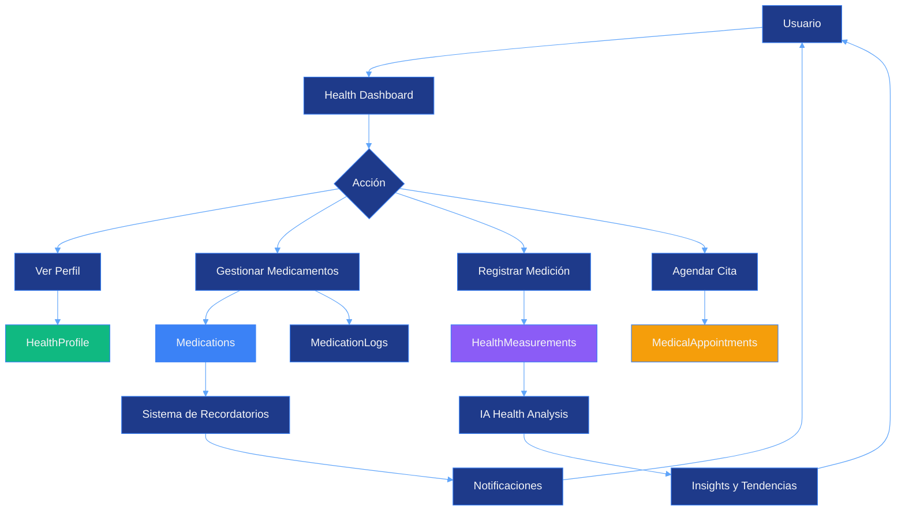
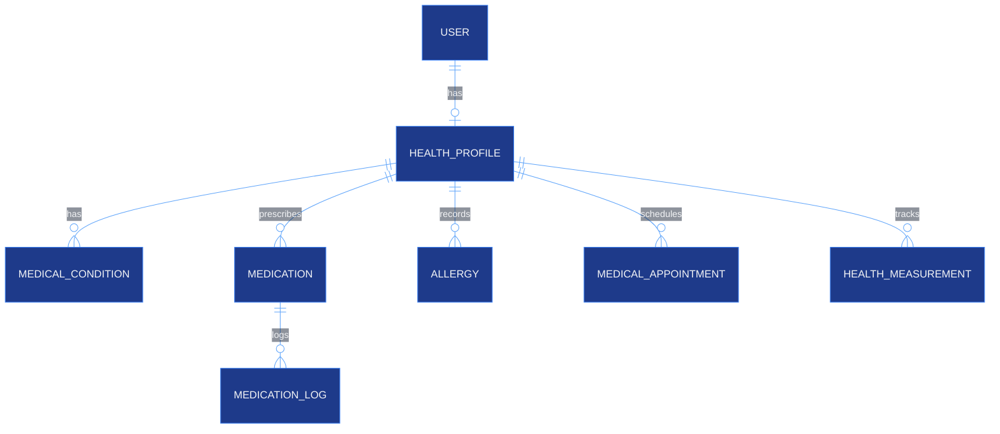

# Health Management Module

## Descripción General

El módulo de gestión de salud permite a los usuarios llevar un registro completo de su información médica personal, incluyendo medicamentos, citas médicas, alergias, condiciones médicas y mediciones de salud. Este módulo está diseñado con seguridad y privacidad en mente, con encriptación de datos sensibles.

---

## ⚠️ ESTADO DEL MÓDULO

**Estado Actual:** PLANIFICADO / EN DESARROLLO

- ✅ Schema de base de datos completo y migrado
- ✅ Modelos de Prisma definidos
- 🚧 API endpoints (pendiente)
- 🚧 Interfaz de usuario (pendiente)
- 🚧 Sistema de recordatorios (pendiente)
- 🚧 Integración con IA para análisis (pendiente)

---

## Características Principales

- Perfil de salud personalizado
- Registro de medicamentos con recordatorios automáticos
- Control de toma de medicamentos (adherencia)
- Gestión de citas médicas
- Registro de alergias (medicamentos, alimentos, ambientales)
- Condiciones médicas (crónicas, agudas, genéticas)
- Mediciones de salud (peso, presión arterial, glucosa, temperatura, etc.)
- Contactos de emergencia
- Información de seguros médicos
- Encriptación de datos sensibles
- Exportación de datos médicos (GDPR + portabilidad)

---

## Arquitectura del Módulo

### Flujo de Datos



---

## Base de Datos

### 1. HealthProfile

Perfil principal de salud del usuario.

```sql
CREATE TABLE health_profiles (
  id VARCHAR PRIMARY KEY DEFAULT uuid(),
  userId VARCHAR UNIQUE REFERENCES users(id) ON DELETE CASCADE,

  -- Información básica
  bloodType VARCHAR,               -- A+, A-, B+, B-, AB+, AB-, O+, O-
  height DECIMAL(5, 2),            -- cm
  weight DECIMAL(5, 2),            -- kg
  sex VARCHAR,                     -- M, F, Other

  -- Contactos de emergencia (JSON encriptado)
  emergencyContacts JSONB,

  -- Información de seguros
  insuranceInfo JSONB,

  -- Datos altamente sensibles (encriptados)
  encryptedData TEXT,

  createdAt TIMESTAMP DEFAULT NOW(),
  updatedAt TIMESTAMP DEFAULT NOW()
);
```

**Estructura de emergencyContacts:**
```json
{
  "contacts": [
    {
      "name": "María Pérez",
      "relationship": "Esposa",
      "phone": "+52 555-123-4567",
      "email": "maria@example.com",
      "isPrimary": true
    },
    {
      "name": "Dr. Juan García",
      "relationship": "Médico de cabecera",
      "phone": "+52 555-987-6543",
      "specialty": "Medicina General"
    }
  ]
}
```

**Estructura de insuranceInfo:**
```json
{
  "provider": "Seguro Popular",
  "policyNumber": "POL-123456",
  "groupNumber": "GRP-789",
  "validUntil": "2025-12-31",
  "coverage": ["Hospitalization", "Emergency", "Medications"]
}
```

### 2. MedicalCondition

Condiciones médicas del usuario.

```sql
CREATE TABLE medical_conditions (
  id VARCHAR PRIMARY KEY DEFAULT uuid(),
  healthProfileId VARCHAR REFERENCES health_profiles(id) ON DELETE CASCADE,

  name VARCHAR NOT NULL,
  type VARCHAR NOT NULL,           -- "crónica", "aguda", "genética"
  severity VARCHAR NOT NULL,       -- "leve", "moderada", "severa"
  diagnosedDate TIMESTAMP,
  diagnosedBy VARCHAR,
  status VARCHAR DEFAULT 'activa', -- "activa", "controlada", "en remisión"

  notes TEXT,
  treatment JSONB,                 -- Tratamiento actual

  createdAt TIMESTAMP DEFAULT NOW(),
  updatedAt TIMESTAMP DEFAULT NOW()
);

CREATE INDEX idx_medical_conditions_profile ON medical_conditions(healthProfileId);
```

### 3. Medication

Medicamentos del usuario.

```sql
CREATE TABLE medications (
  id VARCHAR PRIMARY KEY DEFAULT uuid(),
  healthProfileId VARCHAR REFERENCES health_profiles(id) ON DELETE CASCADE,

  name VARCHAR NOT NULL,
  genericName VARCHAR,
  dosage VARCHAR NOT NULL,         -- "500mg", "10ml"
  frequency VARCHAR NOT NULL,      -- "cada 8 horas", "2 veces al día"
  route VARCHAR NOT NULL,          -- "oral", "inyección", "tópica"

  prescribedBy VARCHAR,
  prescribedDate TIMESTAMP,
  startDate TIMESTAMP NOT NULL,
  endDate TIMESTAMP,

  purpose VARCHAR,
  sideEffects TEXT,
  interactions JSONB,              -- Interacciones con otros medicamentos

  -- Sistema de recordatorios
  reminderEnabled BOOLEAN DEFAULT false,
  reminderTimes JSONB,             -- ["08:00", "16:00", "24:00"]

  isActive BOOLEAN DEFAULT true,
  notes TEXT,

  createdAt TIMESTAMP DEFAULT NOW(),
  updatedAt TIMESTAMP DEFAULT NOW()
);

CREATE INDEX idx_medications_profile ON medications(healthProfileId);
CREATE INDEX idx_medications_active ON medications(isActive);
```

### 4. MedicationLog

Registro de toma de medicamentos (adherencia).

```sql
CREATE TABLE medication_logs (
  id VARCHAR PRIMARY KEY DEFAULT uuid(),
  medicationId VARCHAR REFERENCES medications(id) ON DELETE CASCADE,

  scheduledTime TIMESTAMP NOT NULL,
  takenTime TIMESTAMP,
  status VARCHAR NOT NULL,         -- "tomado", "omitido", "retrasado"
  notes VARCHAR,

  createdAt TIMESTAMP DEFAULT NOW()
);

CREATE INDEX idx_medication_logs_med_time ON medication_logs(medicationId, scheduledTime);
```

### 5. Allergy

Alergias del usuario.

```sql
CREATE TABLE allergies (
  id VARCHAR PRIMARY KEY DEFAULT uuid(),
  healthProfileId VARCHAR REFERENCES health_profiles(id) ON DELETE CASCADE,

  allergen VARCHAR NOT NULL,
  type VARCHAR NOT NULL,           -- "medicamento", "alimento", "ambiental"
  severity VARCHAR NOT NULL,       -- "leve", "moderada", "severa", "anafiláctica"
  reaction TEXT,                   -- Descripción de la reacción
  diagnosedDate TIMESTAMP,

  notes TEXT,

  createdAt TIMESTAMP DEFAULT NOW()
);

CREATE INDEX idx_allergies_profile ON allergies(healthProfileId);
```

### 6. MedicalAppointment

Citas médicas.

```sql
CREATE TABLE medical_appointments (
  id VARCHAR PRIMARY KEY DEFAULT uuid(),
  healthProfileId VARCHAR REFERENCES health_profiles(id) ON DELETE CASCADE,

  type VARCHAR NOT NULL,           -- "consulta", "revisión", "cirugía", "análisis"
  specialty VARCHAR,               -- "cardiología", "dermatología", etc.
  doctorName VARCHAR,
  facility VARCHAR,                -- Hospital, clínica

  scheduledDate TIMESTAMP NOT NULL,
  duration INTEGER,                -- minutos

  status VARCHAR DEFAULT 'programada', -- "programada", "completada", "cancelada"
  reason TEXT,
  notes TEXT,
  results TEXT,                    -- Resultados de la cita

  -- Recordatorios
  reminderSent BOOLEAN DEFAULT false,
  reminderTime TIMESTAMP,

  createdAt TIMESTAMP DEFAULT NOW(),
  updatedAt TIMESTAMP DEFAULT NOW()
);

CREATE INDEX idx_appointments_profile_date ON medical_appointments(healthProfileId, scheduledDate);
```

### 7. HealthMeasurement

Mediciones de salud.

```sql
CREATE TABLE health_measurements (
  id VARCHAR PRIMARY KEY DEFAULT uuid(),
  healthProfileId VARCHAR REFERENCES health_profiles(id) ON DELETE CASCADE,

  type VARCHAR NOT NULL,           -- "weight", "blood_pressure", "glucose", etc.
  value JSONB NOT NULL,            -- Estructura flexible
  measuredAt TIMESTAMP DEFAULT NOW(),
  notes VARCHAR,

  createdAt TIMESTAMP DEFAULT NOW()
);

CREATE INDEX idx_measurements_profile_type_date ON health_measurements(healthProfileId, type, measuredAt);
```

**Estructuras de value por tipo:**

```typescript
// Weight
{
  "weight": 75.5,
  "unit": "kg"
}

// Blood Pressure
{
  "systolic": 120,
  "diastolic": 80,
  "unit": "mmHg",
  "pulse": 72
}

// Glucose
{
  "glucose": 95,
  "unit": "mg/dL",
  "context": "fasting"  // "fasting", "postprandial", "random"
}

// Temperature
{
  "temperature": 36.5,
  "unit": "celsius"
}

// Oxygen Saturation
{
  "saturation": 98,
  "unit": "%"
}
```

### Diagrama ER



---

## API Endpoints (Planificados)

### Health Profile

```typescript
// GET /api/health/profile
// POST /api/health/profile
// PATCH /api/health/profile

// Response
{
  "profile": {
    "id": "uuid",
    "bloodType": "O+",
    "height": 175,
    "weight": 75.5,
    "sex": "M",
    "emergencyContacts": [...],
    "insuranceInfo": {...}
  }
}
```

### Medications

```typescript
// GET /api/health/medications
// POST /api/health/medications
// PATCH /api/health/medications/[id]
// DELETE /api/health/medications/[id]

// POST /api/health/medications/[id]/log
{
  "takenTime": "2025-10-16T08:15:00Z",
  "status": "tomado",
  "notes": "Con alimentos"
}
```

### Medical Appointments

```typescript
// GET /api/health/appointments
// POST /api/health/appointments
// PATCH /api/health/appointments/[id]
// DELETE /api/health/appointments/[id]

// GET /api/health/appointments/upcoming
// GET /api/health/appointments/history
```

### Health Measurements

```typescript
// POST /api/health/measurements
{
  "type": "blood_pressure",
  "value": {
    "systolic": 120,
    "diastolic": 80,
    "pulse": 72
  },
  "measuredAt": "2025-10-16T09:00:00Z",
  "notes": "En reposo"
}

// GET /api/health/measurements?type=weight&from=2025-01-01&to=2025-10-16
```

---

## Interfaz de Usuario (Planificada)

### Dashboard de Salud

```
┌─────────────────────────────────────────────────────────┐
│  Mi Salud                                               │
│─────────────────────────────────────────────────────────│
│  RESUMEN                                                │
│  ┌──────────────┐ ┌──────────────┐ ┌──────────────┐   │
│  │ 75.5 kg      │ │ 120/80       │ │ O+           │   │
│  │ Peso         │ │ Presión      │ │ Tipo sangre  │   │
│  └──────────────┘ └──────────────┘ └──────────────┘   │
│─────────────────────────────────────────────────────────│
│  MEDICAMENTOS ACTIVOS (3)                              │
│  ├─ Aspirina 500mg                   [✓] 08:00        │
│  ├─ Metformina 850mg                 [⏰] 12:00       │
│  └─ Losartán 50mg                    [  ] 20:00       │
│  [Ver todos] [Agregar]                                 │
│─────────────────────────────────────────────────────────│
│  PRÓXIMAS CITAS                                         │
│  ├─ 18/10 10:00 - Dr. García (Cardiología)            │
│  └─ 25/10 15:30 - Laboratorio (Análisis de sangre)    │
│  [Ver todas] [Agendar]                                 │
│─────────────────────────────────────────────────────────│
│  MEDICIONES RECIENTES                                   │
│  [Gráfico de tendencia de peso últimos 30 días]        │
│  [Registrar nueva medición]                            │
└─────────────────────────────────────────────────────────┘
```

### Gestión de Medicamentos

```
┌─────────────────────────────────────────────────────────┐
│  Medicamentos                          [+ Agregar]      │
│─────────────────────────────────────────────────────────│
│  ACTIVOS (3)                                            │
│  ┌─────────────────────────────────────────────────┐   │
│  │ Aspirina 500mg                                  │   │
│  │ Cada 8 horas │ Oral │ Desde: 15/01/2025        │   │
│  │ Próxima toma: 12:00                             │   │
│  │ [Registrar toma] [Editar] [Desactivar]         │   │
│  └─────────────────────────────────────────────────┘   │
│─────────────────────────────────────────────────────────│
│  HISTORIAL DE ADHERENCIA (Última semana)               │
│  L  M  M  J  V  S  D                                    │
│  ✓  ✓  ✓  ✗  ✓  ✓  ✓   Aspirina                       │
│  ✓  ✓  ✓  ✓  ✓  ✓  ✓   Metformina                     │
│  ✓  ✓  ⏰ -  -  -  -   Losartán                        │
│─────────────────────────────────────────────────────────│
│  Adherencia general: 92%                                │
└─────────────────────────────────────────────────────────┘
```

### Registro de Mediciones

```
┌─────────────────────────────────────────────────────────┐
│  Nueva Medición                                 [✕]     │
│─────────────────────────────────────────────────────────│
│  Tipo de medición:                                      │
│  [Peso ▼]                                               │
│    - Peso                                               │
│    - Presión arterial                                   │
│    - Glucosa                                            │
│    - Temperatura                                        │
│    - Saturación de oxígeno                              │
│─────────────────────────────────────────────────────────│
│  Peso:                                                  │
│  [75.5      ] kg                                        │
│─────────────────────────────────────────────────────────│
│  Fecha y hora:                                          │
│  [16/10/2025 09:00]                                     │
│─────────────────────────────────────────────────────────│
│  Notas (opcional):                                      │
│  [En ayunas, después de ejercicio]                      │
│─────────────────────────────────────────────────────────│
│  [Cancelar]                    [Guardar medición]       │
└─────────────────────────────────────────────────────────┘
```

---

## Sistema de Recordatorios

### Estructura de Recordatorios

```typescript
interface MedicationReminder {
  medicationId: string;
  times: string[];  // ["08:00", "16:00", "24:00"]
  enabled: boolean;
  userId: string;
}

interface AppointmentReminder {
  appointmentId: string;
  reminderTime: Date;  // 24 horas antes por defecto
  sent: boolean;
}
```

### Lógica de Recordatorios

```typescript
// Cron job que se ejecuta cada hora
async function checkMedicationReminders() {
  const now = new Date();
  const currentHour = now.getHours();
  const currentMinute = now.getMinutes();

  // Buscar medicamentos con recordatorio para esta hora
  const medications = await prisma.medication.findMany({
    where: {
      reminderEnabled: true,
      isActive: true,
      reminderTimes: {
        path: "$[*]",
        array_contains: `${currentHour}:${currentMinute.toString().padStart(2, '0')}`,
      },
    },
    include: {
      healthProfile: {
        include: {
          user: true,
        },
      },
    },
  });

  // Enviar notificaciones
  for (const med of medications) {
    await sendNotification(med.healthProfile.user, {
      type: "MEDICATION_REMINDER",
      title: `Hora de tomar ${med.name}`,
      body: `${med.dosage} - ${med.frequency}`,
      medicationId: med.id,
    });
  }
}
```

---

## Seguridad y Privacidad

### Encriptación de Datos Sensibles

```typescript
import crypto from "crypto";

const ENCRYPTION_KEY = process.env.HEALTH_ENCRYPTION_KEY; // 32 bytes
const IV_LENGTH = 16;

function encrypt(text: string): string {
  const iv = crypto.randomBytes(IV_LENGTH);
  const cipher = crypto.createCipheriv(
    "aes-256-cbc",
    Buffer.from(ENCRYPTION_KEY),
    iv
  );
  let encrypted = cipher.update(text, "utf8", "hex");
  encrypted += cipher.final("hex");
  return iv.toString("hex") + ":" + encrypted;
}

function decrypt(text: string): string {
  const parts = text.split(":");
  const iv = Buffer.from(parts[0], "hex");
  const encryptedText = parts[1];
  const decipher = crypto.createDecipheriv(
    "aes-256-cbc",
    Buffer.from(ENCRYPTION_KEY),
    iv
  );
  let decrypted = decipher.update(encryptedText, "hex", "utf8");
  decrypted += decipher.final("utf8");
  return decrypted;
}

// Uso en datos de emergencia
const emergencyContacts = {
  contacts: [/* ... */]
};

await prisma.healthProfile.create({
  data: {
    userId: user.id,
    emergencyContacts: encrypt(JSON.stringify(emergencyContacts)),
  },
});
```

### Compliance

**HIPAA (Health Insurance Portability and Accountability Act):**
- Encriptación de datos en reposo y en tránsito
- Control de acceso estricto
- Audit logging de accesos a datos de salud
- Políticas de retención de datos
- Derecho al acceso y portabilidad

**GDPR:**
- Consentimiento explícito para procesar datos de salud
- Derecho al olvido (eliminación completa)
- Portabilidad de datos
- Minimización de datos

---

## Integración con IA

### Análisis de Salud (Futuro)

```typescript
async function generateHealthInsights(userId: string) {
  const profile = await prisma.healthProfile.findUnique({
    where: { userId },
    include: {
      measurements: {
        where: {
          measuredAt: {
            gte: new Date(Date.now() - 90 * 24 * 60 * 60 * 1000), // 90 días
          },
        },
      },
      medications: true,
      conditions: true,
    },
  });

  const prompt = `
    Analiza el siguiente perfil de salud y proporciona insights:

    Tipo de sangre: ${profile.bloodType}
    Peso actual: ${profile.weight} kg
    Altura: ${profile.height} cm

    Mediciones recientes:
    ${JSON.stringify(profile.measurements, null, 2)}

    Medicamentos actuales:
    ${JSON.stringify(profile.medications, null, 2)}

    Condiciones médicas:
    ${JSON.stringify(profile.conditions, null, 2)}

    Proporciona:
    1. Análisis de tendencias
    2. Posibles áreas de preocupación
    3. Recomendaciones generales
    4. Sugerencias de seguimiento

    Nota: No proporciones diagnósticos médicos, solo insights generales.
  `;

  const response = await generateAIResponse(prompt);

  return {
    insights: response.content,
    generatedAt: new Date(),
  };
}
```

### Interacciones de Medicamentos

```typescript
async function checkMedicationInteractions(medicationIds: string[]) {
  const medications = await prisma.medication.findMany({
    where: {
      id: {
        in: medicationIds,
      },
    },
  });

  const prompt = `
    Verifica posibles interacciones entre estos medicamentos:

    ${medications.map((m) => `${m.name} (${m.genericName}) - ${m.dosage}`).join("\n")}

    Proporciona:
    1. Interacciones conocidas
    2. Nivel de severidad (leve, moderada, severa)
    3. Recomendaciones

    Responde en formato JSON.
  `;

  const response = await generateAIResponse(prompt);

  return JSON.parse(response.content);
}
```

---

## Exportación de Datos Médicos

### Formato de Exportación

```typescript
// GET /api/health/export
{
  "exportedAt": "2025-10-16T10:00:00Z",
  "user": {
    "name": "John Doe",
    "email": "john@example.com"
  },
  "healthProfile": {
    "bloodType": "O+",
    "height": 175,
    "weight": 75.5,
    "sex": "M",
    "emergencyContacts": [...],
    "insuranceInfo": {...}
  },
  "medications": [
    {
      "name": "Aspirina",
      "dosage": "500mg",
      "frequency": "cada 8 horas",
      "startDate": "2025-01-15",
      "isActive": true
    }
  ],
  "appointments": [...],
  "measurements": [...],
  "conditions": [...],
  "allergies": [...]
}
```

---

## Estado del Módulo

### Completado ✅

- ✅ Schema de base de datos
- ✅ Modelos de Prisma
- ✅ Diseño de arquitectura
- ✅ Definición de seguridad

### En Desarrollo 🚧

- 🚧 API endpoints
- 🚧 Interfaz de usuario
- 🚧 Sistema de recordatorios
- 🚧 Encriptación de datos

### Pendiente 📋

- 📋 Integración con IA para análisis
- 📋 Verificación de interacciones de medicamentos
- 📋 Gráficos de tendencias
- 📋 Exportación de datos
- 📋 Integración con wearables (Apple Health, Google Fit)
- 📋 Compartir datos con médicos
- 📋 Historial médico completo
- 📋 Recordatorios por notificación push
- 📋 Escaneo de recetas médicas (OCR)

---

**Última actualización:** 2025-10-16
**Estado:** PLANIFICADO - Schema completo, implementación pendiente
**Mantenido por:** cjhirashi@gmail.com
