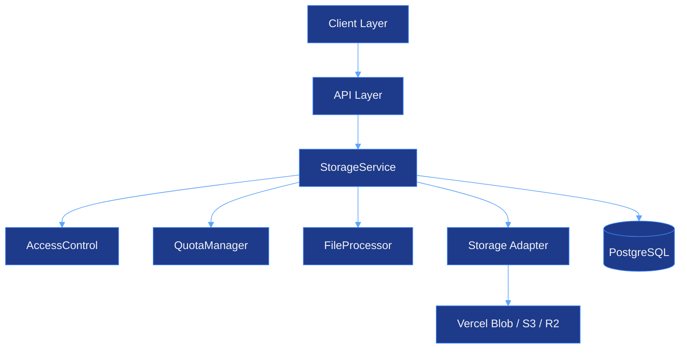

# Storage System - CJHIRASHI Agents

## Estado: 🚧 PLANIFICADO (Diseño completo, implementación pendiente)

**Prioridad**: CRÍTICA (Dependencia de Theme Module y otros módulos futuros)

---

## Tabla de Contenidos

1. [Descripción General](#descripción-general)
2. [Arquitectura](#arquitectura)
3. [Base de Datos](#base-de-datos)
4. [API Endpoints](#api-endpoints)
5. [Servicios y Componentes](#servicios-y-componentes)
6. [Seguridad](#seguridad)
7. [Casos de Uso](#casos-de-uso)
8. [Implementación](#implementación)
9. [Costos](#costos)
10. [Referencias](#referencias)

---

## Descripción General

Sistema integral de almacenamiento de archivos que proporciona upload, download, gestión y seguridad para todos los recursos del sistema (imágenes, documentos, backups, etc.).

### Características Principales

- ✅ **Upload/Download** de archivos
- ✅ **Múltiples proveedores** (Vercel Blob, Local, S3, R2)
- ✅ **Optimización automática** de imágenes (WebP, compression, thumbnails)
- ✅ **Control de acceso** granular (PUBLIC, PRIVATE, ROLE_BASED, USER_BASED)
- ✅ **Quota management** por usuario/tier
- ✅ **Encriptación** para datos sensibles (Health, Finance)
- ✅ **Versionamiento** de archivos
- ✅ **Shared links** con expiración y password
- ✅ **Audit logs** completos
- ✅ **Virus scanning** (opcional)
- ✅ **CDN integration** para performance
- ✅ **HIPAA/GDPR compliance**

### Casos de Uso Soportados

| Módulo | Uso | Requerimientos |
|--------|-----|----------------|
| **Theme** | Logos, favicons | Public, optimizados, CDN |
| **Users** | Avatares | Private, optimizados, thumbnails |
| **Support** | Attachments | Private, virus scan |
| **Agents** | Artifacts | Versioned, private |
| **Health** | Medical docs | Encrypted, HIPAA, audit |
| **Finance** | Receipts, invoices | Encrypted, private |
| **System** | Backups | Internal only, encrypted |
| **Temp** | Processing | TTL, auto-delete |

---

## Arquitectura

### Arquitectura de Alto Nivel



### Patrones de Diseño

1. **Adapter Pattern**: Abstracción de storage providers (Vercel Blob, Local, S3, R2)
2. **Factory Pattern**: Creación de adapters y processors
3. **Strategy Pattern**: Diferentes estrategias de procesamiento por tipo de archivo
4. **Repository Pattern**: Acceso a datos vía Prisma

### Componentes Principales

| Componente | Responsabilidad |
|------------|-----------------|
| **StorageService** | Orquestador principal, lógica de negocio |
| **StorageAdapter** | Interfaz para providers de storage |
| **FileProcessor** | Optimización y procesamiento de archivos |
| **AccessControl** | Validación de permisos de acceso |
| **QuotaManager** | Gestión de límites por usuario/tier |
| **FileEncryption** | Encriptación AES-256 para datos sensibles |

---

## Base de Datos

### Esquema Prisma

```prisma
// ═══════════════════════════════════════════════════════════
// STORAGE SYSTEM
// ═══════════════════════════════════════════════════════════

model StorageFile {
  id              String           @id @default(uuid())

  // Basic info
  filename        String
  storagePath     String           // Path in storage provider
  storageProvider StorageProvider  @default(VERCEL_BLOB)
  mimeType        String
  size            BigInt           // Bytes
  checksum        String           // SHA-256 hash

  // Organization
  folderId        String?
  folder          StorageFolder?   @relation(fields: [folderId], references: [id], onDelete: SetNull)

  // Ownership
  userId          String
  user            User             @relation(fields: [userId], references: [id], onDelete: Cascade)

  // Access control
  accessLevel     FileAccessLevel  @default(PRIVATE)
  allowedRoles    Json?            // Array of roles if role-based
  allowedUsers    Json?            // Array of user IDs if user-based

  // Metadata
  metadata        Json?            // EXIF, dimensions, duration, etc.
  tags            String[]

  // File type flags
  isImage         Boolean          @default(false)
  isVideo         Boolean          @default(false)
  isDocument      Boolean          @default(false)

  // Image/Video specific
  width           Int?
  height          Int?
  duration        Int?             // seconds
  thumbnailId     String?

  // Security
  encrypted       Boolean          @default(false)
  encryptionKey   String?          // Encrypted key reference
  virusScanned    Boolean          @default(false)
  scanResult      String?          // CLEAN, INFECTED, PENDING

  // Lifecycle
  expiresAt       DateTime?        // For temporary files
  deletedAt       DateTime?        // Soft delete

  // Usage context
  usageContext    FileUsageContext @default(OTHER)
  contextId       String?          // ID of related entity

  // Versioning
  versionNumber   Int              @default(1)
  parentVersionId String?
  parentVersion   StorageFile?     @relation("FileVersions", fields: [parentVersionId], references: [id])
  versions        StorageFile[]    @relation("FileVersions")

  // Relations
  accessLogs      FileAccessLog[]
  shares          FileShare[]

  createdAt       DateTime         @default(now())
  updatedAt       DateTime         @updatedAt

  @@index([userId])
  @@index([folderId])
  @@index([accessLevel])
  @@index([usageContext, contextId])
  @@index([expiresAt])
  @@index([createdAt])
  @@index([parentVersionId])
  @@map("storage_files")
}

enum StorageProvider {
  VERCEL_BLOB
  LOCAL
  AWS_S3
  CLOUDFLARE_R2
}

enum FileAccessLevel {
  PUBLIC           // Anyone (theme assets)
  AUTHENTICATED    // Any logged-in user
  PRIVATE          // Only owner
  ROLE_BASED       // Based on user roles
  USER_BASED       // Specific users only
  INTERNAL         // System only (backups)
}

enum FileUsageContext {
  THEME            // Theme assets
  AVATAR           // User avatars
  TICKET           // Support attachments
  ARTIFACT         // Agent files
  HEALTH           // Health documents (HIPAA)
  FINANCE          // Financial documents
  BACKUP           // System backups
  TEMP             // Temporary processing
  OTHER            // General purpose
}

model StorageFolder {
  id          String         @id @default(uuid())
  name        String
  path        String         // /folder1/subfolder2
  userId      String
  user        User           @relation(fields: [userId], references: [id], onDelete: Cascade)

  parentId    String?
  parent      StorageFolder? @relation("FolderHierarchy", fields: [parentId], references: [id])
  children    StorageFolder[] @relation("FolderHierarchy")

  files       StorageFile[]

  createdAt   DateTime       @default(now())
  updatedAt   DateTime       @updatedAt

  @@unique([userId, path])
  @@index([userId])
  @@index([parentId])
  @@map("storage_folders")
}

model StorageQuota {
  id            String   @id @default(uuid())
  userId        String   @unique
  user          User     @relation(fields: [userId], references: [id], onDelete: Cascade)

  // Limits (based on subscription tier)
  maxStorage    BigInt   // Bytes
  maxFileSize   BigInt   // Bytes
  maxFiles      Int

  // Current usage
  usedStorage   BigInt   @default(0)
  fileCount     Int      @default(0)

  // Alerts
  alertAt       Int      @default(80) // Percentage
  alertSent     Boolean  @default(false)

  createdAt     DateTime @default(now())
  updatedAt     DateTime @updatedAt

  @@map("storage_quotas")
}

model FileAccessLog {
  id          String      @id @default(uuid())
  fileId      String
  file        StorageFile @relation(fields: [fileId], references: [id], onDelete: Cascade)

  userId      String?
  action      String      // VIEW, DOWNLOAD, DELETE, SHARE
  ipAddress   String?
  userAgent   String?

  success     Boolean     @default(true)
  errorReason String?

  timestamp   DateTime    @default(now())

  @@index([fileId, timestamp])
  @@index([userId, timestamp])
  @@map("file_access_logs")
}

model FileShare {
  id          String       @id @default(uuid())
  fileId      String
  file        StorageFile  @relation(fields: [fileId], references: [id], onDelete: Cascade)

  token       String       @unique

  expiresAt   DateTime?
  maxAccess   Int?
  accessCount Int          @default(0)
  password    String?

  createdBy   String
  createdAt   DateTime     @default(now())

  @@index([fileId])
  @@index([token])
  @@index([expiresAt])
  @@map("file_shares")
}
```

### Quotas por Subscription Tier

| Tier | Max Storage | Max File Size | Max Files |
|------|-------------|---------------|-----------|
| **FREE** | 1 GB | 10 MB | 100 |
| **BASIC** | 10 GB | 50 MB | 1,000 |
| **PRO** | 100 GB | 100 MB | 10,000 |
| **ENTERPRISE** | 1 TB | 500 MB | 100,000 |
| **UNLIMITED** | ∞ | 1 GB | ∞ |

---

## API Endpoints

### POST `/api/storage/upload`
**Upload a file**

**Authentication:** Required
**Rate Limit:** 10 requests/min

**Request (FormData):**
```typescript
{
  file: File;
  folderId?: string;
  accessLevel?: FileAccessLevel;
  usageContext?: FileUsageContext;
  contextId?: string;
  tags?: string[];
  expiresIn?: number;  // seconds
}
```

**Response:**
```json
{
  "success": true,
  "file": {
    "id": "uuid",
    "filename": "document.pdf",
    "url": "https://blob.vercel-storage.com/...",
    "thumbnailUrl": "https://blob.vercel-storage.com/thumb_...",
    "size": 1048576,
    "mimeType": "application/pdf",
    "createdAt": "2025-01-16T..."
  }
}
```

---

### GET `/api/storage/[id]`
**Get file metadata**

**Authentication:** Required
**Authorization:** Based on file accessLevel

**Response:**
```json
{
  "success": true,
  "file": {
    "id": "uuid",
    "filename": "document.pdf",
    "size": 1048576,
    "mimeType": "application/pdf",
    "url": "https://...",
    "accessLevel": "PRIVATE",
    "usageContext": "TICKET",
    "metadata": { "pages": 5 },
    "tags": ["important"],
    "versionNumber": 1,
    "createdAt": "2025-01-16T...",
    "updatedAt": "2025-01-16T..."
  }
}
```

---

### GET `/api/storage/[id]/download`
**Download file**

**Authentication:** Optional (depends on accessLevel)
**Authorization:** Based on file accessLevel

**Query Params:**
- `token?: string` - For shared files
- `inline?: boolean` - Display vs download

**Response:** File stream

**Headers:**
```
Content-Type: [mime-type]
Content-Disposition: attachment; filename="[filename]"
Content-Length: [size]
Cache-Control: private, max-age=3600
```

---

### DELETE `/api/storage/[id]`
**Delete file**

**Authentication:** Required
**Authorization:** Owner or ADMIN

**Response:**
```json
{
  "success": true,
  "message": "File deleted successfully"
}
```

---

### GET `/api/storage/list`
**List files with filters**

**Authentication:** Required

**Query Params:**
```typescript
{
  folderId?: string;
  usageContext?: FileUsageContext;
  tags?: string;  // comma-separated
  search?: string;
  mimeType?: string;
  cursor?: string;  // pagination
  limit?: number;   // max 100
}
```

**Response:**
```json
{
  "success": true,
  "files": [
    { /* file metadata */ }
  ],
  "pagination": {
    "hasMore": true,
    "nextCursor": "uuid"
  },
  "totalSize": 1073741824,
  "totalCount": 150
}
```

---

### POST `/api/storage/[id]/share`
**Generate shareable link**

**Authentication:** Required
**Authorization:** Owner or ADMIN

**Request:**
```json
{
  "expiresIn": 604800,  // 7 days in seconds
  "maxAccess": 100,
  "password": "optional-password"
}
```

**Response:**
```json
{
  "success": true,
  "shareUrl": "https://app.com/share/abc123...",
  "token": "abc123...",
  "expiresAt": "2025-01-23T..."
}
```

---

### GET `/api/storage/quota`
**Get user quota info**

**Authentication:** Required

**Response:**
```json
{
  "success": true,
  "quota": {
    "maxStorage": 1073741824,
    "usedStorage": 536870912,
    "usagePercentage": 50,
    "maxFileSize": 10485760,
    "maxFiles": 100,
    "fileCount": 42,
    "remaining": 536870912
  }
}
```

---

## Servicios y Componentes

### StorageService (Principal)

```typescript
class StorageService {
  // Core operations
  async upload(options: UploadOptions): Promise<FileMetadata>
  async getFile(fileId: string, userId: string): Promise<FileMetadata | null>
  async download(fileId: string, userId: string): Promise<{stream, file}>
  async delete(fileId: string, userId: string): Promise<void>
  async listFiles(userId: string, filters: ListFilters): Promise<ListResult>

  // Sharing
  async createShare(fileId: string, userId: string, options: ShareOptions): Promise<ShareResult>

  // Utilities
  private validateFile(options: UploadOptions): void
  private processFile(options: UploadOptions): Promise<ProcessResult>
}
```

### StorageAdapter (Interfaz)

```typescript
interface StorageAdapter {
  upload(options: UploadOptions): Promise<UploadResult>;
  download(path: string): Promise<Buffer | ReadableStream>;
  delete(path: string): Promise<void>;
  exists(path: string): Promise<boolean>;
  getUrl(path: string, options?: GetUrlOptions): Promise<string>;
  getSignedUrl(path: string, expiresIn: number): Promise<string>;
}
```

**Implementaciones:**
- `VercelBlobAdapter` - Producción (Vercel Blob)
- `LocalAdapter` - Desarrollo (filesystem local)
- `S3Adapter` - Futuro (AWS S3 compatible)
- `R2Adapter` - Futuro (Cloudflare R2)

### FileProcessor

```typescript
interface FileProcessorStrategy {
  canProcess(mimeType: string): boolean;
  process(buffer: Buffer, options: ProcessOptions): Promise<ProcessResult>;
}
```

**Implementaciones:**
- `ImageProcessor` - Optimización de imágenes (Sharp)
  - WebP conversion
  - Compression
  - Resize
  - Thumbnail generation
  - Metadata extraction (EXIF)
- `VideoProcessor` (futuro) - Thumbnails de videos
- `DocumentProcessor` (futuro) - Metadata de documentos

### AccessControlService

```typescript
class AccessControlService {
  async canAccess(options: AccessControlOptions): Promise<boolean>
}
```

**Lógica:**
1. PUBLIC → todos
2. INTERNAL → nadie (solo sistema)
3. Owner → siempre tiene acceso
4. AUTHENTICATED → cualquier usuario logueado
5. ROLE_BASED → verificar roles del usuario
6. USER_BASED → verificar si userId está en allowedUsers
7. PRIVATE → solo owner
8. ADMIN/SUPER_ADMIN → override (siempre acceso)

### QuotaManager

```typescript
class QuotaManager {
  async checkQuota(userId: string, fileSize: number): Promise<void>
  async updateUsage(userId: string, sizeDelta: number): Promise<void>
  async getQuota(userId: string): Promise<QuotaInfo>
}
```

**Funcionalidad:**
- Verificar quota antes de upload
- Actualizar uso después de upload/delete
- Alertas cuando se acerca al límite (80%)
- Límites basados en subscription tier

### FileEncryption

```typescript
class FileEncryption {
  encrypt(buffer: Buffer): { encrypted, iv, authTag }
  decrypt(encrypted: Buffer, iv: string, authTag: string): Buffer
}
```

**Algoritmo:** AES-256-GCM
**Uso automático para:** HEALTH, FINANCE contexts

---

## Seguridad

### Threat Model

| Amenaza | Mitigación |
|---------|------------|
| **Unauthorized access** | RBAC + ownership checks |
| **Malware upload** | Optional virus scanning |
| **PHI/PII exposure** | AES-256 encryption at rest |
| **DoS (large files)** | Size limits + quota system |
| **Credential theft** | Environment variables |
| **Brute force (shares)** | Cryptographic tokens |
| **SQL Injection** | Prisma ORM |

### Security Features

#### 1. File Type Validation

```typescript
const ALLOWED_MIME_TYPES: Record<FileUsageContext, string[]> = {
  THEME: ['image/png', 'image/jpeg', 'image/svg+xml', 'image/x-icon'],
  AVATAR: ['image/png', 'image/jpeg', 'image/webp'],
  TICKET: ['image/*', 'application/pdf', 'text/plain'],
  HEALTH: ['application/pdf', 'image/*', 'application/msword'],
  // ... más contextos
};
```

#### 2. Encryption (AES-256-GCM)

```typescript
// Automático para contextos sensibles
if (usageContext === 'HEALTH' || usageContext === 'FINANCE') {
  options.encrypt = true;
}

// Encryption
const { encrypted, iv, authTag } = encryption.encrypt(buffer);

// Guardar iv y authTag en metadata para decrypt
```

#### 3. Rate Limiting

- **Upload**: 10 req/min
- **Download**: 50 req/min
- **Delete**: 30 req/min
- **List**: 60 req/min

#### 4. Audit Logging

Todos los accesos se registran en `FileAccessLog`:
```json
{
  "fileId": "uuid",
  "userId": "uuid",
  "action": "DOWNLOAD",
  "ipAddress": "192.168.1.1",
  "userAgent": "Mozilla/5.0...",
  "success": true,
  "timestamp": "2025-01-16T..."
}
```

#### 5. Virus Scanning (Opcional)

Integración con:
- **ClamAV** (self-hosted)
- **VirusTotal API** (cloud)

```typescript
if (STORAGE_CONFIG.enableVirusScanning) {
  await queueVirusScan(file.id);
}
```

### Compliance

#### HIPAA (Health Module)

- ✅ Encryption at rest (AES-256)
- ✅ Encryption in transit (HTTPS)
- ✅ Access audit logs
- ✅ Access control (PRIVATE)
- ✅ Automatic encryption para HEALTH context

#### GDPR (User Data)

- ✅ Right to access (export user files)
- ✅ Right to deletion (delete all user files)
- ✅ Data portability (download as ZIP)
- ✅ Consent tracking (in User model)

---

## Casos de Uso

### Caso 1: Theme Module - Logo Upload

```typescript
// Admin sube logo para tema
const storage = new StorageService();

const file = await storage.upload({
  filename: 'logo-light.png',
  contentType: 'image/png',
  size: buffer.length,
  buffer,
  userId: adminId,
  accessLevel: 'PUBLIC',
  usageContext: 'THEME',
  optimize: true,
  generateThumbnail: false,
});

// URL pública del logo
const logoUrl = file.url; // Guardar en ThemeSettings.logoLight
```

### Caso 2: User Avatar Upload

```typescript
// Usuario sube avatar
const file = await storage.upload({
  filename: 'avatar.jpg',
  contentType: 'image/jpeg',
  size: buffer.length,
  buffer,
  userId,
  accessLevel: 'PRIVATE',
  usageContext: 'AVATAR',
  optimize: true,
  generateThumbnail: true,
});

// Actualizar user.avatar con file.url
```

### Caso 3: Support Ticket Attachment

```typescript
// Usuario adjunta archivo a ticket
const file = await storage.upload({
  filename: 'screenshot.png',
  contentType: 'image/png',
  size: buffer.length,
  buffer,
  userId,
  accessLevel: 'ROLE_BASED',
  allowedRoles: ['ADMIN', 'SUPPORT'],
  usageContext: 'TICKET',
  contextId: ticketId,
  scanVirus: true,
});
```

### Caso 4: Health Document (HIPAA)

```typescript
// Usuario sube documento médico
const file = await storage.upload({
  filename: 'medical-report.pdf',
  contentType: 'application/pdf',
  size: buffer.length,
  buffer,
  userId,
  accessLevel: 'PRIVATE',
  usageContext: 'HEALTH',
  contextId: healthProfileId,
  encrypt: true,  // Automático para HEALTH
  scanVirus: true,
});

// Download con decrypt automático
const { stream, file } = await storage.download(file.id, userId);
```

### Caso 5: Shared Link

```typescript
// Usuario comparte archivo temporalmente
const { shareUrl, token } = await storage.createShare(
  fileId,
  userId,
  {
    expiresIn: 7 * 24 * 60 * 60, // 7 días
    maxAccess: 100,
    password: 'secret123',
  }
);

// Compartir URL: https://app.com/share/abc123...
// Expira en 7 días o después de 100 accesos
```

---

## Implementación

### Roadmap de Implementación

#### **Fase 1: Core Infrastructure** (Semana 1-2) - CRÍTICO

**Tareas:**
- [ ] Agregar modelos Prisma (StorageFile, StorageFolder, StorageQuota, FileAccessLog, FileShare)
- [ ] Migración: `npx prisma migrate dev --name add_storage_system`
- [ ] Implementar `StorageService` core
- [ ] Implementar `VercelBlobAdapter`
- [ ] Implementar `LocalAdapter` (desarrollo)
- [ ] Validación básica de archivos
- [ ] Error handling

**Entregables:**
- Upload/download básico funcionando
- Providers intercambiables
- Database schema migrado

**Dependencias:**
- Vercel Blob configurado
- Variables de entorno

---

#### **Fase 2: Access Control & Security** (Semana 2-3) - CRÍTICO

**Tareas:**
- [ ] Implementar `AccessControlService`
- [ ] Implementar `QuotaManager`
- [ ] Validación de tipos de archivo
- [ ] Validación de tamaño
- [ ] Rate limiting (Upstash Redis)
- [ ] Security headers
- [ ] Audit logging

**Entregables:**
- RBAC funcionando
- Quotas aplicadas
- Seguridad robusta

**Dependencias:**
- Fase 1 completa
- Upstash Redis configurado

---

#### **Fase 3: File Processing** (Semana 3-4) - ALTA

**Tareas:**
- [ ] Instalar Sharp: `npm install sharp`
- [ ] Implementar `ImageProcessor`
- [ ] Thumbnail generation
- [ ] WebP conversion
- [ ] Image compression
- [ ] Metadata extraction (EXIF)
- [ ] Implementar `FileProcessorFactory`

**Entregables:**
- Imágenes optimizadas automáticamente
- Thumbnails generados
- Metadata extraído

**Dependencias:**
- Fase 1 completa

---

#### **Fase 4: API Endpoints** (Semana 4) - ALTA

**Tareas:**
- [ ] `POST /api/storage/upload`
- [ ] `GET /api/storage/[id]`
- [ ] `GET /api/storage/[id]/download`
- [ ] `DELETE /api/storage/[id]`
- [ ] `GET /api/storage/list`
- [ ] `POST /api/storage/[id]/share`
- [ ] `GET /api/storage/quota`
- [ ] Error handling y respuestas

**Entregables:**
- Todos los endpoints funcionales
- Documentación API
- Manejo de errores consistente

**Dependencias:**
- Fases 1 y 2 completas

---

#### **Fase 5: UI Components** (Semana 5) - ALTA

**Tareas:**
- [ ] `FileUpload` component
- [ ] `FileDropzone` component
- [ ] `FileList` component
- [ ] `FilePreview` component
- [ ] `StorageQuotaBadge` component
- [ ] `FileShareDialog` component
- [ ] Integración con páginas existentes

**Entregables:**
- Componentes reutilizables
- Drag & drop funcional
- UI intuitiva

**Dependencias:**
- Fase 4 completa

---

#### **Fase 6: Encryption & Compliance** (Semana 6) - ALTA

**Tareas:**
- [ ] Implementar `FileEncryption` (AES-256-GCM)
- [ ] Encryption automático para HEALTH/FINANCE
- [ ] Decrypt en download
- [ ] HIPAA compliance measures
- [ ] GDPR data export
- [ ] GDPR data deletion
- [ ] Audit trail mejorado

**Entregables:**
- Datos sensibles encriptados
- Compliance requirements cumplidos
- Audit trail completo

**Dependencias:**
- Fases 1-4 completas

---

#### **Fase 7: Advanced Features** (Semana 7-8) - MEDIA

**Tareas:**
- [ ] File versioning
- [ ] Shared links con expiración
- [ ] Password-protected shares
- [ ] Folder organization
- [ ] Bulk operations
- [ ] Search y filtros avanzados
- [ ] Tags management

**Entregables:**
- Versioning operativo
- Links compartidos con controles
- Organización de archivos

**Dependencias:**
- Fases 1-5 completas

---

#### **Fase 8: Virus Scanning** (Semana 9) - OPCIONAL

**Tareas:**
- [ ] Integrar ClamAV o VirusTotal
- [ ] Background scanning queue
- [ ] Quarantine de archivos infectados
- [ ] Notificaciones de virus

**Entregables:**
- Virus scanning operativo
- Archivos infectados aislados

**Dependencias:**
- Fases 1-4 completas
- Servicio externo configurado

---

#### **Fase 9: Performance Optimization** (Semana 10) - MEDIA

**Tareas:**
- [ ] CDN integration (Vercel Edge)
- [ ] Caching strategy
- [ ] Lazy loading
- [ ] Streaming para archivos grandes
- [ ] Resumable uploads
- [ ] Database query optimization

**Entregables:**
- Delivery más rápido
- Mejor UX para archivos grandes
- Queries optimizados

**Dependencias:**
- Todas las fases core completas

---

#### **Fase 10: Admin Tools** (Semana 11) - BAJA

**Tareas:**
- [ ] Admin dashboard de storage
- [ ] Analytics de uso
- [ ] Cleanup cron jobs
- [ ] Storage health checks
- [ ] Cost tracking

**Entregables:**
- Monitoring completo
- Cleanup automático
- Visibilidad de costos

**Dependencias:**
- Todas las fases anteriores

---

### Estructura de Archivos

```
src/
├── lib/
│   └── storage/
│       ├── types.ts
│       ├── storage-service.ts
│       ├── access-control.ts
│       ├── quota-manager.ts
│       ├── adapters/
│       │   ├── factory.ts
│       │   ├── vercel-blob-adapter.ts
│       │   ├── local-adapter.ts
│       │   └── s3-adapter.ts
│       ├── processors/
│       │   ├── factory.ts
│       │   ├── image-processor.ts
│       │   └── video-processor.ts
│       └── utils/
│           ├── validators.ts
│           ├── crypto.ts
│           └── mime-types.ts
│
├── app/
│   └── api/
│       └── storage/
│           ├── upload/route.ts
│           ├── [id]/
│           │   ├── route.ts
│           │   ├── download/route.ts
│           │   ├── share/route.ts
│           │   └── optimize/route.ts
│           ├── list/route.ts
│           ├── quota/route.ts
│           └── serve/[...path]/route.ts
│
├── components/
│   └── storage/
│       ├── file-upload.tsx
│       ├── file-dropzone.tsx
│       ├── file-list.tsx
│       ├── file-preview.tsx
│       ├── storage-quota-badge.tsx
│       └── file-share-dialog.tsx
│
└── prisma/
    └── schema.prisma
```

### Variables de Entorno

```env
# Storage Provider
STORAGE_PROVIDER=VERCEL_BLOB  # VERCEL_BLOB | LOCAL | AWS_S3 | CLOUDFLARE_R2

# Vercel Blob
BLOB_READ_WRITE_TOKEN=vercel_blob_...

# Local (development)
LOCAL_STORAGE_PATH=./storage

# AWS S3 (opcional)
AWS_ACCESS_KEY_ID=...
AWS_SECRET_ACCESS_KEY=...
AWS_S3_BUCKET=...
AWS_REGION=us-east-1

# Cloudflare R2 (opcional)
R2_ACCOUNT_ID=...
R2_ACCESS_KEY_ID=...
R2_SECRET_ACCESS_KEY=...
R2_BUCKET=...

# Encryption
ENCRYPTION_SECRET=your-super-secret-key-min-32-chars

# Rate Limiting (Upstash Redis)
UPSTASH_REDIS_REST_URL=...
UPSTASH_REDIS_REST_TOKEN=...

# Virus Scanning (opcional)
ENABLE_VIRUS_SCAN=false
VIRUSTOTAL_API_KEY=...
```

### Dependencias NPM

```json
{
  "dependencies": {
    "@vercel/blob": "^0.23.0",
    "sharp": "^0.33.0"
  },
  "devDependencies": {
    "@types/sharp": "^0.32.0"
  }
}
```

**Instalar:**
```bash
npm install @vercel/blob sharp
```

---

## Costos

### Vercel Blob Pricing

**Precios (2025):**
- Storage: $0.15/GB/mes
- Bandwidth: $0.40/GB

### Escenarios de Costo

#### Scenario 1: Startup (100 usuarios)
- Storage promedio por usuario: 100MB
- Total storage: 10GB
- Downloads mensuales: 50GB

**Costo mensual:**
- Storage: 10GB × $0.15 = **$1.50**
- Bandwidth: 50GB × $0.40 = **$20.00**
- **Total: $21.50/mes**

---

#### Scenario 2: Growing (1,000 usuarios)
- Storage promedio por usuario: 500MB
- Total storage: 500GB
- Downloads mensuales: 2TB

**Costo mensual:**
- Storage: 500GB × $0.15 = **$75.00**
- Bandwidth: 2,000GB × $0.40 = **$800.00**
- **Total: $875/mes**

---

#### Scenario 3: Enterprise (10,000 usuarios)
- Storage promedio por usuario: 1GB
- Total storage: 10TB
- Downloads mensuales: 50TB

**Costo mensual:**
- Storage: 10,000GB × $0.15 = **$1,500**
- Bandwidth: 50,000GB × $0.40 = **$20,000**
- **Total: $21,500/mes**

---

### Cloudflare R2 (Alternativa)

**Precios:**
- Storage: $0.015/GB/mes (10x más barato)
- Bandwidth: **$0** (egress gratis!)

**Mismo Scenario 3 con R2:**
- Storage: 10,000GB × $0.015 = **$150**
- Bandwidth: **$0**
- **Total: $150/mes** (143x más barato!)

### Recomendación

1. **MVP/Startup**: Vercel Blob (simplicidad)
2. **Crecimiento**: Migrar a Cloudflare R2 cuando costo > $500/mes
3. **Enterprise**: Cloudflare R2 o AWS S3

---

### Optimización de Costos

**Estrategias:**

1. **Image Optimization**
   - WebP conversion: -30-50% tamaño
   - Compression: -20-40% tamaño
   - **Ahorro: 50-70% en storage y bandwidth**

2. **CDN Caching**
   - Vercel Edge cache
   - **Ahorro: 60-80% en bandwidth**

3. **Quota Enforcement**
   - Límites por tier
   - **Previene abuse**

4. **Auto-Cleanup**
   - Delete expired temp files
   - Delete orphaned files
   - **Ahorro: 10-20% en storage**

---

## Referencias

### Documentación Externa

- [Vercel Blob Documentation](https://vercel.com/docs/storage/vercel-blob)
- [Sharp Documentation](https://sharp.pixelplumbing.com/)
- [Cloudflare R2 Documentation](https://developers.cloudflare.com/r2/)
- [AWS S3 Documentation](https://docs.aws.amazon.com/s3/)
- [HIPAA Compliance Guide](https://www.hhs.gov/hipaa/)
- [GDPR Requirements](https://gdpr.eu/)

### Dependencias del Proyecto

- **Theme Module**: Requiere Storage para logos/favicon
- **Users Module**: Requiere Storage para avatares
- **Support Module**: Requiere Storage para attachments
- **Health Module**: Requiere Storage + encryption
- **Finance Module**: Requiere Storage + encryption

---

**Última actualización**: 2025-10-16
**Estado**: Diseño completo, pendiente de implementación
**Prioridad**: CRÍTICA
**Dependencias**: Ninguna (módulo base)
