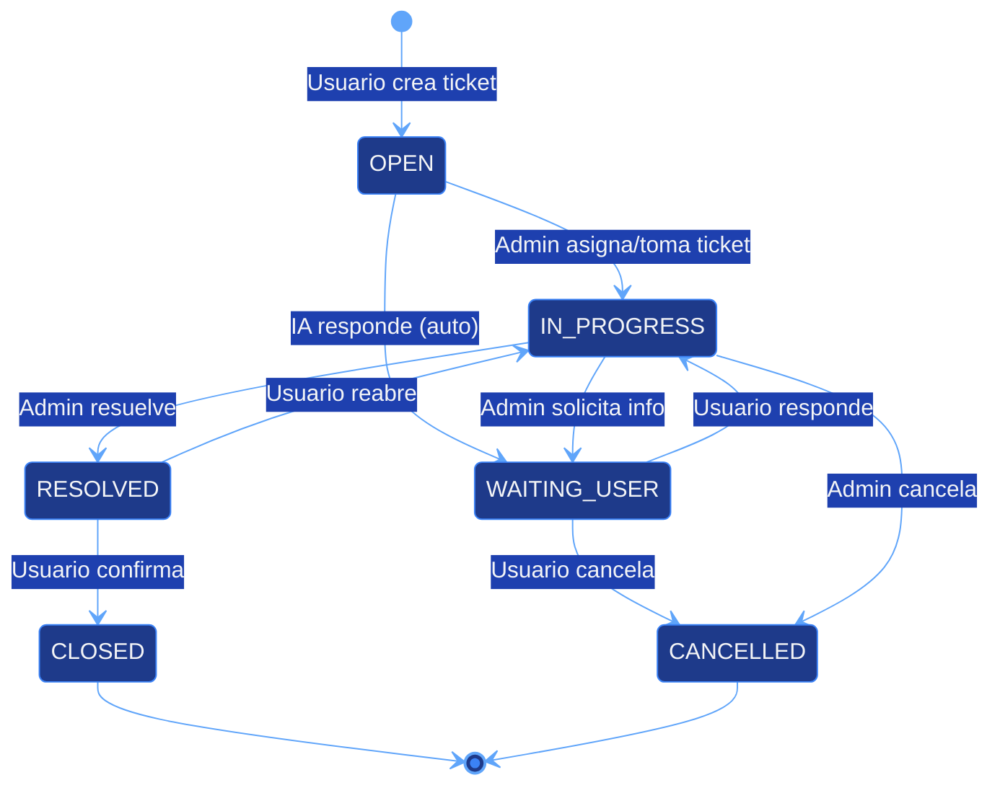
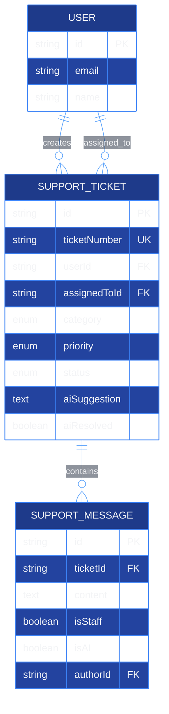

# Support Tickets Module

## Descripción General

El módulo de soporte proporciona un sistema completo de tickets con respuestas automáticas potenciadas por IA (Google Gemini), categorización inteligente, sistema de prioridades, asignación a staff, y chat en tiempo real entre usuarios y equipo de soporte.

---

## Características Principales

- Sistema de tickets con numeración única (TICK-XXXXXX)
- Respuestas automáticas de IA al crear ticket
- Categorización automática y manual
- 4 niveles de prioridad (LOW, MEDIUM, HIGH, URGENT)
- 6 estados del ticket (workflow completo)
- Chat bidireccional entre usuario y staff
- Asignación de tickets a administradores
- Historial completo de interacciones
- Métricas de resolución (tiempo, efectividad)
- Notificaciones en tiempo real (futuro)

---

## Arquitectura del Módulo

### Flujo de Ticket de Soporte



---

## Base de Datos

### Tabla SupportTicket

```sql
CREATE TABLE support_tickets (
  id VARCHAR PRIMARY KEY DEFAULT uuid(),
  ticketNumber VARCHAR UNIQUE NOT NULL,  -- TICK-XXXXXX

  title VARCHAR NOT NULL,
  description TEXT NOT NULL,
  category TicketCategory NOT NULL,
  priority TicketPriority DEFAULT 'MEDIUM',
  status TicketStatus DEFAULT 'OPEN',

  -- Relaciones
  userId VARCHAR REFERENCES users(id) ON DELETE CASCADE,
  assignedToId VARCHAR REFERENCES users(id) ON DELETE SET NULL,

  -- IA
  aiSuggestion TEXT,
  aiResolved BOOLEAN DEFAULT false,

  -- Metadata
  metadata JSONB,  -- browser, OS, etc.
  resolvedAt TIMESTAMP,
  closedAt TIMESTAMP,

  createdAt TIMESTAMP DEFAULT NOW(),
  updatedAt TIMESTAMP DEFAULT NOW()
);

CREATE INDEX idx_tickets_user ON support_tickets(userId);
CREATE INDEX idx_tickets_assigned ON support_tickets(assignedToId);
CREATE INDEX idx_tickets_status ON support_tickets(status);
CREATE INDEX idx_tickets_number ON support_tickets(ticketNumber);
```

### Tabla SupportMessage

```sql
CREATE TABLE support_messages (
  id VARCHAR PRIMARY KEY DEFAULT uuid(),
  ticketId VARCHAR REFERENCES support_tickets(id) ON DELETE CASCADE,

  content TEXT NOT NULL,
  isStaff BOOLEAN DEFAULT false,  -- true = admin/staff
  isAI BOOLEAN DEFAULT false,     -- true = respuesta de IA
  authorId VARCHAR,               -- null si es IA

  attachments JSONB,              -- URLs de archivos
  createdAt TIMESTAMP DEFAULT NOW()
);

CREATE INDEX idx_support_messages_ticket ON support_messages(ticketId);
CREATE INDEX idx_support_messages_created ON support_messages(createdAt);
```

### Enums

```typescript
enum TicketCategory {
  BUG = "BUG",                    // Error en la aplicación
  FEATURE = "FEATURE",            // Solicitud de nueva funcionalidad
  QUESTION = "QUESTION",          // Pregunta general
  ACCOUNT = "ACCOUNT",            // Problema con la cuenta
  BILLING = "BILLING",            // Problema de facturación
  PERFORMANCE = "PERFORMANCE",    // Problema de rendimiento
  OTHER = "OTHER",                // Otro
}

enum TicketPriority {
  LOW = "LOW",                    // Baja prioridad
  MEDIUM = "MEDIUM",              // Prioridad media
  HIGH = "HIGH",                  // Alta prioridad
  URGENT = "URGENT",              // Urgente
}

enum TicketStatus {
  OPEN = "OPEN",                  // Recién creado
  IN_PROGRESS = "IN_PROGRESS",    // Admin trabajando en él
  WAITING_USER = "WAITING_USER",  // Esperando respuesta del usuario
  RESOLVED = "RESOLVED",          // Resuelto (esperando confirmación)
  CLOSED = "CLOSED",              // Cerrado y confirmado
  CANCELLED = "CANCELLED",        // Cancelado por usuario o admin
}
```

### Relaciones



---

## API Endpoints

### 1. Crear Ticket

**Endpoint:** POST `/api/support/tickets`

**Requiere:** Usuario autenticado

```typescript
// Request
{
  "title": "Error al crear agente",
  "description": "Cuando intento crear un agente, me da error 500",
  "category": "BUG",
  "priority": "HIGH",
  "metadata": {
    "browser": "Chrome 120",
    "os": "Windows 11",
    "url": "/agents/new"
  }
}

// Response 201
{
  "success": true,
  "ticket": {
    "id": "uuid",
    "ticketNumber": "TICK-000123",
    "title": "Error al crear agente",
    "description": "Cuando intento crear...",
    "category": "BUG",
    "priority": "HIGH",
    "status": "OPEN",
    "userId": "user-uuid",
    "aiSuggestion": "Basado en tu descripción, parece que...",
    "aiResolved": false,
    "createdAt": "2025-10-16T..."
  },
  "messages": [
    {
      "id": "msg-uuid",
      "content": "Cuando intento crear...",
      "isStaff": false,
      "isAI": false,
      "createdAt": "2025-10-16T..."
    },
    {
      "id": "msg-uuid-2",
      "content": "Basado en tu descripción, parece que...",
      "isStaff": false,
      "isAI": true,
      "createdAt": "2025-10-16T..."
    }
  ]
}
```

### 2. Listar Tickets

**Endpoint:** GET `/api/support/tickets`

**Query Params:**
- `status` (filtro por estado)
- `category` (filtro por categoría)
- `priority` (filtro por prioridad)
- `assignedTo` ("me" para ver asignados a mí)
- `createdBy` ("me" para ver mis tickets)

**Acceso:**
- Usuarios ven solo sus tickets
- ADMIN/SUPER_ADMIN ven todos

```typescript
// Response 200
{
  "tickets": [
    {
      "id": "uuid",
      "ticketNumber": "TICK-000123",
      "title": "Error al crear agente",
      "category": "BUG",
      "priority": "HIGH",
      "status": "IN_PROGRESS",
      "user": {
        "name": "John Doe",
        "email": "john@example.com"
      },
      "assignedTo": {
        "name": "Admin User",
        "email": "admin@example.com"
      },
      "lastMessage": {
        "content": "Estamos investigando...",
        "createdAt": "2025-10-16T..."
      },
      "createdAt": "2025-10-16T...",
      "updatedAt": "2025-10-16T..."
    }
  ],
  "pagination": {
    "total": 45,
    "page": 1,
    "limit": 20
  }
}
```

### 3. Obtener Ticket Específico

**Endpoint:** GET `/api/support/tickets/[ticketId]`

```typescript
// Response 200
{
  "ticket": {
    "id": "uuid",
    "ticketNumber": "TICK-000123",
    "title": "Error al crear agente",
    "description": "Cuando intento crear...",
    "category": "BUG",
    "priority": "HIGH",
    "status": "IN_PROGRESS",
    "user": {
      "id": "user-uuid",
      "name": "John Doe",
      "email": "john@example.com",
      "avatar": "https://..."
    },
    "assignedTo": {
      "id": "admin-uuid",
      "name": "Admin User",
      "email": "admin@example.com"
    },
    "aiSuggestion": "Basado en tu descripción...",
    "aiResolved": false,
    "metadata": {
      "browser": "Chrome 120",
      "os": "Windows 11"
    },
    "createdAt": "2025-10-16T10:00:00Z",
    "updatedAt": "2025-10-16T10:30:00Z",
    "resolvedAt": null,
    "closedAt": null
  },
  "messages": [
    {
      "id": "msg-1",
      "content": "Cuando intento crear...",
      "isStaff": false,
      "isAI": false,
      "author": {
        "name": "John Doe",
        "avatar": "https://..."
      },
      "createdAt": "2025-10-16T10:00:00Z"
    },
    {
      "id": "msg-2",
      "content": "Basado en tu descripción...",
      "isStaff": false,
      "isAI": true,
      "author": null,
      "createdAt": "2025-10-16T10:00:02Z"
    },
    {
      "id": "msg-3",
      "content": "Estamos investigando el problema...",
      "isStaff": true,
      "isAI": false,
      "author": {
        "name": "Admin User",
        "avatar": "https://..."
      },
      "createdAt": "2025-10-16T10:30:00Z"
    }
  ]
}
```

### 4. Enviar Mensaje

**Endpoint:** POST `/api/support/tickets/[ticketId]/messages`

```typescript
// Request (Usuario)
{
  "content": "Sí, el error ocurre cuando selecciono la categoría 'productivity'"
}

// Request (Admin con IA)
{
  "content": "¿Puedes proporcionar más detalles?",
  "useAI": true  // Opcional: mejorar respuesta con IA
}

// Response 201
{
  "success": true,
  "message": {
    "id": "msg-uuid",
    "content": "Sí, el error ocurre...",
    "isStaff": false,
    "isAI": false,
    "author": {
      "name": "John Doe"
    },
    "createdAt": "2025-10-16T..."
  },
  "ticketUpdated": {
    "status": "IN_PROGRESS"  // Auto-actualizado si estaba WAITING_USER
  }
}
```

### 5. Asignar Ticket

**Endpoint:** PATCH `/api/support/tickets/[ticketId]/assign`

**Requiere:** ADMIN o SUPER_ADMIN

```typescript
// Request
{
  "assignedToId": "admin-uuid",
  "assignedToEmail": "admin@example.com"  // Alternativa
}

// Response 200
{
  "success": true,
  "ticket": {
    "id": "uuid",
    "ticketNumber": "TICK-000123",
    "status": "IN_PROGRESS",  // Auto-actualizado
    "assignedTo": {
      "id": "admin-uuid",
      "name": "Admin User"
    }
  }
}
```

### 6. Actualizar Estado

**Endpoint:** PATCH `/api/support/tickets/[ticketId]/status`

```typescript
// Request
{
  "status": "RESOLVED",
  "message": "El problema ha sido resuelto..."  // Opcional
}

// Response 200
{
  "success": true,
  "ticket": {
    "id": "uuid",
    "status": "RESOLVED",
    "resolvedAt": "2025-10-16T..."
  }
}
```

### 7. Cerrar Ticket

**Endpoint:** POST `/api/support/tickets/[ticketId]/close`

**Requiere:** Usuario (creador del ticket) o ADMIN

```typescript
// Request
{
  "feedback": "El problema fue resuelto satisfactoriamente",
  "rating": 5  // 1-5 estrellas
}

// Response 200
{
  "success": true,
  "ticket": {
    "id": "uuid",
    "status": "CLOSED",
    "closedAt": "2025-10-16T..."
  }
}
```

---

## Sistema de IA

### Respuesta Automática al Crear Ticket

Cuando un usuario crea un ticket, la IA analiza automáticamente el problema y genera una sugerencia:

```typescript
async function generateAISuggestion(ticket: SupportTicket) {
  const prompt = `
    Eres un asistente de soporte técnico para CJHIRASHI Agents.

    Un usuario ha reportado el siguiente problema:
    Categoría: ${ticket.category}
    Prioridad: ${ticket.priority}
    Título: ${ticket.title}
    Descripción: ${ticket.description}

    Proporciona una respuesta útil que:
    1. Reconozca el problema
    2. Sugiera posibles soluciones o pasos a seguir
    3. Sea clara y empática
    4. Si es un problema conocido, menciona que el equipo está trabajando en ello

    Responde en español de manera profesional y útil.
  `;

  const response = await generateAIResponse(prompt);

  return response.content;
}
```

### Análisis de Sentimiento

```typescript
async function analyzeSentiment(message: string): Promise<{
  sentiment: "positive" | "neutral" | "negative";
  confidence: number;
}> {
  const prompt = `
    Analiza el sentimiento del siguiente mensaje:
    "${message}"

    Responde solo con un JSON:
    {
      "sentiment": "positive" | "neutral" | "negative",
      "confidence": 0.0-1.0
    }
  `;

  // Parsear respuesta de IA
  // Usado para priorizar tickets con sentimiento negativo
}
```

### Categorización Automática

```typescript
async function suggestCategory(
  title: string,
  description: string
): Promise<TicketCategory> {
  const prompt = `
    Basándote en el título y descripción, sugiere la categoría más apropiada:

    Título: ${title}
    Descripción: ${description}

    Categorías disponibles:
    - BUG: Error en la aplicación
    - FEATURE: Solicitud de nueva funcionalidad
    - QUESTION: Pregunta general
    - ACCOUNT: Problema con la cuenta
    - BILLING: Problema de facturación
    - PERFORMANCE: Problema de rendimiento
    - OTHER: Otro

    Responde solo con el nombre de la categoría.
  `;

  // Parsear y validar categoría
}
```

---

## Métricas de Soporte

### Dashboard de Métricas

```typescript
// GET /api/admin/support/metrics
{
  "overview": {
    "totalTickets": 523,
    "openTickets": 45,
    "inProgressTickets": 23,
    "resolvedToday": 12,
    "averageResolutionTime": 4.5,  // horas
    "aiResolutionRate": 0.35,       // 35% resueltos solo con IA
    "satisfactionRate": 4.2          // de 5 estrellas
  },
  "byCategory": [
    { "category": "BUG", "count": 150, "avgTime": 5.2 },
    { "category": "QUESTION", "count": 200, "avgTime": 2.1 },
    { "category": "FEATURE", "count": 100, "avgTime": 12.5 }
  ],
  "byPriority": [
    { "priority": "URGENT", "count": 12, "avgTime": 1.5 },
    { "priority": "HIGH", "count": 45, "avgTime": 3.2 },
    { "priority": "MEDIUM", "count": 200, "avgTime": 5.5 },
    { "priority": "LOW", "count": 266, "avgTime": 8.0 }
  ],
  "timeline": {
    "last7Days": [
      { "date": "2025-10-10", "created": 15, "resolved": 12 },
      { "date": "2025-10-11", "created": 18, "resolved": 15 }
    ]
  },
  "topStaff": [
    {
      "name": "Admin User",
      "ticketsResolved": 45,
      "avgResolutionTime": 3.2,
      "satisfaction": 4.5
    }
  ]
}
```

---

## Notificaciones

### Eventos que Generan Notificaciones

```typescript
enum TicketEvent {
  TICKET_CREATED = "TICKET_CREATED",
  TICKET_ASSIGNED = "TICKET_ASSIGNED",
  NEW_MESSAGE = "NEW_MESSAGE",
  STATUS_CHANGED = "STATUS_CHANGED",
  TICKET_RESOLVED = "TICKET_RESOLVED",
  TICKET_CLOSED = "TICKET_CLOSED",
}
```

### Notificación por Email (Futuro)

```typescript
async function sendTicketNotification(
  event: TicketEvent,
  ticket: SupportTicket,
  recipient: User
) {
  const templates = {
    TICKET_CREATED: {
      subject: `Nuevo ticket: ${ticket.ticketNumber}`,
      body: `Tu ticket "${ticket.title}" ha sido creado...`,
    },
    NEW_MESSAGE: {
      subject: `Nueva respuesta en ${ticket.ticketNumber}`,
      body: `Hay una nueva respuesta en tu ticket...`,
    },
    TICKET_RESOLVED: {
      subject: `Ticket resuelto: ${ticket.ticketNumber}`,
      body: `Tu ticket ha sido marcado como resuelto...`,
    },
  };

  await sendEmail(recipient.email, templates[event]);
}
```

---

## Interfaz de Usuario

### Lista de Tickets (Usuario)

```
┌─────────────────────────────────────────────────────────┐
│  Mis Tickets de Soporte                  [+ Nuevo Ticket]│
│─────────────────────────────────────────────────────────│
│  Filtros: [Todos ▼] [🔍 Buscar...]                     │
│─────────────────────────────────────────────────────────│
│  TICK-000123 │ Error al crear agente        │ ABIERTO   │
│  BUG         │ Hace 2 horas                 │ ALTA      │
│  [Ver] [Cerrar]                                         │
│─────────────────────────────────────────────────────────│
│  TICK-000120 │ ¿Cómo cambio mi suscripción? │ RESUELTO  │
│  QUESTION    │ Hace 1 día                   │ MEDIA     │
│  [Ver] [Confirmar cierre]                               │
│─────────────────────────────────────────────────────────│
│  TICK-000115 │ Solicitar función X          │ CERRADO   │
│  FEATURE     │ Hace 3 días                  │ BAJA      │
│  [Ver detalles]                                         │
└─────────────────────────────────────────────────────────┘
```

### Chat de Ticket

```
┌─────────────────────────────────────────────────────────┐
│  🎫 TICK-000123: Error al crear agente          [✕]     │
│  Estado: IN_PROGRESS │ Prioridad: ALTA │ BUG            │
│  Asignado a: Admin User                                 │
│─────────────────────────────────────────────────────────│
│                                                         │
│  👤 You (10:00 AM)                                      │
│  Cuando intento crear un agente, me da error 500        │
│                                                         │
│  🤖 Asistente IA (10:00 AM)                             │
│  Basado en tu descripción, parece que el problema       │
│  podría estar relacionado con...                        │
│                                                         │
│  👨💼 Admin User (10:30 AM)                           │
│  Estamos investigando el problema. ¿Puedes              │
│  proporcionar más detalles sobre la categoría?          │
│                                                         │
│  👤 You (10:35 AM)                                      │
│  Sí, ocurre cuando selecciono 'productivity'            │
│                                                         │
│  👨💼 Admin User (11:00 AM)                           │
│  Gracias. Hemos identificado el problema y             │
│  desplegado una solución. ¿Puedes intentar de nuevo?    │
│                                                         │
│─────────────────────────────────────────────────────────│
│  [💬 Escribe tu mensaje...                      ] [↑]  │
│  [Marcar como resuelto] [Cerrar ticket]                │
└─────────────────────────────────────────────────────────┘
```

### Panel de Admin (Vista de Todos los Tickets)

```
┌─────────────────────────────────────────────────────────┐
│  Tickets de Soporte - Admin Panel                       │
│─────────────────────────────────────────────────────────│
│  Filtros: [Estado ▼] [Categoría ▼] [Prioridad ▼]       │
│  [Solo mis asignados] [🔍 Buscar...]                    │
│─────────────────────────────────────────────────────────│
│  TICK │ Usuario      │ Título         │ Estado │ Acciones│
│─────────────────────────────────────────────────────────│
│  0123 │ John Doe     │ Error agente   │ OPEN   │ [Asignar]│
│  BUG  │ HIGH         │ 2h ago         │        │ [Ver]   │
│─────────────────────────────────────────────────────────│
│  0122 │ Jane Smith   │ Pregunta API   │ IN_PROG│ [Ver]   │
│  QUEST│ MEDIUM       │ 5h ago         │ Me     │ [Resolver]
│─────────────────────────────────────────────────────────│
│  0121 │ Bob Jones    │ Feature X      │ WAITING│ [Ver]   │
│  FEAT │ LOW          │ 1d ago         │ Admin 2│ [Reasignar]
└─────────────────────────────────────────────────────────┘
```

---

## Archivos Clave

```
src/
├── app/
│   ├── (protected)/
│   │   ├── support/
│   │   │   ├── page.tsx              # Lista de tickets del usuario
│   │   │   ├── new/
│   │   │   │   └── page.tsx          # Crear ticket
│   │   │   └── [ticketId]/
│   │   │       └── page.tsx          # Chat del ticket
│   │   └── admin/
│   │       └── support/
│   │           ├── page.tsx          # Lista de todos los tickets
│   │           └── metrics/
│   │               └── page.tsx      # Dashboard de métricas
│   └── api/
│       └── support/
│           └── tickets/
│               ├── route.ts          # GET/POST tickets
│               └── [ticketId]/
│                   ├── route.ts      # GET/PATCH ticket
│                   ├── messages/
│                   │   └── route.ts  # POST mensaje
│                   ├── assign/
│                   │   └── route.ts  # PATCH asignar
│                   └── status/
│                       └── route.ts  # PATCH estado
```

---

## Estado del Módulo

### Implementado ✅

- ✅ Creación de tickets
- ✅ Numeración única de tickets
- ✅ Respuestas automáticas de IA
- ✅ Categorización y prioridades
- ✅ Estados del ticket (workflow)
- ✅ Chat bidireccional
- ✅ Asignación de tickets
- ✅ Vista de admin

### Pendiente 🚧

- 🚧 Notificaciones en tiempo real (WebSocket)
- 🚧 Notificaciones por email
- 🚧 Attachments (archivos adjuntos)
- 🚧 Dashboard de métricas completo
- 🚧 Templates de respuestas rápidas
- 🚧 SLA (Service Level Agreement) tracking
- 🚧 Escalación automática de tickets
- 🚧 Integración con Slack/Discord
- 🚧 Knowledge base integrada
- 🚧 Chatbot IA independiente

---

**Última actualización:** 2025-10-16
**Estado:** Producción (funcionalidad core)
**Mantenido por:** cjhirashi@gmail.com
