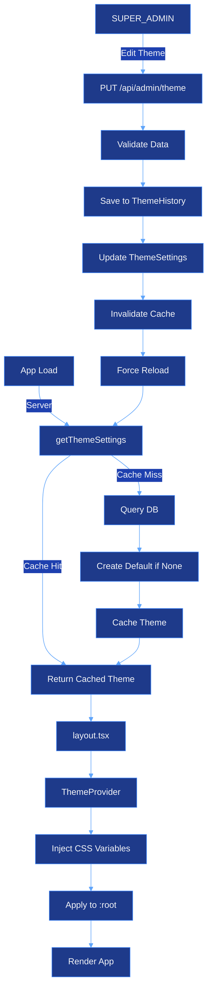

# Theme Customization Module - CJHIRASHI Agents

## Estado: 🚧 PLANIFICADO (Diseño completo, implementación pendiente)

---

## Descripción General

Módulo de personalización corporativa (white-label) que permite al **SUPER_ADMIN** personalizar la identidad visual completa de la plataforma. Los cambios se aplican globalmente a todos los usuarios en tiempo real.

---

## Características Principales

### 1. Personalización de Marca
- ✅ Nombre de marca personalizable
- ✅ Logo para modo claro
- ✅ Logo para modo oscuro
- ✅ Favicon corporativo

### 2. Paleta de Colores
- ✅ Colores para modo claro (13 variables)
  - Primario y secundario
  - Acento
  - Fondos (background, card)
  - Textos (foreground, muted)
  - Bordes
- ✅ Colores para modo oscuro (13 variables)
- ✅ Formato HSL compatible con Tailwind CSS

### 3. Tipografía (Opcional)
- ✅ Fuente principal (Google Fonts)
- ✅ Fuente monoespaciada (Google Fonts)

### 4. Gestión de Tema
- ✅ Live preview antes de guardar
- ✅ Reset a valores por defecto
- ✅ Historial de cambios (auditoría)
- ✅ Aplicación en tiempo real

---

## Arquitectura de Datos

### Database Schema (Prisma)

```prisma
// ═══════════════════════════════════════════════════════════
// SISTEMA DE PERSONALIZACIÓN DE TEMAS
// ═══════════════════════════════════════════════════════════

model ThemeSettings {
  id            String   @id @default("global") // Singleton pattern

  // Brand Identity
  brandName     String   @default("CJHIRASHI Agents")

  // Assets (URLs a Storage)
  logoLight     String?  // Logo para tema claro
  logoDark      String?  // Logo para tema oscuro
  favicon       String?  // Favicon del sitio

  // Color Palette - Light Mode (HSL format: "263 70% 60%")
  primaryLight            String   @default("263 70% 60%")
  primaryForegroundLight  String   @default("0 0% 98%")
  secondaryLight          String   @default("320 60% 70%")
  secondaryForegroundLight String  @default("0 0% 9%")
  accentLight             String   @default("260 50% 95%")
  accentForegroundLight   String   @default("263 70% 40%")
  backgroundLight         String   @default("0 0% 100%")
  foregroundLight         String   @default("0 0% 3.9%")
  cardLight               String   @default("0 0% 100%")
  cardForegroundLight     String   @default("0 0% 3.9%")
  borderLight             String   @default("0 0% 89.8%")
  mutedLight              String   @default("0 0% 96.1%")
  mutedForegroundLight    String   @default("0 0% 45.1%")

  // Color Palette - Dark Mode
  primaryDark             String   @default("263 70% 65%")
  primaryForegroundDark   String   @default("0 0% 98%")
  secondaryDark           String   @default("320 60% 70%")
  secondaryForegroundDark String   @default("0 0% 98%")
  accentDark              String   @default("210 11% 28%")
  accentForegroundDark    String   @default("0 0% 98%")
  backgroundDark          String   @default("210 18% 15%")
  foregroundDark          String   @default("0 0% 98%")
  cardDark                String   @default("210 11% 24%")
  cardForegroundDark      String   @default("0 0% 98%")
  borderDark              String   @default("210 11% 30%")
  mutedDark               String   @default("210 11% 28%")
  mutedForegroundDark     String   @default("0 0% 60%")

  // Typography (opcional)
  fontFamily      String?  // e.g., "Inter", "Roboto"
  fontFamilyMono  String?  // e.g., "Fira Code", "JetBrains Mono"

  // Metadata
  lastModifiedBy  String?  // User ID
  lastModifiedAt  DateTime @default(now()) @updatedAt
  createdAt       DateTime @default(now())

  @@map("theme_settings")
}

// Historial de cambios (auditoría)
model ThemeHistory {
  id          String   @id @default(uuid())
  adminId     String   // User ID del SUPER_ADMIN
  changes     Json     // Campos que cambiaron
  snapshot    Json     // Snapshot completo del tema anterior
  createdAt   DateTime @default(now())

  @@index([adminId])
  @@index([createdAt])
  @@map("theme_history")
}
```

**Justificación del diseño:**
- **Singleton Pattern**: Solo un registro con ID `"global"`
- **HSL Format**: Compatible con CSS variables de Tailwind/shadcn
- **URLs a Storage**: Logos/favicon almacenados en módulo Storage (no BLOB en DB)
- **Auditoría completa**: `ThemeHistory` registra todos los cambios

---

## API Endpoints (Planificados)

### `GET /api/admin/theme`
**Descripción**: Obtiene configuración actual del tema

**Autorización**: Público (cualquier usuario puede ver)

**Response**:
```json
{
  "theme": {
    "id": "global",
    "brandName": "CJHIRASHI Agents",
    "logoLight": "/storage/theme/logo-light.png",
    "logoDark": "/storage/theme/logo-dark.png",
    "favicon": "/storage/theme/favicon.ico",
    "primaryLight": "263 70% 60%",
    "primaryDark": "263 70% 65%",
    ...
  }
}
```

---

### `PUT /api/admin/theme`
**Descripción**: Actualiza configuración del tema

**Autorización**: Solo SUPER_ADMIN

**Request Body**:
```json
{
  "brandName": "Mi Empresa AI",
  "primaryLight": "220 70% 60%",
  "primaryDark": "220 70% 65%",
  ...
}
```

**Response**:
```json
{
  "theme": { /* tema actualizado */ },
  "message": "Tema actualizado correctamente"
}
```

**Side Effects**:
- Guarda snapshot en `ThemeHistory`
- Invalida cache del tema
- Trigger reload en clientes activos (opcional)

---

### `POST /api/admin/theme/upload`
**Descripción**: Upload de logos y favicon

**Autorización**: Solo SUPER_ADMIN

**Request**: FormData
```
file: File (PNG, JPG, SVG, WebP, max 2MB)
type: 'logo-light' | 'logo-dark' | 'favicon'
```

**Response**:
```json
{
  "url": "/storage/theme/logo-light-1234567890.png",
  "message": "Archivo subido correctamente"
}
```

**Side Effects**:
- Elimina archivo anterior del Storage
- Actualiza URL en `ThemeSettings`
- Optimiza imagen automáticamente

---

### `POST /api/admin/theme/reset`
**Descripción**: Resetea tema a valores por defecto

**Autorización**: Solo SUPER_ADMIN

**Response**:
```json
{
  "theme": { /* tema con valores por defecto */ },
  "message": "Tema reseteado correctamente"
}
```

**Side Effects**:
- Guarda snapshot en `ThemeHistory`
- Elimina logos/favicon del Storage
- Invalida cache

---

## Flujo de Aplicación del Tema



---

## Interfaz de Usuario (Planificada)

### Página: `/admin/theme`

**Layout**:
```
┌─────────────────────────────────────────────────────────────┐
│  Personalización de Tema                [Reset] [Guardar]   │
├─────────────────────────────────────────────────────────────┤
│  Tabs: [Marca] [Colores Claro] [Colores Oscuro] [Tipografía] [Preview] │
├─────────────────────────────────────────────────────────────┤
│                                                               │
│  ┌─────────────── TAB: MARCA ──────────────────┐            │
│  │                                               │            │
│  │  Nombre de la Marca                          │            │
│  │  [CJHIRASHI Agents___________________]       │            │
│  │                                               │            │
│  │  Logo (Modo Claro)                           │            │
│  │  ┌─────────────────┐                         │            │
│  │  │   [Preview]     │  [Subir archivo]        │            │
│  │  └─────────────────┘                         │            │
│  │                                               │            │
│  │  Logo (Modo Oscuro)                          │            │
│  │  ┌─────────────────┐                         │            │
│  │  │   [Preview]     │  [Subir archivo]        │            │
│  │  └─────────────────┘                         │            │
│  │                                               │            │
│  │  Favicon                                     │            │
│  │  ┌────┐                                      │            │
│  │  │[🎯]│  [Subir archivo]                     │            │
│  │  └────┘                                      │            │
│  └───────────────────────────────────────────────┘            │
│                                                               │
└─────────────────────────────────────────────────────────────┘
```

### Componentes UI Necesarios

#### 1. **ColorPicker Component**
```typescript
<ColorPicker
  label="Color Primario"
  value="263 70% 60%"
  onChange={(value) => handleColorChange('primaryLight', value)}
/>
```

Features:
- Native HTML color picker
- Input manual en formato HSL
- Preview en vivo del color
- Conversión HSL ↔ HEX automática

#### 2. **FileUpload Component**
```typescript
<FileUpload
  accept="image/*"
  currentUrl="/storage/theme/logo-light.png"
  onUpload={(file) => handleUpload('logo-light', file)}
  maxSize={2 * 1024 * 1024} // 2MB
/>
```

Features:
- Drag & drop
- Preview de imagen actual
- Validación de tipo y tamaño
- Progress bar durante upload
- Crop/resize opcional

#### 3. **ThemePreview Component**
```typescript
<ThemePreview theme={previewTheme} />
```

Features:
- Componentes de ejemplo (Button, Card, Input)
- Toggle light/dark mode
- Live preview de cambios
- Antes/después comparison

---

## Integración con Storage Module

El módulo de Theme **depende completamente** del módulo Storage:

### Uso del Storage:

```typescript
// Subir logo
const logoUrl = await storage.upload({
  file: logoFile,
  path: 'theme/logos',
  category: 'system',
  access: 'public',
  metadata: {
    type: 'logo-light',
    uploadedBy: userId,
  }
});

// Actualizar tema
await prisma.themeSettings.update({
  where: { id: 'global' },
  data: { logoLight: logoUrl }
});

// Eliminar logo anterior
await storage.delete(oldLogoUrl);
```

**Ventajas de usar Storage Module**:
- ✅ Gestión centralizada de archivos
- ✅ Optimización automática de imágenes
- ✅ CDN out-of-the-box
- ✅ Control de acceso
- ✅ Versionamiento de archivos
- ✅ Métricas de uso

---

## Implementación de CSS Variables Dinámicas

### ThemeProvider Mejorado

```typescript
// src/components/theme-provider.tsx
"use client"

import { useEffect } from "react"
import { ThemeProvider as NextThemesProvider } from "next-themes"

export function ThemeProvider({ children, customTheme, ...props }) {
  useEffect(() => {
    if (!customTheme?.colors) return;

    const root = document.documentElement;

    // Aplicar colores light mode a :root
    Object.entries(customTheme.colors.light).forEach(([key, value]) => {
      root.style.setProperty(`--${key}`, value);
    });

    // Crear/actualizar estilos para .dark
    let darkStyle = document.getElementById('dark-mode-theme');
    if (!darkStyle) {
      darkStyle = document.createElement('style');
      darkStyle.id = 'dark-mode-theme';
      document.head.appendChild(darkStyle);
    }

    const darkCss = Object.entries(customTheme.colors.dark)
      .map(([key, value]) => `  --${key}: ${value};`)
      .join('\n');

    darkStyle.textContent = `.dark {\n${darkCss}\n}`;

    // Actualizar favicon
    if (customTheme.favicon) {
      const link = document.querySelector("link[rel='icon']");
      if (link) link.href = customTheme.favicon;
    }

  }, [customTheme]);

  return <NextThemesProvider {...props}>{children}</NextThemesProvider>
}
```

### Layout.tsx Integration

```typescript
// src/app/layout.tsx
import { getThemeSettings } from "@/lib/theme";

export default async function RootLayout({ children }) {
  const theme = await getThemeSettings();

  return (
    <html lang="es" suppressHydrationWarning>
      <body>
        <ThemeProvider
          customTheme={{
            brandName: theme.brandName,
            logoLight: theme.logoLight,
            logoDark: theme.logoDark,
            favicon: theme.favicon,
            colors: {
              light: { /* colores light */ },
              dark: { /* colores dark */ }
            }
          }}
        >
          {children}
        </ThemeProvider>
      </body>
    </html>
  );
}
```

---

## Caching Strategy

### Server-Side Cache

```typescript
// src/lib/theme.ts
import { unstable_cache } from 'next/cache';

export const getThemeSettings = unstable_cache(
  async () => {
    let theme = await prisma.themeSettings.findUnique({
      where: { id: "global" }
    });

    if (!theme) {
      theme = await prisma.themeSettings.create({
        data: { id: "global" }
      });
    }

    return theme;
  },
  ['theme-settings'],
  {
    revalidate: 3600, // 1 hora
    tags: ['theme']
  }
);

// Invalidar cache
export async function revalidateTheme() {
  const { revalidateTag } = await import('next/cache');
  revalidateTag('theme');
}
```

---

## Seguridad

### Validación de Archivos

```typescript
const ALLOWED_TYPES = ['image/png', 'image/jpeg', 'image/svg+xml', 'image/webp'];
const MAX_SIZE = 2 * 1024 * 1024; // 2MB

function validateThemeAsset(file: File) {
  if (!ALLOWED_TYPES.includes(file.type)) {
    throw new Error('Tipo de archivo no permitido');
  }
  if (file.size > MAX_SIZE) {
    throw new Error('Archivo demasiado grande (max 2MB)');
  }
}
```

### Autorización

- **GET /api/admin/theme**: Público (todos pueden ver)
- **PUT /api/admin/theme**: Solo SUPER_ADMIN
- **POST /api/admin/theme/upload**: Solo SUPER_ADMIN
- **POST /api/admin/theme/reset**: Solo SUPER_ADMIN

### Auditoría

Todos los cambios se registran en `ThemeHistory`:
```json
{
  "adminId": "user-123",
  "changes": {
    "brandName": "Nueva Marca",
    "primaryLight": "220 70% 60%"
  },
  "snapshot": { /* tema completo anterior */ },
  "createdAt": "2025-01-16T..."
}
```

---

## Performance

### Optimizaciones:

1. **Server-Side Caching**: Cache de 1 hora del tema
2. **CSS Variables**: Aplicación nativa por el browser (muy rápida)
3. **Lazy Loading**: Fuentes de Google Fonts con `display: swap`
4. **Image Optimization**: Next.js Image component + Storage optimization
5. **CDN**: Logos/favicon servidos desde CDN del Storage

### Métricas Objetivo:

| Métrica | Objetivo |
|---------|----------|
| Theme Load Time | < 50ms (con cache) |
| CSS Injection | < 10ms |
| Image Load (logo) | < 200ms (CDN) |
| Theme Update (admin) | < 500ms |

---

## Tareas de Implementación

### Fase 1: Database & Backend (Prioridad Alta)

- [ ] **1.1** Agregar modelos `ThemeSettings` y `ThemeHistory` a `prisma/schema.prisma`
- [ ] **1.2** Correr migración: `npx prisma migrate dev --name add_theme_module`
- [ ] **1.3** Crear `src/lib/theme.ts` con utilidades:
  - `getThemeSettings()` con caching
  - `revalidateTheme()`
- [ ] **1.4** Crear `src/lib/auth-utils.ts::requireSuperAdmin()` si no existe

### Fase 2: API Endpoints (Prioridad Alta)

- [ ] **2.1** Implementar `GET /api/admin/theme/route.ts`
- [ ] **2.2** Implementar `PUT /api/admin/theme/route.ts`
  - Validación con Zod
  - Guardar en `ThemeHistory`
  - Invalidar cache
- [ ] **2.3** Implementar `POST /api/admin/theme/upload/route.ts`
  - Integración con Storage Module
  - Validación de archivos
  - Eliminar archivo anterior
- [ ] **2.4** Implementar `POST /api/admin/theme/reset/route.ts`

### Fase 3: Frontend Core (Prioridad Alta)

- [ ] **3.1** Actualizar `src/components/theme-provider.tsx`
  - Agregar prop `customTheme`
  - Inyección dinámica de CSS variables
  - Actualización de favicon
- [ ] **3.2** Actualizar `src/app/layout.tsx`
  - Cargar tema con `getThemeSettings()`
  - Pasar tema a `ThemeProvider`
  - Actualizar metadata dinámica
- [ ] **3.3** Actualizar `src/components/navbar.tsx`
  - Usar `logoLight` y `logoDark` dinámicos
  - Toggle entre logos según tema activo

### Fase 4: Componentes UI (Prioridad Media)

- [ ] **4.1** Crear `src/components/color-picker.tsx`
  - Native color picker
  - Input HSL manual
  - Conversión HSL ↔ HEX
- [ ] **4.2** Crear `src/components/file-upload.tsx`
  - Drag & drop
  - Preview de imagen
  - Validación de tipo/tamaño
  - Progress indicator
- [ ] **4.3** Crear `src/components/theme-preview.tsx`
  - Ejemplos de componentes
  - Toggle light/dark
  - Live preview

### Fase 5: Admin Panel (Prioridad Media)

- [ ] **5.1** Crear `src/app/admin/theme/page.tsx`
  - Verificación de SUPER_ADMIN
  - Fetch de tema actual
  - State management (preview)
- [ ] **5.2** Implementar Tab "Marca"
  - Input de nombre de marca
  - Upload de logos (light/dark)
  - Upload de favicon
- [ ] **5.3** Implementar Tab "Colores (Claro)"
  - ColorPickers para cada variable
  - Preview en vivo
- [ ] **5.4** Implementar Tab "Colores (Oscuro)"
  - ColorPickers para cada variable
- [ ] **5.5** Implementar Tab "Tipografía"
  - Selección de Google Fonts
- [ ] **5.6** Implementar Tab "Preview"
  - Componentes de ejemplo con tema aplicado
- [ ] **5.7** Implementar botones de acción
  - Botón "Guardar Cambios"
  - Botón "Resetear a Default"
  - Confirmaciones

### Fase 6: Testing (Prioridad Media)

- [ ] **6.1** Testing manual de flujos completos
  - Upload de logos
  - Cambio de colores
  - Reset a default
  - Persistencia entre recargas
- [ ] **6.2** Testing de edge cases
  - Primera carga sin tema
  - Archivos inválidos
  - Colores HSL inválidos
  - Múltiples admins editando simultáneamente
- [ ] **6.3** Testing de performance
  - Cache funcionando correctamente
  - Invalidación de cache
  - Carga de imágenes desde Storage

### Fase 7: Documentación (Prioridad Baja)

- [ ] **7.1** Actualizar `system-docs/SYSTEM.md`
  - Agregar módulo Theme a la lista
- [ ] **7.2** Crear README para admins
  - Guía de uso del panel
  - Límites técnicos
  - Best practices
- [ ] **7.3** Documentar API endpoints en Swagger/OpenAPI (opcional)

---

## Dependencias Externas

### Requeridas:

- **Storage Module** (CRÍTICO)
  - Upload/delete de archivos
  - Optimización de imágenes
  - URLs públicas

### Opcionales:

- **Google Fonts API** (para fuentes custom)
- **Sharp** (para optimización de imágenes, ya incluido en Next.js)

---

## Consideraciones Futuras

### Features Avanzadas (Backlog):

- [ ] **Multi-tenancy**: Temas diferentes por tenant/workspace
- [ ] **Theme Marketplace**: Temas predefinidos para elegir
- [ ] **Advanced Editor**: Editor visual drag-and-drop
- [ ] **Component Customization**: Personalizar componentes específicos
- [ ] **Animation Settings**: Personalizar animaciones y transiciones
- [ ] **Export/Import**: Exportar tema como JSON, importar desde archivo
- [ ] **Preview URL**: URL pública para preview del tema antes de aplicar
- [ ] **Scheduled Changes**: Agendar cambios de tema (e.g., tema navideño)
- [ ] **A/B Testing**: Probar diferentes temas con grupos de usuarios

---

## Referencias

- [Tailwind CSS Variables](https://tailwindcss.com/docs/customizing-colors#using-css-variables)
- [shadcn/ui Theming](https://ui.shadcn.com/docs/theming)
- [Next.js Image Optimization](https://nextjs.org/docs/app/building-your-application/optimizing/images)
- [next-themes Documentation](https://github.com/pacocoursey/next-themes)
- [HSL Color Format](https://developer.mozilla.org/en-US/docs/Web/CSS/color_value/hsl)

---

**Última actualización**: 2025-10-16
**Estado**: Diseño completo, pendiente de implementación
**Dependencias críticas**: Storage Module
**Prioridad**: Media-Alta (después de Storage Module)
