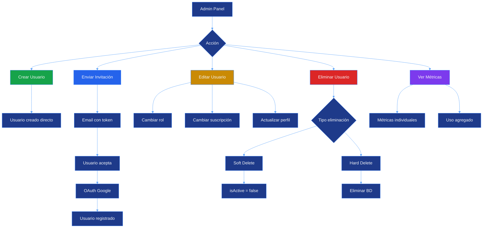

# User Management Module

## Descripción General

El módulo de gestión de usuarios proporciona funcionalidades completas de CRUD (Create, Read, Update, Delete) para administradores, incluyendo un sistema de invitaciones, gestión de roles, métricas de uso, suscripciones y audit logs.

---

## Características Principales

- CRUD completo de usuarios (solo ADMIN y SUPER_ADMIN)
- Sistema de invitaciones con tokens seguros
- Gestión de roles y permisos granulares
- Sistema de suscripciones con 6 tiers
- Métricas de uso por usuario (mensajes, tokens, costos)
- Audit logs de acciones administrativas
- Exportación de datos de usuario (GDPR compliance)
- Soft delete y hard delete de usuarios

---

## Suscripciones y Tiers

### Tiers Disponibles

```typescript
enum SubscriptionTier {
  FREE           // Límites básicos
  BASIC          // Plan entrada
  PRO            // Plan profesional
  ENTERPRISE     // Plan empresarial
  CUSTOM         // Plan personalizado por super admin
  UNLIMITED      // Sin límites (para usuarios especiales)
}
```

### Límites por Tier

| Feature | FREE | BASIC | PRO | ENTERPRISE | CUSTOM | UNLIMITED |
|---------|------|-------|-----|------------|--------|-----------|
| **Mensajes/mes** | 100 | 1,000 | 10,000 | 50,000 | Variable | ∞ |
| **Tokens/mes** | 50K | 500K | 5M | 25M | Variable | ∞ |
| **Agentes propios** | 1 | 5 | 20 | 100 | Variable | ∞ |
| **Agentes públicos** | ✅ | ✅ | ✅ | ✅ | ✅ | ✅ |
| **Soporte IA** | ✅ | ✅ | ✅ | ✅ | ✅ | ✅ |
| **Soporte humano** | ❌ | Email | Email+Chat | Prioritario | Dedicado | Dedicado |
| **Export datos** | ❌ | ❌ | ✅ | ✅ | ✅ | ✅ |
| **API access** | ❌ | ❌ | ✅ | ✅ | ✅ | ✅ |
| **Artifacts** | 10 | 50 | 200 | 1000 | Variable | ∞ |
| **Storage (GB)** | 1 | 5 | 20 | 100 | Variable | ∞ |

---

## Arquitectura del Módulo

### Flujo de Gestión de Usuarios



---

## Base de Datos

### Tabla Users

```sql
CREATE TABLE users (
  id VARCHAR PRIMARY KEY DEFAULT uuid(),
  email VARCHAR UNIQUE NOT NULL,
  emailVerified TIMESTAMP,

  -- Información básica
  name VARCHAR,
  displayName VARCHAR,
  avatar VARCHAR,
  dateOfBirth TIMESTAMP,
  timezone VARCHAR DEFAULT 'America/Mexico_City',
  language VARCHAR DEFAULT 'es',
  bio TEXT,

  -- Roles y permisos
  role UserRole DEFAULT 'USER',
  permissions JSONB,
  isActive BOOLEAN DEFAULT true,

  -- Perfil de personalidad IA
  personalityProfile JSONB,
  aiProfileLastUpdate TIMESTAMP,

  -- Suscripción
  subscriptionTier SubscriptionTier DEFAULT 'FREE',
  subscriptionId VARCHAR,
  subscriptionStart TIMESTAMP,
  subscriptionEnd TIMESTAMP,
  customLimits JSONB,

  -- Métricas
  totalMessages INTEGER DEFAULT 0,
  totalTokensUsed BIGINT DEFAULT 0,
  monthlyMessages INTEGER DEFAULT 0,
  monthlyTokens BIGINT DEFAULT 0,
  lastResetAt TIMESTAMP DEFAULT NOW(),
  lastInteraction TIMESTAMP,

  createdAt TIMESTAMP DEFAULT NOW(),
  updatedAt TIMESTAMP DEFAULT NOW()
);

CREATE INDEX idx_users_email ON users(email);
CREATE INDEX idx_users_role ON users(role);
CREATE INDEX idx_users_subscription ON users(subscriptionTier);
CREATE INDEX idx_users_active ON users(isActive);
```

### Relaciones

```mermaid
%%{init: {'theme':'base', 'themeVariables': {
  'primaryColor':'#1e3a8a',
  'primaryTextColor':'#f3f4f6',
  'primaryBorderColor':'#3b82f6',
  'lineColor':'#60a5fa',
  'secondaryColor':'#1e40af',
  'tertiaryColor':'#1e293b',
  'background':'#0f172a',
  'mainBkg':'#1e3a8a',
  'secondaryBkground':'#1e40af',
  'textColor':'#f3f4f6',
  'fontSize':'16px'
}}}%%
erDiagram
    USER ||--o{ ACCOUNT : has
    USER ||--o{ SESSION : has
    USER ||--o{ INVITATION_SENT : sends
    USER ||--o| INVITATION_RECEIVED : receives
    USER ||--o{ AGENT : creates
    USER ||--o{ CHAT_SESSION : has
    USER ||--o| HEALTH_PROFILE : has
    USER ||--o| FINANCIAL_PROFILE : has
    USER ||--o{ SUPPORT_TICKET : creates
    USER ||--o{ USAGE_LOG : generates
    USER ||--o{ MONTHLY_USAGE : tracks
    USER ||--o{ AUDIT_LOG : performs
```



---

## Funcionalidades

### 1. Crear Usuario (Directo)

**Endpoint:** POST `/api/admin/users`

**Requiere:** ADMIN o SUPER_ADMIN

```typescript
// Request
{
  "email": "user@example.com",
  "name": "John Doe",
  "role": "USER",
  "subscriptionTier": "FREE"
}

// Response 201
{
  "success": true,
  "user": {
    "id": "uuid",
    "email": "user@example.com",
    "name": "John Doe",
    "role": "USER",
    "subscriptionTier": "FREE",
    "isActive": true,
    "createdAt": "2025-10-16T..."
  }
}
```

### 2. Enviar Invitación

**Endpoint:** POST `/api/admin/invitations`

**Requiere:** ADMIN o SUPER_ADMIN

```typescript
// Request
{
  "email": "newuser@example.com",
  "role": "USER"
}

// Response 201
{
  "success": true,
  "invitation": {
    "id": "uuid",
    "email": "newuser@example.com",
    "token": "secure-token-uuid",
    "role": "USER",
    "status": "PENDING",
    "expiresAt": "2025-10-23T...",
    "invitedBy": "admin-uuid"
  },
  "inviteLink": "https://app.com/invite/secure-token-uuid"
}
```

### 3. Listar Usuarios

**Endpoint:** GET `/api/admin/users`

**Requiere:** ADMIN, SUPER_ADMIN o MANAGER

**Query Params:**
- `page` (default: 1)
- `limit` (default: 20, max: 100)
- `role` (filtro por rol)
- `subscriptionTier` (filtro por tier)
- `isActive` (true/false)
- `search` (búsqueda por email/nombre)

```typescript
// Response 200
{
  "users": [
    {
      "id": "uuid",
      "email": "user@example.com",
      "name": "John Doe",
      "avatar": "https://...",
      "role": "USER",
      "subscriptionTier": "PRO",
      "isActive": true,
      "totalMessages": 523,
      "monthlyMessages": 45,
      "lastInteraction": "2025-10-16T...",
      "createdAt": "2025-01-15T..."
    }
  ],
  "pagination": {
    "total": 150,
    "page": 1,
    "limit": 20,
    "totalPages": 8
  }
}
```

### 4. Obtener Usuario Específico

**Endpoint:** GET `/api/admin/users/[userId]`

**Requiere:** ADMIN, SUPER_ADMIN o el propio usuario

```typescript
// Response 200
{
  "user": {
    "id": "uuid",
    "email": "user@example.com",
    "name": "John Doe",
    "displayName": "Johnny",
    "avatar": "https://...",
    "dateOfBirth": "1990-05-15",
    "timezone": "America/Mexico_City",
    "language": "es",
    "bio": "Developer & AI enthusiast",
    "role": "USER",
    "isActive": true,
    "subscriptionTier": "PRO",
    "subscriptionStart": "2025-01-01T...",
    "subscriptionEnd": "2026-01-01T...",
    "totalMessages": 523,
    "totalTokensUsed": 2500000,
    "monthlyMessages": 45,
    "monthlyTokens": 50000,
    "lastResetAt": "2025-10-01T...",
    "lastInteraction": "2025-10-16T...",
    "createdAt": "2025-01-15T...",
    "updatedAt": "2025-10-16T..."
  },
  "stats": {
    "agentsCreated": 5,
    "conversationsTotal": 150,
    "ticketsCreated": 3,
    "ticketsResolved": 2
  }
}
```

### 5. Actualizar Usuario

**Endpoint:** PATCH `/api/admin/users/[userId]`

**Requiere:** ADMIN, SUPER_ADMIN o el propio usuario (limitado)

```typescript
// Request
{
  "name": "John Updated",
  "displayName": "Johnny",
  "role": "ADMIN",  // Solo SUPER_ADMIN puede cambiar roles
  "subscriptionTier": "ENTERPRISE",  // Solo ADMIN+
  "isActive": false,  // Solo ADMIN+
  "customLimits": {  // Solo SUPER_ADMIN
    "messagesPerMonth": 100000,
    "tokensPerMonth": 10000000
  }
}

// Response 200
{
  "success": true,
  "user": { /* usuario actualizado */ },
  "auditLog": {
    "action": "UPDATE_USER",
    "changes": ["role", "subscriptionTier"]
  }
}
```

### 6. Eliminar Usuario

**Endpoint:** DELETE `/api/admin/users/[userId]`

**Requiere:** ADMIN o SUPER_ADMIN

**Query Params:**
- `hard` (true para eliminación permanente, default: false)

```typescript
// Soft Delete (default)
// Response 200
{
  "success": true,
  "message": "Usuario desactivado exitosamente",
  "user": {
    "id": "uuid",
    "isActive": false
  }
}

// Hard Delete (?hard=true)
// Response 200
{
  "success": true,
  "message": "Usuario eliminado permanentemente",
  "deletedData": {
    "userId": "uuid",
    "agentsDeleted": 5,
    "conversationsDeleted": 150,
    "ticketsDeleted": 3
  }
}
```

---

## Panel de Administración

### Página Principal

**Ruta:** `/admin/users`

**Acceso:** ADMIN, SUPER_ADMIN, MANAGER (solo lectura)

**Características:**

```
┌─────────────────────────────────────────────────────────┐
│  Gestión de Usuarios                         [+ Invitar]│
│─────────────────────────────────────────────────────────│
│  Filtros:                                               │
│  [Todos roles ▼] [Todos tiers ▼] [🔍 Buscar...]        │
│─────────────────────────────────────────────────────────│
│  Usuario         │ Rol    │ Tier  │ Mensajes │ Acciones│
│─────────────────────────────────────────────────────────│
│  John Doe        │ USER   │ PRO   │ 523/1000 │ [⚙️][🗑️]│
│  john@email.com  │        │       │          │         │
│─────────────────────────────────────────────────────────│
│  Jane Smith      │ ADMIN  │ UNLIM │ 2.5K/∞   │ [⚙️][🗑️]│
│  jane@email.com  │        │       │          │         │
│─────────────────────────────────────────────────────────│
│  < Prev    1 2 3 4 5    Next >                          │
└─────────────────────────────────────────────────────────┘
```

### Modal de Invitación

```
┌─────────────────────────────────────────┐
│  Enviar Invitación              [✕]     │
│─────────────────────────────────────────│
│  Email:                                 │
│  [user@example.com           ]          │
│                                         │
│  Rol:                                   │
│  [USER ▼]                               │
│                                         │
│  Mensaje personalizado (opcional):      │
│  [Te invito a unirte...]                │
│                                         │
│  Expiración:                            │
│  [7 días ▼]                             │
│                                         │
│  [Cancelar]              [Enviar]       │
└─────────────────────────────────────────┘
```

### Detalle de Usuario

**Ruta:** `/admin/users/[userId]`

```
┌─────────────────────────────────────────────────────────┐
│  [←] John Doe                                           │
│  john@example.com                      [Editar] [Delete]│
│─────────────────────────────────────────────────────────│
│  INFORMACIÓN GENERAL                                    │
│  ├─ Rol: USER              ├─ Estado: Activo ✅        │
│  ├─ Tier: PRO              ├─ Creado: 15/01/2025       │
│  └─ Timezone: Mexico City  └─ Última actividad: Hoy    │
│─────────────────────────────────────────────────────────│
│  USO MENSUAL                                            │
│  ├─ Mensajes: 45 / 10,000  (0.45%) [███░░░░░░░]       │
│  └─ Tokens: 50K / 5M       (1.00%) [███░░░░░░░]       │
│─────────────────────────────────────────────────────────│
│  TOTALES                                                │
│  ├─ Mensajes totales: 523  ├─ Agentes creados: 5      │
│  ├─ Tokens totales: 2.5M   ├─ Conversaciones: 150     │
│  └─ Costo total: $12.50    └─ Tickets: 3              │
│─────────────────────────────────────────────────────────│
│  ACTIVIDAD RECIENTE                                     │
│  ├─ 16/10 10:30 - Chat con "Helper Agent"             │
│  ├─ 16/10 09:15 - Creó ticket #TICK-000045            │
│  └─ 15/10 18:45 - Creó agente "My Assistant"          │
└─────────────────────────────────────────────────────────┘
```

---

## Métricas de Usuario

### MonthlyUsage

Tabla que rastrea el uso mensual de cada usuario:

```sql
CREATE TABLE monthly_usage (
  id VARCHAR PRIMARY KEY,
  userId VARCHAR REFERENCES users(id),
  year INTEGER NOT NULL,
  month INTEGER NOT NULL,

  totalMessages INTEGER DEFAULT 0,
  totalTokens BIGINT DEFAULT 0,
  totalCost DECIMAL(10, 2) DEFAULT 0,

  agentUsage JSONB,  -- Desglose por agente

  limitMessages INTEGER,
  limitTokens BIGINT,

  exceededLimit BOOLEAN DEFAULT false,
  warningsSent INTEGER DEFAULT 0,

  UNIQUE(userId, year, month)
);
```

### UsageLog

Tabla que registra cada interacción con la IA:

```sql
CREATE TABLE usage_logs (
  id VARCHAR PRIMARY KEY,
  userId VARCHAR REFERENCES users(id),
  agentId VARCHAR REFERENCES agents(id),
  conversationId VARCHAR,
  messageId VARCHAR,

  tokensInput INTEGER,
  tokensOutput INTEGER,
  totalTokens INTEGER,
  model VARCHAR,

  costInput DECIMAL(10, 6),
  costOutput DECIMAL(10, 6),
  totalCost DECIMAL(10, 6),

  duration INTEGER,  -- ms
  success BOOLEAN DEFAULT true,
  errorMessage VARCHAR,

  timestamp TIMESTAMP DEFAULT NOW()
);

CREATE INDEX idx_usage_logs_user_ts ON usage_logs(userId, timestamp);
CREATE INDEX idx_usage_logs_agent_ts ON usage_logs(agentId, timestamp);
```

### UsageAlert

Alertas cuando un usuario se acerca a sus límites:

```sql
CREATE TABLE usage_alerts (
  id VARCHAR PRIMARY KEY,
  userId VARCHAR REFERENCES users(id),
  type AlertType,  -- APPROACHING_LIMIT, LIMIT_WARNING, LIMIT_EXCEEDED
  threshold INTEGER,  -- Porcentaje (80, 90, 100)
  triggered BOOLEAN DEFAULT false,
  resolvedAt TIMESTAMP,
  createdAt TIMESTAMP DEFAULT NOW()
);
```

---

## Permisos Personalizados

### Estructura JSON

Los permisos personalizados permiten control granular más allá de los roles:

```json
{
  "permissions": {
    "users": {
      "read": true,
      "create": false,
      "update": false,
      "delete": false
    },
    "agents": {
      "read": true,
      "create": true,
      "update": true,  // Solo propios
      "delete": true,   // Solo propios
      "viewPublic": true,
      "makePublic": false
    },
    "support": {
      "createTicket": true,
      "viewAllTickets": false,
      "assignTickets": false
    },
    "metrics": {
      "viewOwn": true,
      "viewGlobal": false,
      "export": false
    },
    "customFeatures": {
      "healthModule": true,
      "financeModule": true,
      "apiAccess": false
    }
  }
}
```

### Verificación de Permisos

```typescript
// Función helper
export function hasPermission(
  user: User,
  resource: string,
  action: string
): boolean {
  // Primero verificar por rol
  const rolePermissions = getRolePermissions(user.role);
  if (rolePermissions[resource]?.[action]) return true;

  // Luego verificar permisos personalizados
  const customPerms = user.permissions as any;
  return customPerms?.[resource]?.[action] === true;
}

// Uso en API
if (!hasPermission(user, "users", "delete")) {
  return NextResponse.json(
    { error: "Forbidden" },
    { status: 403 }
  );
}
```

---

## Perfil de Personalidad IA

### Generación Automática

El sistema puede generar un perfil de personalidad basado en las interacciones del usuario:

```json
{
  "personalityProfile": {
    "communicationStyle": "direct",
    "technicalLevel": "intermediate",
    "preferredLanguage": "es",
    "interests": [
      "desarrollo web",
      "inteligencia artificial",
      "productividad"
    ],
    "typicalQuestions": [
      "code examples",
      "best practices",
      "debugging help"
    ],
    "responsePreferences": {
      "length": "concise",
      "codeExamples": true,
      "explanations": "detailed"
    },
    "activityPatterns": {
      "mostActiveHours": [9, 10, 14, 15, 16],
      "mostActiveDays": ["Monday", "Tuesday", "Wednesday"],
      "averageSessionLength": 25  // minutos
    },
    "generatedAt": "2025-10-16T...",
    "confidence": 0.85
  }
}
```

### Actualización del Perfil

```typescript
// Endpoint
POST /api/users/[userId]/personality/analyze

// Se ejecuta automáticamente cada 50 interacciones
// o manualmente por el usuario
```

---

## Invitaciones

### Estados de Invitación

```typescript
enum InvitationStatus {
  PENDING,    // Enviada, esperando aceptación
  ACCEPTED,   // Aceptada, usuario creado
  EXPIRED,    // Expirada por tiempo
  CANCELLED   // Cancelada por admin
}
```

### Flujo Completo

1. **Admin envía invitación**
   - Genera token único
   - Expira en 7 días (configurable)
   - Envía email con link

2. **Usuario recibe email**
   ```
   Asunto: Te han invitado a CJHIRASHI Agents

   Hola,

   [Admin Name] te ha invitado a unirte a CJHIRASHI Agents
   con el rol de [ROLE].

   Haz clic aquí para aceptar:
   https://app.com/invite/token-uuid

   Esta invitación expira el [fecha].
   ```

3. **Usuario acepta**
   - Clic en link
   - Redirige a `/invite/[token]`
   - Valida token
   - Inicia OAuth con Google
   - Crea usuario con rol asignado
   - Marca invitación como ACCEPTED

4. **Registro de auditoría**
   ```typescript
   {
     "action": "INVITATION_ACCEPTED",
     "invitationId": "uuid",
     "email": "user@example.com",
     "invitedBy": "admin-uuid",
     "acceptedAt": "2025-10-16T..."
   }
   ```

---

## Audit Logs

### Acciones Registradas

Todas las acciones administrativas sobre usuarios se registran:

```typescript
type UserAction =
  | "CREATE_USER"
  | "UPDATE_USER"
  | "DELETE_USER"
  | "ACTIVATE_USER"
  | "DEACTIVATE_USER"
  | "CHANGE_ROLE"
  | "CHANGE_SUBSCRIPTION"
  | "SEND_INVITATION"
  | "CANCEL_INVITATION"
  | "EXPORT_USER_DATA"
  | "RESET_USAGE_LIMITS";
```

### Ejemplo de Log

```json
{
  "id": "uuid",
  "adminId": "admin-uuid",
  "action": "CHANGE_ROLE",
  "targetId": "user-uuid",
  "details": {
    "oldRole": "USER",
    "newRole": "ADMIN",
    "reason": "Promoted to admin for support tasks"
  },
  "ipAddress": "192.168.1.1",
  "userAgent": "Mozilla/5.0...",
  "timestamp": "2025-10-16T10:30:00Z"
}
```

---

## Scripts de Utilidad

### 1. Asignar Rol Admin

**Archivo:** `scripts/set-admin.ts`

```bash
npm run set-admin user@example.com
```

```typescript
import { PrismaClient } from "@prisma/client";

const prisma = new PrismaClient();

async function setAdmin(email: string) {
  const user = await prisma.user.update({
    where: { email },
    data: { role: "ADMIN" },
  });

  console.log(`✅ ${email} is now ADMIN`);

  await prisma.auditLog.create({
    data: {
      adminId: user.id,
      action: "CHANGE_ROLE",
      targetId: user.id,
      details: { newRole: "ADMIN", method: "script" },
    },
  });
}

const email = process.argv[2];
if (!email) {
  console.error("❌ Please provide email");
  process.exit(1);
}

setAdmin(email)
  .then(() => process.exit(0))
  .catch(console.error);
```

### 2. Resetear Límites Mensuales

```bash
npm run reset-monthly-limits
```

```typescript
// Ejecutar el 1ro de cada mes automáticamente
async function resetMonthlyLimits() {
  await prisma.user.updateMany({
    data: {
      monthlyMessages: 0,
      monthlyTokens: 0,
      lastResetAt: new Date(),
    },
  });

  console.log("✅ Monthly limits reset for all users");
}
```

### 3. Exportar Datos de Usuario (GDPR)

```bash
npm run export-user-data user@example.com
```

```typescript
async function exportUserData(email: string) {
  const user = await prisma.user.findUnique({
    where: { email },
    include: {
      agents: true,
      conversations: { include: { messages: true } },
      supportTickets: { include: { messages: true } },
      usageLogs: true,
      monthlyUsage: true,
    },
  });

  const exportData = {
    user: sanitizeUserData(user),
    exportedAt: new Date(),
    format: "JSON",
  };

  // Guardar en archivo
  fs.writeFileSync(
    `exports/${email}-${Date.now()}.json`,
    JSON.stringify(exportData, null, 2)
  );

  console.log("✅ User data exported");
}
```

---

## Seguridad y Compliance

### GDPR Compliance

1. **Derecho al acceso**
   - Endpoint: GET `/api/users/me/export`
   - Usuario puede descargar todos sus datos

2. **Derecho al olvido**
   - Endpoint: DELETE `/api/users/me`
   - Hard delete con confirmación
   - Elimina todos los datos relacionados

3. **Portabilidad de datos**
   - Formato JSON estándar
   - Incluye todas las relaciones
   - Descarga inmediata

### Protección de Datos Sensibles

```typescript
// Nunca exponer en API
const sensitiveFields = [
  "password",  // No usamos passwords, pero por si acaso
  "accessToken",
  "refreshToken",
  "encryptedData",
];

// Sanitizar respuestas
function sanitizeUser(user: User) {
  const {
    accounts,  // OAuth data
    authSessions,
    ...safeData
  } = user;

  return safeData;
}
```

---

## Componentes UI

### Archivos Principales

```
src/
└── app/
    └── (protected)/
        └── admin/
            └── users/
                ├── page.tsx              # Lista de usuarios
                ├── [userId]/
                │   └── page.tsx          # Detalle de usuario
                └── components/
                    ├── UserTable.tsx     # Tabla de usuarios
                    ├── UserRow.tsx       # Fila de usuario
                    ├── InviteModal.tsx   # Modal de invitación
                    ├── EditUserModal.tsx # Modal de edición
                    ├── UserStats.tsx     # Métricas de usuario
                    └── UsageChart.tsx    # Gráfico de uso
```

---

## Estado del Módulo

### Implementado ✅

- ✅ CRUD completo de usuarios
- ✅ Sistema de invitaciones
- ✅ Gestión de roles
- ✅ Sistema de suscripciones
- ✅ Métricas de uso básicas
- ✅ Audit logs
- ✅ Soft delete
- ✅ Scripts de administración
- ✅ Panel de administración UI

### Pendiente 🚧

- 🚧 Exportación de datos (GDPR)
- 🚧 Análisis de personalidad IA
- 🚧 Alertas de uso automáticas
- 🚧 Notificaciones por email
- 🚧 Reportes avanzados
- 🚧 Gestión de pagos (Stripe)
- 🚧 API pública para integraciones
- 🚧 Webhooks de cambios de usuario

---

**Última actualización:** 2025-10-16
**Estado:** Producción (funcionalidad core), En desarrollo (features avanzadas)
**Mantenido por:** cjhirashi@gmail.com
